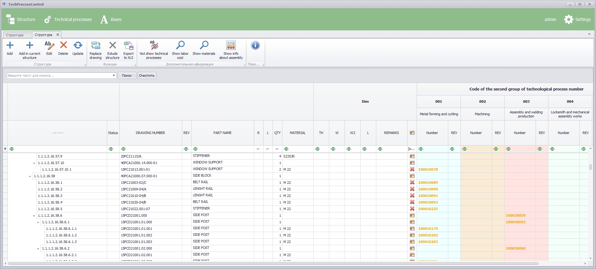
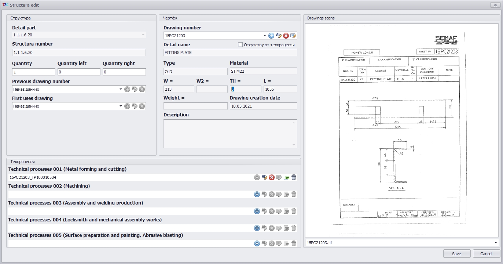

<div id="top"></div>
<!--
*** Thanks for checking out the Best-README-Template. If you have a suggestion
*** that would make this better, please fork the repo and create a pull request
*** or simply open an issue with the tag "enhancement".
*** Don't forget to give the project a star!
*** Thanks again! Now go create something AMAZING! :D
-->


<!-- PROJECT SHIELDS -->
<!--
*** I'm using markdown "reference style" links for readability.
*** Reference links are enclosed in brackets [ ] instead of parentheses ( ).
*** See the bottom of this document for the declaration of the reference variables
*** for contributors-url, forks-url, etc. This is an optional, concise syntax you may use.
*** https://www.markdownguide.org/basic-syntax/#reference-style-links
-->


<!-- PROJECT LOGO -->
<br />
<div align="center">
  <a href="https://github.com/MaximTelyatnick/TechnicalProcessControlg">
    
  </a>

<h3 align="center">TechnicalProcessControl</h3>

  <p align="center">
    The program allows you to simplify the process of creating technical processes.
    <br />
    <a href="https://github.com/github_username/repo_name"><strong>Explore the docs »</strong></a>
    <br />
    <br />
    <a href="https://github.com/github_username/repo_name">View Demo</a>
    ·
    <a href="https://github.com/github_username/repo_name/issues">Report Bug</a>
    ·
    <a href="https://github.com/github_username/repo_name/issues">Request Feature</a>
  </p>
</div>


<!-- ABOUT THE PROJECT -->
## About The Project
<p align="left">The main application form includes the structural number of the product, the drawing of the part, the technical process of creating the product, the materials spent on manufacturing. Using the buttons "Add", "Edit", "Delete", the user can edit the structure element, which consists of the drawing number, the number of blanks, physical parameters of the product, and the type of material.</p>
 <br />
<a href="https://github.com/MaximTelyatnick/TechnicalProcessControlg">
    
  </a>
  <h4 align="center">Main Form Structure</h4>
<p align="left">
  The structure editing form allows you to specify the parent links of the structural element, the parent drawing, the current drawing (or call the form for creating a drawing, editing, creating a revision), workflows (and editing operations for workflows).
</p>
  <a href="https://github.com/MaximTelyatnick/TechnicalProcessControlg">
    
  </a>
  <h4 align="center">Main Form Structure</h4>


<p align="right">(<a href="#top">back to top</a>)</p>


### Built With

* [Entity Framework](https://docs.microsoft.com/en-us/ef/?ranMID=46131&ranEAID=a1LgFw09t88&ranSiteID=a1LgFw09t88-hlluP1_OXfxgOwFLJlEmrQ&epi=a1LgFw09t88-hlluP1_OXfxgOwFLJlEmrQ&irgwc=1&OCID=AID2200057_aff_7806_1243925&tduid=%28ir__69bg1pxcickf6zoxfl9yvpgsmf2xoyl6stjahgn300%29%287806%29%281243925%29%28a1LgFw09t88-hlluP1_OXfxgOwFLJlEmrQ%29%28%29&irclickid=_69bg1pxcickf6zoxfl9yvpgsmf2xoyl6stjahgn300)
* [Firebird](http://www.firebirdsql.org/)
* [Visual Studio Code](https://code.visualstudio.com/)
* [DevExpress](https://www.devexpress.com/)

<p align="right">(<a href="#top">back to top</a>)</p>


<!-- GETTING STARTED -->
## Getting Started

This is an example of how you may give instructions on setting up your project locally.
To get a local copy up and running follow these simple example steps.

### Prerequisites

This is an example of how to list things you need to use the software and how to install them.
* npm
  ```sh
  npm install npm@latest -g
  ```

### Installation

1. Get a free API Key at [https://example.com](https://example.com)
2. Clone the repo
   ```sh
   git clone https://github.com/github_username/repo_name.git
   ```
3. Install NPM packages
   ```sh
   npm install
   ```
4. Enter your API in `config.js`
   ```js
   const API_KEY = 'ENTER YOUR API';
   ```

<p align="right">(<a href="#top">back to top</a>)</p>


<!-- USAGE EXAMPLES -->
## Usage

Use this space to show useful examples of how a project can be used. Additional screenshots, code examples and demos work well in this space. You may also link to more resources.

_For more examples, please refer to the [Documentation](https://example.com)_

<p align="right">(<a href="#top">back to top</a>)</p>


<!-- ROADMAP -->
## Roadmap

- [] Feature 1
- [] Feature 2
- [] Feature 3
    - [] Nested Feature

See the [open issues](https://github.com/github_username/repo_name/issues) for a full list of proposed features (and known issues).

<p align="right">(<a href="#top">back to top</a>)</p>


<!-- CONTRIBUTING -->
## Contributing

Contributions are what make the open source community such an amazing place to learn, inspire, and create. Any contributions you make are **greatly appreciated**.

If you have a suggestion that would make this better, please fork the repo and create a pull request. You can also simply open an issue with the tag "enhancement".
Don't forget to give the project a star! Thanks again!

1. Fork the Project
2. Create your Feature Branch (`git checkout -b feature/AmazingFeature`)
3. Commit your Changes (`git commit -m 'Add some AmazingFeature'`)
4. Push to the Branch (`git push origin feature/AmazingFeature`)
5. Open a Pull Request

<p align="right">(<a href="#top">back to top</a>)</p>


<!-- LICENSE -->
## License

Distributed under the MIT License. See `LICENSE.txt` for more information.

<p align="right">(<a href="#top">back to top</a>)</p>


<!-- CONTACT -->
## Contact

Your Name - [@twitter_handle](https://twitter.com/twitter_handle) - email@email_client.com

Project Link: [https://github.com/github_username/repo_name](https://github.com/github_username/repo_name)

<p align="right">(<a href="#top">back to top</a>)</p>


<p align="right">(<a href="#top">back to top</a>)</p>


<div align="center">
  <a href="https://github.com/MaximTelyatnick/TechnicalProcessControlg">
    
  </a>
</div>
<h3 align="center">CRM система малого предприятия</h1>
<br> 


<!-- TABLE OF CONTENTS -->
## Про программный продукт

Программный продукт разработан для введения учета данных на малых предприятиях.
<p>Состоит из следующих модулей:</p>
<details>
  <summary>Бух. учет</summary>
  <ul>
    <li>
      <strong>Описание вкладки</strong>
      <p>Бух учет предприятия: приходы, списания, банковские операции, расчеты с заказчиками, ведение касовой книги, основных средств предприятия.</p>
    </li>
    <li>
      Меню     
        
      <ul> 
        <li>Приходы</li>
        <li>Списание</li>
        <li>Основные средства</li>
        <li>Требования</li>
        <li>Налоговый учёт</li>
        <li>Расчеты с покупателями и заказчиками</li>
        <li>Банковские операции</li>
        <li>Кассовая книга</li>
        <li>Отчёты</li>      
      </ul>
    </li>
    
  </ul>
</details>

<details>
  <summary>Командировки</summary>
  <ul>
    <li>
      <strong>Описание вкладки</strong>
      <p>Учет командировок командируемого персонала, создание приказов и удостоверений на командировку, виплата аванса, суточных. Ведение командировочных расходов.</p>
    </li>
    <li>
      Меню
      
      <ul>
        <li>Удостоверения</li>
        <li>Приказы</li>
        <li>Основные средства</li>
        <li>Журнал авансов и отчётов</li>
        <li>Журнал хозяйственных нужд</li>
      </ul>
    </li>
  </ul>
</details>

<details>
  <summary>Договора</summary>
  <ol>
    <li>
      <strong>Описание вкладки</strong>
      <p>Учет заказов и договоров предприятия(подвязка скан копий договоров и всей документации по договору), ведение журнала входящий комерческив предприятий и ведения журнала этапов переговоров с контрагентом. Анализ расходов и доходов по каждому заказу.</p>
    </li>
    <li>
      Меню
      <ul>
        
      </ul>
    </li>
    <li>Заказы</li>
    <li>Приходы и расходы (деньги)</li>
    <li>Журнал договоров</li>
    <li>Счета</li>
    <li>Журнал регистрации запросов заказчиков</li>

  </ol>
</details>

<details>
  <summary>МТС</summary>
  <ol>
    <li>
      <strong>Описание вкладки</strong>
      <p>Ведение журнала проэктов предприятие, составление материально технической спецыфикации на каждое изделие, привязка изделия к кокнкретному заказу.</p>
    </li>
    <li>
      Меню
      <ul>
        
      </ul>
    </li>
    <li>Материальные спецыфикации</li>
    <li>Журнал регистрации изделий</li>
    <li>Журнал регистрации изделий(чертежи заказчика)</li>
    <li>Справочник материальных спцификаций</li>

  </ol>
</details>

<details>
  <summary>Производство</summary>
  <ol>
    <li>
      <strong>Описание вкладки</strong>
      <p>Ведение журнала сварочных и малярных работ, списание материалов комплектовщиком по факту.</p>
    </li>
    <li>
      Меню
      <ul>
        
      </ul>
    </li>
    <li>Сварочные работы</li>
    <li>Приходы (производство)</li>
    <li>Списание (производство)</li>
    <li>Журнал покрасочных работ</li>

  </ol>
</details>

<details>
  <summary>Збыт</summary>
  <ol>
    <li>
      <strong>Описание вкладки</strong>
      <p>Учет командировок командируемого персонала, создание приказов и удостоверений на командировку, виплата аванса, суточных. Ведение командировочных расходов.</p>
    </li>
    <li>
      Меню
      <ul>
        
      </ul>
    </li>
    <li>Журнал упаковочных листов</li>
    <li>Документы на отгрузку</li>
  </ol>
</details>

<details>
  <summary>Материальное обеспечения</summary>
  <ol>
    <li>
      <strong>Описание вкладки</strong>
      <p>Учет командировок командируемого персонала, создание приказов и удостоверений на командировку, виплата аванса, суточных. Ведение командировочных расходов.</p>
    </li>
    <li>
      Меню
      <ul>
        
      </ul>
    </li>
    <li>Приход материалов</li>
    <li>Платежи</li>
    <li>Задолженость по контрагентам</li>
    <li>Остатки на складе</li>
    <li>Остатки на складе (по приходам)</li>
    <li>Журнал товарно-транспортных накладных</li>
  </ol>
</details>

<details>
  <summary>ОТК (Технический контроль)</summary>
  <ol>
    <li>
      <strong>Описание вкладки</strong>
      <p>Учет командировок командируемого персонала, создание приказов и удостоверений на командировку, виплата аванса, суточных. Ведение командировочных расходов.</p>
    </li>
    <li>
      Меню
      <ul>
        
      </ul>
    </li>
    <li>Сертификаты и паспорта</li>
    <li>Списание по проэктам</li>
    <li>Гарантийные обязательства</li>
    <li>Журнал атестации</li>
    <li>Журнал выдачи клейм</li>
    <li>Приёмно-сдаточные накладные</li>

  </ol>
</details>

<details>
  <summary>Складской учёт</summary>
  <ol>
    <li>
      <strong>Описание вкладки</strong>
      <p>Учет командировок командируемого персонала, создание приказов и удостоверений на командировку, виплата аванса, суточных. Ведение командировочных расходов.</p>
    </li>
    <li>
      Меню
      <ul>
        
      </ul>
    </li>
    <li>Приходы</li>
    <li>Требования</li>
    <li>Учёт спецодежды</li>
    <li>Журнал учёта спецодежды</li>
    <li>Остатки на складе</li>
    <li>Журнал товарно-транспортных накладных</li>

  </ol>
</details>

</details>

<details>
  <summary>Класификаторы</summary>
  <ol>
    <li>
      <strong>Описание вкладки</strong>
      <p>Учет командировок командируемого персонала, создание приказов и удостоверений на командировку, виплата аванса, суточных. Ведение командировочных расходов.</p>
    </li>
    <li>
      Меню
      <ul>
        
      </ul>
    </li> 
    <li>Сотрудники</li>
    <li>Контрагенты</li>
    <li>WPS</li>
    <li>Клейма</li>
    <li>
      МТ класификаторы
      <ul>
        <li>Материалы</li>
        <li>Госты</li>
        <li>Единицы измерения</li>
      </ul>   
    </li>
    <li>Бухгалтерия
      <ul>
        <li>Счета</li>
        <li>Периоды</li>
        <li>Словарь УКТЗ ЄД</li>
        <li>Словарь ДК 016-2010</li>
        <li>Словарь ДК 021:2015</li>
        <li>Журнал условий</li>
        <li>Журнал касовіх контрагентов</li>
        <li>Журнал перевозчиков</li>
      </ul>
    </li>
    <li>Складские класификаторі
    <ul>
        <li>Материалы</li>
        <li>Склады</li>
        <li>Перевозчики</li>
      </ul>
    </li>
    <li>Визитки</li>
    <li>Табель</li>
  </ol>
</details>

## Как использовать

* [Руководство по эксплуатации программы](https://github.com/MaximTelyatnick/ERP_NEW_GT/blob/master/DXApplication1/ERP_NEW.GUI/Temp/Pdf/OperatorERPmanual.pdf)
* [Развертка и описание базы данных](https://github.com/MaximTelyatnick/ERP_NEW_GT/blob/master/DXApplication1/ERP_NEW.GUI/Temp/Pdf/OperatorDbManual.xls)


## Создано при помощи

При разработке приложения использовались следующие инструменты и технологии:


* [Entity Framework](https://docs.microsoft.com/en-us/ef/?ranMID=46131&ranEAID=a1LgFw09t88&ranSiteID=a1LgFw09t88-hlluP1_OXfxgOwFLJlEmrQ&epi=a1LgFw09t88-hlluP1_OXfxgOwFLJlEmrQ&irgwc=1&OCID=AID2200057_aff_7806_1243925&tduid=%28ir__69bg1pxcickf6zoxfl9yvpgsmf2xoyl6stjahgn300%29%287806%29%281243925%29%28a1LgFw09t88-hlluP1_OXfxgOwFLJlEmrQ%29%28%29&irclickid=_69bg1pxcickf6zoxfl9yvpgsmf2xoyl6stjahgn300)
* [Firebird](http://www.firebirdsql.org/)
* [Visual Studio Code](https://code.visualstudio.com/)
* [DevExpress](https://www.devexpress.com/)

<!-- CONTACT -->
## Контакты

<p>Mail - <a href="mailto:maxtel011395@gmail.com">maxtel011395@gmail.com</a></p>
<p>Project Link: [https://github.com/MaximTelyatnick/ERP_NEW_GT](https://github.com/MaximTelyatnick/ERP_NEW_GT)</p>


<p align="right">(<a href="#top">Вверх</a>)</p>


<!-- MARKDOWN LINKS & IMAGES -->
<!-- https://www.markdownguide.org/basic-syntax/#reference-style-links -->
[contributors-shield]: https://img.shields.io/github/contributors/github_username/repo_name.svg?style=for-the-badge
[contributors-url]: https://github.com/github_username/repo_name/graphs/contributors
[forks-shield]: https://img.shields.io/github/forks/github_username/repo_name.svg?style=for-the-badge
[forks-url]: https://github.com/github_username/repo_name/network/members
[stars-shield]: https://img.shields.io/github/stars/github_username/repo_name.svg?style=for-the-badge
[stars-url]: https://github.com/github_username/repo_name/stargazers
[issues-shield]: https://img.shields.io/github/issues/github_username/repo_name.svg?style=for-the-badge
[issues-url]: https://github.com/github_username/repo_name/issues
[license-shield]: https://img.shields.io/github/license/github_username/repo_name.svg?style=for-the-badge
[license-url]: https://github.com/github_username/repo_name/blob/master/LICENSE.txt
[linkedin-shield]: https://img.shields.io/badge/-LinkedIn-black.svg?style=for-the-badge&logo=linkedin&colorB=555
[linkedin-url]: https://linkedin.com/in/linkedin_username
[product-screenshot]: images/screenshot.png
