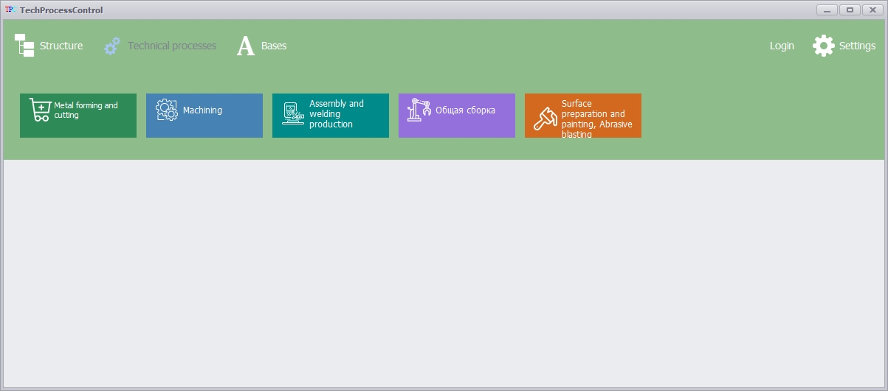
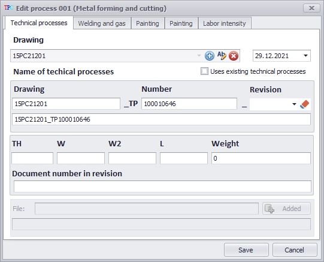

<HEAD>

<META content="text/html; charset=utf-8" http-equiv=Content-Type>
<LINK HREF="IBEHTMLDoc.css" type=text/css rel=STYLESHEET>
 

 
</HEAD>

<!--
*** Thanks for checking out the Best-README-Template. If you have a suggestion
*** that would make this better, please fork the repo and create a pull request
*** or simply open an issue with the tag "enhancement".
*** Don't forget to give the project a star!
*** Thanks again! Now go create something AMAZING! :D
-->

<!-- PROJECT SHIELDS -->
<!--
*** I'm using markdown "reference style" links for readability.
*** Reference links are enclosed in brackets [ ] instead of parentheses ( ).
*** See the bottom of this document for the declaration of the reference variables
*** for contributors-url, forks-url, etc. This is an optional, concise syntax you may use.
*** https://www.markdownguide.org/basic-syntax/#reference-style-links
-->

<!-- PROJECT LOGO -->
 

  

<h3 align="center">TechnicalProcessControl</h3>
 
  

    The program allows you to simplify the process of creating technical processes.
    

  

   [About The Project](#about-the-project) •
   <a href="https://www.youtube.com/watch?v=hffeZHG6lZE">View Demo •</a>
   [Installation](#installation) •
   [Configuration](#configuration) •
   
   

 [About The Project](#about-the-project) •
 

[Getting started](#getting-started) •
[Installation](#installation) •
[Configuration](#configuration) •
[Integrations](#third-party-integrations)
  

<!-- ABOUT THE PROJECT -->
## About The Project

The main application form includes the structural number of the product, the drawing of the part, the technical process of creating the product, the materials spent on manufacturing. Using the buttons "Add", "Edit", "Delete", the user can edit the structure element, which consists of the drawing number, the number of blanks, physical parameters of the product, and the type of material.

  

  <h4 align="center">Main Form Structure</h4>
The program supports five types of technical processes.
  The structure editing form allows you to specify the parent links of the structural element, the parent drawing, the current drawing (or call the form for creating a drawing, editing, creating a revision), workflows (and editing operations for workflows).

  
  <h4 align="center">Structure editing form</h4>

  The program supports five types of technical processes. 

  

  
  <h4 align="center">Types of technical processes</h4>
 

  
  
  
  The form for editing the technical process allows you to specify the size of the drawing of the product, revision of the technical process, parameters of the workpiece, date of creation of the technical process, consumables. A universal template of the .xls format has been developed to simplify the creation of technical processes; it is also possible to use a ready-made technical process (automatic change of parameters within the technical process file does not work in this case).

  
  <h4 align="center">Process editing form</h4>
 

(<a href="#top">back to top</a>)

### Built With

* [Entity Framework](https://docs.microsoft.com/en-us/ef/?ranMID=46131&ranEAID=a1LgFw09t88&ranSiteID=a1LgFw09t88-hlluP1_OXfxgOwFLJlEmrQ&epi=a1LgFw09t88-hlluP1_OXfxgOwFLJlEmrQ&irgwc=1&OCID=AID2200057_aff_7806_1243925&tduid=%28ir__69bg1pxcickf6zoxfl9yvpgsmf2xoyl6stjahgn300%29%287806%29%281243925%29%28a1LgFw09t88-hlluP1_OXfxgOwFLJlEmrQ%29%28%29&irclickid=_69bg1pxcickf6zoxfl9yvpgsmf2xoyl6stjahgn300)
* [Firebird](http://www.firebirdsql.org/)
* [Visual Studio Code](https://code.visualstudio.com/)
* [DevExpress](https://www.devexpress.com/)

## How to use

  
Database settings

(<a href="#top">back to top</a>)

&nbsp;

Database: F:\Soft\DataBase\ib\TECHDATABASEDB

&nbsp;

Domains&nbsp(0)

<A HREF="#_TABLES">Tables</A>&nbsp(19)

Views&nbsp(0)

<A HREF="#_PROCEDURES">Procedures</A>&nbsp(2)

<A HREF="#_TRIGGERS">Triggers</A>&nbsp(19)

<A HREF="#_GENERATORS">Generators</A>&nbsp(21)

Exceptions&nbsp(0)

UDFs&nbsp(0)

<A HREF="#_INDICES">Indices</A>&nbsp(64)

<A HREF="#_FOREIGN_KEYS">Foreign Keys</A>&nbsp(45)

Checks&nbsp(0)

Roles&nbsp(0)

<A NAME="_DOMAINS">
Domains
</A>

&nbsp;

<TABLE CLASS="dtArg" CELLSPACING="0">
  <TH WIDTH="1%">
<B>Domain</B>

  <TH WIDTH="1%">
<B>Type</B>

  <TH WIDTH="1%" ALIGN="middle">
<B>NN</B>

  <TH WIDTH="1%">
<B>Default</B>

  <TH WIDTH="50%">
<B>Description</B>

</TABLE>

<A NAME="_TABLES">
Tables
</A>

&nbsp;

<TABLE CLASS="dtArg" CELLSPACING="0">
  <TH WIDTH="1%">
<B>Table</B>

  <TH>
<B>Description</B>

  <TR>
    <TD>
<A HREF="#TBL_Colors"><NOBR>Colors</NOBR></A></TD>
    <TD>
&nbsp</TD>
  </TR>
  <TR>
    <TD>
<A HREF="#TBL_Details"><NOBR>Details</NOBR></A></TD>
    <TD>
&nbsp</TD>
  </TR>
  <TR>
    <TD>
<A HREF="#TBL_Drawing"><NOBR>Drawing</NOBR></A></TD>
    <TD>
&nbsp</TD>
  </TR>
  <TR>
    <TD>
<A HREF="#TBL_DrawingScan"><NOBR>DrawingScan</NOBR></A></TD>
    <TD>
&nbsp</TD>
  </TR>
  <TR>
    <TD>
<A HREF="#TBL_Drawings"><NOBR>Drawings</NOBR></A></TD>
    <TD>
&nbsp</TD>
  </TR>
  <TR>
    <TD>
<A HREF="#TBL_Materials"><NOBR>Materials</NOBR></A></TD>
    <TD>
&nbsp</TD>
  </TR>
  <TR>
    <TD>
<A HREF="#TBL_OperationName"><NOBR>OperationName</NOBR></A></TD>
    <TD>
&nbsp</TD>
  </TR>
  <TR>
    <TD>
<A HREF="#TBL_OperationNumber"><NOBR>OperationNumber</NOBR></A></TD>
    <TD>
&nbsp</TD>
  </TR>
  <TR>
    <TD>
<A HREF="#TBL_OperationPaintMaterial"><NOBR>OperationPaintMaterial</NOBR></A></TD>
    <TD>
&nbsp</TD>
  </TR>
  <TR>
    <TD>
<A HREF="#TBL_RevisionType"><NOBR>RevisionType</NOBR></A></TD>
    <TD>
&nbsp</TD>
  </TR>
  <TR>
    <TD>
<A HREF="#TBL_Revisions"><NOBR>Revisions</NOBR></A></TD>
    <TD>
&nbsp</TD>
  </TR>
  <TR>
    <TD>
<A HREF="#TBL_TechProcess001"><NOBR>TechProcess001</NOBR></A></TD>
    <TD>
&nbsp</TD>
  </TR>
  <TR>
    <TD>
<A HREF="#TBL_TechProcess002"><NOBR>TechProcess002</NOBR></A></TD>
    <TD>
&nbsp</TD>
  </TR>
  <TR>
    <TD>
<A HREF="#TBL_TechProcess003"><NOBR>TechProcess003</NOBR></A></TD>
    <TD>
&nbsp</TD>
  </TR>
  <TR>
    <TD>
<A HREF="#TBL_TechProcess004"><NOBR>TechProcess004</NOBR></A></TD>
    <TD>
&nbsp</TD>
  </TR>
  <TR>
    <TD>
<A HREF="#TBL_TechProcess005"><NOBR>TechProcess005</NOBR></A></TD>
    <TD>
&nbsp</TD>
  </TR>
  <TR>
    <TD>
<A HREF="#TBL_Type"><NOBR>Type</NOBR></A></TD>
    <TD>
&nbsp</TD>
  </TR>
  <TR>
    <TD>
<A HREF="#TBL_UserRole"><NOBR>UserRole</NOBR></A></TD>
    <TD>
&nbsp</TD>
  </TR>
  <TR>
    <TD>
<A HREF="#TBL_Users"><NOBR>Users</NOBR></A></TD>
    <TD>
&nbsp</TD>
  </TR>
</TABLE>

<A NAME="TBL_Colors">
Table: Colors

&nbsp;

Description

<I>(There is no description for table Colors)</I>

&nbsp;

Fields

<TABLE CLASS="dtArg" CELLSPACING="0">
  <TH WIDTH="1%" ALIGN="middle">
<B>PK</B>

  <TH WIDTH="1%" ALIGN="middle">
<B>FK</B>

  <TH WIDTH="1%">
<B>Field</B>

  <TH WIDTH="1%">
<B>Domain</B>

  <TH WIDTH="20%">
<B>Type</B>

  <TH WIDTH="1%" ALIGN="middle">
<B>NN</B>

  <TH WIDTH="1%">
<B>Default</B>

  <TH WIDTH="40%">
<B>Description</B>

  <TR>
    <TD ALIGN="middle">

</TD>
    <TD ALIGN="middle">
&nbsp;
</TD>
    <TD><A NAME="Colors.Id">
Id
</A></TD>
    <TD>
&nbsp;
</TD>
    <TD>
INTEGER
</TD>
    <TD ALIGN="middle">

</TD>
    <TD>
&nbsp;
</TD>
    <TD>
&nbsp;
</TD>
  </TR>
  <TR>
    <TD ALIGN="middle">
&nbsp;
</TD>
    <TD ALIGN="middle">
&nbsp;
</TD>
    <TD><A NAME="Colors.NameRus">
NameRus
</A></TD>
    <TD>
&nbsp;
</TD>
    <TD>
VARCHAR(40)
</TD>
    <TD ALIGN="middle">

</TD>
    <TD>
&nbsp;
</TD>
    <TD>
&nbsp;
</TD>
  </TR>
  <TR>
    <TD ALIGN="middle">
&nbsp;
</TD>
    <TD ALIGN="middle">
&nbsp;
</TD>
    <TD><A NAME="Colors.Code">
Code
</A></TD>
    <TD>
&nbsp;
</TD>
    <TD>
CHAR(7)
</TD>
    <TD ALIGN="middle">

</TD>
    <TD>
&nbsp;
</TD>
    <TD>
&nbsp;
</TD>
  </TR>
  <TR>
    <TD ALIGN="middle">
&nbsp;
</TD>
    <TD ALIGN="middle">
&nbsp;
</TD>
    <TD><A NAME="Colors.NameEng">
NameEng
</A></TD>
    <TD>
&nbsp;
</TD>
    <TD>
VARCHAR(40)
</TD>
    <TD ALIGN="middle">

</TD>
    <TD>
&nbsp;
</TD>
    <TD>
&nbsp;
</TD>
  </TR>
  <TR>
    <TD ALIGN="middle">
&nbsp;
</TD>
    <TD ALIGN="middle">
&nbsp;
</TD>
    <TD><A NAME="Colors.NameAr">
NameAr
</A></TD>
    <TD>
&nbsp;
</TD>
    <TD>
VARCHAR(40)
</TD>
    <TD ALIGN="middle">

</TD>
    <TD>
&nbsp;
</TD>
    <TD>
&nbsp;
</TD>
  </TR>
</TABLE>

&nbsp;

Triggers

<TABLE CLASS="dtArg" CELLSPACING="0">
  <TH WIDTH="1%">
<B>Trigger</B>

  <TH WIDTH="1%">
<B>Type</B>

  <TH WIDTH="1%">
<B>Activity</B>

  <TH WIDTH="1%">
<B>Order</B>

  <TH WIDTH="50%">
<B>Description</B>

  <TR>
    <TD>
<A HREF="#TRG_Tr_Colors">Tr_Colors</A></TD>
    <TD>
BEFORE&nbsp;INSERT</TD>
    <TD>
Yes</TD>
    <TD ALIGN="right">
0</TD>
    <TD>
&nbsp</TD>
  </TR>
</TABLE>

&nbsp;

Indices

<TABLE CLASS="dtArg" CELLSPACING="0">
  <TH>
<B>Index</B>

  <TH>
<B>Fields</B>

  <TH ALIGN="middle">
<B>Active</B>

  <TH ALIGN="middle">
<B>Unique</B>

  <TH ALIGN="middle">
<B>Order</B>

  <TR>
    <TD>
<A HREF="#IND_PK_ColorsId">PK_ColorsId</A></TD>
    <TD>
"Id"</TD>
    <TD ALIGN="middle">
</TD>
    <TD ALIGN="middle">
</TD>
    <TD ALIGN="middle">
ASC</TD>
  </TR>
</TABLE>

&nbsp;

References

<I>(There are no references for table Colors)</I>

&nbsp;

Referenced By

<TABLE CLASS="dtArg" CELLSPACING="0">
  <TH>
<B>Table</B>

  <TH>
<B>Foreign Key</B>

  <TH>
<B>Fields</B>

  <TH>
<B>FK Field</B>

  <TH>
<B>Delete Rule</B>

  <TH>
<B>Update Rule</B>

  <TR>
    <TD>
<A HREF="#TBL_Drawings">Drawings</A></TD>
    <TD>
<A HREF="#FKEY_FK_ColorId_CurrentLevelMenuId">FK_ColorId_CurrentLevelMenuId</A></TD>
    <TD>
CurrentLevelMenuColorId</TD>
    <TD>
Id</TD>
    <TD>
SET NULL</TD>
    <TD>
NO ACTION</TD>
  </TR>
  <TR>
    <TD>
<A HREF="#TBL_Drawings">Drawings</A></TD>
    <TD>
<A HREF="#FKEY_FK_ColorId_DrawingId">FK_ColorId_DrawingId</A></TD>
    <TD>
DrawingColorId</TD>
    <TD>
Id</TD>
    <TD>
SET NULL</TD>
    <TD>
NO ACTION</TD>
  </TR>
  <TR>
    <TD>
<A HREF="#TBL_Drawings">Drawings</A></TD>
    <TD>
<A HREF="#FKEY_FK_ColorId_MaterialId">FK_ColorId_MaterialId</A></TD>
    <TD>
MaterialColorId</TD>
    <TD>
Id</TD>
    <TD>
SET NULL</TD>
    <TD>
NO ACTION</TD>
  </TR>
</TABLE>

&nbsp;

Definition

<code><pre>
<b>CREATE</b><b> </b><b>TABLE</b><b> </b><u>&quot;Colors&quot;</u><b> </b><b>(</b>
<b>    </b>&quot;Id&quot;<b>       </b><b>INTEGER</b><b> </b><b>NOT</b><b> </b><b>NULL</b><b>,</b>
<b>    </b>&quot;NameRus&quot;<b>  </b><b>VARCHAR</b><b>(</b>40<b>)</b><b>,</b>
<b>    </b>&quot;Code&quot;<b>     </b><b>CHAR</b><b>(</b>7<b>)</b><b>,</b>
<b>    </b>&quot;NameEng&quot;<b>  </b><b>VARCHAR</b><b>(</b>40<b>)</b><b>,</b>
<b>    </b>&quot;NameAr&quot;<b>   </b><b>VARCHAR</b><b>(</b>40<b>)</b>
<b>)</b><b>;</b>

<b>ALTER</b><b> </b><b>TABLE</b><b> </b><u>&quot;Colors&quot;</u><b> </b><b>ADD</b><b> </b><b>CONSTRAINT</b><b> </b>&quot;PK_ColorsId&quot;<b> </b><b>PRIMARY</b><b> </b><b>KEY</b><b> </b><b>(</b>&quot;Id&quot;<b>)</b><b>;</b>

</pre></code>

&nbsp;

<A NAME="TBL_Details">
Table: Details

&nbsp;

Description

<I>(There is no description for table Details)</I>

&nbsp;

Fields

<TABLE CLASS="dtArg" CELLSPACING="0">
  <TH WIDTH="1%" ALIGN="middle">
<B>PK</B>

  <TH WIDTH="1%" ALIGN="middle">
<B>FK</B>

  <TH WIDTH="1%">
<B>Field</B>

  <TH WIDTH="1%">
<B>Domain</B>

  <TH WIDTH="20%">
<B>Type</B>

  <TH WIDTH="1%" ALIGN="middle">
<B>NN</B>

  <TH WIDTH="1%">
<B>Default</B>

  <TH WIDTH="40%">
<B>Description</B>

  <TR>
    <TD ALIGN="middle">

</TD>
    <TD ALIGN="middle">
&nbsp;
</TD>
    <TD><A NAME="Details.Id">
Id
</A></TD>
    <TD>
&nbsp;
</TD>
    <TD>
INTEGER
</TD>
    <TD ALIGN="middle">

</TD>
    <TD>
&nbsp;
</TD>
    <TD>
&nbsp;
</TD>
  </TR>
  <TR>
    <TD ALIGN="middle">
&nbsp;
</TD>
    <TD ALIGN="middle">
&nbsp;
</TD>
    <TD><A NAME="Details.DetailName">
DetailName
</A></TD>
    <TD>
&nbsp;
</TD>
    <TD>
VARCHAR(100)
</TD>
    <TD ALIGN="middle">

</TD>
    <TD>
&nbsp;
</TD>
    <TD>
&nbsp;
</TD>
  </TR>
</TABLE>

&nbsp;

Triggers

<TABLE CLASS="dtArg" CELLSPACING="0">
  <TH WIDTH="1%">
<B>Trigger</B>

  <TH WIDTH="1%">
<B>Type</B>

  <TH WIDTH="1%">
<B>Activity</B>

  <TH WIDTH="1%">
<B>Order</B>

  <TH WIDTH="50%">
<B>Description</B>

  <TR>
    <TD>
<A HREF="#TRG_Tr_Details">Tr_Details</A></TD>
    <TD>
BEFORE&nbsp;INSERT</TD>
    <TD>
Yes</TD>
    <TD ALIGN="right">
0</TD>
    <TD>
&nbsp</TD>
  </TR>
</TABLE>

&nbsp;

Indices

<TABLE CLASS="dtArg" CELLSPACING="0">
  <TH>
<B>Index</B>

  <TH>
<B>Fields</B>

  <TH ALIGN="middle">
<B>Active</B>

  <TH ALIGN="middle">
<B>Unique</B>

  <TH ALIGN="middle">
<B>Order</B>

  <TR>
    <TD>
<A HREF="#IND_PK_DetailsId">PK_DetailsId</A></TD>
    <TD>
"Id"</TD>
    <TD ALIGN="middle">
</TD>
    <TD ALIGN="middle">
</TD>
    <TD ALIGN="middle">
ASC</TD>
  </TR>
</TABLE>

&nbsp;

References

<I>(There are no references for table Details)</I>

&nbsp;

Referenced By

<TABLE CLASS="dtArg" CELLSPACING="0">
  <TH>
<B>Table</B>

  <TH>
<B>Foreign Key</B>

  <TH>
<B>Fields</B>

  <TH>
<B>FK Field</B>

  <TH>
<B>Delete Rule</B>

  <TH>
<B>Update Rule</B>

  <TR>
    <TD>
<A HREF="#TBL_Drawing">Drawing</A></TD>
    <TD>
<A HREF="#FKEY_FK_Drawing_DetId">FK_Drawing_DetId</A></TD>
    <TD>
DetailId</TD>
    <TD>
Id</TD>
    <TD>
SET NULL</TD>
    <TD>
NO ACTION</TD>
  </TR>
</TABLE>

&nbsp;

Definition

<code><pre>
<b>CREATE</b><b> </b><b>TABLE</b><b> </b><u>&quot;Details&quot;</u><b> </b><b>(</b>
<b>    </b>&quot;Id&quot;<b>          </b><b>INTEGER</b><b> </b><b>NOT</b><b> </b><b>NULL</b><b>,</b>
<b>    </b>&quot;DetailName&quot;<b>  </b><b>VARCHAR</b><b>(</b>100<b>)</b><b> </b><b>CHARACTER</b><b> </b><b>SET</b><b> </b>WIN1251
<b>)</b><b>;</b>

<b>ALTER</b><b> </b><b>TABLE</b><b> </b><u>&quot;Details&quot;</u><b> </b><b>ADD</b><b> </b><b>CONSTRAINT</b><b> </b>&quot;PK_DetailsId&quot;<b> </b><b>PRIMARY</b><b> </b><b>KEY</b><b> </b><b>(</b>&quot;Id&quot;<b>)</b><b>;</b>

</pre></code>

&nbsp;

<A NAME="TBL_Drawing">
Table: Drawing

&nbsp;

Description

<I>(There is no description for table Drawing)</I>

&nbsp;

Fields

<TABLE CLASS="dtArg" CELLSPACING="0">
  <TH WIDTH="1%" ALIGN="middle">
<B>PK</B>

  <TH WIDTH="1%" ALIGN="middle">
<B>FK</B>

  <TH WIDTH="1%">
<B>Field</B>

  <TH WIDTH="1%">
<B>Domain</B>

  <TH WIDTH="20%">
<B>Type</B>

  <TH WIDTH="1%" ALIGN="middle">
<B>NN</B>

  <TH WIDTH="1%">
<B>Default</B>

  <TH WIDTH="40%">
<B>Description</B>

  <TR>
    <TD ALIGN="middle">

</TD>
    <TD ALIGN="middle">
&nbsp;
</TD>
    <TD><A NAME="Drawing.Id">
Id
</A></TD>
    <TD>
&nbsp;
</TD>
    <TD>
INTEGER
</TD>
    <TD ALIGN="middle">

</TD>
    <TD>
&nbsp;
</TD>
    <TD>
&nbsp;
</TD>
  </TR>
  <TR>
    <TD ALIGN="middle">
&nbsp;
</TD>
    <TD ALIGN="middle">
&nbsp;
</TD>
    <TD><A NAME="Drawing.Number">
Number
</A></TD>
    <TD>
&nbsp;
</TD>
    <TD>
VARCHAR(100)
</TD>
    <TD ALIGN="middle">

</TD>
    <TD>
&nbsp;
</TD>
    <TD>
&nbsp;
</TD>
  </TR>
  <TR>
    <TD ALIGN="middle">
&nbsp;
</TD>
    <TD ALIGN="middle">

</TD>
    <TD><A NAME="Drawing.MaterialId">
MaterialId
</A></TD>
    <TD>
&nbsp;
</TD>
    <TD>
INTEGER
</TD>
    <TD ALIGN="middle">

</TD>
    <TD>
&nbsp;
</TD>
    <TD>
&nbsp;
</TD>
  </TR>
  <TR>
    <TD ALIGN="middle">
&nbsp;
</TD>
    <TD ALIGN="middle">

</TD>
    <TD><A NAME="Drawing.TypeId">
TypeId
</A></TD>
    <TD>
&nbsp;
</TD>
    <TD>
INTEGER
</TD>
    <TD ALIGN="middle">

</TD>
    <TD>
&nbsp;
</TD>
    <TD>
&nbsp;
</TD>
  </TR>
  <TR>
    <TD ALIGN="middle">
&nbsp;
</TD>
    <TD ALIGN="middle">

</TD>
    <TD><A NAME="Drawing.DetailId">
DetailId
</A></TD>
    <TD>
&nbsp;
</TD>
    <TD>
INTEGER
</TD>
    <TD ALIGN="middle">

</TD>
    <TD>
&nbsp;
</TD>
    <TD>
&nbsp;
</TD>
  </TR>
  <TR>
    <TD ALIGN="middle">
&nbsp;
</TD>
    <TD ALIGN="middle">

</TD>
    <TD><A NAME="Drawing.RevisionId">
RevisionId
</A></TD>
    <TD>
&nbsp;
</TD>
    <TD>
INTEGER
</TD>
    <TD ALIGN="middle">

</TD>
    <TD>
&nbsp;
</TD>
    <TD>
&nbsp;
</TD>
  </TR>
  <TR>
    <TD ALIGN="middle">
&nbsp;
</TD>
    <TD ALIGN="middle">
&nbsp;
</TD>
    <TD><A NAME="Drawing.DetailWeight">
DetailWeight
</A></TD>
    <TD>
&nbsp;
</TD>
    <TD>
NUMERIC(10,2)
</TD>
    <TD ALIGN="middle">

</TD>
    <TD>
0
</TD>
    <TD>
&nbsp;
</TD>
  </TR>
  <TR>
    <TD ALIGN="middle">
&nbsp;
</TD>
    <TD ALIGN="middle">
&nbsp;
</TD>
    <TD><A NAME="Drawing.TH">
TH
</A></TD>
    <TD>
&nbsp;
</TD>
    <TD>
VARCHAR(100)
</TD>
    <TD ALIGN="middle">

</TD>
    <TD>
&nbsp;
</TD>
    <TD>
&nbsp;
</TD>
  </TR>
  <TR>
    <TD ALIGN="middle">
&nbsp;
</TD>
    <TD ALIGN="middle">
&nbsp;
</TD>
    <TD><A NAME="Drawing.W">
W
</A></TD>
    <TD>
&nbsp;
</TD>
    <TD>
VARCHAR(100)
</TD>
    <TD ALIGN="middle">

</TD>
    <TD>
&nbsp;
</TD>
    <TD>
&nbsp;
</TD>
  </TR>
  <TR>
    <TD ALIGN="middle">
&nbsp;
</TD>
    <TD ALIGN="middle">
&nbsp;
</TD>
    <TD><A NAME="Drawing.W2">
W2
</A></TD>
    <TD>
&nbsp;
</TD>
    <TD>
VARCHAR(100)
</TD>
    <TD ALIGN="middle">

</TD>
    <TD>
&nbsp;
</TD>
    <TD>
&nbsp;
</TD>
  </TR>
  <TR>
    <TD ALIGN="middle">
&nbsp;
</TD>
    <TD ALIGN="middle">
&nbsp;
</TD>
    <TD><A NAME="Drawing.L">
L
</A></TD>
    <TD>
&nbsp;
</TD>
    <TD>
VARCHAR(100)
</TD>
    <TD ALIGN="middle">

</TD>
    <TD>
&nbsp;
</TD>
    <TD>
&nbsp;
</TD>
  </TR>
  <TR>
    <TD ALIGN="middle">
&nbsp;
</TD>
    <TD ALIGN="middle">
&nbsp;
</TD>
    <TD><A NAME="Drawing.CreateDate">
CreateDate
</A></TD>
    <TD>
&nbsp;
</TD>
    <TD>
DATE
</TD>
    <TD ALIGN="middle">

</TD>
    <TD>
CURRENT_DATE
</TD>
    <TD>
&nbsp;
</TD>
  </TR>
  <TR>
    <TD ALIGN="middle">
&nbsp;
</TD>
    <TD ALIGN="middle">

</TD>
    <TD><A NAME="Drawing.ParentId">
ParentId
</A></TD>
    <TD>
&nbsp;
</TD>
    <TD>
INTEGER
</TD>
    <TD ALIGN="middle">

</TD>
    <TD>
&nbsp;
</TD>
    <TD>
&nbsp;
</TD>
  </TR>
  <TR>
    <TD ALIGN="middle">
&nbsp;
</TD>
    <TD ALIGN="middle">
&nbsp;
</TD>
    <TD><A NAME="Drawing.Note">
Note
</A></TD>
    <TD>
&nbsp;
</TD>
    <TD>
VARCHAR(200)
</TD>
    <TD ALIGN="middle">

</TD>
    <TD>
&nbsp;
</TD>
    <TD>
&nbsp;
</TD>
  </TR>
  <TR>
    <TD ALIGN="middle">
&nbsp;
</TD>
    <TD ALIGN="middle">
&nbsp;
</TD>
    <TD><A NAME="Drawing.Assembly">
Assembly
</A></TD>
    <TD>
&nbsp;
</TD>
    <TD>
SMALLINT
</TD>
    <TD ALIGN="middle">

</TD>
    <TD>
0
</TD>
    <TD>
&nbsp;
</TD>
  </TR>
  <TR>
    <TD ALIGN="middle">
&nbsp;
</TD>
    <TD ALIGN="middle">

</TD>
    <TD><A NAME="Drawing.UserId">
UserId
</A></TD>
    <TD>
&nbsp;
</TD>
    <TD>
SMALLINT
</TD>
    <TD ALIGN="middle">

</TD>
    <TD>
&nbsp;
</TD>
    <TD>
&nbsp;
</TD>
  </TR>
  <TR>
    <TD ALIGN="middle">
&nbsp;
</TD>
    <TD ALIGN="middle">
&nbsp;
</TD>
    <TD><A NAME="Drawing.NumberForParse">
NumberForParse
</A></TD>
    <TD>
&nbsp;
</TD>
    <TD>
VARCHAR(100)
</TD>
    <TD ALIGN="middle">

</TD>
    <TD>
&nbsp;
</TD>
    <TD>
&nbsp;
</TD>
  </TR>
</TABLE>

&nbsp;

Triggers

<TABLE CLASS="dtArg" CELLSPACING="0">
  <TH WIDTH="1%">
<B>Trigger</B>

  <TH WIDTH="1%">
<B>Type</B>

  <TH WIDTH="1%">
<B>Activity</B>

  <TH WIDTH="1%">
<B>Order</B>

  <TH WIDTH="50%">
<B>Description</B>

  <TR>
    <TD>
<A HREF="#TRG_Tr_Drawing">Tr_Drawing</A></TD>
    <TD>
BEFORE&nbsp;INSERT</TD>
    <TD>
Yes</TD>
    <TD ALIGN="right">
0</TD>
    <TD>
&nbsp</TD>
  </TR>
</TABLE>

&nbsp;

Indices

<TABLE CLASS="dtArg" CELLSPACING="0">
  <TH>
<B>Index</B>

  <TH>
<B>Fields</B>

  <TH ALIGN="middle">
<B>Active</B>

  <TH ALIGN="middle">
<B>Unique</B>

  <TH ALIGN="middle">
<B>Order</B>

  <TR>
    <TD>
<A HREF="#IND_FK_Drawing_DetId">FK_Drawing_DetId</A></TD>
    <TD>
"DetailId"</TD>
    <TD ALIGN="middle">
</TD>
    <TD ALIGN="middle">
</TD>
    <TD ALIGN="middle">
ASC</TD>
  </TR>
  <TR>
    <TD>
<A HREF="#IND_FK_Drawing_MatId">FK_Drawing_MatId</A></TD>
    <TD>
"MaterialId"</TD>
    <TD ALIGN="middle">
</TD>
    <TD ALIGN="middle">
</TD>
    <TD ALIGN="middle">
ASC</TD>
  </TR>
  <TR>
    <TD>
<A HREF="#IND_FK_Drawing_ParentId">FK_Drawing_ParentId</A></TD>
    <TD>
"ParentId"</TD>
    <TD ALIGN="middle">
</TD>
    <TD ALIGN="middle">
</TD>
    <TD ALIGN="middle">
ASC</TD>
  </TR>
  <TR>
    <TD>
<A HREF="#IND_FK_Drawing_RevId">FK_Drawing_RevId</A></TD>
    <TD>
"RevisionId"</TD>
    <TD ALIGN="middle">
</TD>
    <TD ALIGN="middle">
</TD>
    <TD ALIGN="middle">
ASC</TD>
  </TR>
  <TR>
    <TD>
<A HREF="#IND_FK_Drawing_TypeId">FK_Drawing_TypeId</A></TD>
    <TD>
"TypeId"</TD>
    <TD ALIGN="middle">
</TD>
    <TD ALIGN="middle">
</TD>
    <TD ALIGN="middle">
ASC</TD>
  </TR>
  <TR>
    <TD>
<A HREF="#IND_FK_Drawing_UserId">FK_Drawing_UserId</A></TD>
    <TD>
"UserId"</TD>
    <TD ALIGN="middle">
</TD>
    <TD ALIGN="middle">
</TD>
    <TD ALIGN="middle">
ASC</TD>
  </TR>
  <TR>
    <TD>
<A HREF="#IND_PK_DrawingId">PK_DrawingId</A></TD>
    <TD>
"Id"</TD>
    <TD ALIGN="middle">
</TD>
    <TD ALIGN="middle">
</TD>
    <TD ALIGN="middle">
ASC</TD>
  </TR>
</TABLE>

&nbsp;

References

<TABLE CLASS="dtArg" CELLSPACING="0">
  <TH>
<B>Table</B>

  <TH>
<B>Foreign Key</B>

  <TH>
<B>Fields</B>

  <TH>
<B>FK Field</B>

  <TH>
<B>Delete Rule</B>

  <TH>
<B>Update Rule</B>

  <TR>
    <TD>
<A HREF="#TBL_Details">Details</A></TD>
    <TD>
<A HREF="#FKEY_FK_Drawing_DetId">FK_Drawing_DetId</A></TD>
    <TD>
DetailId</TD>
    <TD>
Id</TD>
    <TD>
SET NULL</TD>
    <TD>
NO ACTION</TD>
  </TR>
  <TR>
    <TD>
<A HREF="#TBL_Materials">Materials</A></TD>
    <TD>
<A HREF="#FKEY_FK_Drawing_MatId">FK_Drawing_MatId</A></TD>
    <TD>
MaterialId</TD>
    <TD>
Id</TD>
    <TD>
SET NULL</TD>
    <TD>
NO ACTION</TD>
  </TR>
  <TR>
    <TD>
<A HREF="#TBL_Drawing">Drawing</A></TD>
    <TD>
<A HREF="#FKEY_FK_Drawing_ParentId">FK_Drawing_ParentId</A></TD>
    <TD>
ParentId</TD>
    <TD>
Id</TD>
    <TD>
SET NULL</TD>
    <TD>
NO ACTION</TD>
  </TR>
  <TR>
    <TD>
<A HREF="#TBL_Revisions">Revisions</A></TD>
    <TD>
<A HREF="#FKEY_FK_Drawing_RevId">FK_Drawing_RevId</A></TD>
    <TD>
RevisionId</TD>
    <TD>
Id</TD>
    <TD>
NO ACTION</TD>
    <TD>
NO ACTION</TD>
  </TR>
  <TR>
    <TD>
<A HREF="#TBL_Type">Type</A></TD>
    <TD>
<A HREF="#FKEY_FK_Drawing_TypeId">FK_Drawing_TypeId</A></TD>
    <TD>
TypeId</TD>
    <TD>
Id</TD>
    <TD>
SET NULL</TD>
    <TD>
NO ACTION</TD>
  </TR>
  <TR>
    <TD>
<A HREF="#TBL_Users">Users</A></TD>
    <TD>
<A HREF="#FKEY_FK_Drawing_UserId">FK_Drawing_UserId</A></TD>
    <TD>
UserId</TD>
    <TD>
Id</TD>
    <TD>
NO ACTION</TD>
    <TD>
NO ACTION</TD>
  </TR>
</TABLE>

&nbsp;

Referenced By

<TABLE CLASS="dtArg" CELLSPACING="0">
  <TH>
<B>Table</B>

  <TH>
<B>Foreign Key</B>

  <TH>
<B>Fields</B>

  <TH>
<B>FK Field</B>

  <TH>
<B>Delete Rule</B>

  <TH>
<B>Update Rule</B>

  <TR>
    <TD>
<A HREF="#TBL_Drawing">Drawing</A></TD>
    <TD>
<A HREF="#FKEY_FK_Drawing_ParentId">FK_Drawing_ParentId</A></TD>
    <TD>
ParentId</TD>
    <TD>
Id</TD>
    <TD>
SET NULL</TD>
    <TD>
NO ACTION</TD>
  </TR>
  <TR>
    <TD>
<A HREF="#TBL_Drawings">Drawings</A></TD>
    <TD>
<A HREF="#FKEY_FK_Drawings_DrawingId">FK_Drawings_DrawingId</A></TD>
    <TD>
DrawingId</TD>
    <TD>
Id</TD>
    <TD>
SET NULL</TD>
    <TD>
NO ACTION</TD>
  </TR>
  <TR>
    <TD>
<A HREF="#TBL_Drawings">Drawings</A></TD>
    <TD>
<A HREF="#FKEY_FK_Drawings_OccurrenceId">FK_Drawings_OccurrenceId</A></TD>
    <TD>
OccurrenceId</TD>
    <TD>
Id</TD>
    <TD>
SET NULL</TD>
    <TD>
NO ACTION</TD>
  </TR>
  <TR>
    <TD>
<A HREF="#TBL_Drawings">Drawings</A></TD>
    <TD>
<A HREF="#FKEY_FK_Drawings_ReplaceDrawingId">FK_Drawings_ReplaceDrawingId</A></TD>
    <TD>
ReplaceDrawingId</TD>
    <TD>
Id</TD>
    <TD>
SET NULL</TD>
    <TD>
NO ACTION</TD>
  </TR>
  <TR>
    <TD>
<A HREF="#TBL_DrawingScan">DrawingScan</A></TD>
    <TD>
<A HREF="#FKEY_FK_DrawingScan_Drawing">FK_DrawingScan_Drawing</A></TD>
    <TD>
DrawingId</TD>
    <TD>
Id</TD>
    <TD>
CASCADE</TD>
    <TD>
NO ACTION</TD>
  </TR>
  <TR>
    <TD>
<A HREF="#TBL_TechProcess001">TechProcess001</A></TD>
    <TD>
<A HREF="#FKEY_FK_TechProcess001_CopyDrawingId">FK_TechProcess001_CopyDrawingId</A></TD>
    <TD>
CopyDrawingId</TD>
    <TD>
Id</TD>
    <TD>
SET NULL</TD>
    <TD>
NO ACTION</TD>
  </TR>
  <TR>
    <TD>
<A HREF="#TBL_TechProcess001">TechProcess001</A></TD>
    <TD>
<A HREF="#FKEY_FK_TechProcess001_DrawingId">FK_TechProcess001_DrawingId</A></TD>
    <TD>
DrawingId</TD>
    <TD>
Id</TD>
    <TD>
SET NULL</TD>
    <TD>
NO ACTION</TD>
  </TR>
  <TR>
    <TD>
<A HREF="#TBL_TechProcess002">TechProcess002</A></TD>
    <TD>
<A HREF="#FKEY_FK_TechProcess002_CopyDrawingId">FK_TechProcess002_CopyDrawingId</A></TD>
    <TD>
CopyDrawingId</TD>
    <TD>
Id</TD>
    <TD>
SET NULL</TD>
    <TD>
NO ACTION</TD>
  </TR>
  <TR>
    <TD>
<A HREF="#TBL_TechProcess002">TechProcess002</A></TD>
    <TD>
<A HREF="#FKEY_FK_TechProcess002_DrawingId">FK_TechProcess002_DrawingId</A></TD>
    <TD>
DrawingId</TD>
    <TD>
Id</TD>
    <TD>
SET NULL</TD>
    <TD>
NO ACTION</TD>
  </TR>
  <TR>
    <TD>
<A HREF="#TBL_TechProcess003">TechProcess003</A></TD>
    <TD>
<A HREF="#FKEY_FK_TechProcess003_CopyDrawingId">FK_TechProcess003_CopyDrawingId</A></TD>
    <TD>
CopyDrawingId</TD>
    <TD>
Id</TD>
    <TD>
SET NULL</TD>
    <TD>
NO ACTION</TD>
  </TR>
  <TR>
    <TD>
<A HREF="#TBL_TechProcess003">TechProcess003</A></TD>
    <TD>
<A HREF="#FKEY_FK_TechProcess003_DrawingId">FK_TechProcess003_DrawingId</A></TD>
    <TD>
DrawingId</TD>
    <TD>
Id</TD>
    <TD>
SET NULL</TD>
    <TD>
NO ACTION</TD>
  </TR>
  <TR>
    <TD>
<A HREF="#TBL_TechProcess004">TechProcess004</A></TD>
    <TD>
<A HREF="#FKEY_FK_TechProcess004_CopyDrawingId">FK_TechProcess004_CopyDrawingId</A></TD>
    <TD>
CopyDrawingId</TD>
    <TD>
Id</TD>
    <TD>
SET NULL</TD>
    <TD>
NO ACTION</TD>
  </TR>
  <TR>
    <TD>
<A HREF="#TBL_TechProcess004">TechProcess004</A></TD>
    <TD>
<A HREF="#FKEY_FK_TechProcess004_DrawingId">FK_TechProcess004_DrawingId</A></TD>
    <TD>
DrawingId</TD>
    <TD>
Id</TD>
    <TD>
SET NULL</TD>
    <TD>
NO ACTION</TD>
  </TR>
  <TR>
    <TD>
<A HREF="#TBL_TechProcess005">TechProcess005</A></TD>
    <TD>
<A HREF="#FKEY_FK_TechProcess005_CopyDrawingId">FK_TechProcess005_CopyDrawingId</A></TD>
    <TD>
CopyDrawingId</TD>
    <TD>
Id</TD>
    <TD>
SET NULL</TD>
    <TD>
NO ACTION</TD>
  </TR>
  <TR>
    <TD>
<A HREF="#TBL_TechProcess005">TechProcess005</A></TD>
    <TD>
<A HREF="#FKEY_FK_TechProcess005_DrawingId">FK_TechProcess005_DrawingId</A></TD>
    <TD>
DrawingId</TD>
    <TD>
Id</TD>
    <TD>
SET NULL</TD>
    <TD>
NO ACTION</TD>
  </TR>
</TABLE>

&nbsp;

Definition

<code><pre>
<b>CREATE</b><b> </b><b>TABLE</b><b> </b><u>&quot;Drawing&quot;</u><b> </b><b>(</b>
<b>    </b>&quot;Id&quot;<b>              </b><b>INTEGER</b><b> </b><b>NOT</b><b> </b><b>NULL</b><b>,</b>
<b>    </b>&quot;Number&quot;<b>          </b><b>VARCHAR</b><b>(</b>100<b>)</b><b> </b><b>CHARACTER</b><b> </b><b>SET</b><b> </b>WIN1251<b>,</b>
<b>    </b>&quot;MaterialId&quot;<b>      </b><b>INTEGER</b><b>,</b>
<b>    </b>&quot;TypeId&quot;<b>          </b><b>INTEGER</b><b>,</b>
<b>    </b>&quot;DetailId&quot;<b>        </b><b>INTEGER</b><b>,</b>
<b>    </b>&quot;RevisionId&quot;<b>      </b><b>INTEGER</b><b>,</b>
<b>    </b>&quot;DetailWeight&quot;<b>    </b><b>NUMERIC</b><b>(</b>10<b>,</b>2<b>)</b><b> </b><b>DEFAULT</b><b> </b>0<b>,</b>
<b>    </b>TH<b>                </b><b>VARCHAR</b><b>(</b>100<b>)</b><b>,</b>
<b>    </b>W<b>                 </b><b>VARCHAR</b><b>(</b>100<b>)</b><b>,</b>
<b>    </b>W2<b>                </b><b>VARCHAR</b><b>(</b>100<b>)</b><b>,</b>
<b>    </b>L<b>                 </b><b>VARCHAR</b><b>(</b>100<b>)</b><b>,</b>
<b>    </b>&quot;CreateDate&quot;<b>      </b><b>DATE</b><b> </b><b>DEFAULT</b><b> </b><b>CURRENT_DATE</b><b>,</b>
<b>    </b>&quot;ParentId&quot;<b>        </b><b>INTEGER</b><b>,</b>
<b>    </b>&quot;Note&quot;<b>            </b><b>VARCHAR</b><b>(</b>200<b>)</b><b> </b><b>CHARACTER</b><b> </b><b>SET</b><b> </b>WIN1251<b>,</b>
<b>    </b>&quot;Assembly&quot;<b>        </b><b>SMALLINT</b><b> </b><b>DEFAULT</b><b> </b>0<b>,</b>
<b>    </b>&quot;UserId&quot;<b>          </b><b>SMALLINT</b><b>,</b>
<b>    </b>&quot;NumberForParse&quot;<b>  </b><b>VARCHAR</b><b>(</b>100<b>)</b>
<b>)</b><b>;</b>

<b>ALTER</b><b> </b><b>TABLE</b><b> </b><u>&quot;Drawing&quot;</u><b> </b><b>ADD</b><b> </b><b>CONSTRAINT</b><b> </b>&quot;PK_DrawingId&quot;<b> </b><b>PRIMARY</b><b> </b><b>KEY</b><b> </b><b>(</b>&quot;Id&quot;<b>)</b><b>;</b>
<b>ALTER</b><b> </b><b>TABLE</b><b> </b><u>&quot;Drawing&quot;</u><b> </b><b>ADD</b><b> </b><b>CONSTRAINT</b><b> </b>&quot;FK_Drawing_DetId&quot;<b> </b><b>FOREIGN</b><b> </b><b>KEY</b><b> </b><b>(</b>&quot;DetailId&quot;<b>)</b><b> </b><b>REFERENCES</b><b> </b><u>&quot;Details&quot;</u><b> </b><b>(</b>&quot;Id&quot;<b>)</b><b> </b><b>ON</b><b> </b><b>DELETE</b><b> </b><b>SET</b><b> </b><b>NULL</b><b>;</b>
<b>ALTER</b><b> </b><b>TABLE</b><b> </b><u>&quot;Drawing&quot;</u><b> </b><b>ADD</b><b> </b><b>CONSTRAINT</b><b> </b>&quot;FK_Drawing_MatId&quot;<b> </b><b>FOREIGN</b><b> </b><b>KEY</b><b> </b><b>(</b>&quot;MaterialId&quot;<b>)</b><b> </b><b>REFERENCES</b><b> </b><u>&quot;Materials&quot;</u><b> </b><b>(</b>&quot;Id&quot;<b>)</b><b> </b><b>ON</b><b> </b><b>DELETE</b><b> </b><b>SET</b><b> </b><b>NULL</b><b>;</b>
<b>ALTER</b><b> </b><b>TABLE</b><b> </b><u>&quot;Drawing&quot;</u><b> </b><b>ADD</b><b> </b><b>CONSTRAINT</b><b> </b>&quot;FK_Drawing_ParentId&quot;<b> </b><b>FOREIGN</b><b> </b><b>KEY</b><b> </b><b>(</b>&quot;ParentId&quot;<b>)</b><b> </b><b>REFERENCES</b><b> </b><u>&quot;Drawing&quot;</u><b> </b><b>(</b>&quot;Id&quot;<b>)</b><b> </b><b>ON</b><b> </b><b>DELETE</b><b> </b><b>SET</b><b> </b><b>NULL</b><b>;</b>
<b>ALTER</b><b> </b><b>TABLE</b><b> </b><u>&quot;Drawing&quot;</u><b> </b><b>ADD</b><b> </b><b>CONSTRAINT</b><b> </b>&quot;FK_Drawing_RevId&quot;<b> </b><b>FOREIGN</b><b> </b><b>KEY</b><b> </b><b>(</b>&quot;RevisionId&quot;<b>)</b><b> </b><b>REFERENCES</b><b> </b><u>&quot;Revisions&quot;</u><b> </b><b>(</b>&quot;Id&quot;<b>)</b><b>;</b>
<b>ALTER</b><b> </b><b>TABLE</b><b> </b><u>&quot;Drawing&quot;</u><b> </b><b>ADD</b><b> </b><b>CONSTRAINT</b><b> </b>&quot;FK_Drawing_TypeId&quot;<b> </b><b>FOREIGN</b><b> </b><b>KEY</b><b> </b><b>(</b>&quot;TypeId&quot;<b>)</b><b> </b><b>REFERENCES</b><b> </b><u>&quot;Type&quot;</u><b> </b><b>(</b>&quot;Id&quot;<b>)</b><b> </b><b>ON</b><b> </b><b>DELETE</b><b> </b><b>SET</b><b> </b><b>NULL</b><b>;</b>
<b>ALTER</b><b> </b><b>TABLE</b><b> </b><u>&quot;Drawing&quot;</u><b> </b><b>ADD</b><b> </b><b>CONSTRAINT</b><b> </b>&quot;FK_Drawing_UserId&quot;<b> </b><b>FOREIGN</b><b> </b><b>KEY</b><b> </b><b>(</b>&quot;UserId&quot;<b>)</b><b> </b><b>REFERENCES</b><b> </b><u>&quot;Users&quot;</u><b> </b><b>(</b>&quot;Id&quot;<b>)</b><b>;</b>

</pre></code>

&nbsp;

<A NAME="TBL_DrawingScan">
Table: DrawingScan

&nbsp;

Description

<I>(There is no description for table DrawingScan)</I>

&nbsp;

Fields

<TABLE CLASS="dtArg" CELLSPACING="0">
  <TH WIDTH="1%" ALIGN="middle">
<B>PK</B>

  <TH WIDTH="1%" ALIGN="middle">
<B>FK</B>

  <TH WIDTH="1%">
<B>Field</B>

  <TH WIDTH="1%">
<B>Domain</B>

  <TH WIDTH="20%">
<B>Type</B>

  <TH WIDTH="1%" ALIGN="middle">
<B>NN</B>

  <TH WIDTH="1%">
<B>Default</B>

  <TH WIDTH="40%">
<B>Description</B>

  <TR>
    <TD ALIGN="middle">

</TD>
    <TD ALIGN="middle">
&nbsp;
</TD>
    <TD><A NAME="DrawingScan.Id">
Id
</A></TD>
    <TD>
&nbsp;
</TD>
    <TD>
INTEGER
</TD>
    <TD ALIGN="middle">

</TD>
    <TD>
&nbsp;
</TD>
    <TD>
&nbsp;
</TD>
  </TR>
  <TR>
    <TD ALIGN="middle">
&nbsp;
</TD>
    <TD ALIGN="middle">

</TD>
    <TD><A NAME="DrawingScan.DrawingId">
DrawingId
</A></TD>
    <TD>
&nbsp;
</TD>
    <TD>
INTEGER
</TD>
    <TD ALIGN="middle">

</TD>
    <TD>
&nbsp;
</TD>
    <TD>
&nbsp;
</TD>
  </TR>
  <TR>
    <TD ALIGN="middle">
&nbsp;
</TD>
    <TD ALIGN="middle">
&nbsp;
</TD>
    <TD><A NAME="DrawingScan.Scan">
Scan
</A></TD>
    <TD>
&nbsp;
</TD>
    <TD>
BLOB SUB_TYPE 0 SEGMENT SIZE 4098
</TD>
    <TD ALIGN="middle">

</TD>
    <TD>
&nbsp;
</TD>
    <TD>
&nbsp;
</TD>
  </TR>
  <TR>
    <TD ALIGN="middle">
&nbsp;
</TD>
    <TD ALIGN="middle">
&nbsp;
</TD>
    <TD><A NAME="DrawingScan.FileName">
FileName
</A></TD>
    <TD>
&nbsp;
</TD>
    <TD>
VARCHAR(100)
</TD>
    <TD ALIGN="middle">

</TD>
    <TD>
&nbsp;
</TD>
    <TD>
&nbsp;
</TD>
  </TR>
  <TR>
    <TD ALIGN="middle">
&nbsp;
</TD>
    <TD ALIGN="middle">
&nbsp;
</TD>
    <TD><A NAME="DrawingScan.Status">
Status
</A></TD>
    <TD>
&nbsp;
</TD>
    <TD>
SMALLINT
</TD>
    <TD ALIGN="middle">

</TD>
    <TD>
&nbsp;
</TD>
    <TD>
&nbsp;
</TD>
  </TR>
</TABLE>

&nbsp;

Triggers

<TABLE CLASS="dtArg" CELLSPACING="0">
  <TH WIDTH="1%">
<B>Trigger</B>

  <TH WIDTH="1%">
<B>Type</B>

  <TH WIDTH="1%">
<B>Activity</B>

  <TH WIDTH="1%">
<B>Order</B>

  <TH WIDTH="50%">
<B>Description</B>

  <TR>
    <TD>
<A HREF="#TRG_Tr_BIO_DrawingScan">Tr_BIO_DrawingScan</A></TD>
    <TD>
BEFORE&nbsp;INSERT</TD>
    <TD>
Yes</TD>
    <TD ALIGN="right">
0</TD>
    <TD>
&nbsp</TD>
  </TR>
</TABLE>

&nbsp;

Indices

<TABLE CLASS="dtArg" CELLSPACING="0">
  <TH>
<B>Index</B>

  <TH>
<B>Fields</B>

  <TH ALIGN="middle">
<B>Active</B>

  <TH ALIGN="middle">
<B>Unique</B>

  <TH ALIGN="middle">
<B>Order</B>

  <TR>
    <TD>
<A HREF="#IND_FK_DrawingScan_Drawing">FK_DrawingScan_Drawing</A></TD>
    <TD>
"DrawingId"</TD>
    <TD ALIGN="middle">
</TD>
    <TD ALIGN="middle">
</TD>
    <TD ALIGN="middle">
ASC</TD>
  </TR>
  <TR>
    <TD>
<A HREF="#IND_PK_DrawingScanId">PK_DrawingScanId</A></TD>
    <TD>
"Id"</TD>
    <TD ALIGN="middle">
</TD>
    <TD ALIGN="middle">
</TD>
    <TD ALIGN="middle">
ASC</TD>
  </TR>
</TABLE>

&nbsp;

References

<TABLE CLASS="dtArg" CELLSPACING="0">
  <TH>
<B>Table</B>

  <TH>
<B>Foreign Key</B>

  <TH>
<B>Fields</B>

  <TH>
<B>FK Field</B>

  <TH>
<B>Delete Rule</B>

  <TH>
<B>Update Rule</B>

  <TR>
    <TD>
<A HREF="#TBL_Drawing">Drawing</A></TD>
    <TD>
<A HREF="#FKEY_FK_DrawingScan_Drawing">FK_DrawingScan_Drawing</A></TD>
    <TD>
DrawingId</TD>
    <TD>
Id</TD>
    <TD>
CASCADE</TD>
    <TD>
NO ACTION</TD>
  </TR>
</TABLE>

&nbsp;

Referenced By

<I>(There are no tables referenced by table DrawingScan)</I>

&nbsp;

Definition

<code><pre>
<b>CREATE</b><b> </b><b>TABLE</b><b> </b><u>&quot;DrawingScan&quot;</u><b> </b><b>(</b>
<b>    </b>&quot;Id&quot;<b>         </b><b>INTEGER</b><b> </b><b>NOT</b><b> </b><b>NULL</b><b>,</b>
<b>    </b>&quot;DrawingId&quot;<b>  </b><b>INTEGER</b><b>,</b>
<b>    </b>&quot;Scan&quot;<b>       </b><b>BLOB</b><b> </b><b>SUB_TYPE</b><b> </b>0<b> </b><b>SEGMENT</b><b> </b><b>SIZE</b><b> </b>4098<b>,</b>
<b>    </b>&quot;FileName&quot;<b>   </b><b>VARCHAR</b><b>(</b>100<b>)</b><b>,</b>
<b>    </b>&quot;Status&quot;<b>     </b><b>SMALLINT</b>
<b>)</b><b>;</b>

<b>ALTER</b><b> </b><b>TABLE</b><b> </b><u>&quot;DrawingScan&quot;</u><b> </b><b>ADD</b><b> </b><b>CONSTRAINT</b><b> </b>&quot;PK_DrawingScanId&quot;<b> </b><b>PRIMARY</b><b> </b><b>KEY</b><b> </b><b>(</b>&quot;Id&quot;<b>)</b><b>;</b>
<b>ALTER</b><b> </b><b>TABLE</b><b> </b><u>&quot;DrawingScan&quot;</u><b> </b><b>ADD</b><b> </b><b>CONSTRAINT</b><b> </b>&quot;FK_DrawingScan_Drawing&quot;<b> </b><b>FOREIGN</b><b> </b><b>KEY</b><b> </b><b>(</b>&quot;DrawingId&quot;<b>)</b><b> </b><b>REFERENCES</b><b> </b><u>&quot;Drawing&quot;</u><b> </b><b>(</b>&quot;Id&quot;<b>)</b><b> </b><b>ON</b><b> </b><b>DELETE</b><b> </b><b>CASCADE</b><b>;</b>

</pre></code>

&nbsp;

<A NAME="TBL_Drawings">
Table: Drawings

&nbsp;

Description

<I>(There is no description for table Drawings)</I>

&nbsp;

Fields

<TABLE CLASS="dtArg" CELLSPACING="0">
  <TH WIDTH="1%" ALIGN="middle">
<B>PK</B>

  <TH WIDTH="1%" ALIGN="middle">
<B>FK</B>

  <TH WIDTH="1%">
<B>Field</B>

  <TH WIDTH="1%">
<B>Domain</B>

  <TH WIDTH="20%">
<B>Type</B>

  <TH WIDTH="1%" ALIGN="middle">
<B>NN</B>

  <TH WIDTH="1%">
<B>Default</B>

  <TH WIDTH="40%">
<B>Description</B>

  <TR>
    <TD ALIGN="middle">

</TD>
    <TD ALIGN="middle">
&nbsp;
</TD>
    <TD><A NAME="Drawings.Id">
Id
</A></TD>
    <TD>
&nbsp;
</TD>
    <TD>
INTEGER
</TD>
    <TD ALIGN="middle">

</TD>
    <TD>
&nbsp;
</TD>
    <TD>
&nbsp;
</TD>
  </TR>
  <TR>
    <TD ALIGN="middle">
&nbsp;
</TD>
    <TD ALIGN="middle">

</TD>
    <TD><A NAME="Drawings.ParentId">
ParentId
</A></TD>
    <TD>
&nbsp;
</TD>
    <TD>
INTEGER
</TD>
    <TD ALIGN="middle">

</TD>
    <TD>
&nbsp;
</TD>
    <TD>
&nbsp;
</TD>
  </TR>
  <TR>
    <TD ALIGN="middle">
&nbsp;
</TD>
    <TD ALIGN="middle">
&nbsp;
</TD>
    <TD><A NAME="Drawings.CurrentLevelMenu">
CurrentLevelMenu
</A></TD>
    <TD>
&nbsp;
</TD>
    <TD>
VARCHAR(100)
</TD>
    <TD ALIGN="middle">

</TD>
    <TD>
&nbsp;
</TD>
    <TD>
&nbsp;
</TD>
  </TR>
  <TR>
    <TD ALIGN="middle">
&nbsp;
</TD>
    <TD ALIGN="middle">

</TD>
    <TD><A NAME="Drawings.DrawingId">
DrawingId
</A></TD>
    <TD>
&nbsp;
</TD>
    <TD>
SMALLINT
</TD>
    <TD ALIGN="middle">

</TD>
    <TD>
&nbsp;
</TD>
    <TD>
&nbsp;
</TD>
  </TR>
  <TR>
    <TD ALIGN="middle">
&nbsp;
</TD>
    <TD ALIGN="middle">

</TD>
    <TD><A NAME="Drawings.ReplaceDrawingId">
ReplaceDrawingId
</A></TD>
    <TD>
&nbsp;
</TD>
    <TD>
SMALLINT
</TD>
    <TD ALIGN="middle">

</TD>
    <TD>
&nbsp;
</TD>
    <TD>
&nbsp;
</TD>
  </TR>
  <TR>
    <TD ALIGN="middle">
&nbsp;
</TD>
    <TD ALIGN="middle">

</TD>
    <TD><A NAME="Drawings.OccurrenceId">
OccurrenceId
</A></TD>
    <TD>
&nbsp;
</TD>
    <TD>
SMALLINT
</TD>
    <TD ALIGN="middle">

</TD>
    <TD>
&nbsp;
</TD>
    <TD>
&nbsp;
</TD>
  </TR>
  <TR>
    <TD ALIGN="middle">
&nbsp;
</TD>
    <TD ALIGN="middle">
&nbsp;
</TD>
    <TD><A NAME="Drawings.Quantity">
Quantity
</A></TD>
    <TD>
&nbsp;
</TD>
    <TD>
NUMERIC(5,2)
</TD>
    <TD ALIGN="middle">

</TD>
    <TD>
0
</TD>
    <TD>
&nbsp;
</TD>
  </TR>
  <TR>
    <TD ALIGN="middle">
&nbsp;
</TD>
    <TD ALIGN="middle">
&nbsp;
</TD>
    <TD><A NAME="Drawings.QuantityL">
QuantityL
</A></TD>
    <TD>
&nbsp;
</TD>
    <TD>
NUMERIC(5,2)
</TD>
    <TD ALIGN="middle">

</TD>
    <TD>
0
</TD>
    <TD>
&nbsp;
</TD>
  </TR>
  <TR>
    <TD ALIGN="middle">
&nbsp;
</TD>
    <TD ALIGN="middle">
&nbsp;
</TD>
    <TD><A NAME="Drawings.QuantityR">
QuantityR
</A></TD>
    <TD>
&nbsp;
</TD>
    <TD>
NUMERIC(5,2)
</TD>
    <TD ALIGN="middle">

</TD>
    <TD>
0
</TD>
    <TD>
&nbsp;
</TD>
  </TR>
  <TR>
    <TD ALIGN="middle">
&nbsp;
</TD>
    <TD ALIGN="middle">
&nbsp;
</TD>
    <TD><A NAME="Drawings.StructuraDisable">
StructuraDisable
</A></TD>
    <TD>
&nbsp;
</TD>
    <TD>
SMALLINT
</TD>
    <TD ALIGN="middle">

</TD>
    <TD>
0
</TD>
    <TD>
&nbsp;
</TD>
  </TR>
  <TR>
    <TD ALIGN="middle">
&nbsp;
</TD>
    <TD ALIGN="middle">

</TD>
    <TD><A NAME="Drawings.CurrentLevelMenuColorId">
CurrentLevelMenuColorId
</A></TD>
    <TD>
&nbsp;
</TD>
    <TD>
SMALLINT
</TD>
    <TD ALIGN="middle">

</TD>
    <TD>
&nbsp;
</TD>
    <TD>
&nbsp;
</TD>
  </TR>
  <TR>
    <TD ALIGN="middle">
&nbsp;
</TD>
    <TD ALIGN="middle">

</TD>
    <TD><A NAME="Drawings.DrawingColorId">
DrawingColorId
</A></TD>
    <TD>
&nbsp;
</TD>
    <TD>
SMALLINT
</TD>
    <TD ALIGN="middle">

</TD>
    <TD>
&nbsp;
</TD>
    <TD>
&nbsp;
</TD>
  </TR>
  <TR>
    <TD ALIGN="middle">
&nbsp;
</TD>
    <TD ALIGN="middle">

</TD>
    <TD><A NAME="Drawings.MaterialColorId">
MaterialColorId
</A></TD>
    <TD>
&nbsp;
</TD>
    <TD>
SMALLINT
</TD>
    <TD ALIGN="middle">

</TD>
    <TD>
&nbsp;
</TD>
    <TD>
&nbsp;
</TD>
  </TR>
</TABLE>

&nbsp;

Triggers

<TABLE CLASS="dtArg" CELLSPACING="0">
  <TH WIDTH="1%">
<B>Trigger</B>

  <TH WIDTH="1%">
<B>Type</B>

  <TH WIDTH="1%">
<B>Activity</B>

  <TH WIDTH="1%">
<B>Order</B>

  <TH WIDTH="50%">
<B>Description</B>

  <TR>
    <TD>
<A HREF="#TRG_Tr_Drawings">Tr_Drawings</A></TD>
    <TD>
BEFORE&nbsp;INSERT</TD>
    <TD>
Yes</TD>
    <TD ALIGN="right">
0</TD>
    <TD>
&nbsp</TD>
  </TR>
</TABLE>

&nbsp;

Indices

<TABLE CLASS="dtArg" CELLSPACING="0">
  <TH>
<B>Index</B>

  <TH>
<B>Fields</B>

  <TH ALIGN="middle">
<B>Active</B>

  <TH ALIGN="middle">
<B>Unique</B>

  <TH ALIGN="middle">
<B>Order</B>

  <TR>
    <TD>
<A HREF="#IND_FK_ColorId_CurrentLevelMenuId">FK_ColorId_CurrentLevelMenuId</A></TD>
    <TD>
"CurrentLevelMenuColorId"</TD>
    <TD ALIGN="middle">
</TD>
    <TD ALIGN="middle">
</TD>
    <TD ALIGN="middle">
ASC</TD>
  </TR>
  <TR>
    <TD>
<A HREF="#IND_FK_ColorId_DrawingId">FK_ColorId_DrawingId</A></TD>
    <TD>
"DrawingColorId"</TD>
    <TD ALIGN="middle">
</TD>
    <TD ALIGN="middle">
</TD>
    <TD ALIGN="middle">
ASC</TD>
  </TR>
  <TR>
    <TD>
<A HREF="#IND_FK_ColorId_MaterialId">FK_ColorId_MaterialId</A></TD>
    <TD>
"MaterialColorId"</TD>
    <TD ALIGN="middle">
</TD>
    <TD ALIGN="middle">
</TD>
    <TD ALIGN="middle">
ASC</TD>
  </TR>
  <TR>
    <TD>
<A HREF="#IND_FK_Drawings_DrawingId">FK_Drawings_DrawingId</A></TD>
    <TD>
"DrawingId"</TD>
    <TD ALIGN="middle">
</TD>
    <TD ALIGN="middle">
</TD>
    <TD ALIGN="middle">
ASC</TD>
  </TR>
  <TR>
    <TD>
<A HREF="#IND_FK_Drawings_Id">FK_Drawings_Id</A></TD>
    <TD>
"ParentId"</TD>
    <TD ALIGN="middle">
</TD>
    <TD ALIGN="middle">
</TD>
    <TD ALIGN="middle">
ASC</TD>
  </TR>
  <TR>
    <TD>
<A HREF="#IND_FK_Drawings_OccurrenceId">FK_Drawings_OccurrenceId</A></TD>
    <TD>
"OccurrenceId"</TD>
    <TD ALIGN="middle">
</TD>
    <TD ALIGN="middle">
</TD>
    <TD ALIGN="middle">
ASC</TD>
  </TR>
  <TR>
    <TD>
<A HREF="#IND_FK_Drawings_ReplaceDrawingId">FK_Drawings_ReplaceDrawingId</A></TD>
    <TD>
"ReplaceDrawingId"</TD>
    <TD ALIGN="middle">
</TD>
    <TD ALIGN="middle">
</TD>
    <TD ALIGN="middle">
ASC</TD>
  </TR>
  <TR>
    <TD>
<A HREF="#IND_PK_DrawingsId">PK_DrawingsId</A></TD>
    <TD>
"Id"</TD>
    <TD ALIGN="middle">
</TD>
    <TD ALIGN="middle">
</TD>
    <TD ALIGN="middle">
ASC</TD>
  </TR>
</TABLE>

&nbsp;

References

<TABLE CLASS="dtArg" CELLSPACING="0">
  <TH>
<B>Table</B>

  <TH>
<B>Foreign Key</B>

  <TH>
<B>Fields</B>

  <TH>
<B>FK Field</B>

  <TH>
<B>Delete Rule</B>

  <TH>
<B>Update Rule</B>

  <TR>
    <TD>
<A HREF="#TBL_Colors">Colors</A></TD>
    <TD>
<A HREF="#FKEY_FK_ColorId_CurrentLevelMenuId">FK_ColorId_CurrentLevelMenuId</A></TD>
    <TD>
CurrentLevelMenuColorId</TD>
    <TD>
Id</TD>
    <TD>
SET NULL</TD>
    <TD>
NO ACTION</TD>
  </TR>
  <TR>
    <TD>
<A HREF="#TBL_Colors">Colors</A></TD>
    <TD>
<A HREF="#FKEY_FK_ColorId_DrawingId">FK_ColorId_DrawingId</A></TD>
    <TD>
DrawingColorId</TD>
    <TD>
Id</TD>
    <TD>
SET NULL</TD>
    <TD>
NO ACTION</TD>
  </TR>
  <TR>
    <TD>
<A HREF="#TBL_Colors">Colors</A></TD>
    <TD>
<A HREF="#FKEY_FK_ColorId_MaterialId">FK_ColorId_MaterialId</A></TD>
    <TD>
MaterialColorId</TD>
    <TD>
Id</TD>
    <TD>
SET NULL</TD>
    <TD>
NO ACTION</TD>
  </TR>
  <TR>
    <TD>
<A HREF="#TBL_Drawing">Drawing</A></TD>
    <TD>
<A HREF="#FKEY_FK_Drawings_DrawingId">FK_Drawings_DrawingId</A></TD>
    <TD>
DrawingId</TD>
    <TD>
Id</TD>
    <TD>
SET NULL</TD>
    <TD>
NO ACTION</TD>
  </TR>
  <TR>
    <TD>
<A HREF="#TBL_Drawings">Drawings</A></TD>
    <TD>
<A HREF="#FKEY_FK_Drawings_Id">FK_Drawings_Id</A></TD>
    <TD>
ParentId</TD>
    <TD>
Id</TD>
    <TD>
CASCADE</TD>
    <TD>
NO ACTION</TD>
  </TR>
  <TR>
    <TD>
<A HREF="#TBL_Drawing">Drawing</A></TD>
    <TD>
<A HREF="#FKEY_FK_Drawings_OccurrenceId">FK_Drawings_OccurrenceId</A></TD>
    <TD>
OccurrenceId</TD>
    <TD>
Id</TD>
    <TD>
SET NULL</TD>
    <TD>
NO ACTION</TD>
  </TR>
  <TR>
    <TD>
<A HREF="#TBL_Drawing">Drawing</A></TD>
    <TD>
<A HREF="#FKEY_FK_Drawings_ReplaceDrawingId">FK_Drawings_ReplaceDrawingId</A></TD>
    <TD>
ReplaceDrawingId</TD>
    <TD>
Id</TD>
    <TD>
SET NULL</TD>
    <TD>
NO ACTION</TD>
  </TR>
</TABLE>

&nbsp;

Referenced By

<TABLE CLASS="dtArg" CELLSPACING="0">
  <TH>
<B>Table</B>

  <TH>
<B>Foreign Key</B>

  <TH>
<B>Fields</B>

  <TH>
<B>FK Field</B>

  <TH>
<B>Delete Rule</B>

  <TH>
<B>Update Rule</B>

  <TR>
    <TD>
<A HREF="#TBL_Drawings">Drawings</A></TD>
    <TD>
<A HREF="#FKEY_FK_Drawings_Id">FK_Drawings_Id</A></TD>
    <TD>
ParentId</TD>
    <TD>
Id</TD>
    <TD>
CASCADE</TD>
    <TD>
NO ACTION</TD>
  </TR>
</TABLE>

&nbsp;

Definition

<code><pre>
<b>CREATE</b><b> </b><b>TABLE</b><b> </b><u>&quot;Drawings&quot;</u><b> </b><b>(</b>
<b>    </b>&quot;Id&quot;<b>                       </b><b>INTEGER</b><b> </b><b>NOT</b><b> </b><b>NULL</b><b>,</b>
<b>    </b>&quot;ParentId&quot;<b>                 </b><b>INTEGER</b><b>,</b>
<b>    </b>&quot;CurrentLevelMenu&quot;<b>         </b><b>VARCHAR</b><b>(</b>100<b>)</b><b>,</b>
<b>    </b>&quot;DrawingId&quot;<b>                </b><b>SMALLINT</b><b>,</b>
<b>    </b>&quot;ReplaceDrawingId&quot;<b>         </b><b>SMALLINT</b><b>,</b>
<b>    </b>&quot;OccurrenceId&quot;<b>             </b><b>SMALLINT</b><b>,</b>
<b>    </b>&quot;Quantity&quot;<b>                 </b><b>NUMERIC</b><b>(</b>5<b>,</b>2<b>)</b><b> </b><b>DEFAULT</b><b> </b>0<b>,</b>
<b>    </b>&quot;QuantityL&quot;<b>                </b><b>NUMERIC</b><b>(</b>5<b>,</b>2<b>)</b><b> </b><b>DEFAULT</b><b> </b>0<b>,</b>
<b>    </b>&quot;QuantityR&quot;<b>                </b><b>NUMERIC</b><b>(</b>5<b>,</b>2<b>)</b><b> </b><b>DEFAULT</b><b> </b>0<b>,</b>
<b>    </b>&quot;StructuraDisable&quot;<b>         </b><b>SMALLINT</b><b> </b><b>DEFAULT</b><b> </b>0<b>,</b>
<b>    </b>&quot;CurrentLevelMenuColorId&quot;<b>  </b><b>SMALLINT</b><b>,</b>
<b>    </b>&quot;DrawingColorId&quot;<b>           </b><b>SMALLINT</b><b>,</b>
<b>    </b>&quot;MaterialColorId&quot;<b>          </b><b>SMALLINT</b>
<b>)</b><b>;</b>

<b>ALTER</b><b> </b><b>TABLE</b><b> </b><u>&quot;Drawings&quot;</u><b> </b><b>ADD</b><b> </b><b>CONSTRAINT</b><b> </b>&quot;PK_DrawingsId&quot;<b> </b><b>PRIMARY</b><b> </b><b>KEY</b><b> </b><b>(</b>&quot;Id&quot;<b>)</b><b>;</b>
<b>ALTER</b><b> </b><b>TABLE</b><b> </b><u>&quot;Drawings&quot;</u><b> </b><b>ADD</b><b> </b><b>CONSTRAINT</b><b> </b>&quot;FK_ColorId_CurrentLevelMenuId&quot;<b> </b><b>FOREIGN</b><b> </b><b>KEY</b><b> </b><b>(</b>&quot;CurrentLevelMenuColorId&quot;<b>)</b><b> </b><b>REFERENCES</b><b> </b><u>&quot;Colors&quot;</u><b> </b><b>(</b>&quot;Id&quot;<b>)</b><b> </b><b>ON</b><b> </b><b>DELETE</b><b> </b><b>SET</b><b> </b><b>NULL</b><b>;</b>
<b>ALTER</b><b> </b><b>TABLE</b><b> </b><u>&quot;Drawings&quot;</u><b> </b><b>ADD</b><b> </b><b>CONSTRAINT</b><b> </b>&quot;FK_ColorId_DrawingId&quot;<b> </b><b>FOREIGN</b><b> </b><b>KEY</b><b> </b><b>(</b>&quot;DrawingColorId&quot;<b>)</b><b> </b><b>REFERENCES</b><b> </b><u>&quot;Colors&quot;</u><b> </b><b>(</b>&quot;Id&quot;<b>)</b><b> </b><b>ON</b><b> </b><b>DELETE</b><b> </b><b>SET</b><b> </b><b>NULL</b><b>;</b>
<b>ALTER</b><b> </b><b>TABLE</b><b> </b><u>&quot;Drawings&quot;</u><b> </b><b>ADD</b><b> </b><b>CONSTRAINT</b><b> </b>&quot;FK_ColorId_MaterialId&quot;<b> </b><b>FOREIGN</b><b> </b><b>KEY</b><b> </b><b>(</b>&quot;MaterialColorId&quot;<b>)</b><b> </b><b>REFERENCES</b><b> </b><u>&quot;Colors&quot;</u><b> </b><b>(</b>&quot;Id&quot;<b>)</b><b> </b><b>ON</b><b> </b><b>DELETE</b><b> </b><b>SET</b><b> </b><b>NULL</b><b>;</b>
<b>ALTER</b><b> </b><b>TABLE</b><b> </b><u>&quot;Drawings&quot;</u><b> </b><b>ADD</b><b> </b><b>CONSTRAINT</b><b> </b>&quot;FK_Drawings_DrawingId&quot;<b> </b><b>FOREIGN</b><b> </b><b>KEY</b><b> </b><b>(</b>&quot;DrawingId&quot;<b>)</b><b> </b><b>REFERENCES</b><b> </b><u>&quot;Drawing&quot;</u><b> </b><b>(</b>&quot;Id&quot;<b>)</b><b> </b><b>ON</b><b> </b><b>DELETE</b><b> </b><b>SET</b><b> </b><b>NULL</b><b>;</b>
<b>ALTER</b><b> </b><b>TABLE</b><b> </b><u>&quot;Drawings&quot;</u><b> </b><b>ADD</b><b> </b><b>CONSTRAINT</b><b> </b>&quot;FK_Drawings_Id&quot;<b> </b><b>FOREIGN</b><b> </b><b>KEY</b><b> </b><b>(</b>&quot;ParentId&quot;<b>)</b><b> </b><b>REFERENCES</b><b> </b><u>&quot;Drawings&quot;</u><b> </b><b>(</b>&quot;Id&quot;<b>)</b><b> </b><b>ON</b><b> </b><b>DELETE</b><b> </b><b>CASCADE</b><b>;</b>
<b>ALTER</b><b> </b><b>TABLE</b><b> </b><u>&quot;Drawings&quot;</u><b> </b><b>ADD</b><b> </b><b>CONSTRAINT</b><b> </b>&quot;FK_Drawings_OccurrenceId&quot;<b> </b><b>FOREIGN</b><b> </b><b>KEY</b><b> </b><b>(</b>&quot;OccurrenceId&quot;<b>)</b><b> </b><b>REFERENCES</b><b> </b><u>&quot;Drawing&quot;</u><b> </b><b>(</b>&quot;Id&quot;<b>)</b><b> </b><b>ON</b><b> </b><b>DELETE</b><b> </b><b>SET</b><b> </b><b>NULL</b><b>;</b>
<b>ALTER</b><b> </b><b>TABLE</b><b> </b><u>&quot;Drawings&quot;</u><b> </b><b>ADD</b><b> </b><b>CONSTRAINT</b><b> </b>&quot;FK_Drawings_ReplaceDrawingId&quot;<b> </b><b>FOREIGN</b><b> </b><b>KEY</b><b> </b><b>(</b>&quot;ReplaceDrawingId&quot;<b>)</b><b> </b><b>REFERENCES</b><b> </b><u>&quot;Drawing&quot;</u><b> </b><b>(</b>&quot;Id&quot;<b>)</b><b> </b><b>ON</b><b> </b><b>DELETE</b><b> </b><b>SET</b><b> </b><b>NULL</b><b>;</b>

</pre></code>

&nbsp;

<A NAME="TBL_Materials">
Table: Materials

&nbsp;

Description

<I>(There is no description for table Materials)</I>

&nbsp;

Fields

<TABLE CLASS="dtArg" CELLSPACING="0">
  <TH WIDTH="1%" ALIGN="middle">
<B>PK</B>

  <TH WIDTH="1%" ALIGN="middle">
<B>FK</B>

  <TH WIDTH="1%">
<B>Field</B>

  <TH WIDTH="1%">
<B>Domain</B>

  <TH WIDTH="20%">
<B>Type</B>

  <TH WIDTH="1%" ALIGN="middle">
<B>NN</B>

  <TH WIDTH="1%">
<B>Default</B>

  <TH WIDTH="40%">
<B>Description</B>

  <TR>
    <TD ALIGN="middle">

</TD>
    <TD ALIGN="middle">
&nbsp;
</TD>
    <TD><A NAME="Materials.Id">
Id
</A></TD>
    <TD>
&nbsp;
</TD>
    <TD>
INTEGER
</TD>
    <TD ALIGN="middle">

</TD>
    <TD>
&nbsp;
</TD>
    <TD>
&nbsp;
</TD>
  </TR>
  <TR>
    <TD ALIGN="middle">
&nbsp;
</TD>
    <TD ALIGN="middle">
&nbsp;
</TD>
    <TD><A NAME="Materials.MaterialName">
MaterialName
</A></TD>
    <TD>
&nbsp;
</TD>
    <TD>
VARCHAR(50)
</TD>
    <TD ALIGN="middle">

</TD>
    <TD>
&nbsp;
</TD>
    <TD>
&nbsp;
</TD>
  </TR>
</TABLE>

&nbsp;

Triggers

<TABLE CLASS="dtArg" CELLSPACING="0">
  <TH WIDTH="1%">
<B>Trigger</B>

  <TH WIDTH="1%">
<B>Type</B>

  <TH WIDTH="1%">
<B>Activity</B>

  <TH WIDTH="1%">
<B>Order</B>

  <TH WIDTH="50%">
<B>Description</B>

  <TR>
    <TD>
<A HREF="#TRG_Tr_Materials">Tr_Materials</A></TD>
    <TD>
BEFORE&nbsp;INSERT</TD>
    <TD>
Yes</TD>
    <TD ALIGN="right">
0</TD>
    <TD>
&nbsp</TD>
  </TR>
</TABLE>

&nbsp;

Indices

<TABLE CLASS="dtArg" CELLSPACING="0">
  <TH>
<B>Index</B>

  <TH>
<B>Fields</B>

  <TH ALIGN="middle">
<B>Active</B>

  <TH ALIGN="middle">
<B>Unique</B>

  <TH ALIGN="middle">
<B>Order</B>

  <TR>
    <TD>
<A HREF="#IND_PK_MaterialsId">PK_MaterialsId</A></TD>
    <TD>
"Id"</TD>
    <TD ALIGN="middle">
</TD>
    <TD ALIGN="middle">
</TD>
    <TD ALIGN="middle">
ASC</TD>
  </TR>
</TABLE>

&nbsp;

References

<I>(There are no references for table Materials)</I>

&nbsp;

Referenced By

<TABLE CLASS="dtArg" CELLSPACING="0">
  <TH>
<B>Table</B>

  <TH>
<B>Foreign Key</B>

  <TH>
<B>Fields</B>

  <TH>
<B>FK Field</B>

  <TH>
<B>Delete Rule</B>

  <TH>
<B>Update Rule</B>

  <TR>
    <TD>
<A HREF="#TBL_Drawing">Drawing</A></TD>
    <TD>
<A HREF="#FKEY_FK_Drawing_MatId">FK_Drawing_MatId</A></TD>
    <TD>
MaterialId</TD>
    <TD>
Id</TD>
    <TD>
SET NULL</TD>
    <TD>
NO ACTION</TD>
  </TR>
</TABLE>

&nbsp;

Definition

<code><pre>
<b>CREATE</b><b> </b><b>TABLE</b><b> </b><u>&quot;Materials&quot;</u><b> </b><b>(</b>
<b>    </b>&quot;Id&quot;<b>            </b><b>INTEGER</b><b> </b><b>NOT</b><b> </b><b>NULL</b><b>,</b>
<b>    </b>&quot;MaterialName&quot;<b>  </b><b>VARCHAR</b><b>(</b>50<b>)</b>
<b>)</b><b>;</b>

<b>ALTER</b><b> </b><b>TABLE</b><b> </b><u>&quot;Materials&quot;</u><b> </b><b>ADD</b><b> </b><b>CONSTRAINT</b><b> </b>&quot;PK_MaterialsId&quot;<b> </b><b>PRIMARY</b><b> </b><b>KEY</b><b> </b><b>(</b>&quot;Id&quot;<b>)</b><b>;</b>

</pre></code>

&nbsp;

<A NAME="TBL_OperationName">
Table: OperationName

&nbsp;

Description

<I>(There is no description for table OperationName)</I>

&nbsp;

Fields

<TABLE CLASS="dtArg" CELLSPACING="0">
  <TH WIDTH="1%" ALIGN="middle">
<B>PK</B>

  <TH WIDTH="1%" ALIGN="middle">
<B>FK</B>

  <TH WIDTH="1%">
<B>Field</B>

  <TH WIDTH="1%">
<B>Domain</B>

  <TH WIDTH="20%">
<B>Type</B>

  <TH WIDTH="1%" ALIGN="middle">
<B>NN</B>

  <TH WIDTH="1%">
<B>Default</B>

  <TH WIDTH="40%">
<B>Description</B>

  <TR>
    <TD ALIGN="middle">

</TD>
    <TD ALIGN="middle">
&nbsp;
</TD>
    <TD><A NAME="OperationName.Id">
Id
</A></TD>
    <TD>
&nbsp;
</TD>
    <TD>
INTEGER
</TD>
    <TD ALIGN="middle">

</TD>
    <TD>
&nbsp;
</TD>
    <TD>
&nbsp;
</TD>
  </TR>
  <TR>
    <TD ALIGN="middle">
&nbsp;
</TD>
    <TD ALIGN="middle">
&nbsp;
</TD>
    <TD><A NAME="OperationName.TableId">
TableId
</A></TD>
    <TD>
&nbsp;
</TD>
    <TD>
VARCHAR(5)
</TD>
    <TD ALIGN="middle">

</TD>
    <TD>
&nbsp;
</TD>
    <TD>
&nbsp;
</TD>
  </TR>
  <TR>
    <TD ALIGN="middle">
&nbsp;
</TD>
    <TD ALIGN="middle">
&nbsp;
</TD>
    <TD><A NAME="OperationName.Code">
Code
</A></TD>
    <TD>
&nbsp;
</TD>
    <TD>
VARCHAR(20)
</TD>
    <TD ALIGN="middle">

</TD>
    <TD>
&nbsp;
</TD>
    <TD>
&nbsp;
</TD>
  </TR>
  <TR>
    <TD ALIGN="middle">
&nbsp;
</TD>
    <TD ALIGN="middle">
&nbsp;
</TD>
    <TD><A NAME="OperationName.NameRus">
NameRus
</A></TD>
    <TD>
&nbsp;
</TD>
    <TD>
VARCHAR(100)
</TD>
    <TD ALIGN="middle">

</TD>
    <TD>
&nbsp;
</TD>
    <TD>
&nbsp;
</TD>
  </TR>
  <TR>
    <TD ALIGN="middle">
&nbsp;
</TD>
    <TD ALIGN="middle">
&nbsp;
</TD>
    <TD><A NAME="OperationName.NameEng">
NameEng
</A></TD>
    <TD>
&nbsp;
</TD>
    <TD>
VARCHAR(100)
</TD>
    <TD ALIGN="middle">

</TD>
    <TD>
&nbsp;
</TD>
    <TD>
&nbsp;
</TD>
  </TR>
  <TR>
    <TD ALIGN="middle">
&nbsp;
</TD>
    <TD ALIGN="middle">
&nbsp;
</TD>
    <TD><A NAME="OperationName.NameAr">
NameAr
</A></TD>
    <TD>
&nbsp;
</TD>
    <TD>
VARCHAR(100)
</TD>
    <TD ALIGN="middle">

</TD>
    <TD>
&nbsp;
</TD>
    <TD>
&nbsp;
</TD>
  </TR>
</TABLE>

&nbsp;

Triggers

<TABLE CLASS="dtArg" CELLSPACING="0">
  <TH WIDTH="1%">
<B>Trigger</B>

  <TH WIDTH="1%">
<B>Type</B>

  <TH WIDTH="1%">
<B>Activity</B>

  <TH WIDTH="1%">
<B>Order</B>

  <TH WIDTH="50%">
<B>Description</B>

  <TR>
    <TD>
<A HREF="#TRG_Tr_OperationName">Tr_OperationName</A></TD>
    <TD>
BEFORE&nbsp;INSERT</TD>
    <TD>
Yes</TD>
    <TD ALIGN="right">
0</TD>
    <TD>
&nbsp</TD>
  </TR>
</TABLE>

&nbsp;

Indices

<TABLE CLASS="dtArg" CELLSPACING="0">
  <TH>
<B>Index</B>

  <TH>
<B>Fields</B>

  <TH ALIGN="middle">
<B>Active</B>

  <TH ALIGN="middle">
<B>Unique</B>

  <TH ALIGN="middle">
<B>Order</B>

  <TR>
    <TD>
<A HREF="#IND_PK_OperationNameId">PK_OperationNameId</A></TD>
    <TD>
"Id"</TD>
    <TD ALIGN="middle">
</TD>
    <TD ALIGN="middle">
</TD>
    <TD ALIGN="middle">
ASC</TD>
  </TR>
</TABLE>

&nbsp;

References

<I>(There are no references for table OperationName)</I>

&nbsp;

Referenced By

<I>(There are no tables referenced by table OperationName)</I>

&nbsp;

Definition

<code><pre>
<b>CREATE</b><b> </b><b>TABLE</b><b> </b><u>&quot;OperationName&quot;</u><b> </b><b>(</b>
<b>    </b>&quot;Id&quot;<b>       </b><b>INTEGER</b><b> </b><b>NOT</b><b> </b><b>NULL</b><b>,</b>
<b>    </b>&quot;TableId&quot;<b>  </b><b>VARCHAR</b><b>(</b>5<b>)</b><b>,</b>
<b>    </b>&quot;Code&quot;<b>     </b><b>VARCHAR</b><b>(</b>20<b>)</b><b>,</b>
<b>    </b>&quot;NameRus&quot;<b>  </b><b>VARCHAR</b><b>(</b>100<b>)</b><b> </b><b>CHARACTER</b><b> </b><b>SET</b><b> </b>WIN1251<b>,</b>
<b>    </b>&quot;NameEng&quot;<b>  </b><b>VARCHAR</b><b>(</b>100<b>)</b><b> </b><b>CHARACTER</b><b> </b><b>SET</b><b> </b>WIN1251<b>,</b>
<b>    </b>&quot;NameAr&quot;<b>   </b><b>VARCHAR</b><b>(</b>100<b>)</b><b> </b><b>CHARACTER</b><b> </b><b>SET</b><b> </b>WIN1256
<b>)</b><b>;</b>

<b>ALTER</b><b> </b><b>TABLE</b><b> </b><u>&quot;OperationName&quot;</u><b> </b><b>ADD</b><b> </b><b>CONSTRAINT</b><b> </b>&quot;PK_OperationNameId&quot;<b> </b><b>PRIMARY</b><b> </b><b>KEY</b><b> </b><b>(</b>&quot;Id&quot;<b>)</b><b>;</b>

</pre></code>

&nbsp;

<A NAME="TBL_OperationNumber">
Table: OperationNumber

&nbsp;

Description

<I>(There is no description for table OperationNumber)</I>

&nbsp;

Fields

<TABLE CLASS="dtArg" CELLSPACING="0">
  <TH WIDTH="1%" ALIGN="middle">
<B>PK</B>

  <TH WIDTH="1%" ALIGN="middle">
<B>FK</B>

  <TH WIDTH="1%">
<B>Field</B>

  <TH WIDTH="1%">
<B>Domain</B>

  <TH WIDTH="20%">
<B>Type</B>

  <TH WIDTH="1%" ALIGN="middle">
<B>NN</B>

  <TH WIDTH="1%">
<B>Default</B>

  <TH WIDTH="40%">
<B>Description</B>

  <TR>
    <TD ALIGN="middle">

</TD>
    <TD ALIGN="middle">
&nbsp;
</TD>
    <TD><A NAME="OperationNumber.Id">
Id
</A></TD>
    <TD>
&nbsp;
</TD>
    <TD>
INTEGER
</TD>
    <TD ALIGN="middle">

</TD>
    <TD>
&nbsp;
</TD>
    <TD>
&nbsp;
</TD>
  </TR>
  <TR>
    <TD ALIGN="middle">
&nbsp;
</TD>
    <TD ALIGN="middle">
&nbsp;
</TD>
    <TD><A NAME="OperationNumber.TableId">
TableId
</A></TD>
    <TD>
&nbsp;
</TD>
    <TD>
VARCHAR(5)
</TD>
    <TD ALIGN="middle">

</TD>
    <TD>
&nbsp;
</TD>
    <TD>
&nbsp;
</TD>
  </TR>
  <TR>
    <TD ALIGN="middle">
&nbsp;
</TD>
    <TD ALIGN="middle">
&nbsp;
</TD>
    <TD><A NAME="OperationNumber.OperationNumberName">
OperationNumberName
</A></TD>
    <TD>
&nbsp;
</TD>
    <TD>
VARCHAR(15)
</TD>
    <TD ALIGN="middle">

</TD>
    <TD>
&nbsp;
</TD>
    <TD>
&nbsp;
</TD>
  </TR>
</TABLE>

&nbsp;

Triggers

<TABLE CLASS="dtArg" CELLSPACING="0">
  <TH WIDTH="1%">
<B>Trigger</B>

  <TH WIDTH="1%">
<B>Type</B>

  <TH WIDTH="1%">
<B>Activity</B>

  <TH WIDTH="1%">
<B>Order</B>

  <TH WIDTH="50%">
<B>Description</B>

  <TR>
    <TD>
<A HREF="#TRG_Tr_OperationNumber">Tr_OperationNumber</A></TD>
    <TD>
BEFORE&nbsp;INSERT</TD>
    <TD>
Yes</TD>
    <TD ALIGN="right">
0</TD>
    <TD>
&nbsp</TD>
  </TR>
</TABLE>

&nbsp;

Indices

<TABLE CLASS="dtArg" CELLSPACING="0">
  <TH>
<B>Index</B>

  <TH>
<B>Fields</B>

  <TH ALIGN="middle">
<B>Active</B>

  <TH ALIGN="middle">
<B>Unique</B>

  <TH ALIGN="middle">
<B>Order</B>

  <TR>
    <TD>
<A HREF="#IND_PK_OperationNumberId">PK_OperationNumberId</A></TD>
    <TD>
"Id"</TD>
    <TD ALIGN="middle">
</TD>
    <TD ALIGN="middle">
</TD>
    <TD ALIGN="middle">
ASC</TD>
  </TR>
</TABLE>

&nbsp;

References

<I>(There are no references for table OperationNumber)</I>

&nbsp;

Referenced By

<I>(There are no tables referenced by table OperationNumber)</I>

&nbsp;

Definition

<code><pre>
<b>CREATE</b><b> </b><b>TABLE</b><b> </b><u>&quot;OperationNumber&quot;</u><b> </b><b>(</b>
<b>    </b>&quot;Id&quot;<b>                   </b><b>INTEGER</b><b> </b><b>NOT</b><b> </b><b>NULL</b><b>,</b>
<b>    </b>&quot;TableId&quot;<b>              </b><b>VARCHAR</b><b>(</b>5<b>)</b><b>,</b>
<b>    </b>&quot;OperationNumberName&quot;<b>  </b><b>VARCHAR</b><b>(</b>15<b>)</b>
<b>)</b><b>;</b>

<b>ALTER</b><b> </b><b>TABLE</b><b> </b><u>&quot;OperationNumber&quot;</u><b> </b><b>ADD</b><b> </b><b>CONSTRAINT</b><b> </b>&quot;PK_OperationNumberId&quot;<b> </b><b>PRIMARY</b><b> </b><b>KEY</b><b> </b><b>(</b>&quot;Id&quot;<b>)</b><b>;</b>

</pre></code>

&nbsp;

<A NAME="TBL_OperationPaintMaterial">
Table: OperationPaintMaterial

&nbsp;

Description

<I>(There is no description for table OperationPaintMaterial)</I>

&nbsp;

Fields

<TABLE CLASS="dtArg" CELLSPACING="0">
  <TH WIDTH="1%" ALIGN="middle">
<B>PK</B>

  <TH WIDTH="1%" ALIGN="middle">
<B>FK</B>

  <TH WIDTH="1%">
<B>Field</B>

  <TH WIDTH="1%">
<B>Domain</B>

  <TH WIDTH="20%">
<B>Type</B>

  <TH WIDTH="1%" ALIGN="middle">
<B>NN</B>

  <TH WIDTH="1%">
<B>Default</B>

  <TH WIDTH="40%">
<B>Description</B>

  <TR>
    <TD ALIGN="middle">

</TD>
    <TD ALIGN="middle">
&nbsp;
</TD>
    <TD><A NAME="OperationPaintMaterial.Id">
Id
</A></TD>
    <TD>
&nbsp;
</TD>
    <TD>
INTEGER
</TD>
    <TD ALIGN="middle">

</TD>
    <TD>
&nbsp;
</TD>
    <TD>
&nbsp;
</TD>
  </TR>
  <TR>
    <TD ALIGN="middle">
&nbsp;
</TD>
    <TD ALIGN="middle">
&nbsp;
</TD>
    <TD><A NAME="OperationPaintMaterial.Code">
Code
</A></TD>
    <TD>
&nbsp;
</TD>
    <TD>
VARCHAR(10)
</TD>
    <TD ALIGN="middle">

</TD>
    <TD>
&nbsp;
</TD>
    <TD>
&nbsp;
</TD>
  </TR>
  <TR>
    <TD ALIGN="middle">
&nbsp;
</TD>
    <TD ALIGN="middle">
&nbsp;
</TD>
    <TD><A NAME="OperationPaintMaterial.Type">
Type
</A></TD>
    <TD>
&nbsp;
</TD>
    <TD>
VARCHAR(100)
</TD>
    <TD ALIGN="middle">

</TD>
    <TD>
&nbsp;
</TD>
    <TD>
&nbsp;
</TD>
  </TR>
  <TR>
    <TD ALIGN="middle">
&nbsp;
</TD>
    <TD ALIGN="middle">
&nbsp;
</TD>
    <TD><A NAME="OperationPaintMaterial.NameRus">
NameRus
</A></TD>
    <TD>
&nbsp;
</TD>
    <TD>
VARCHAR(100)
</TD>
    <TD ALIGN="middle">

</TD>
    <TD>
&nbsp;
</TD>
    <TD>
&nbsp;
</TD>
  </TR>
  <TR>
    <TD ALIGN="middle">
&nbsp;
</TD>
    <TD ALIGN="middle">
&nbsp;
</TD>
    <TD><A NAME="OperationPaintMaterial.NameEng">
NameEng
</A></TD>
    <TD>
&nbsp;
</TD>
    <TD>
VARCHAR(100)
</TD>
    <TD ALIGN="middle">

</TD>
    <TD>
&nbsp;
</TD>
    <TD>
&nbsp;
</TD>
  </TR>
</TABLE>

&nbsp;

Triggers

<TABLE CLASS="dtArg" CELLSPACING="0">
  <TH WIDTH="1%">
<B>Trigger</B>

  <TH WIDTH="1%">
<B>Type</B>

  <TH WIDTH="1%">
<B>Activity</B>

  <TH WIDTH="1%">
<B>Order</B>

  <TH WIDTH="50%">
<B>Description</B>

  <TR>
    <TD>
<A HREF="#TRG_Tr_OperationPaintMaterial">Tr_OperationPaintMaterial</A></TD>
    <TD>
BEFORE&nbsp;INSERT</TD>
    <TD>
Yes</TD>
    <TD ALIGN="right">
0</TD>
    <TD>
&nbsp</TD>
  </TR>
</TABLE>

&nbsp;

Indices

<TABLE CLASS="dtArg" CELLSPACING="0">
  <TH>
<B>Index</B>

  <TH>
<B>Fields</B>

  <TH ALIGN="middle">
<B>Active</B>

  <TH ALIGN="middle">
<B>Unique</B>

  <TH ALIGN="middle">
<B>Order</B>

  <TR>
    <TD>
<A HREF="#IND_PK_OperationPaintMaterialId">PK_OperationPaintMaterialId</A></TD>
    <TD>
"Id"</TD>
    <TD ALIGN="middle">
</TD>
    <TD ALIGN="middle">
</TD>
    <TD ALIGN="middle">
ASC</TD>
  </TR>
</TABLE>

&nbsp;

References

<I>(There are no references for table OperationPaintMaterial)</I>

&nbsp;

Referenced By

<I>(There are no tables referenced by table OperationPaintMaterial)</I>

&nbsp;

Definition

<code><pre>
<b>CREATE</b><b> </b><b>TABLE</b><b> </b><u>&quot;OperationPaintMaterial&quot;</u><b> </b><b>(</b>
<b>    </b>&quot;Id&quot;<b>       </b><b>INTEGER</b><b> </b><b>NOT</b><b> </b><b>NULL</b><b>,</b>
<b>    </b>&quot;Code&quot;<b>     </b><b>VARCHAR</b><b>(</b>10<b>)</b><b> </b><b>CHARACTER</b><b> </b><b>SET</b><b> </b>WIN1251<b>,</b>
<b>    </b><u>&quot;Type&quot;</u><b>     </b><b>VARCHAR</b><b>(</b>100<b>)</b><b> </b><b>CHARACTER</b><b> </b><b>SET</b><b> </b>WIN1251<b>,</b>
<b>    </b>&quot;NameRus&quot;<b>  </b><b>VARCHAR</b><b>(</b>100<b>)</b><b> </b><b>CHARACTER</b><b> </b><b>SET</b><b> </b>WIN1251<b>,</b>
<b>    </b>&quot;NameEng&quot;<b>  </b><b>VARCHAR</b><b>(</b>100<b>)</b><b> </b><b>CHARACTER</b><b> </b><b>SET</b><b> </b>WIN1251
<b>)</b><b>;</b>

<b>ALTER</b><b> </b><b>TABLE</b><b> </b><u>&quot;OperationPaintMaterial&quot;</u><b> </b><b>ADD</b><b> </b><b>CONSTRAINT</b><b> </b>&quot;PK_OperationPaintMaterialId&quot;<b> </b><b>PRIMARY</b><b> </b><b>KEY</b><b> </b><b>(</b>&quot;Id&quot;<b>)</b><b>;</b>

</pre></code>

&nbsp;

<A NAME="TBL_RevisionType">
Table: RevisionType

&nbsp;

Description

<I>(There is no description for table RevisionType)</I>

&nbsp;

Fields

<TABLE CLASS="dtArg" CELLSPACING="0">
  <TH WIDTH="1%" ALIGN="middle">
<B>PK</B>

  <TH WIDTH="1%" ALIGN="middle">
<B>FK</B>

  <TH WIDTH="1%">
<B>Field</B>

  <TH WIDTH="1%">
<B>Domain</B>

  <TH WIDTH="20%">
<B>Type</B>

  <TH WIDTH="1%" ALIGN="middle">
<B>NN</B>

  <TH WIDTH="1%">
<B>Default</B>

  <TH WIDTH="40%">
<B>Description</B>

  <TR>
    <TD ALIGN="middle">

</TD>
    <TD ALIGN="middle">
&nbsp;
</TD>
    <TD><A NAME="RevisionType.Id">
Id
</A></TD>
    <TD>
&nbsp;
</TD>
    <TD>
INTEGER
</TD>
    <TD ALIGN="middle">

</TD>
    <TD>
&nbsp;
</TD>
    <TD>
&nbsp;
</TD>
  </TR>
  <TR>
    <TD ALIGN="middle">
&nbsp;
</TD>
    <TD ALIGN="middle">
&nbsp;
</TD>
    <TD><A NAME="RevisionType.Name">
Name
</A></TD>
    <TD>
&nbsp;
</TD>
    <TD>
VARCHAR(20)
</TD>
    <TD ALIGN="middle">

</TD>
    <TD>
&nbsp;
</TD>
    <TD>
&nbsp;
</TD>
  </TR>
</TABLE>

&nbsp;

Triggers

<TABLE CLASS="dtArg" CELLSPACING="0">
  <TH WIDTH="1%">
<B>Trigger</B>

  <TH WIDTH="1%">
<B>Type</B>

  <TH WIDTH="1%">
<B>Activity</B>

  <TH WIDTH="1%">
<B>Order</B>

  <TH WIDTH="50%">
<B>Description</B>

  <TR>
    <TD>
<A HREF="#TRG_Tr_RevisionType">Tr_RevisionType</A></TD>
    <TD>
BEFORE&nbsp;INSERT</TD>
    <TD>
Yes</TD>
    <TD ALIGN="right">
0</TD>
    <TD>
&nbsp</TD>
  </TR>
</TABLE>

&nbsp;

Indices

<TABLE CLASS="dtArg" CELLSPACING="0">
  <TH>
<B>Index</B>

  <TH>
<B>Fields</B>

  <TH ALIGN="middle">
<B>Active</B>

  <TH ALIGN="middle">
<B>Unique</B>

  <TH ALIGN="middle">
<B>Order</B>

  <TR>
    <TD>
<A HREF="#IND_PK_RevisionTypeId">PK_RevisionTypeId</A></TD>
    <TD>
"Id"</TD>
    <TD ALIGN="middle">
</TD>
    <TD ALIGN="middle">
</TD>
    <TD ALIGN="middle">
ASC</TD>
  </TR>
</TABLE>

&nbsp;

References

<I>(There are no references for table RevisionType)</I>

&nbsp;

Referenced By

<TABLE CLASS="dtArg" CELLSPACING="0">
  <TH>
<B>Table</B>

  <TH>
<B>Foreign Key</B>

  <TH>
<B>Fields</B>

  <TH>
<B>FK Field</B>

  <TH>
<B>Delete Rule</B>

  <TH>
<B>Update Rule</B>

  <TR>
    <TD>
<A HREF="#TBL_TechProcess001">TechProcess001</A></TD>
    <TD>
<A HREF="#FKEY_FK_TechProcess001_TypeId">FK_TechProcess001_TypeId</A></TD>
    <TD>
TypeId</TD>
    <TD>
Id</TD>
    <TD>
NO ACTION</TD>
    <TD>
NO ACTION</TD>
  </TR>
  <TR>
    <TD>
<A HREF="#TBL_TechProcess002">TechProcess002</A></TD>
    <TD>
<A HREF="#FKEY_FK_TechProcess002_TypeId">FK_TechProcess002_TypeId</A></TD>
    <TD>
TypeId</TD>
    <TD>
Id</TD>
    <TD>
NO ACTION</TD>
    <TD>
NO ACTION</TD>
  </TR>
  <TR>
    <TD>
<A HREF="#TBL_TechProcess003">TechProcess003</A></TD>
    <TD>
<A HREF="#FKEY_FK_TechProcess003_TypeId">FK_TechProcess003_TypeId</A></TD>
    <TD>
TypeId</TD>
    <TD>
Id</TD>
    <TD>
NO ACTION</TD>
    <TD>
NO ACTION</TD>
  </TR>
  <TR>
    <TD>
<A HREF="#TBL_TechProcess004">TechProcess004</A></TD>
    <TD>
<A HREF="#FKEY_FK_TechProcess004_TypeId">FK_TechProcess004_TypeId</A></TD>
    <TD>
TypeId</TD>
    <TD>
Id</TD>
    <TD>
NO ACTION</TD>
    <TD>
NO ACTION</TD>
  </TR>
  <TR>
    <TD>
<A HREF="#TBL_TechProcess005">TechProcess005</A></TD>
    <TD>
<A HREF="#FKEY_FK_TechProcess005_TypeId">FK_TechProcess005_TypeId</A></TD>
    <TD>
TypeId</TD>
    <TD>
Id</TD>
    <TD>
NO ACTION</TD>
    <TD>
NO ACTION</TD>
  </TR>
</TABLE>

&nbsp;

Definition

<code><pre>
<b>CREATE</b><b> </b><b>TABLE</b><b> </b><u>&quot;RevisionType&quot;</u><b> </b><b>(</b>
<b>    </b>&quot;Id&quot;<b>    </b><b>INTEGER</b><b> </b><b>NOT</b><b> </b><b>NULL</b><b>,</b>
<b>    </b>&quot;Name&quot;<b>  </b><b>VARCHAR</b><b>(</b>20<b>)</b>
<b>)</b><b>;</b>

<b>ALTER</b><b> </b><b>TABLE</b><b> </b><u>&quot;RevisionType&quot;</u><b> </b><b>ADD</b><b> </b><b>CONSTRAINT</b><b> </b>&quot;PK_RevisionTypeId&quot;<b> </b><b>PRIMARY</b><b> </b><b>KEY</b><b> </b><b>(</b>&quot;Id&quot;<b>)</b><b>;</b>

</pre></code>

&nbsp;

<A NAME="TBL_Revisions">
Table: Revisions

&nbsp;

Description

<I>(There is no description for table Revisions)</I>

&nbsp;

Fields

<TABLE CLASS="dtArg" CELLSPACING="0">
  <TH WIDTH="1%" ALIGN="middle">
<B>PK</B>

  <TH WIDTH="1%" ALIGN="middle">
<B>FK</B>

  <TH WIDTH="1%">
<B>Field</B>

  <TH WIDTH="1%">
<B>Domain</B>

  <TH WIDTH="20%">
<B>Type</B>

  <TH WIDTH="1%" ALIGN="middle">
<B>NN</B>

  <TH WIDTH="1%">
<B>Default</B>

  <TH WIDTH="40%">
<B>Description</B>

  <TR>
    <TD ALIGN="middle">

</TD>
    <TD ALIGN="middle">
&nbsp;
</TD>
    <TD><A NAME="Revisions.Id">
Id
</A></TD>
    <TD>
&nbsp;
</TD>
    <TD>
INTEGER
</TD>
    <TD ALIGN="middle">

</TD>
    <TD>
&nbsp;
</TD>
    <TD>
&nbsp;
</TD>
  </TR>
  <TR>
    <TD ALIGN="middle">
&nbsp;
</TD>
    <TD ALIGN="middle">
&nbsp;
</TD>
    <TD><A NAME="Revisions.Symbol">
Symbol
</A></TD>
    <TD>
&nbsp;
</TD>
    <TD>
VARCHAR(2)
</TD>
    <TD ALIGN="middle">

</TD>
    <TD>
&nbsp;
</TD>
    <TD>
&nbsp;
</TD>
  </TR>
</TABLE>

&nbsp;

Triggers

<TABLE CLASS="dtArg" CELLSPACING="0">
  <TH WIDTH="1%">
<B>Trigger</B>

  <TH WIDTH="1%">
<B>Type</B>

  <TH WIDTH="1%">
<B>Activity</B>

  <TH WIDTH="1%">
<B>Order</B>

  <TH WIDTH="50%">
<B>Description</B>

  <TR>
    <TD>
<A HREF="#TRG_Tr_Revisions">Tr_Revisions</A></TD>
    <TD>
BEFORE&nbsp;INSERT</TD>
    <TD>
Yes</TD>
    <TD ALIGN="right">
0</TD>
    <TD>
&nbsp</TD>
  </TR>
</TABLE>

&nbsp;

Indices

<TABLE CLASS="dtArg" CELLSPACING="0">
  <TH>
<B>Index</B>

  <TH>
<B>Fields</B>

  <TH ALIGN="middle">
<B>Active</B>

  <TH ALIGN="middle">
<B>Unique</B>

  <TH ALIGN="middle">
<B>Order</B>

  <TR>
    <TD>
<A HREF="#IND_PK_RevisionsId">PK_RevisionsId</A></TD>
    <TD>
"Id"</TD>
    <TD ALIGN="middle">
</TD>
    <TD ALIGN="middle">
</TD>
    <TD ALIGN="middle">
ASC</TD>
  </TR>
</TABLE>

&nbsp;

References

<I>(There are no references for table Revisions)</I>

&nbsp;

Referenced By

<TABLE CLASS="dtArg" CELLSPACING="0">
  <TH>
<B>Table</B>

  <TH>
<B>Foreign Key</B>

  <TH>
<B>Fields</B>

  <TH>
<B>FK Field</B>

  <TH>
<B>Delete Rule</B>

  <TH>
<B>Update Rule</B>

  <TR>
    <TD>
<A HREF="#TBL_Drawing">Drawing</A></TD>
    <TD>
<A HREF="#FKEY_FK_Drawing_RevId">FK_Drawing_RevId</A></TD>
    <TD>
RevisionId</TD>
    <TD>
Id</TD>
    <TD>
NO ACTION</TD>
    <TD>
NO ACTION</TD>
  </TR>
  <TR>
    <TD>
<A HREF="#TBL_TechProcess001">TechProcess001</A></TD>
    <TD>
<A HREF="#FKEY_FK_TechProcess001_RevisionId">FK_TechProcess001_RevisionId</A></TD>
    <TD>
RevisionId</TD>
    <TD>
Id</TD>
    <TD>
NO ACTION</TD>
    <TD>
NO ACTION</TD>
  </TR>
  <TR>
    <TD>
<A HREF="#TBL_TechProcess002">TechProcess002</A></TD>
    <TD>
<A HREF="#FKEY_FK_TechProcess002_RevisionId">FK_TechProcess002_RevisionId</A></TD>
    <TD>
RevisionId</TD>
    <TD>
Id</TD>
    <TD>
NO ACTION</TD>
    <TD>
NO ACTION</TD>
  </TR>
  <TR>
    <TD>
<A HREF="#TBL_TechProcess003">TechProcess003</A></TD>
    <TD>
<A HREF="#FKEY_FK_TechProcess003_RevisionId">FK_TechProcess003_RevisionId</A></TD>
    <TD>
RevisionId</TD>
    <TD>
Id</TD>
    <TD>
NO ACTION</TD>
    <TD>
NO ACTION</TD>
  </TR>
  <TR>
    <TD>
<A HREF="#TBL_TechProcess004">TechProcess004</A></TD>
    <TD>
<A HREF="#FKEY_FK_TechProcess004_RevisionId">FK_TechProcess004_RevisionId</A></TD>
    <TD>
RevisionId</TD>
    <TD>
Id</TD>
    <TD>
NO ACTION</TD>
    <TD>
NO ACTION</TD>
  </TR>
  <TR>
    <TD>
<A HREF="#TBL_TechProcess005">TechProcess005</A></TD>
    <TD>
<A HREF="#FKEY_FK_TechProcess005_RevisionId">FK_TechProcess005_RevisionId</A></TD>
    <TD>
RevisionId</TD>
    <TD>
Id</TD>
    <TD>
NO ACTION</TD>
    <TD>
NO ACTION</TD>
  </TR>
</TABLE>

&nbsp;

Definition

<code><pre>
<b>CREATE</b><b> </b><b>TABLE</b><b> </b><u>&quot;Revisions&quot;</u><b> </b><b>(</b>
<b>    </b>&quot;Id&quot;<b>      </b><b>INTEGER</b><b> </b><b>NOT</b><b> </b><b>NULL</b><b>,</b>
<b>    </b>&quot;Symbol&quot;<b>  </b><b>VARCHAR</b><b>(</b>2<b>)</b><b> </b><b>CHARACTER</b><b> </b><b>SET</b><b> </b>WIN1251
<b>)</b><b>;</b>

<b>ALTER</b><b> </b><b>TABLE</b><b> </b><u>&quot;Revisions&quot;</u><b> </b><b>ADD</b><b> </b><b>CONSTRAINT</b><b> </b>&quot;PK_RevisionsId&quot;<b> </b><b>PRIMARY</b><b> </b><b>KEY</b><b> </b><b>(</b>&quot;Id&quot;<b>)</b><b>;</b>

</pre></code>

&nbsp;

<A NAME="TBL_TechProcess001">
Table: TechProcess001

&nbsp;

Description

<I>(There is no description for table TechProcess001)</I>

&nbsp;

Fields

<TABLE CLASS="dtArg" CELLSPACING="0">
  <TH WIDTH="1%" ALIGN="middle">
<B>PK</B>

  <TH WIDTH="1%" ALIGN="middle">
<B>FK</B>

  <TH WIDTH="1%">
<B>Field</B>

  <TH WIDTH="1%">
<B>Domain</B>

  <TH WIDTH="20%">
<B>Type</B>

  <TH WIDTH="1%" ALIGN="middle">
<B>NN</B>

  <TH WIDTH="1%">
<B>Default</B>

  <TH WIDTH="40%">
<B>Description</B>

  <TR>
    <TD ALIGN="middle">

</TD>
    <TD ALIGN="middle">
&nbsp;
</TD>
    <TD><A NAME="TechProcess001.Id">
Id
</A></TD>
    <TD>
&nbsp;
</TD>
    <TD>
INTEGER
</TD>
    <TD ALIGN="middle">

</TD>
    <TD>
&nbsp;
</TD>
    <TD>
&nbsp;
</TD>
  </TR>
  <TR>
    <TD ALIGN="middle">
&nbsp;
</TD>
    <TD ALIGN="middle">
&nbsp;
</TD>
    <TD><A NAME="TechProcess001.TechProcessName">
TechProcessName
</A></TD>
    <TD>
&nbsp;
</TD>
    <TD>
BIGINT
</TD>
    <TD ALIGN="middle">

</TD>
    <TD>
&nbsp;
</TD>
    <TD>
&nbsp;
</TD>
  </TR>
  <TR>
    <TD ALIGN="middle">
&nbsp;
</TD>
    <TD ALIGN="middle">
&nbsp;
</TD>
    <TD><A NAME="TechProcess001.TechProcessPath">
TechProcessPath
</A></TD>
    <TD>
&nbsp;
</TD>
    <TD>
VARCHAR(200)
</TD>
    <TD ALIGN="middle">

</TD>
    <TD>
&nbsp;
</TD>
    <TD>
&nbsp;
</TD>
  </TR>
  <TR>
    <TD ALIGN="middle">
&nbsp;
</TD>
    <TD ALIGN="middle">
&nbsp;
</TD>
    <TD><A NAME="TechProcess001.TechProcessFullName">
TechProcessFullName
</A></TD>
    <TD>
&nbsp;
</TD>
    <TD>
VARCHAR(50)
</TD>
    <TD ALIGN="middle">

</TD>
    <TD>
&nbsp;
</TD>
    <TD>
&nbsp;
</TD>
  </TR>
  <TR>
    <TD ALIGN="middle">
&nbsp;
</TD>
    <TD ALIGN="middle">

</TD>
    <TD><A NAME="TechProcess001.RevisionId">
RevisionId
</A></TD>
    <TD>
&nbsp;
</TD>
    <TD>
SMALLINT
</TD>
    <TD ALIGN="middle">

</TD>
    <TD>
&nbsp;
</TD>
    <TD>
&nbsp;
</TD>
  </TR>
  <TR>
    <TD ALIGN="middle">
&nbsp;
</TD>
    <TD ALIGN="middle">

</TD>
    <TD><A NAME="TechProcess001.DrawingId">
DrawingId
</A></TD>
    <TD>
&nbsp;
</TD>
    <TD>
SMALLINT
</TD>
    <TD ALIGN="middle">

</TD>
    <TD>
&nbsp;
</TD>
    <TD>
&nbsp;
</TD>
  </TR>
  <TR>
    <TD ALIGN="middle">
&nbsp;
</TD>
    <TD ALIGN="middle">

</TD>
    <TD><A NAME="TechProcess001.CopyDrawingId">
CopyDrawingId
</A></TD>
    <TD>
&nbsp;
</TD>
    <TD>
SMALLINT
</TD>
    <TD ALIGN="middle">

</TD>
    <TD>
&nbsp;
</TD>
    <TD>
&nbsp;
</TD>
  </TR>
  <TR>
    <TD ALIGN="middle">
&nbsp;
</TD>
    <TD ALIGN="middle">

</TD>
    <TD><A NAME="TechProcess001.ParentId">
ParentId
</A></TD>
    <TD>
&nbsp;
</TD>
    <TD>
SMALLINT
</TD>
    <TD ALIGN="middle">

</TD>
    <TD>
&nbsp;
</TD>
    <TD>
&nbsp;
</TD>
  </TR>
  <TR>
    <TD ALIGN="middle">
&nbsp;
</TD>
    <TD ALIGN="middle">
&nbsp;
</TD>
    <TD><A NAME="TechProcess001.CreateDate">
CreateDate
</A></TD>
    <TD>
&nbsp;
</TD>
    <TD>
DATE
</TD>
    <TD ALIGN="middle">

</TD>
    <TD>
CURRENT_DATE
</TD>
    <TD>
&nbsp;
</TD>
  </TR>
  <TR>
    <TD ALIGN="middle">
&nbsp;
</TD>
    <TD ALIGN="middle">

</TD>
    <TD><A NAME="TechProcess001.TypeId">
TypeId
</A></TD>
    <TD>
&nbsp;
</TD>
    <TD>
SMALLINT
</TD>
    <TD ALIGN="middle">

</TD>
    <TD>
1
</TD>
    <TD>
&nbsp;
</TD>
  </TR>
  <TR>
    <TD ALIGN="middle">
&nbsp;
</TD>
    <TD ALIGN="middle">
&nbsp;
</TD>
    <TD><A NAME="TechProcess001.OldTechProcess">
OldTechProcess
</A></TD>
    <TD>
&nbsp;
</TD>
    <TD>
SMALLINT
</TD>
    <TD ALIGN="middle">

</TD>
    <TD>
0
</TD>
    <TD>
&nbsp;
</TD>
  </TR>
  <TR>
    <TD ALIGN="middle">
&nbsp;
</TD>
    <TD ALIGN="middle">
&nbsp;
</TD>
    <TD><A NAME="TechProcess001.TH">
TH
</A></TD>
    <TD>
&nbsp;
</TD>
    <TD>
VARCHAR(10)
</TD>
    <TD ALIGN="middle">

</TD>
    <TD>
0
</TD>
    <TD>
&nbsp;
</TD>
  </TR>
  <TR>
    <TD ALIGN="middle">
&nbsp;
</TD>
    <TD ALIGN="middle">
&nbsp;
</TD>
    <TD><A NAME="TechProcess001.W">
W
</A></TD>
    <TD>
&nbsp;
</TD>
    <TD>
VARCHAR(10)
</TD>
    <TD ALIGN="middle">

</TD>
    <TD>
0
</TD>
    <TD>
&nbsp;
</TD>
  </TR>
  <TR>
    <TD ALIGN="middle">
&nbsp;
</TD>
    <TD ALIGN="middle">
&nbsp;
</TD>
    <TD><A NAME="TechProcess001.W2">
W2
</A></TD>
    <TD>
&nbsp;
</TD>
    <TD>
VARCHAR(10)
</TD>
    <TD ALIGN="middle">

</TD>
    <TD>
0
</TD>
    <TD>
&nbsp;
</TD>
  </TR>
  <TR>
    <TD ALIGN="middle">
&nbsp;
</TD>
    <TD ALIGN="middle">
&nbsp;
</TD>
    <TD><A NAME="TechProcess001.L">
L
</A></TD>
    <TD>
&nbsp;
</TD>
    <TD>
VARCHAR(10)
</TD>
    <TD ALIGN="middle">

</TD>
    <TD>
0
</TD>
    <TD>
&nbsp;
</TD>
  </TR>
  <TR>
    <TD ALIGN="middle">
&nbsp;
</TD>
    <TD ALIGN="middle">
&nbsp;
</TD>
    <TD><A NAME="TechProcess001.Weight">
Weight
</A></TD>
    <TD>
&nbsp;
</TD>
    <TD>
NUMERIC(10,2)
</TD>
    <TD ALIGN="middle">

</TD>
    <TD>
0
</TD>
    <TD>
&nbsp;
</TD>
  </TR>
  <TR>
    <TD ALIGN="middle">
&nbsp;
</TD>
    <TD ALIGN="middle">

</TD>
    <TD><A NAME="TechProcess001.UserId">
UserId
</A></TD>
    <TD>
&nbsp;
</TD>
    <TD>
SMALLINT
</TD>
    <TD ALIGN="middle">

</TD>
    <TD>
&nbsp;
</TD>
    <TD>
&nbsp;
</TD>
  </TR>
  <TR>
    <TD ALIGN="middle">
&nbsp;
</TD>
    <TD ALIGN="middle">
&nbsp;
</TD>
    <TD><A NAME="TechProcess001.RevisionDocumentName">
RevisionDocumentName
</A></TD>
    <TD>
&nbsp;
</TD>
    <TD>
VARCHAR(20)
</TD>
    <TD ALIGN="middle">

</TD>
    <TD>
&nbsp;
</TD>
    <TD>
&nbsp;
</TD>
  </TR>
  <TR>
    <TD ALIGN="middle">
&nbsp;
</TD>
    <TD ALIGN="middle">
&nbsp;
</TD>
    <TD><A NAME="TechProcess001.Welding20Steel">
Welding20Steel
</A></TD>
    <TD>
&nbsp;
</TD>
    <TD>
NUMERIC(6,2)
</TD>
    <TD ALIGN="middle">

</TD>
    <TD>
0
</TD>
    <TD>
&nbsp;
</TD>
  </TR>
  <TR>
    <TD ALIGN="middle">
&nbsp;
</TD>
    <TD ALIGN="middle">
&nbsp;
</TD>
    <TD><A NAME="TechProcess001.Welding10">
Welding10
</A></TD>
    <TD>
&nbsp;
</TD>
    <TD>
NUMERIC(6,2)
</TD>
    <TD ALIGN="middle">

</TD>
    <TD>
0
</TD>
    <TD>
&nbsp;
</TD>
  </TR>
  <TR>
    <TD ALIGN="middle">
&nbsp;
</TD>
    <TD ALIGN="middle">
&nbsp;
</TD>
    <TD><A NAME="TechProcess001.Welding12">
Welding12
</A></TD>
    <TD>
&nbsp;
</TD>
    <TD>
NUMERIC(6,2)
</TD>
    <TD ALIGN="middle">

</TD>
    <TD>
0
</TD>
    <TD>
&nbsp;
</TD>
  </TR>
  <TR>
    <TD ALIGN="middle">
&nbsp;
</TD>
    <TD ALIGN="middle">
&nbsp;
</TD>
    <TD><A NAME="TechProcess001.Welding16">
Welding16
</A></TD>
    <TD>
&nbsp;
</TD>
    <TD>
NUMERIC(6,2)
</TD>
    <TD ALIGN="middle">

</TD>
    <TD>
0
</TD>
    <TD>
&nbsp;
</TD>
  </TR>
  <TR>
    <TD ALIGN="middle">
&nbsp;
</TD>
    <TD ALIGN="middle">
&nbsp;
</TD>
    <TD><A NAME="TechProcess001.Welding20">
Welding20
</A></TD>
    <TD>
&nbsp;
</TD>
    <TD>
NUMERIC(6,2)
</TD>
    <TD ALIGN="middle">

</TD>
    <TD>
0
</TD>
    <TD>
&nbsp;
</TD>
  </TR>
  <TR>
    <TD ALIGN="middle">
&nbsp;
</TD>
    <TD ALIGN="middle">
&nbsp;
</TD>
    <TD><A NAME="TechProcess001.GasArCO2">
GasArCO2
</A></TD>
    <TD>
&nbsp;
</TD>
    <TD>
NUMERIC(6,2)
</TD>
    <TD ALIGN="middle">

</TD>
    <TD>
0
</TD>
    <TD>
&nbsp;
</TD>
  </TR>
  <TR>
    <TD ALIGN="middle">
&nbsp;
</TD>
    <TD ALIGN="middle">
&nbsp;
</TD>
    <TD><A NAME="TechProcess001.GasCO3">
GasCO3
</A></TD>
    <TD>
&nbsp;
</TD>
    <TD>
NUMERIC(6,2)
</TD>
    <TD ALIGN="middle">

</TD>
    <TD>
0
</TD>
    <TD>
&nbsp;
</TD>
  </TR>
  <TR>
    <TD ALIGN="middle">
&nbsp;
</TD>
    <TD ALIGN="middle">
&nbsp;
</TD>
    <TD><A NAME="TechProcess001.GasAr">
GasAr
</A></TD>
    <TD>
&nbsp;
</TD>
    <TD>
NUMERIC(6,2)
</TD>
    <TD ALIGN="middle">

</TD>
    <TD>
0
</TD>
    <TD>
&nbsp;
</TD>
  </TR>
  <TR>
    <TD ALIGN="middle">
&nbsp;
</TD>
    <TD ALIGN="middle">
&nbsp;
</TD>
    <TD><A NAME="TechProcess001.WeldingElektrod">
WeldingElektrod
</A></TD>
    <TD>
&nbsp;
</TD>
    <TD>
NUMERIC(6,2)
</TD>
    <TD ALIGN="middle">

</TD>
    <TD>
0
</TD>
    <TD>
&nbsp;
</TD>
  </TR>
  <TR>
    <TD ALIGN="middle">
&nbsp;
</TD>
    <TD ALIGN="middle">
&nbsp;
</TD>
    <TD><A NAME="TechProcess001.GasO2">
GasO2
</A></TD>
    <TD>
&nbsp;
</TD>
    <TD>
NUMERIC(6,2)
</TD>
    <TD ALIGN="middle">

</TD>
    <TD>
0
</TD>
    <TD>
&nbsp;
</TD>
  </TR>
  <TR>
    <TD ALIGN="middle">
&nbsp;
</TD>
    <TD ALIGN="middle">
&nbsp;
</TD>
    <TD><A NAME="TechProcess001.GasNature">
GasNature
</A></TD>
    <TD>
&nbsp;
</TD>
    <TD>
NUMERIC(6,2)
</TD>
    <TD ALIGN="middle">

</TD>
    <TD>
0
</TD>
    <TD>
&nbsp;
</TD>
  </TR>
  <TR>
    <TD ALIGN="middle">
&nbsp;
</TD>
    <TD ALIGN="middle">
&nbsp;
</TD>
    <TD><A NAME="TechProcess001.GasN2">
GasN2
</A></TD>
    <TD>
&nbsp;
</TD>
    <TD>
NUMERIC(6,2)
</TD>
    <TD ALIGN="middle">

</TD>
    <TD>
0
</TD>
    <TD>
&nbsp;
</TD>
  </TR>
  <TR>
    <TD ALIGN="middle">
&nbsp;
</TD>
    <TD ALIGN="middle">
&nbsp;
</TD>
    <TD><A NAME="TechProcess001.HardKapci881">
HardKapci881
</A></TD>
    <TD>
&nbsp;
</TD>
    <TD>
NUMERIC(6,2)
</TD>
    <TD ALIGN="middle">

</TD>
    <TD>
0
</TD>
    <TD>
&nbsp;
</TD>
  </TR>
  <TR>
    <TD ALIGN="middle">
&nbsp;
</TD>
    <TD ALIGN="middle">
&nbsp;
</TD>
    <TD><A NAME="TechProcess001.HardKapciHs6055">
HardKapciHs6055
</A></TD>
    <TD>
&nbsp;
</TD>
    <TD>
NUMERIC(6,2)
</TD>
    <TD ALIGN="middle">

</TD>
    <TD>
0
</TD>
    <TD>
&nbsp;
</TD>
  </TR>
  <TR>
    <TD ALIGN="middle">
&nbsp;
</TD>
    <TD ALIGN="middle">
&nbsp;
</TD>
    <TD><A NAME="TechProcess001.HardKapci126">
HardKapci126
</A></TD>
    <TD>
&nbsp;
</TD>
    <TD>
NUMERIC(6,2)
</TD>
    <TD ALIGN="middle">

</TD>
    <TD>
0
</TD>
    <TD>
&nbsp;
</TD>
  </TR>
  <TR>
    <TD ALIGN="middle">
&nbsp;
</TD>
    <TD ALIGN="middle">
&nbsp;
</TD>
    <TD><A NAME="TechProcess001.HardKapciPEPutty">
HardKapciPEPutty
</A></TD>
    <TD>
&nbsp;
</TD>
    <TD>
NUMERIC(6,2)
</TD>
    <TD ALIGN="middle">

</TD>
    <TD>
0
</TD>
    <TD>
&nbsp;
</TD>
  </TR>
  <TR>
    <TD ALIGN="middle">
&nbsp;
</TD>
    <TD ALIGN="middle">
&nbsp;
</TD>
    <TD><A NAME="TechProcess001.HardKapci2KMS651">
HardKapci2KMS651
</A></TD>
    <TD>
&nbsp;
</TD>
    <TD>
NUMERIC(6,2)
</TD>
    <TD ALIGN="middle">

</TD>
    <TD>
0
</TD>
    <TD>
&nbsp;
</TD>
  </TR>
  <TR>
    <TD ALIGN="middle">
&nbsp;
</TD>
    <TD ALIGN="middle">
&nbsp;
</TD>
    <TD><A NAME="TechProcess001.DilKapci881">
DilKapci881
</A></TD>
    <TD>
&nbsp;
</TD>
    <TD>
NUMERIC(6,2)
</TD>
    <TD ALIGN="middle">

</TD>
    <TD>
0
</TD>
    <TD>
&nbsp;
</TD>
  </TR>
  <TR>
    <TD ALIGN="middle">
&nbsp;
</TD>
    <TD ALIGN="middle">
&nbsp;
</TD>
    <TD><A NAME="TechProcess001.DilKapci2K">
DilKapci2K
</A></TD>
    <TD>
&nbsp;
</TD>
    <TD>
NUMERIC(6,2)
</TD>
    <TD ALIGN="middle">

</TD>
    <TD>
0
</TD>
    <TD>
&nbsp;
</TD>
  </TR>
  <TR>
    <TD ALIGN="middle">
&nbsp;
</TD>
    <TD ALIGN="middle">
&nbsp;
</TD>
    <TD><A NAME="TechProcess001.DilKapci880">
DilKapci880
</A></TD>
    <TD>
&nbsp;
</TD>
    <TD>
NUMERIC(6,2)
</TD>
    <TD ALIGN="middle">

</TD>
    <TD>
0
</TD>
    <TD>
&nbsp;
</TD>
  </TR>
  <TR>
    <TD ALIGN="middle">
&nbsp;
</TD>
    <TD ALIGN="middle">
&nbsp;
</TD>
    <TD><A NAME="TechProcess001.PrimerKapci125">
PrimerKapci125
</A></TD>
    <TD>
&nbsp;
</TD>
    <TD>
NUMERIC(6,2)
</TD>
    <TD ALIGN="middle">

</TD>
    <TD>
0
</TD>
    <TD>
&nbsp;
</TD>
  </TR>
  <TR>
    <TD ALIGN="middle">
&nbsp;
</TD>
    <TD ALIGN="middle">
&nbsp;
</TD>
    <TD><A NAME="TechProcess001.PrimerKapci633">
PrimerKapci633
</A></TD>
    <TD>
&nbsp;
</TD>
    <TD>
NUMERIC(6,2)
</TD>
    <TD ALIGN="middle">

</TD>
    <TD>
0
</TD>
    <TD>
&nbsp;
</TD>
  </TR>
  <TR>
    <TD ALIGN="middle">
&nbsp;
</TD>
    <TD ALIGN="middle">
&nbsp;
</TD>
    <TD><A NAME="TechProcess001.EnamelKapci641">
EnamelKapci641
</A></TD>
    <TD>
&nbsp;
</TD>
    <TD>
NUMERIC(6,2)
</TD>
    <TD ALIGN="middle">

</TD>
    <TD>
0
</TD>
    <TD>
&nbsp;
</TD>
  </TR>
  <TR>
    <TD ALIGN="middle">
&nbsp;
</TD>
    <TD ALIGN="middle">
&nbsp;
</TD>
    <TD><A NAME="TechProcess001.EnamelKapci670">
EnamelKapci670
</A></TD>
    <TD>
&nbsp;
</TD>
    <TD>
NUMERIC(6,2)
</TD>
    <TD ALIGN="middle">

</TD>
    <TD>
0
</TD>
    <TD>
&nbsp;
</TD>
  </TR>
  <TR>
    <TD ALIGN="middle">
&nbsp;
</TD>
    <TD ALIGN="middle">
&nbsp;
</TD>
    <TD><A NAME="TechProcess001.EnamelKapci6030">
EnamelKapci6030
</A></TD>
    <TD>
&nbsp;
</TD>
    <TD>
NUMERIC(6,2)
</TD>
    <TD ALIGN="middle">

</TD>
    <TD>
0
</TD>
    <TD>
&nbsp;
</TD>
  </TR>
  <TR>
    <TD ALIGN="middle">
&nbsp;
</TD>
    <TD ALIGN="middle">
&nbsp;
</TD>
    <TD><A NAME="TechProcess001.UniversalSikaflex527">
UniversalSikaflex527
</A></TD>
    <TD>
&nbsp;
</TD>
    <TD>
NUMERIC(6,2)
</TD>
    <TD ALIGN="middle">

</TD>
    <TD>
0
</TD>
    <TD>
&nbsp;
</TD>
  </TR>
  <TR>
    <TD ALIGN="middle">
&nbsp;
</TD>
    <TD ALIGN="middle">
&nbsp;
</TD>
    <TD><A NAME="TechProcess001.PuttyKapci350">
PuttyKapci350
</A></TD>
    <TD>
&nbsp;
</TD>
    <TD>
NUMERIC(6,2)
</TD>
    <TD ALIGN="middle">

</TD>
    <TD>
0
</TD>
    <TD>
&nbsp;
</TD>
  </TR>
  <TR>
    <TD ALIGN="middle">
&nbsp;
</TD>
    <TD ALIGN="middle">
&nbsp;
</TD>
    <TD><A NAME="TechProcess001.LaborIntensity001">
LaborIntensity001
</A></TD>
    <TD>
&nbsp;
</TD>
    <TD>
NUMERIC(6,2)
</TD>
    <TD ALIGN="middle">

</TD>
    <TD>
0
</TD>
    <TD>
&nbsp;
</TD>
  </TR>
  <TR>
    <TD ALIGN="middle">
&nbsp;
</TD>
    <TD ALIGN="middle">
&nbsp;
</TD>
    <TD><A NAME="TechProcess001.LaborIntensity002">
LaborIntensity002
</A></TD>
    <TD>
&nbsp;
</TD>
    <TD>
NUMERIC(6,2)
</TD>
    <TD ALIGN="middle">

</TD>
    <TD>
0
</TD>
    <TD>
&nbsp;
</TD>
  </TR>
  <TR>
    <TD ALIGN="middle">
&nbsp;
</TD>
    <TD ALIGN="middle">
&nbsp;
</TD>
    <TD><A NAME="TechProcess001.LaborIntensity003">
LaborIntensity003
</A></TD>
    <TD>
&nbsp;
</TD>
    <TD>
NUMERIC(6,2)
</TD>
    <TD ALIGN="middle">

</TD>
    <TD>
0
</TD>
    <TD>
&nbsp;
</TD>
  </TR>
  <TR>
    <TD ALIGN="middle">
&nbsp;
</TD>
    <TD ALIGN="middle">
&nbsp;
</TD>
    <TD><A NAME="TechProcess001.LaborIntensity004">
LaborIntensity004
</A></TD>
    <TD>
&nbsp;
</TD>
    <TD>
NUMERIC(6,2)
</TD>
    <TD ALIGN="middle">

</TD>
    <TD>
0
</TD>
    <TD>
&nbsp;
</TD>
  </TR>
  <TR>
    <TD ALIGN="middle">
&nbsp;
</TD>
    <TD ALIGN="middle">
&nbsp;
</TD>
    <TD><A NAME="TechProcess001.LaborIntensity005">
LaborIntensity005
</A></TD>
    <TD>
&nbsp;
</TD>
    <TD>
NUMERIC(6,2)
</TD>
    <TD ALIGN="middle">

</TD>
    <TD>
0
</TD>
    <TD>
&nbsp;
</TD>
  </TR>
</TABLE>

&nbsp;

Triggers

<TABLE CLASS="dtArg" CELLSPACING="0">
  <TH WIDTH="1%">
<B>Trigger</B>

  <TH WIDTH="1%">
<B>Type</B>

  <TH WIDTH="1%">
<B>Activity</B>

  <TH WIDTH="1%">
<B>Order</B>

  <TH WIDTH="50%">
<B>Description</B>

  <TR>
    <TD>
<A HREF="#TRG_Tr_TechProcess001">Tr_TechProcess001</A></TD>
    <TD>
BEFORE&nbsp;INSERT</TD>
    <TD>
Yes</TD>
    <TD ALIGN="right">
0</TD>
    <TD>
&nbsp</TD>
  </TR>
</TABLE>

&nbsp;

Indices

<TABLE CLASS="dtArg" CELLSPACING="0">
  <TH>
<B>Index</B>

  <TH>
<B>Fields</B>

  <TH ALIGN="middle">
<B>Active</B>

  <TH ALIGN="middle">
<B>Unique</B>

  <TH ALIGN="middle">
<B>Order</B>

  <TR>
    <TD>
<A HREF="#IND_FK_TechProcess001_CopyDrawingId">FK_TechProcess001_CopyDrawingId</A></TD>
    <TD>
"CopyDrawingId"</TD>
    <TD ALIGN="middle">
</TD>
    <TD ALIGN="middle">
</TD>
    <TD ALIGN="middle">
ASC</TD>
  </TR>
  <TR>
    <TD>
<A HREF="#IND_FK_TechProcess001_DrawingId">FK_TechProcess001_DrawingId</A></TD>
    <TD>
"DrawingId"</TD>
    <TD ALIGN="middle">
</TD>
    <TD ALIGN="middle">
</TD>
    <TD ALIGN="middle">
ASC</TD>
  </TR>
  <TR>
    <TD>
<A HREF="#IND_FK_TechProcess001_ParentId">FK_TechProcess001_ParentId</A></TD>
    <TD>
"ParentId"</TD>
    <TD ALIGN="middle">
</TD>
    <TD ALIGN="middle">
</TD>
    <TD ALIGN="middle">
ASC</TD>
  </TR>
  <TR>
    <TD>
<A HREF="#IND_FK_TechProcess001_RevisionId">FK_TechProcess001_RevisionId</A></TD>
    <TD>
"RevisionId"</TD>
    <TD ALIGN="middle">
</TD>
    <TD ALIGN="middle">
</TD>
    <TD ALIGN="middle">
ASC</TD>
  </TR>
  <TR>
    <TD>
<A HREF="#IND_FK_TechProcess001_TypeId">FK_TechProcess001_TypeId</A></TD>
    <TD>
"TypeId"</TD>
    <TD ALIGN="middle">
</TD>
    <TD ALIGN="middle">
</TD>
    <TD ALIGN="middle">
ASC</TD>
  </TR>
  <TR>
    <TD>
<A HREF="#IND_FK_TechProcess001_UserId">FK_TechProcess001_UserId</A></TD>
    <TD>
"UserId"</TD>
    <TD ALIGN="middle">
</TD>
    <TD ALIGN="middle">
</TD>
    <TD ALIGN="middle">
ASC</TD>
  </TR>
  <TR>
    <TD>
<A HREF="#IND_PK_TechProcess001Id">PK_TechProcess001Id</A></TD>
    <TD>
"Id"</TD>
    <TD ALIGN="middle">
</TD>
    <TD ALIGN="middle">
</TD>
    <TD ALIGN="middle">
ASC</TD>
  </TR>
</TABLE>

&nbsp;

References

<TABLE CLASS="dtArg" CELLSPACING="0">
  <TH>
<B>Table</B>

  <TH>
<B>Foreign Key</B>

  <TH>
<B>Fields</B>

  <TH>
<B>FK Field</B>

  <TH>
<B>Delete Rule</B>

  <TH>
<B>Update Rule</B>

  <TR>
    <TD>
<A HREF="#TBL_Drawing">Drawing</A></TD>
    <TD>
<A HREF="#FKEY_FK_TechProcess001_CopyDrawingId">FK_TechProcess001_CopyDrawingId</A></TD>
    <TD>
CopyDrawingId</TD>
    <TD>
Id</TD>
    <TD>
SET NULL</TD>
    <TD>
NO ACTION</TD>
  </TR>
  <TR>
    <TD>
<A HREF="#TBL_Drawing">Drawing</A></TD>
    <TD>
<A HREF="#FKEY_FK_TechProcess001_DrawingId">FK_TechProcess001_DrawingId</A></TD>
    <TD>
DrawingId</TD>
    <TD>
Id</TD>
    <TD>
SET NULL</TD>
    <TD>
NO ACTION</TD>
  </TR>
  <TR>
    <TD>
<A HREF="#TBL_TechProcess001">TechProcess001</A></TD>
    <TD>
<A HREF="#FKEY_FK_TechProcess001_ParentId">FK_TechProcess001_ParentId</A></TD>
    <TD>
ParentId</TD>
    <TD>
Id</TD>
    <TD>
SET NULL</TD>
    <TD>
NO ACTION</TD>
  </TR>
  <TR>
    <TD>
<A HREF="#TBL_Revisions">Revisions</A></TD>
    <TD>
<A HREF="#FKEY_FK_TechProcess001_RevisionId">FK_TechProcess001_RevisionId</A></TD>
    <TD>
RevisionId</TD>
    <TD>
Id</TD>
    <TD>
NO ACTION</TD>
    <TD>
NO ACTION</TD>
  </TR>
  <TR>
    <TD>
<A HREF="#TBL_RevisionType">RevisionType</A></TD>
    <TD>
<A HREF="#FKEY_FK_TechProcess001_TypeId">FK_TechProcess001_TypeId</A></TD>
    <TD>
TypeId</TD>
    <TD>
Id</TD>
    <TD>
NO ACTION</TD>
    <TD>
NO ACTION</TD>
  </TR>
  <TR>
    <TD>
<A HREF="#TBL_Users">Users</A></TD>
    <TD>
<A HREF="#FKEY_FK_TechProcess001_UserId">FK_TechProcess001_UserId</A></TD>
    <TD>
UserId</TD>
    <TD>
Id</TD>
    <TD>
NO ACTION</TD>
    <TD>
NO ACTION</TD>
  </TR>
</TABLE>

&nbsp;

Referenced By

<TABLE CLASS="dtArg" CELLSPACING="0">
  <TH>
<B>Table</B>

  <TH>
<B>Foreign Key</B>

  <TH>
<B>Fields</B>

  <TH>
<B>FK Field</B>

  <TH>
<B>Delete Rule</B>

  <TH>
<B>Update Rule</B>

  <TR>
    <TD>
<A HREF="#TBL_TechProcess001">TechProcess001</A></TD>
    <TD>
<A HREF="#FKEY_FK_TechProcess001_ParentId">FK_TechProcess001_ParentId</A></TD>
    <TD>
ParentId</TD>
    <TD>
Id</TD>
    <TD>
SET NULL</TD>
    <TD>
NO ACTION</TD>
  </TR>
</TABLE>

&nbsp;

Definition

<code><pre>
<b>CREATE</b><b> </b><b>TABLE</b><b> </b><u>&quot;TechProcess001&quot;</u><b> </b><b>(</b>
<b>    </b>&quot;Id&quot;<b>                    </b><b>INTEGER</b><b> </b><b>NOT</b><b> </b><b>NULL</b><b>,</b>
<b>    </b>&quot;TechProcessName&quot;<b>       </b><b>BIGINT</b><b>,</b>
<b>    </b>&quot;TechProcessPath&quot;<b>       </b><b>VARCHAR</b><b>(</b>200<b>)</b><b>,</b>
<b>    </b>&quot;TechProcessFullName&quot;<b>   </b><b>VARCHAR</b><b>(</b>50<b>)</b><b>,</b>
<b>    </b>&quot;RevisionId&quot;<b>            </b><b>SMALLINT</b><b>,</b>
<b>    </b>&quot;DrawingId&quot;<b>             </b><b>SMALLINT</b><b>,</b>
<b>    </b>&quot;CopyDrawingId&quot;<b>         </b><b>SMALLINT</b><b>,</b>
<b>    </b>&quot;ParentId&quot;<b>              </b><b>SMALLINT</b><b>,</b>
<b>    </b>&quot;CreateDate&quot;<b>            </b><b>DATE</b><b> </b><b>DEFAULT</b><b> </b><b>CURRENT_DATE</b><b>,</b>
<b>    </b>&quot;TypeId&quot;<b>                </b><b>SMALLINT</b><b> </b><b>DEFAULT</b><b> </b>1<b>,</b>
<b>    </b>&quot;OldTechProcess&quot;<b>        </b><b>SMALLINT</b><b> </b><b>DEFAULT</b><b> </b>0<b>,</b>
<b>    </b>TH<b>                      </b><b>VARCHAR</b><b>(</b>10<b>)</b><b> </b><b>CHARACTER</b><b> </b><b>SET</b><b> </b>WIN1251<b> </b><b>DEFAULT</b><b> </b>0<b>,</b>
<b>    </b>W<b>                       </b><b>VARCHAR</b><b>(</b>10<b>)</b><b> </b><b>CHARACTER</b><b> </b><b>SET</b><b> </b>WIN1251<b> </b><b>DEFAULT</b><b> </b>0<b>,</b>
<b>    </b>W2<b>                      </b><b>VARCHAR</b><b>(</b>10<b>)</b><b> </b><b>CHARACTER</b><b> </b><b>SET</b><b> </b>WIN1251<b> </b><b>DEFAULT</b><b> </b>0<b>,</b>
<b>    </b>L<b>                       </b><b>VARCHAR</b><b>(</b>10<b>)</b><b> </b><b>CHARACTER</b><b> </b><b>SET</b><b> </b>WIN1251<b> </b><b>DEFAULT</b><b> </b>0<b>,</b>
<b>    </b>&quot;Weight&quot;<b>                </b><b>NUMERIC</b><b>(</b>10<b>,</b>2<b>)</b><b> </b><b>DEFAULT</b><b> </b>0<b>,</b>
<b>    </b>&quot;UserId&quot;<b>                </b><b>SMALLINT</b><b>,</b>
<b>    </b>&quot;RevisionDocumentName&quot;<b>  </b><b>VARCHAR</b><b>(</b>20<b>)</b><b>,</b>
<b>    </b>&quot;Welding20Steel&quot;<b>        </b><b>NUMERIC</b><b>(</b>6<b>,</b>2<b>)</b><b> </b><b>DEFAULT</b><b> </b>0<b>,</b>
<b>    </b>&quot;Welding10&quot;<b>             </b><b>NUMERIC</b><b>(</b>6<b>,</b>2<b>)</b><b> </b><b>DEFAULT</b><b> </b>0<b>,</b>
<b>    </b>&quot;Welding12&quot;<b>             </b><b>NUMERIC</b><b>(</b>6<b>,</b>2<b>)</b><b> </b><b>DEFAULT</b><b> </b>0<b>,</b>
<b>    </b>&quot;Welding16&quot;<b>             </b><b>NUMERIC</b><b>(</b>6<b>,</b>2<b>)</b><b> </b><b>DEFAULT</b><b> </b>0<b>,</b>
<b>    </b>&quot;Welding20&quot;<b>             </b><b>NUMERIC</b><b>(</b>6<b>,</b>2<b>)</b><b> </b><b>DEFAULT</b><b> </b>0<b>,</b>
<b>    </b>&quot;GasArCO2&quot;<b>              </b><b>NUMERIC</b><b>(</b>6<b>,</b>2<b>)</b><b> </b><b>DEFAULT</b><b> </b>0<b>,</b>
<b>    </b>&quot;GasCO3&quot;<b>                </b><b>NUMERIC</b><b>(</b>6<b>,</b>2<b>)</b><b> </b><b>DEFAULT</b><b> </b>0<b>,</b>
<b>    </b>&quot;GasAr&quot;<b>                 </b><b>NUMERIC</b><b>(</b>6<b>,</b>2<b>)</b><b> </b><b>DEFAULT</b><b> </b>0<b>,</b>
<b>    </b>&quot;WeldingElektrod&quot;<b>       </b><b>NUMERIC</b><b>(</b>6<b>,</b>2<b>)</b><b> </b><b>DEFAULT</b><b> </b>0<b>,</b>
<b>    </b>&quot;GasO2&quot;<b>                 </b><b>NUMERIC</b><b>(</b>6<b>,</b>2<b>)</b><b> </b><b>DEFAULT</b><b> </b>0<b>,</b>
<b>    </b>&quot;GasNature&quot;<b>             </b><b>NUMERIC</b><b>(</b>6<b>,</b>2<b>)</b><b> </b><b>DEFAULT</b><b> </b>0<b>,</b>
<b>    </b>&quot;GasN2&quot;<b>                 </b><b>NUMERIC</b><b>(</b>6<b>,</b>2<b>)</b><b> </b><b>DEFAULT</b><b> </b>0<b>,</b>
<b>    </b>&quot;HardKapci881&quot;<b>          </b><b>NUMERIC</b><b>(</b>6<b>,</b>2<b>)</b><b> </b><b>DEFAULT</b><b> </b>0<b>,</b>
<b>    </b>&quot;HardKapciHs6055&quot;<b>       </b><b>NUMERIC</b><b>(</b>6<b>,</b>2<b>)</b><b> </b><b>DEFAULT</b><b> </b>0<b>,</b>
<b>    </b>&quot;HardKapci126&quot;<b>          </b><b>NUMERIC</b><b>(</b>6<b>,</b>2<b>)</b><b> </b><b>DEFAULT</b><b> </b>0<b>,</b>
<b>    </b>&quot;HardKapciPEPutty&quot;<b>      </b><b>NUMERIC</b><b>(</b>6<b>,</b>2<b>)</b><b> </b><b>DEFAULT</b><b> </b>0<b>,</b>
<b>    </b>&quot;HardKapci2KMS651&quot;<b>      </b><b>NUMERIC</b><b>(</b>6<b>,</b>2<b>)</b><b> </b><b>DEFAULT</b><b> </b>0<b>,</b>
<b>    </b>&quot;DilKapci881&quot;<b>           </b><b>NUMERIC</b><b>(</b>6<b>,</b>2<b>)</b><b> </b><b>DEFAULT</b><b> </b>0<b>,</b>
<b>    </b>&quot;DilKapci2K&quot;<b>            </b><b>NUMERIC</b><b>(</b>6<b>,</b>2<b>)</b><b> </b><b>DEFAULT</b><b> </b>0<b>,</b>
<b>    </b>&quot;DilKapci880&quot;<b>           </b><b>NUMERIC</b><b>(</b>6<b>,</b>2<b>)</b><b> </b><b>DEFAULT</b><b> </b>0<b>,</b>
<b>    </b>&quot;PrimerKapci125&quot;<b>        </b><b>NUMERIC</b><b>(</b>6<b>,</b>2<b>)</b><b> </b><b>DEFAULT</b><b> </b>0<b>,</b>
<b>    </b>&quot;PrimerKapci633&quot;<b>        </b><b>NUMERIC</b><b>(</b>6<b>,</b>2<b>)</b><b> </b><b>DEFAULT</b><b> </b>0<b>,</b>
<b>    </b>&quot;EnamelKapci641&quot;<b>        </b><b>NUMERIC</b><b>(</b>6<b>,</b>2<b>)</b><b> </b><b>DEFAULT</b><b> </b>0<b>,</b>
<b>    </b>&quot;EnamelKapci670&quot;<b>        </b><b>NUMERIC</b><b>(</b>6<b>,</b>2<b>)</b><b> </b><b>DEFAULT</b><b> </b>0<b>,</b>
<b>    </b>&quot;EnamelKapci6030&quot;<b>       </b><b>NUMERIC</b><b>(</b>6<b>,</b>2<b>)</b><b> </b><b>DEFAULT</b><b> </b>0<b>,</b>
<b>    </b>&quot;UniversalSikaflex527&quot;<b>  </b><b>NUMERIC</b><b>(</b>6<b>,</b>2<b>)</b><b> </b><b>DEFAULT</b><b> </b>0<b>,</b>
<b>    </b>&quot;PuttyKapci350&quot;<b>         </b><b>NUMERIC</b><b>(</b>6<b>,</b>2<b>)</b><b> </b><b>DEFAULT</b><b> </b>0<b>,</b>
<b>    </b>&quot;LaborIntensity001&quot;<b>     </b><b>NUMERIC</b><b>(</b>6<b>,</b>2<b>)</b><b> </b><b>DEFAULT</b><b> </b>0<b>,</b>
<b>    </b>&quot;LaborIntensity002&quot;<b>     </b><b>NUMERIC</b><b>(</b>6<b>,</b>2<b>)</b><b> </b><b>DEFAULT</b><b> </b>0<b>,</b>
<b>    </b>&quot;LaborIntensity003&quot;<b>     </b><b>NUMERIC</b><b>(</b>6<b>,</b>2<b>)</b><b> </b><b>DEFAULT</b><b> </b>0<b>,</b>
<b>    </b>&quot;LaborIntensity004&quot;<b>     </b><b>NUMERIC</b><b>(</b>6<b>,</b>2<b>)</b><b> </b><b>DEFAULT</b><b> </b>0<b>,</b>
<b>    </b>&quot;LaborIntensity005&quot;<b>     </b><b>NUMERIC</b><b>(</b>6<b>,</b>2<b>)</b><b> </b><b>DEFAULT</b><b> </b>0
<b>)</b><b>;</b>

<b>ALTER</b><b> </b><b>TABLE</b><b> </b><u>&quot;TechProcess001&quot;</u><b> </b><b>ADD</b><b> </b><b>CONSTRAINT</b><b> </b>&quot;PK_TechProcess001Id&quot;<b> </b><b>PRIMARY</b><b> </b><b>KEY</b><b> </b><b>(</b>&quot;Id&quot;<b>)</b><b>;</b>
<b>ALTER</b><b> </b><b>TABLE</b><b> </b><u>&quot;TechProcess001&quot;</u><b> </b><b>ADD</b><b> </b><b>CONSTRAINT</b><b> </b>&quot;FK_TechProcess001_CopyDrawingId&quot;<b> </b><b>FOREIGN</b><b> </b><b>KEY</b><b> </b><b>(</b>&quot;CopyDrawingId&quot;<b>)</b><b> </b><b>REFERENCES</b><b> </b><u>&quot;Drawing&quot;</u><b> </b><b>(</b>&quot;Id&quot;<b>)</b><b> </b><b>ON</b><b> </b><b>DELETE</b><b> </b><b>SET</b><b> </b><b>NULL</b><b>;</b>
<b>ALTER</b><b> </b><b>TABLE</b><b> </b><u>&quot;TechProcess001&quot;</u><b> </b><b>ADD</b><b> </b><b>CONSTRAINT</b><b> </b>&quot;FK_TechProcess001_DrawingId&quot;<b> </b><b>FOREIGN</b><b> </b><b>KEY</b><b> </b><b>(</b>&quot;DrawingId&quot;<b>)</b><b> </b><b>REFERENCES</b><b> </b><u>&quot;Drawing&quot;</u><b> </b><b>(</b>&quot;Id&quot;<b>)</b><b> </b><b>ON</b><b> </b><b>DELETE</b><b> </b><b>SET</b><b> </b><b>NULL</b><b>;</b>
<b>ALTER</b><b> </b><b>TABLE</b><b> </b><u>&quot;TechProcess001&quot;</u><b> </b><b>ADD</b><b> </b><b>CONSTRAINT</b><b> </b>&quot;FK_TechProcess001_ParentId&quot;<b> </b><b>FOREIGN</b><b> </b><b>KEY</b><b> </b><b>(</b>&quot;ParentId&quot;<b>)</b><b> </b><b>REFERENCES</b><b> </b><u>&quot;TechProcess001&quot;</u><b> </b><b>(</b>&quot;Id&quot;<b>)</b><b> </b><b>ON</b><b> </b><b>DELETE</b><b> </b><b>SET</b><b> </b><b>NULL</b><b>;</b>
<b>ALTER</b><b> </b><b>TABLE</b><b> </b><u>&quot;TechProcess001&quot;</u><b> </b><b>ADD</b><b> </b><b>CONSTRAINT</b><b> </b>&quot;FK_TechProcess001_RevisionId&quot;<b> </b><b>FOREIGN</b><b> </b><b>KEY</b><b> </b><b>(</b>&quot;RevisionId&quot;<b>)</b><b> </b><b>REFERENCES</b><b> </b><u>&quot;Revisions&quot;</u><b> </b><b>(</b>&quot;Id&quot;<b>)</b><b>;</b>
<b>ALTER</b><b> </b><b>TABLE</b><b> </b><u>&quot;TechProcess001&quot;</u><b> </b><b>ADD</b><b> </b><b>CONSTRAINT</b><b> </b>&quot;FK_TechProcess001_TypeId&quot;<b> </b><b>FOREIGN</b><b> </b><b>KEY</b><b> </b><b>(</b>&quot;TypeId&quot;<b>)</b><b> </b><b>REFERENCES</b><b> </b><u>&quot;RevisionType&quot;</u><b> </b><b>(</b>&quot;Id&quot;<b>)</b><b>;</b>
<b>ALTER</b><b> </b><b>TABLE</b><b> </b><u>&quot;TechProcess001&quot;</u><b> </b><b>ADD</b><b> </b><b>CONSTRAINT</b><b> </b>&quot;FK_TechProcess001_UserId&quot;<b> </b><b>FOREIGN</b><b> </b><b>KEY</b><b> </b><b>(</b>&quot;UserId&quot;<b>)</b><b> </b><b>REFERENCES</b><b> </b><u>&quot;Users&quot;</u><b> </b><b>(</b>&quot;Id&quot;<b>)</b><b>;</b>

</pre></code>

&nbsp;

<A NAME="TBL_TechProcess002">
Table: TechProcess002

&nbsp;

Description

<I>(There is no description for table TechProcess002)</I>

&nbsp;

Fields

<TABLE CLASS="dtArg" CELLSPACING="0">
  <TH WIDTH="1%" ALIGN="middle">
<B>PK</B>

  <TH WIDTH="1%" ALIGN="middle">
<B>FK</B>

  <TH WIDTH="1%">
<B>Field</B>

  <TH WIDTH="1%">
<B>Domain</B>

  <TH WIDTH="20%">
<B>Type</B>

  <TH WIDTH="1%" ALIGN="middle">
<B>NN</B>

  <TH WIDTH="1%">
<B>Default</B>

  <TH WIDTH="40%">
<B>Description</B>

  <TR>
    <TD ALIGN="middle">

</TD>
    <TD ALIGN="middle">
&nbsp;
</TD>
    <TD><A NAME="TechProcess002.Id">
Id
</A></TD>
    <TD>
&nbsp;
</TD>
    <TD>
INTEGER
</TD>
    <TD ALIGN="middle">

</TD>
    <TD>
&nbsp;
</TD>
    <TD>
&nbsp;
</TD>
  </TR>
  <TR>
    <TD ALIGN="middle">
&nbsp;
</TD>
    <TD ALIGN="middle">
&nbsp;
</TD>
    <TD><A NAME="TechProcess002.TechProcessName">
TechProcessName
</A></TD>
    <TD>
&nbsp;
</TD>
    <TD>
BIGINT
</TD>
    <TD ALIGN="middle">

</TD>
    <TD>
&nbsp;
</TD>
    <TD>
&nbsp;
</TD>
  </TR>
  <TR>
    <TD ALIGN="middle">
&nbsp;
</TD>
    <TD ALIGN="middle">
&nbsp;
</TD>
    <TD><A NAME="TechProcess002.TechProcessPath">
TechProcessPath
</A></TD>
    <TD>
&nbsp;
</TD>
    <TD>
VARCHAR(200)
</TD>
    <TD ALIGN="middle">

</TD>
    <TD>
&nbsp;
</TD>
    <TD>
&nbsp;
</TD>
  </TR>
  <TR>
    <TD ALIGN="middle">
&nbsp;
</TD>
    <TD ALIGN="middle">
&nbsp;
</TD>
    <TD><A NAME="TechProcess002.TechProcessFullName">
TechProcessFullName
</A></TD>
    <TD>
&nbsp;
</TD>
    <TD>
VARCHAR(50)
</TD>
    <TD ALIGN="middle">

</TD>
    <TD>
&nbsp;
</TD>
    <TD>
&nbsp;
</TD>
  </TR>
  <TR>
    <TD ALIGN="middle">
&nbsp;
</TD>
    <TD ALIGN="middle">

</TD>
    <TD><A NAME="TechProcess002.RevisionId">
RevisionId
</A></TD>
    <TD>
&nbsp;
</TD>
    <TD>
SMALLINT
</TD>
    <TD ALIGN="middle">

</TD>
    <TD>
&nbsp;
</TD>
    <TD>
&nbsp;
</TD>
  </TR>
  <TR>
    <TD ALIGN="middle">
&nbsp;
</TD>
    <TD ALIGN="middle">

</TD>
    <TD><A NAME="TechProcess002.DrawingId">
DrawingId
</A></TD>
    <TD>
&nbsp;
</TD>
    <TD>
SMALLINT
</TD>
    <TD ALIGN="middle">

</TD>
    <TD>
&nbsp;
</TD>
    <TD>
&nbsp;
</TD>
  </TR>
  <TR>
    <TD ALIGN="middle">
&nbsp;
</TD>
    <TD ALIGN="middle">

</TD>
    <TD><A NAME="TechProcess002.CopyDrawingId">
CopyDrawingId
</A></TD>
    <TD>
&nbsp;
</TD>
    <TD>
SMALLINT
</TD>
    <TD ALIGN="middle">

</TD>
    <TD>
&nbsp;
</TD>
    <TD>
&nbsp;
</TD>
  </TR>
  <TR>
    <TD ALIGN="middle">
&nbsp;
</TD>
    <TD ALIGN="middle">

</TD>
    <TD><A NAME="TechProcess002.ParentId">
ParentId
</A></TD>
    <TD>
&nbsp;
</TD>
    <TD>
SMALLINT
</TD>
    <TD ALIGN="middle">

</TD>
    <TD>
&nbsp;
</TD>
    <TD>
&nbsp;
</TD>
  </TR>
  <TR>
    <TD ALIGN="middle">
&nbsp;
</TD>
    <TD ALIGN="middle">
&nbsp;
</TD>
    <TD><A NAME="TechProcess002.CreateDate">
CreateDate
</A></TD>
    <TD>
&nbsp;
</TD>
    <TD>
DATE
</TD>
    <TD ALIGN="middle">

</TD>
    <TD>
CURRENT_DATE
</TD>
    <TD>
&nbsp;
</TD>
  </TR>
  <TR>
    <TD ALIGN="middle">
&nbsp;
</TD>
    <TD ALIGN="middle">

</TD>
    <TD><A NAME="TechProcess002.TypeId">
TypeId
</A></TD>
    <TD>
&nbsp;
</TD>
    <TD>
SMALLINT
</TD>
    <TD ALIGN="middle">

</TD>
    <TD>
1
</TD>
    <TD>
&nbsp;
</TD>
  </TR>
  <TR>
    <TD ALIGN="middle">
&nbsp;
</TD>
    <TD ALIGN="middle">
&nbsp;
</TD>
    <TD><A NAME="TechProcess002.OldTechProcess">
OldTechProcess
</A></TD>
    <TD>
&nbsp;
</TD>
    <TD>
SMALLINT
</TD>
    <TD ALIGN="middle">

</TD>
    <TD>
0
</TD>
    <TD>
&nbsp;
</TD>
  </TR>
  <TR>
    <TD ALIGN="middle">
&nbsp;
</TD>
    <TD ALIGN="middle">
&nbsp;
</TD>
    <TD><A NAME="TechProcess002.TH">
TH
</A></TD>
    <TD>
&nbsp;
</TD>
    <TD>
VARCHAR(10)
</TD>
    <TD ALIGN="middle">

</TD>
    <TD>
0
</TD>
    <TD>
&nbsp;
</TD>
  </TR>
  <TR>
    <TD ALIGN="middle">
&nbsp;
</TD>
    <TD ALIGN="middle">
&nbsp;
</TD>
    <TD><A NAME="TechProcess002.W">
W
</A></TD>
    <TD>
&nbsp;
</TD>
    <TD>
VARCHAR(10)
</TD>
    <TD ALIGN="middle">

</TD>
    <TD>
0
</TD>
    <TD>
&nbsp;
</TD>
  </TR>
  <TR>
    <TD ALIGN="middle">
&nbsp;
</TD>
    <TD ALIGN="middle">
&nbsp;
</TD>
    <TD><A NAME="TechProcess002.W2">
W2
</A></TD>
    <TD>
&nbsp;
</TD>
    <TD>
VARCHAR(10)
</TD>
    <TD ALIGN="middle">

</TD>
    <TD>
0
</TD>
    <TD>
&nbsp;
</TD>
  </TR>
  <TR>
    <TD ALIGN="middle">
&nbsp;
</TD>
    <TD ALIGN="middle">
&nbsp;
</TD>
    <TD><A NAME="TechProcess002.L">
L
</A></TD>
    <TD>
&nbsp;
</TD>
    <TD>
VARCHAR(10)
</TD>
    <TD ALIGN="middle">

</TD>
    <TD>
0
</TD>
    <TD>
&nbsp;
</TD>
  </TR>
  <TR>
    <TD ALIGN="middle">
&nbsp;
</TD>
    <TD ALIGN="middle">
&nbsp;
</TD>
    <TD><A NAME="TechProcess002.Weight">
Weight
</A></TD>
    <TD>
&nbsp;
</TD>
    <TD>
NUMERIC(10,2)
</TD>
    <TD ALIGN="middle">

</TD>
    <TD>
0
</TD>
    <TD>
&nbsp;
</TD>
  </TR>
  <TR>
    <TD ALIGN="middle">
&nbsp;
</TD>
    <TD ALIGN="middle">

</TD>
    <TD><A NAME="TechProcess002.UserId">
UserId
</A></TD>
    <TD>
&nbsp;
</TD>
    <TD>
SMALLINT
</TD>
    <TD ALIGN="middle">

</TD>
    <TD>
&nbsp;
</TD>
    <TD>
&nbsp;
</TD>
  </TR>
  <TR>
    <TD ALIGN="middle">
&nbsp;
</TD>
    <TD ALIGN="middle">
&nbsp;
</TD>
    <TD><A NAME="TechProcess002.RevisionDocumentName">
RevisionDocumentName
</A></TD>
    <TD>
&nbsp;
</TD>
    <TD>
VARCHAR(20)
</TD>
    <TD ALIGN="middle">

</TD>
    <TD>
&nbsp;
</TD>
    <TD>
&nbsp;
</TD>
  </TR>
  <TR>
    <TD ALIGN="middle">
&nbsp;
</TD>
    <TD ALIGN="middle">
&nbsp;
</TD>
    <TD><A NAME="TechProcess002.Welding20Steel">
Welding20Steel
</A></TD>
    <TD>
&nbsp;
</TD>
    <TD>
NUMERIC(6,2)
</TD>
    <TD ALIGN="middle">

</TD>
    <TD>
0
</TD>
    <TD>
&nbsp;
</TD>
  </TR>
  <TR>
    <TD ALIGN="middle">
&nbsp;
</TD>
    <TD ALIGN="middle">
&nbsp;
</TD>
    <TD><A NAME="TechProcess002.Welding10">
Welding10
</A></TD>
    <TD>
&nbsp;
</TD>
    <TD>
NUMERIC(6,2)
</TD>
    <TD ALIGN="middle">

</TD>
    <TD>
0
</TD>
    <TD>
&nbsp;
</TD>
  </TR>
  <TR>
    <TD ALIGN="middle">
&nbsp;
</TD>
    <TD ALIGN="middle">
&nbsp;
</TD>
    <TD><A NAME="TechProcess002.Welding12">
Welding12
</A></TD>
    <TD>
&nbsp;
</TD>
    <TD>
NUMERIC(6,2)
</TD>
    <TD ALIGN="middle">

</TD>
    <TD>
0
</TD>
    <TD>
&nbsp;
</TD>
  </TR>
  <TR>
    <TD ALIGN="middle">
&nbsp;
</TD>
    <TD ALIGN="middle">
&nbsp;
</TD>
    <TD><A NAME="TechProcess002.Welding16">
Welding16
</A></TD>
    <TD>
&nbsp;
</TD>
    <TD>
NUMERIC(6,2)
</TD>
    <TD ALIGN="middle">

</TD>
    <TD>
0
</TD>
    <TD>
&nbsp;
</TD>
  </TR>
  <TR>
    <TD ALIGN="middle">
&nbsp;
</TD>
    <TD ALIGN="middle">
&nbsp;
</TD>
    <TD><A NAME="TechProcess002.Welding20">
Welding20
</A></TD>
    <TD>
&nbsp;
</TD>
    <TD>
NUMERIC(6,2)
</TD>
    <TD ALIGN="middle">

</TD>
    <TD>
0
</TD>
    <TD>
&nbsp;
</TD>
  </TR>
  <TR>
    <TD ALIGN="middle">
&nbsp;
</TD>
    <TD ALIGN="middle">
&nbsp;
</TD>
    <TD><A NAME="TechProcess002.GasArCO2">
GasArCO2
</A></TD>
    <TD>
&nbsp;
</TD>
    <TD>
NUMERIC(6,2)
</TD>
    <TD ALIGN="middle">

</TD>
    <TD>
0
</TD>
    <TD>
&nbsp;
</TD>
  </TR>
  <TR>
    <TD ALIGN="middle">
&nbsp;
</TD>
    <TD ALIGN="middle">
&nbsp;
</TD>
    <TD><A NAME="TechProcess002.GasCO3">
GasCO3
</A></TD>
    <TD>
&nbsp;
</TD>
    <TD>
NUMERIC(6,2)
</TD>
    <TD ALIGN="middle">

</TD>
    <TD>
0
</TD>
    <TD>
&nbsp;
</TD>
  </TR>
  <TR>
    <TD ALIGN="middle">
&nbsp;
</TD>
    <TD ALIGN="middle">
&nbsp;
</TD>
    <TD><A NAME="TechProcess002.GasAr">
GasAr
</A></TD>
    <TD>
&nbsp;
</TD>
    <TD>
NUMERIC(6,2)
</TD>
    <TD ALIGN="middle">

</TD>
    <TD>
0
</TD>
    <TD>
&nbsp;
</TD>
  </TR>
  <TR>
    <TD ALIGN="middle">
&nbsp;
</TD>
    <TD ALIGN="middle">
&nbsp;
</TD>
    <TD><A NAME="TechProcess002.WeldingElektrod">
WeldingElektrod
</A></TD>
    <TD>
&nbsp;
</TD>
    <TD>
NUMERIC(6,2)
</TD>
    <TD ALIGN="middle">

</TD>
    <TD>
0
</TD>
    <TD>
&nbsp;
</TD>
  </TR>
  <TR>
    <TD ALIGN="middle">
&nbsp;
</TD>
    <TD ALIGN="middle">
&nbsp;
</TD>
    <TD><A NAME="TechProcess002.GasO2">
GasO2
</A></TD>
    <TD>
&nbsp;
</TD>
    <TD>
NUMERIC(6,2)
</TD>
    <TD ALIGN="middle">

</TD>
    <TD>
0
</TD>
    <TD>
&nbsp;
</TD>
  </TR>
  <TR>
    <TD ALIGN="middle">
&nbsp;
</TD>
    <TD ALIGN="middle">
&nbsp;
</TD>
    <TD><A NAME="TechProcess002.GasNature">
GasNature
</A></TD>
    <TD>
&nbsp;
</TD>
    <TD>
NUMERIC(6,2)
</TD>
    <TD ALIGN="middle">

</TD>
    <TD>
0
</TD>
    <TD>
&nbsp;
</TD>
  </TR>
  <TR>
    <TD ALIGN="middle">
&nbsp;
</TD>
    <TD ALIGN="middle">
&nbsp;
</TD>
    <TD><A NAME="TechProcess002.GasN2">
GasN2
</A></TD>
    <TD>
&nbsp;
</TD>
    <TD>
NUMERIC(6,2)
</TD>
    <TD ALIGN="middle">

</TD>
    <TD>
0
</TD>
    <TD>
&nbsp;
</TD>
  </TR>
  <TR>
    <TD ALIGN="middle">
&nbsp;
</TD>
    <TD ALIGN="middle">
&nbsp;
</TD>
    <TD><A NAME="TechProcess002.HardKapci881">
HardKapci881
</A></TD>
    <TD>
&nbsp;
</TD>
    <TD>
NUMERIC(6,2)
</TD>
    <TD ALIGN="middle">

</TD>
    <TD>
0
</TD>
    <TD>
&nbsp;
</TD>
  </TR>
  <TR>
    <TD ALIGN="middle">
&nbsp;
</TD>
    <TD ALIGN="middle">
&nbsp;
</TD>
    <TD><A NAME="TechProcess002.HardKapciHs6055">
HardKapciHs6055
</A></TD>
    <TD>
&nbsp;
</TD>
    <TD>
NUMERIC(6,2)
</TD>
    <TD ALIGN="middle">

</TD>
    <TD>
0
</TD>
    <TD>
&nbsp;
</TD>
  </TR>
  <TR>
    <TD ALIGN="middle">
&nbsp;
</TD>
    <TD ALIGN="middle">
&nbsp;
</TD>
    <TD><A NAME="TechProcess002.HardKapci126">
HardKapci126
</A></TD>
    <TD>
&nbsp;
</TD>
    <TD>
NUMERIC(6,2)
</TD>
    <TD ALIGN="middle">

</TD>
    <TD>
0
</TD>
    <TD>
&nbsp;
</TD>
  </TR>
  <TR>
    <TD ALIGN="middle">
&nbsp;
</TD>
    <TD ALIGN="middle">
&nbsp;
</TD>
    <TD><A NAME="TechProcess002.HardKapciPEPutty">
HardKapciPEPutty
</A></TD>
    <TD>
&nbsp;
</TD>
    <TD>
NUMERIC(6,2)
</TD>
    <TD ALIGN="middle">

</TD>
    <TD>
0
</TD>
    <TD>
&nbsp;
</TD>
  </TR>
  <TR>
    <TD ALIGN="middle">
&nbsp;
</TD>
    <TD ALIGN="middle">
&nbsp;
</TD>
    <TD><A NAME="TechProcess002.HardKapci2KMS651">
HardKapci2KMS651
</A></TD>
    <TD>
&nbsp;
</TD>
    <TD>
NUMERIC(6,2)
</TD>
    <TD ALIGN="middle">

</TD>
    <TD>
0
</TD>
    <TD>
&nbsp;
</TD>
  </TR>
  <TR>
    <TD ALIGN="middle">
&nbsp;
</TD>
    <TD ALIGN="middle">
&nbsp;
</TD>
    <TD><A NAME="TechProcess002.DilKapci881">
DilKapci881
</A></TD>
    <TD>
&nbsp;
</TD>
    <TD>
NUMERIC(6,2)
</TD>
    <TD ALIGN="middle">

</TD>
    <TD>
0
</TD>
    <TD>
&nbsp;
</TD>
  </TR>
  <TR>
    <TD ALIGN="middle">
&nbsp;
</TD>
    <TD ALIGN="middle">
&nbsp;
</TD>
    <TD><A NAME="TechProcess002.DilKapci2K">
DilKapci2K
</A></TD>
    <TD>
&nbsp;
</TD>
    <TD>
NUMERIC(6,2)
</TD>
    <TD ALIGN="middle">

</TD>
    <TD>
0
</TD>
    <TD>
&nbsp;
</TD>
  </TR>
  <TR>
    <TD ALIGN="middle">
&nbsp;
</TD>
    <TD ALIGN="middle">
&nbsp;
</TD>
    <TD><A NAME="TechProcess002.DilKapci880">
DilKapci880
</A></TD>
    <TD>
&nbsp;
</TD>
    <TD>
NUMERIC(6,2)
</TD>
    <TD ALIGN="middle">

</TD>
    <TD>
0
</TD>
    <TD>
&nbsp;
</TD>
  </TR>
  <TR>
    <TD ALIGN="middle">
&nbsp;
</TD>
    <TD ALIGN="middle">
&nbsp;
</TD>
    <TD><A NAME="TechProcess002.PrimerKapci125">
PrimerKapci125
</A></TD>
    <TD>
&nbsp;
</TD>
    <TD>
NUMERIC(6,2)
</TD>
    <TD ALIGN="middle">

</TD>
    <TD>
0
</TD>
    <TD>
&nbsp;
</TD>
  </TR>
  <TR>
    <TD ALIGN="middle">
&nbsp;
</TD>
    <TD ALIGN="middle">
&nbsp;
</TD>
    <TD><A NAME="TechProcess002.PrimerKapci633">
PrimerKapci633
</A></TD>
    <TD>
&nbsp;
</TD>
    <TD>
NUMERIC(6,2)
</TD>
    <TD ALIGN="middle">

</TD>
    <TD>
0
</TD>
    <TD>
&nbsp;
</TD>
  </TR>
  <TR>
    <TD ALIGN="middle">
&nbsp;
</TD>
    <TD ALIGN="middle">
&nbsp;
</TD>
    <TD><A NAME="TechProcess002.EnamelKapci641">
EnamelKapci641
</A></TD>
    <TD>
&nbsp;
</TD>
    <TD>
NUMERIC(6,2)
</TD>
    <TD ALIGN="middle">

</TD>
    <TD>
0
</TD>
    <TD>
&nbsp;
</TD>
  </TR>
  <TR>
    <TD ALIGN="middle">
&nbsp;
</TD>
    <TD ALIGN="middle">
&nbsp;
</TD>
    <TD><A NAME="TechProcess002.EnamelKapci670">
EnamelKapci670
</A></TD>
    <TD>
&nbsp;
</TD>
    <TD>
NUMERIC(6,2)
</TD>
    <TD ALIGN="middle">

</TD>
    <TD>
0
</TD>
    <TD>
&nbsp;
</TD>
  </TR>
  <TR>
    <TD ALIGN="middle">
&nbsp;
</TD>
    <TD ALIGN="middle">
&nbsp;
</TD>
    <TD><A NAME="TechProcess002.EnamelKapci6030">
EnamelKapci6030
</A></TD>
    <TD>
&nbsp;
</TD>
    <TD>
NUMERIC(6,2)
</TD>
    <TD ALIGN="middle">

</TD>
    <TD>
0
</TD>
    <TD>
&nbsp;
</TD>
  </TR>
  <TR>
    <TD ALIGN="middle">
&nbsp;
</TD>
    <TD ALIGN="middle">
&nbsp;
</TD>
    <TD><A NAME="TechProcess002.UniversalSikaflex527">
UniversalSikaflex527
</A></TD>
    <TD>
&nbsp;
</TD>
    <TD>
NUMERIC(6,2)
</TD>
    <TD ALIGN="middle">

</TD>
    <TD>
0
</TD>
    <TD>
&nbsp;
</TD>
  </TR>
  <TR>
    <TD ALIGN="middle">
&nbsp;
</TD>
    <TD ALIGN="middle">
&nbsp;
</TD>
    <TD><A NAME="TechProcess002.PuttyKapci350">
PuttyKapci350
</A></TD>
    <TD>
&nbsp;
</TD>
    <TD>
NUMERIC(6,2)
</TD>
    <TD ALIGN="middle">

</TD>
    <TD>
0
</TD>
    <TD>
&nbsp;
</TD>
  </TR>
  <TR>
    <TD ALIGN="middle">
&nbsp;
</TD>
    <TD ALIGN="middle">
&nbsp;
</TD>
    <TD><A NAME="TechProcess002.LaborIntensity001">
LaborIntensity001
</A></TD>
    <TD>
&nbsp;
</TD>
    <TD>
NUMERIC(6,2)
</TD>
    <TD ALIGN="middle">

</TD>
    <TD>
0
</TD>
    <TD>
&nbsp;
</TD>
  </TR>
  <TR>
    <TD ALIGN="middle">
&nbsp;
</TD>
    <TD ALIGN="middle">
&nbsp;
</TD>
    <TD><A NAME="TechProcess002.LaborIntensity002">
LaborIntensity002
</A></TD>
    <TD>
&nbsp;
</TD>
    <TD>
NUMERIC(6,2)
</TD>
    <TD ALIGN="middle">

</TD>
    <TD>
0
</TD>
    <TD>
&nbsp;
</TD>
  </TR>
  <TR>
    <TD ALIGN="middle">
&nbsp;
</TD>
    <TD ALIGN="middle">
&nbsp;
</TD>
    <TD><A NAME="TechProcess002.LaborIntensity003">
LaborIntensity003
</A></TD>
    <TD>
&nbsp;
</TD>
    <TD>
NUMERIC(6,2)
</TD>
    <TD ALIGN="middle">

</TD>
    <TD>
0
</TD>
    <TD>
&nbsp;
</TD>
  </TR>
  <TR>
    <TD ALIGN="middle">
&nbsp;
</TD>
    <TD ALIGN="middle">
&nbsp;
</TD>
    <TD><A NAME="TechProcess002.LaborIntensity004">
LaborIntensity004
</A></TD>
    <TD>
&nbsp;
</TD>
    <TD>
NUMERIC(6,2)
</TD>
    <TD ALIGN="middle">

</TD>
    <TD>
0
</TD>
    <TD>
&nbsp;
</TD>
  </TR>
  <TR>
    <TD ALIGN="middle">
&nbsp;
</TD>
    <TD ALIGN="middle">
&nbsp;
</TD>
    <TD><A NAME="TechProcess002.LaborIntensity005">
LaborIntensity005
</A></TD>
    <TD>
&nbsp;
</TD>
    <TD>
NUMERIC(6,2)
</TD>
    <TD ALIGN="middle">

</TD>
    <TD>
0
</TD>
    <TD>
&nbsp;
</TD>
  </TR>
</TABLE>

&nbsp;

Triggers

<TABLE CLASS="dtArg" CELLSPACING="0">
  <TH WIDTH="1%">
<B>Trigger</B>

  <TH WIDTH="1%">
<B>Type</B>

  <TH WIDTH="1%">
<B>Activity</B>

  <TH WIDTH="1%">
<B>Order</B>

  <TH WIDTH="50%">
<B>Description</B>

  <TR>
    <TD>
<A HREF="#TRG_Tr_TechProcess002">Tr_TechProcess002</A></TD>
    <TD>
BEFORE&nbsp;INSERT</TD>
    <TD>
Yes</TD>
    <TD ALIGN="right">
0</TD>
    <TD>
&nbsp</TD>
  </TR>
</TABLE>

&nbsp;

Indices

<TABLE CLASS="dtArg" CELLSPACING="0">
  <TH>
<B>Index</B>

  <TH>
<B>Fields</B>

  <TH ALIGN="middle">
<B>Active</B>

  <TH ALIGN="middle">
<B>Unique</B>

  <TH ALIGN="middle">
<B>Order</B>

  <TR>
    <TD>
<A HREF="#IND_FK_TechProcess002_CopyDrawingId">FK_TechProcess002_CopyDrawingId</A></TD>
    <TD>
"CopyDrawingId"</TD>
    <TD ALIGN="middle">
</TD>
    <TD ALIGN="middle">
</TD>
    <TD ALIGN="middle">
ASC</TD>
  </TR>
  <TR>
    <TD>
<A HREF="#IND_FK_TechProcess002_DrawingId">FK_TechProcess002_DrawingId</A></TD>
    <TD>
"DrawingId"</TD>
    <TD ALIGN="middle">
</TD>
    <TD ALIGN="middle">
</TD>
    <TD ALIGN="middle">
ASC</TD>
  </TR>
  <TR>
    <TD>
<A HREF="#IND_FK_TechProcess002_ParentId">FK_TechProcess002_ParentId</A></TD>
    <TD>
"ParentId"</TD>
    <TD ALIGN="middle">
</TD>
    <TD ALIGN="middle">
</TD>
    <TD ALIGN="middle">
ASC</TD>
  </TR>
  <TR>
    <TD>
<A HREF="#IND_FK_TechProcess002_RevisionId">FK_TechProcess002_RevisionId</A></TD>
    <TD>
"RevisionId"</TD>
    <TD ALIGN="middle">
</TD>
    <TD ALIGN="middle">
</TD>
    <TD ALIGN="middle">
ASC</TD>
  </TR>
  <TR>
    <TD>
<A HREF="#IND_FK_TechProcess002_TypeId">FK_TechProcess002_TypeId</A></TD>
    <TD>
"TypeId"</TD>
    <TD ALIGN="middle">
</TD>
    <TD ALIGN="middle">
</TD>
    <TD ALIGN="middle">
ASC</TD>
  </TR>
  <TR>
    <TD>
<A HREF="#IND_FK_TechProcess002_UserId">FK_TechProcess002_UserId</A></TD>
    <TD>
"UserId"</TD>
    <TD ALIGN="middle">
</TD>
    <TD ALIGN="middle">
</TD>
    <TD ALIGN="middle">
ASC</TD>
  </TR>
  <TR>
    <TD>
<A HREF="#IND_PK_TechProcess002Id">PK_TechProcess002Id</A></TD>
    <TD>
"Id"</TD>
    <TD ALIGN="middle">
</TD>
    <TD ALIGN="middle">
</TD>
    <TD ALIGN="middle">
ASC</TD>
  </TR>
</TABLE>

&nbsp;

References

<TABLE CLASS="dtArg" CELLSPACING="0">
  <TH>
<B>Table</B>

  <TH>
<B>Foreign Key</B>

  <TH>
<B>Fields</B>

  <TH>
<B>FK Field</B>

  <TH>
<B>Delete Rule</B>

  <TH>
<B>Update Rule</B>

  <TR>
    <TD>
<A HREF="#TBL_Drawing">Drawing</A></TD>
    <TD>
<A HREF="#FKEY_FK_TechProcess002_CopyDrawingId">FK_TechProcess002_CopyDrawingId</A></TD>
    <TD>
CopyDrawingId</TD>
    <TD>
Id</TD>
    <TD>
SET NULL</TD>
    <TD>
NO ACTION</TD>
  </TR>
  <TR>
    <TD>
<A HREF="#TBL_Drawing">Drawing</A></TD>
    <TD>
<A HREF="#FKEY_FK_TechProcess002_DrawingId">FK_TechProcess002_DrawingId</A></TD>
    <TD>
DrawingId</TD>
    <TD>
Id</TD>
    <TD>
SET NULL</TD>
    <TD>
NO ACTION</TD>
  </TR>
  <TR>
    <TD>
<A HREF="#TBL_TechProcess002">TechProcess002</A></TD>
    <TD>
<A HREF="#FKEY_FK_TechProcess002_ParentId">FK_TechProcess002_ParentId</A></TD>
    <TD>
ParentId</TD>
    <TD>
Id</TD>
    <TD>
SET NULL</TD>
    <TD>
NO ACTION</TD>
  </TR>
  <TR>
    <TD>
<A HREF="#TBL_Revisions">Revisions</A></TD>
    <TD>
<A HREF="#FKEY_FK_TechProcess002_RevisionId">FK_TechProcess002_RevisionId</A></TD>
    <TD>
RevisionId</TD>
    <TD>
Id</TD>
    <TD>
NO ACTION</TD>
    <TD>
NO ACTION</TD>
  </TR>
  <TR>
    <TD>
<A HREF="#TBL_RevisionType">RevisionType</A></TD>
    <TD>
<A HREF="#FKEY_FK_TechProcess002_TypeId">FK_TechProcess002_TypeId</A></TD>
    <TD>
TypeId</TD>
    <TD>
Id</TD>
    <TD>
NO ACTION</TD>
    <TD>
NO ACTION</TD>
  </TR>
  <TR>
    <TD>
<A HREF="#TBL_Users">Users</A></TD>
    <TD>
<A HREF="#FKEY_FK_TechProcess002_UserId">FK_TechProcess002_UserId</A></TD>
    <TD>
UserId</TD>
    <TD>
Id</TD>
    <TD>
NO ACTION</TD>
    <TD>
NO ACTION</TD>
  </TR>
</TABLE>

&nbsp;

Referenced By

<TABLE CLASS="dtArg" CELLSPACING="0">
  <TH>
<B>Table</B>

  <TH>
<B>Foreign Key</B>

  <TH>
<B>Fields</B>

  <TH>
<B>FK Field</B>

  <TH>
<B>Delete Rule</B>

  <TH>
<B>Update Rule</B>

  <TR>
    <TD>
<A HREF="#TBL_TechProcess002">TechProcess002</A></TD>
    <TD>
<A HREF="#FKEY_FK_TechProcess002_ParentId">FK_TechProcess002_ParentId</A></TD>
    <TD>
ParentId</TD>
    <TD>
Id</TD>
    <TD>
SET NULL</TD>
    <TD>
NO ACTION</TD>
  </TR>
</TABLE>

&nbsp;

Definition

<code><pre>
<b>CREATE</b><b> </b><b>TABLE</b><b> </b><u>&quot;TechProcess002&quot;</u><b> </b><b>(</b>
<b>    </b>&quot;Id&quot;<b>                    </b><b>INTEGER</b><b> </b><b>NOT</b><b> </b><b>NULL</b><b>,</b>
<b>    </b>&quot;TechProcessName&quot;<b>       </b><b>BIGINT</b><b>,</b>
<b>    </b>&quot;TechProcessPath&quot;<b>       </b><b>VARCHAR</b><b>(</b>200<b>)</b><b>,</b>
<b>    </b>&quot;TechProcessFullName&quot;<b>   </b><b>VARCHAR</b><b>(</b>50<b>)</b><b>,</b>
<b>    </b>&quot;RevisionId&quot;<b>            </b><b>SMALLINT</b><b>,</b>
<b>    </b>&quot;DrawingId&quot;<b>             </b><b>SMALLINT</b><b>,</b>
<b>    </b>&quot;CopyDrawingId&quot;<b>         </b><b>SMALLINT</b><b>,</b>
<b>    </b>&quot;ParentId&quot;<b>              </b><b>SMALLINT</b><b>,</b>
<b>    </b>&quot;CreateDate&quot;<b>            </b><b>DATE</b><b> </b><b>DEFAULT</b><b> </b><b>CURRENT_DATE</b><b>,</b>
<b>    </b>&quot;TypeId&quot;<b>                </b><b>SMALLINT</b><b> </b><b>DEFAULT</b><b> </b>1<b>,</b>
<b>    </b>&quot;OldTechProcess&quot;<b>        </b><b>SMALLINT</b><b> </b><b>DEFAULT</b><b> </b>0<b>,</b>
<b>    </b>TH<b>                      </b><b>VARCHAR</b><b>(</b>10<b>)</b><b> </b><b>CHARACTER</b><b> </b><b>SET</b><b> </b>WIN1251<b> </b><b>DEFAULT</b><b> </b>0<b>,</b>
<b>    </b>W<b>                       </b><b>VARCHAR</b><b>(</b>10<b>)</b><b> </b><b>CHARACTER</b><b> </b><b>SET</b><b> </b>WIN1251<b> </b><b>DEFAULT</b><b> </b>0<b>,</b>
<b>    </b>W2<b>                      </b><b>VARCHAR</b><b>(</b>10<b>)</b><b> </b><b>CHARACTER</b><b> </b><b>SET</b><b> </b>WIN1251<b> </b><b>DEFAULT</b><b> </b>0<b>,</b>
<b>    </b>L<b>                       </b><b>VARCHAR</b><b>(</b>10<b>)</b><b> </b><b>CHARACTER</b><b> </b><b>SET</b><b> </b>WIN1251<b> </b><b>DEFAULT</b><b> </b>0<b>,</b>
<b>    </b>&quot;Weight&quot;<b>                </b><b>NUMERIC</b><b>(</b>10<b>,</b>2<b>)</b><b> </b><b>DEFAULT</b><b> </b>0<b>,</b>
<b>    </b>&quot;UserId&quot;<b>                </b><b>SMALLINT</b><b>,</b>
<b>    </b>&quot;RevisionDocumentName&quot;<b>  </b><b>VARCHAR</b><b>(</b>20<b>)</b><b>,</b>
<b>    </b>&quot;Welding20Steel&quot;<b>        </b><b>NUMERIC</b><b>(</b>6<b>,</b>2<b>)</b><b> </b><b>DEFAULT</b><b> </b>0<b>,</b>
<b>    </b>&quot;Welding10&quot;<b>             </b><b>NUMERIC</b><b>(</b>6<b>,</b>2<b>)</b><b> </b><b>DEFAULT</b><b> </b>0<b>,</b>
<b>    </b>&quot;Welding12&quot;<b>             </b><b>NUMERIC</b><b>(</b>6<b>,</b>2<b>)</b><b> </b><b>DEFAULT</b><b> </b>0<b>,</b>
<b>    </b>&quot;Welding16&quot;<b>             </b><b>NUMERIC</b><b>(</b>6<b>,</b>2<b>)</b><b> </b><b>DEFAULT</b><b> </b>0<b>,</b>
<b>    </b>&quot;Welding20&quot;<b>             </b><b>NUMERIC</b><b>(</b>6<b>,</b>2<b>)</b><b> </b><b>DEFAULT</b><b> </b>0<b>,</b>
<b>    </b>&quot;GasArCO2&quot;<b>              </b><b>NUMERIC</b><b>(</b>6<b>,</b>2<b>)</b><b> </b><b>DEFAULT</b><b> </b>0<b>,</b>
<b>    </b>&quot;GasCO3&quot;<b>                </b><b>NUMERIC</b><b>(</b>6<b>,</b>2<b>)</b><b> </b><b>DEFAULT</b><b> </b>0<b>,</b>
<b>    </b>&quot;GasAr&quot;<b>                 </b><b>NUMERIC</b><b>(</b>6<b>,</b>2<b>)</b><b> </b><b>DEFAULT</b><b> </b>0<b>,</b>
<b>    </b>&quot;WeldingElektrod&quot;<b>       </b><b>NUMERIC</b><b>(</b>6<b>,</b>2<b>)</b><b> </b><b>DEFAULT</b><b> </b>0<b>,</b>
<b>    </b>&quot;GasO2&quot;<b>                 </b><b>NUMERIC</b><b>(</b>6<b>,</b>2<b>)</b><b> </b><b>DEFAULT</b><b> </b>0<b>,</b>
<b>    </b>&quot;GasNature&quot;<b>             </b><b>NUMERIC</b><b>(</b>6<b>,</b>2<b>)</b><b> </b><b>DEFAULT</b><b> </b>0<b>,</b>
<b>    </b>&quot;GasN2&quot;<b>                 </b><b>NUMERIC</b><b>(</b>6<b>,</b>2<b>)</b><b> </b><b>DEFAULT</b><b> </b>0<b>,</b>
<b>    </b>&quot;HardKapci881&quot;<b>          </b><b>NUMERIC</b><b>(</b>6<b>,</b>2<b>)</b><b> </b><b>DEFAULT</b><b> </b>0<b>,</b>
<b>    </b>&quot;HardKapciHs6055&quot;<b>       </b><b>NUMERIC</b><b>(</b>6<b>,</b>2<b>)</b><b> </b><b>DEFAULT</b><b> </b>0<b>,</b>
<b>    </b>&quot;HardKapci126&quot;<b>          </b><b>NUMERIC</b><b>(</b>6<b>,</b>2<b>)</b><b> </b><b>DEFAULT</b><b> </b>0<b>,</b>
<b>    </b>&quot;HardKapciPEPutty&quot;<b>      </b><b>NUMERIC</b><b>(</b>6<b>,</b>2<b>)</b><b> </b><b>DEFAULT</b><b> </b>0<b>,</b>
<b>    </b>&quot;HardKapci2KMS651&quot;<b>      </b><b>NUMERIC</b><b>(</b>6<b>,</b>2<b>)</b><b> </b><b>DEFAULT</b><b> </b>0<b>,</b>
<b>    </b>&quot;DilKapci881&quot;<b>           </b><b>NUMERIC</b><b>(</b>6<b>,</b>2<b>)</b><b> </b><b>DEFAULT</b><b> </b>0<b>,</b>
<b>    </b>&quot;DilKapci2K&quot;<b>            </b><b>NUMERIC</b><b>(</b>6<b>,</b>2<b>)</b><b> </b><b>DEFAULT</b><b> </b>0<b>,</b>
<b>    </b>&quot;DilKapci880&quot;<b>           </b><b>NUMERIC</b><b>(</b>6<b>,</b>2<b>)</b><b> </b><b>DEFAULT</b><b> </b>0<b>,</b>
<b>    </b>&quot;PrimerKapci125&quot;<b>        </b><b>NUMERIC</b><b>(</b>6<b>,</b>2<b>)</b><b> </b><b>DEFAULT</b><b> </b>0<b>,</b>
<b>    </b>&quot;PrimerKapci633&quot;<b>        </b><b>NUMERIC</b><b>(</b>6<b>,</b>2<b>)</b><b> </b><b>DEFAULT</b><b> </b>0<b>,</b>
<b>    </b>&quot;EnamelKapci641&quot;<b>        </b><b>NUMERIC</b><b>(</b>6<b>,</b>2<b>)</b><b> </b><b>DEFAULT</b><b> </b>0<b>,</b>
<b>    </b>&quot;EnamelKapci670&quot;<b>        </b><b>NUMERIC</b><b>(</b>6<b>,</b>2<b>)</b><b> </b><b>DEFAULT</b><b> </b>0<b>,</b>
<b>    </b>&quot;EnamelKapci6030&quot;<b>       </b><b>NUMERIC</b><b>(</b>6<b>,</b>2<b>)</b><b> </b><b>DEFAULT</b><b> </b>0<b>,</b>
<b>    </b>&quot;UniversalSikaflex527&quot;<b>  </b><b>NUMERIC</b><b>(</b>6<b>,</b>2<b>)</b><b> </b><b>DEFAULT</b><b> </b>0<b>,</b>
<b>    </b>&quot;PuttyKapci350&quot;<b>         </b><b>NUMERIC</b><b>(</b>6<b>,</b>2<b>)</b><b> </b><b>DEFAULT</b><b> </b>0<b>,</b>
<b>    </b>&quot;LaborIntensity001&quot;<b>     </b><b>NUMERIC</b><b>(</b>6<b>,</b>2<b>)</b><b> </b><b>DEFAULT</b><b> </b>0<b>,</b>
<b>    </b>&quot;LaborIntensity002&quot;<b>     </b><b>NUMERIC</b><b>(</b>6<b>,</b>2<b>)</b><b> </b><b>DEFAULT</b><b> </b>0<b>,</b>
<b>    </b>&quot;LaborIntensity003&quot;<b>     </b><b>NUMERIC</b><b>(</b>6<b>,</b>2<b>)</b><b> </b><b>DEFAULT</b><b> </b>0<b>,</b>
<b>    </b>&quot;LaborIntensity004&quot;<b>     </b><b>NUMERIC</b><b>(</b>6<b>,</b>2<b>)</b><b> </b><b>DEFAULT</b><b> </b>0<b>,</b>
<b>    </b>&quot;LaborIntensity005&quot;<b>     </b><b>NUMERIC</b><b>(</b>6<b>,</b>2<b>)</b><b> </b><b>DEFAULT</b><b> </b>0
<b>)</b><b>;</b>

<b>ALTER</b><b> </b><b>TABLE</b><b> </b><u>&quot;TechProcess002&quot;</u><b> </b><b>ADD</b><b> </b><b>CONSTRAINT</b><b> </b>&quot;PK_TechProcess002Id&quot;<b> </b><b>PRIMARY</b><b> </b><b>KEY</b><b> </b><b>(</b>&quot;Id&quot;<b>)</b><b>;</b>
<b>ALTER</b><b> </b><b>TABLE</b><b> </b><u>&quot;TechProcess002&quot;</u><b> </b><b>ADD</b><b> </b><b>CONSTRAINT</b><b> </b>&quot;FK_TechProcess002_CopyDrawingId&quot;<b> </b><b>FOREIGN</b><b> </b><b>KEY</b><b> </b><b>(</b>&quot;CopyDrawingId&quot;<b>)</b><b> </b><b>REFERENCES</b><b> </b><u>&quot;Drawing&quot;</u><b> </b><b>(</b>&quot;Id&quot;<b>)</b><b> </b><b>ON</b><b> </b><b>DELETE</b><b> </b><b>SET</b><b> </b><b>NULL</b><b>;</b>
<b>ALTER</b><b> </b><b>TABLE</b><b> </b><u>&quot;TechProcess002&quot;</u><b> </b><b>ADD</b><b> </b><b>CONSTRAINT</b><b> </b>&quot;FK_TechProcess002_DrawingId&quot;<b> </b><b>FOREIGN</b><b> </b><b>KEY</b><b> </b><b>(</b>&quot;DrawingId&quot;<b>)</b><b> </b><b>REFERENCES</b><b> </b><u>&quot;Drawing&quot;</u><b> </b><b>(</b>&quot;Id&quot;<b>)</b><b> </b><b>ON</b><b> </b><b>DELETE</b><b> </b><b>SET</b><b> </b><b>NULL</b><b>;</b>
<b>ALTER</b><b> </b><b>TABLE</b><b> </b><u>&quot;TechProcess002&quot;</u><b> </b><b>ADD</b><b> </b><b>CONSTRAINT</b><b> </b>&quot;FK_TechProcess002_ParentId&quot;<b> </b><b>FOREIGN</b><b> </b><b>KEY</b><b> </b><b>(</b>&quot;ParentId&quot;<b>)</b><b> </b><b>REFERENCES</b><b> </b><u>&quot;TechProcess002&quot;</u><b> </b><b>(</b>&quot;Id&quot;<b>)</b><b> </b><b>ON</b><b> </b><b>DELETE</b><b> </b><b>SET</b><b> </b><b>NULL</b><b>;</b>
<b>ALTER</b><b> </b><b>TABLE</b><b> </b><u>&quot;TechProcess002&quot;</u><b> </b><b>ADD</b><b> </b><b>CONSTRAINT</b><b> </b>&quot;FK_TechProcess002_RevisionId&quot;<b> </b><b>FOREIGN</b><b> </b><b>KEY</b><b> </b><b>(</b>&quot;RevisionId&quot;<b>)</b><b> </b><b>REFERENCES</b><b> </b><u>&quot;Revisions&quot;</u><b> </b><b>(</b>&quot;Id&quot;<b>)</b><b>;</b>
<b>ALTER</b><b> </b><b>TABLE</b><b> </b><u>&quot;TechProcess002&quot;</u><b> </b><b>ADD</b><b> </b><b>CONSTRAINT</b><b> </b>&quot;FK_TechProcess002_TypeId&quot;<b> </b><b>FOREIGN</b><b> </b><b>KEY</b><b> </b><b>(</b>&quot;TypeId&quot;<b>)</b><b> </b><b>REFERENCES</b><b> </b><u>&quot;RevisionType&quot;</u><b> </b><b>(</b>&quot;Id&quot;<b>)</b><b>;</b>
<b>ALTER</b><b> </b><b>TABLE</b><b> </b><u>&quot;TechProcess002&quot;</u><b> </b><b>ADD</b><b> </b><b>CONSTRAINT</b><b> </b>&quot;FK_TechProcess002_UserId&quot;<b> </b><b>FOREIGN</b><b> </b><b>KEY</b><b> </b><b>(</b>&quot;UserId&quot;<b>)</b><b> </b><b>REFERENCES</b><b> </b><u>&quot;Users&quot;</u><b> </b><b>(</b>&quot;Id&quot;<b>)</b><b>;</b>

</pre></code>

&nbsp;

<A NAME="TBL_TechProcess003">
Table: TechProcess003

&nbsp;

Description

<I>(There is no description for table TechProcess003)</I>

&nbsp;

Fields

<TABLE CLASS="dtArg" CELLSPACING="0">
  <TH WIDTH="1%" ALIGN="middle">
<B>PK</B>

  <TH WIDTH="1%" ALIGN="middle">
<B>FK</B>

  <TH WIDTH="1%">
<B>Field</B>

  <TH WIDTH="1%">
<B>Domain</B>

  <TH WIDTH="20%">
<B>Type</B>

  <TH WIDTH="1%" ALIGN="middle">
<B>NN</B>

  <TH WIDTH="1%">
<B>Default</B>

  <TH WIDTH="40%">
<B>Description</B>

  <TR>
    <TD ALIGN="middle">

</TD>
    <TD ALIGN="middle">
&nbsp;
</TD>
    <TD><A NAME="TechProcess003.Id">
Id
</A></TD>
    <TD>
&nbsp;
</TD>
    <TD>
INTEGER
</TD>
    <TD ALIGN="middle">

</TD>
    <TD>
&nbsp;
</TD>
    <TD>
&nbsp;
</TD>
  </TR>
  <TR>
    <TD ALIGN="middle">
&nbsp;
</TD>
    <TD ALIGN="middle">
&nbsp;
</TD>
    <TD><A NAME="TechProcess003.TechProcessName">
TechProcessName
</A></TD>
    <TD>
&nbsp;
</TD>
    <TD>
BIGINT
</TD>
    <TD ALIGN="middle">

</TD>
    <TD>
&nbsp;
</TD>
    <TD>
&nbsp;
</TD>
  </TR>
  <TR>
    <TD ALIGN="middle">
&nbsp;
</TD>
    <TD ALIGN="middle">
&nbsp;
</TD>
    <TD><A NAME="TechProcess003.TechProcessPath">
TechProcessPath
</A></TD>
    <TD>
&nbsp;
</TD>
    <TD>
VARCHAR(200)
</TD>
    <TD ALIGN="middle">

</TD>
    <TD>
&nbsp;
</TD>
    <TD>
&nbsp;
</TD>
  </TR>
  <TR>
    <TD ALIGN="middle">
&nbsp;
</TD>
    <TD ALIGN="middle">
&nbsp;
</TD>
    <TD><A NAME="TechProcess003.TechProcessFullName">
TechProcessFullName
</A></TD>
    <TD>
&nbsp;
</TD>
    <TD>
VARCHAR(50)
</TD>
    <TD ALIGN="middle">

</TD>
    <TD>
&nbsp;
</TD>
    <TD>
&nbsp;
</TD>
  </TR>
  <TR>
    <TD ALIGN="middle">
&nbsp;
</TD>
    <TD ALIGN="middle">

</TD>
    <TD><A NAME="TechProcess003.RevisionId">
RevisionId
</A></TD>
    <TD>
&nbsp;
</TD>
    <TD>
SMALLINT
</TD>
    <TD ALIGN="middle">

</TD>
    <TD>
&nbsp;
</TD>
    <TD>
&nbsp;
</TD>
  </TR>
  <TR>
    <TD ALIGN="middle">
&nbsp;
</TD>
    <TD ALIGN="middle">

</TD>
    <TD><A NAME="TechProcess003.DrawingId">
DrawingId
</A></TD>
    <TD>
&nbsp;
</TD>
    <TD>
SMALLINT
</TD>
    <TD ALIGN="middle">

</TD>
    <TD>
&nbsp;
</TD>
    <TD>
&nbsp;
</TD>
  </TR>
  <TR>
    <TD ALIGN="middle">
&nbsp;
</TD>
    <TD ALIGN="middle">

</TD>
    <TD><A NAME="TechProcess003.CopyDrawingId">
CopyDrawingId
</A></TD>
    <TD>
&nbsp;
</TD>
    <TD>
SMALLINT
</TD>
    <TD ALIGN="middle">

</TD>
    <TD>
&nbsp;
</TD>
    <TD>
&nbsp;
</TD>
  </TR>
  <TR>
    <TD ALIGN="middle">
&nbsp;
</TD>
    <TD ALIGN="middle">

</TD>
    <TD><A NAME="TechProcess003.ParentId">
ParentId
</A></TD>
    <TD>
&nbsp;
</TD>
    <TD>
SMALLINT
</TD>
    <TD ALIGN="middle">

</TD>
    <TD>
&nbsp;
</TD>
    <TD>
&nbsp;
</TD>
  </TR>
  <TR>
    <TD ALIGN="middle">
&nbsp;
</TD>
    <TD ALIGN="middle">
&nbsp;
</TD>
    <TD><A NAME="TechProcess003.CreateDate">
CreateDate
</A></TD>
    <TD>
&nbsp;
</TD>
    <TD>
DATE
</TD>
    <TD ALIGN="middle">

</TD>
    <TD>
CURRENT_DATE
</TD>
    <TD>
&nbsp;
</TD>
  </TR>
  <TR>
    <TD ALIGN="middle">
&nbsp;
</TD>
    <TD ALIGN="middle">

</TD>
    <TD><A NAME="TechProcess003.TypeId">
TypeId
</A></TD>
    <TD>
&nbsp;
</TD>
    <TD>
SMALLINT
</TD>
    <TD ALIGN="middle">

</TD>
    <TD>
1
</TD>
    <TD>
&nbsp;
</TD>
  </TR>
  <TR>
    <TD ALIGN="middle">
&nbsp;
</TD>
    <TD ALIGN="middle">
&nbsp;
</TD>
    <TD><A NAME="TechProcess003.OldTechProcess">
OldTechProcess
</A></TD>
    <TD>
&nbsp;
</TD>
    <TD>
SMALLINT
</TD>
    <TD ALIGN="middle">

</TD>
    <TD>
0
</TD>
    <TD>
&nbsp;
</TD>
  </TR>
  <TR>
    <TD ALIGN="middle">
&nbsp;
</TD>
    <TD ALIGN="middle">
&nbsp;
</TD>
    <TD><A NAME="TechProcess003.TH">
TH
</A></TD>
    <TD>
&nbsp;
</TD>
    <TD>
VARCHAR(10)
</TD>
    <TD ALIGN="middle">

</TD>
    <TD>
0
</TD>
    <TD>
&nbsp;
</TD>
  </TR>
  <TR>
    <TD ALIGN="middle">
&nbsp;
</TD>
    <TD ALIGN="middle">
&nbsp;
</TD>
    <TD><A NAME="TechProcess003.W">
W
</A></TD>
    <TD>
&nbsp;
</TD>
    <TD>
VARCHAR(10)
</TD>
    <TD ALIGN="middle">

</TD>
    <TD>
0
</TD>
    <TD>
&nbsp;
</TD>
  </TR>
  <TR>
    <TD ALIGN="middle">
&nbsp;
</TD>
    <TD ALIGN="middle">
&nbsp;
</TD>
    <TD><A NAME="TechProcess003.W2">
W2
</A></TD>
    <TD>
&nbsp;
</TD>
    <TD>
VARCHAR(10)
</TD>
    <TD ALIGN="middle">

</TD>
    <TD>
0
</TD>
    <TD>
&nbsp;
</TD>
  </TR>
  <TR>
    <TD ALIGN="middle">
&nbsp;
</TD>
    <TD ALIGN="middle">
&nbsp;
</TD>
    <TD><A NAME="TechProcess003.L">
L
</A></TD>
    <TD>
&nbsp;
</TD>
    <TD>
VARCHAR(10)
</TD>
    <TD ALIGN="middle">

</TD>
    <TD>
0
</TD>
    <TD>
&nbsp;
</TD>
  </TR>
  <TR>
    <TD ALIGN="middle">
&nbsp;
</TD>
    <TD ALIGN="middle">
&nbsp;
</TD>
    <TD><A NAME="TechProcess003.Weight">
Weight
</A></TD>
    <TD>
&nbsp;
</TD>
    <TD>
NUMERIC(10,2)
</TD>
    <TD ALIGN="middle">

</TD>
    <TD>
0
</TD>
    <TD>
&nbsp;
</TD>
  </TR>
  <TR>
    <TD ALIGN="middle">
&nbsp;
</TD>
    <TD ALIGN="middle">

</TD>
    <TD><A NAME="TechProcess003.UserId">
UserId
</A></TD>
    <TD>
&nbsp;
</TD>
    <TD>
SMALLINT
</TD>
    <TD ALIGN="middle">

</TD>
    <TD>
&nbsp;
</TD>
    <TD>
&nbsp;
</TD>
  </TR>
  <TR>
    <TD ALIGN="middle">
&nbsp;
</TD>
    <TD ALIGN="middle">
&nbsp;
</TD>
    <TD><A NAME="TechProcess003.RevisionDocumentName">
RevisionDocumentName
</A></TD>
    <TD>
&nbsp;
</TD>
    <TD>
VARCHAR(20)
</TD>
    <TD ALIGN="middle">

</TD>
    <TD>
&nbsp;
</TD>
    <TD>
&nbsp;
</TD>
  </TR>
  <TR>
    <TD ALIGN="middle">
&nbsp;
</TD>
    <TD ALIGN="middle">
&nbsp;
</TD>
    <TD><A NAME="TechProcess003.Welding20Steel">
Welding20Steel
</A></TD>
    <TD>
&nbsp;
</TD>
    <TD>
NUMERIC(6,2)
</TD>
    <TD ALIGN="middle">

</TD>
    <TD>
0
</TD>
    <TD>
&nbsp;
</TD>
  </TR>
  <TR>
    <TD ALIGN="middle">
&nbsp;
</TD>
    <TD ALIGN="middle">
&nbsp;
</TD>
    <TD><A NAME="TechProcess003.Welding10">
Welding10
</A></TD>
    <TD>
&nbsp;
</TD>
    <TD>
NUMERIC(6,2)
</TD>
    <TD ALIGN="middle">

</TD>
    <TD>
0
</TD>
    <TD>
&nbsp;
</TD>
  </TR>
  <TR>
    <TD ALIGN="middle">
&nbsp;
</TD>
    <TD ALIGN="middle">
&nbsp;
</TD>
    <TD><A NAME="TechProcess003.Welding12">
Welding12
</A></TD>
    <TD>
&nbsp;
</TD>
    <TD>
NUMERIC(6,2)
</TD>
    <TD ALIGN="middle">

</TD>
    <TD>
0
</TD>
    <TD>
&nbsp;
</TD>
  </TR>
  <TR>
    <TD ALIGN="middle">
&nbsp;
</TD>
    <TD ALIGN="middle">
&nbsp;
</TD>
    <TD><A NAME="TechProcess003.Welding16">
Welding16
</A></TD>
    <TD>
&nbsp;
</TD>
    <TD>
NUMERIC(6,2)
</TD>
    <TD ALIGN="middle">

</TD>
    <TD>
0
</TD>
    <TD>
&nbsp;
</TD>
  </TR>
  <TR>
    <TD ALIGN="middle">
&nbsp;
</TD>
    <TD ALIGN="middle">
&nbsp;
</TD>
    <TD><A NAME="TechProcess003.Welding20">
Welding20
</A></TD>
    <TD>
&nbsp;
</TD>
    <TD>
NUMERIC(6,2)
</TD>
    <TD ALIGN="middle">

</TD>
    <TD>
0
</TD>
    <TD>
&nbsp;
</TD>
  </TR>
  <TR>
    <TD ALIGN="middle">
&nbsp;
</TD>
    <TD ALIGN="middle">
&nbsp;
</TD>
    <TD><A NAME="TechProcess003.GasArCO2">
GasArCO2
</A></TD>
    <TD>
&nbsp;
</TD>
    <TD>
NUMERIC(6,2)
</TD>
    <TD ALIGN="middle">

</TD>
    <TD>
0
</TD>
    <TD>
&nbsp;
</TD>
  </TR>
  <TR>
    <TD ALIGN="middle">
&nbsp;
</TD>
    <TD ALIGN="middle">
&nbsp;
</TD>
    <TD><A NAME="TechProcess003.GasCO3">
GasCO3
</A></TD>
    <TD>
&nbsp;
</TD>
    <TD>
NUMERIC(6,2)
</TD>
    <TD ALIGN="middle">

</TD>
    <TD>
0
</TD>
    <TD>
&nbsp;
</TD>
  </TR>
  <TR>
    <TD ALIGN="middle">
&nbsp;
</TD>
    <TD ALIGN="middle">
&nbsp;
</TD>
    <TD><A NAME="TechProcess003.GasAr">
GasAr
</A></TD>
    <TD>
&nbsp;
</TD>
    <TD>
NUMERIC(6,2)
</TD>
    <TD ALIGN="middle">

</TD>
    <TD>
0
</TD>
    <TD>
&nbsp;
</TD>
  </TR>
  <TR>
    <TD ALIGN="middle">
&nbsp;
</TD>
    <TD ALIGN="middle">
&nbsp;
</TD>
    <TD><A NAME="TechProcess003.WeldingElektrod">
WeldingElektrod
</A></TD>
    <TD>
&nbsp;
</TD>
    <TD>
NUMERIC(6,2)
</TD>
    <TD ALIGN="middle">

</TD>
    <TD>
0
</TD>
    <TD>
&nbsp;
</TD>
  </TR>
  <TR>
    <TD ALIGN="middle">
&nbsp;
</TD>
    <TD ALIGN="middle">
&nbsp;
</TD>
    <TD><A NAME="TechProcess003.GasO2">
GasO2
</A></TD>
    <TD>
&nbsp;
</TD>
    <TD>
NUMERIC(6,2)
</TD>
    <TD ALIGN="middle">

</TD>
    <TD>
0
</TD>
    <TD>
&nbsp;
</TD>
  </TR>
  <TR>
    <TD ALIGN="middle">
&nbsp;
</TD>
    <TD ALIGN="middle">
&nbsp;
</TD>
    <TD><A NAME="TechProcess003.GasNature">
GasNature
</A></TD>
    <TD>
&nbsp;
</TD>
    <TD>
NUMERIC(6,2)
</TD>
    <TD ALIGN="middle">

</TD>
    <TD>
0
</TD>
    <TD>
&nbsp;
</TD>
  </TR>
  <TR>
    <TD ALIGN="middle">
&nbsp;
</TD>
    <TD ALIGN="middle">
&nbsp;
</TD>
    <TD><A NAME="TechProcess003.GasN2">
GasN2
</A></TD>
    <TD>
&nbsp;
</TD>
    <TD>
NUMERIC(6,2)
</TD>
    <TD ALIGN="middle">

</TD>
    <TD>
0
</TD>
    <TD>
&nbsp;
</TD>
  </TR>
  <TR>
    <TD ALIGN="middle">
&nbsp;
</TD>
    <TD ALIGN="middle">
&nbsp;
</TD>
    <TD><A NAME="TechProcess003.HardKapci881">
HardKapci881
</A></TD>
    <TD>
&nbsp;
</TD>
    <TD>
NUMERIC(6,2)
</TD>
    <TD ALIGN="middle">

</TD>
    <TD>
0
</TD>
    <TD>
&nbsp;
</TD>
  </TR>
  <TR>
    <TD ALIGN="middle">
&nbsp;
</TD>
    <TD ALIGN="middle">
&nbsp;
</TD>
    <TD><A NAME="TechProcess003.HardKapciHs6055">
HardKapciHs6055
</A></TD>
    <TD>
&nbsp;
</TD>
    <TD>
NUMERIC(6,2)
</TD>
    <TD ALIGN="middle">

</TD>
    <TD>
0
</TD>
    <TD>
&nbsp;
</TD>
  </TR>
  <TR>
    <TD ALIGN="middle">
&nbsp;
</TD>
    <TD ALIGN="middle">
&nbsp;
</TD>
    <TD><A NAME="TechProcess003.HardKapci126">
HardKapci126
</A></TD>
    <TD>
&nbsp;
</TD>
    <TD>
NUMERIC(6,2)
</TD>
    <TD ALIGN="middle">

</TD>
    <TD>
0
</TD>
    <TD>
&nbsp;
</TD>
  </TR>
  <TR>
    <TD ALIGN="middle">
&nbsp;
</TD>
    <TD ALIGN="middle">
&nbsp;
</TD>
    <TD><A NAME="TechProcess003.HardKapciPEPutty">
HardKapciPEPutty
</A></TD>
    <TD>
&nbsp;
</TD>
    <TD>
NUMERIC(6,2)
</TD>
    <TD ALIGN="middle">

</TD>
    <TD>
0
</TD>
    <TD>
&nbsp;
</TD>
  </TR>
  <TR>
    <TD ALIGN="middle">
&nbsp;
</TD>
    <TD ALIGN="middle">
&nbsp;
</TD>
    <TD><A NAME="TechProcess003.HardKapci2KMS651">
HardKapci2KMS651
</A></TD>
    <TD>
&nbsp;
</TD>
    <TD>
NUMERIC(6,2)
</TD>
    <TD ALIGN="middle">

</TD>
    <TD>
0
</TD>
    <TD>
&nbsp;
</TD>
  </TR>
  <TR>
    <TD ALIGN="middle">
&nbsp;
</TD>
    <TD ALIGN="middle">
&nbsp;
</TD>
    <TD><A NAME="TechProcess003.DilKapci881">
DilKapci881
</A></TD>
    <TD>
&nbsp;
</TD>
    <TD>
NUMERIC(6,2)
</TD>
    <TD ALIGN="middle">

</TD>
    <TD>
0
</TD>
    <TD>
&nbsp;
</TD>
  </TR>
  <TR>
    <TD ALIGN="middle">
&nbsp;
</TD>
    <TD ALIGN="middle">
&nbsp;
</TD>
    <TD><A NAME="TechProcess003.DilKapci2K">
DilKapci2K
</A></TD>
    <TD>
&nbsp;
</TD>
    <TD>
NUMERIC(6,2)
</TD>
    <TD ALIGN="middle">

</TD>
    <TD>
0
</TD>
    <TD>
&nbsp;
</TD>
  </TR>
  <TR>
    <TD ALIGN="middle">
&nbsp;
</TD>
    <TD ALIGN="middle">
&nbsp;
</TD>
    <TD><A NAME="TechProcess003.DilKapci880">
DilKapci880
</A></TD>
    <TD>
&nbsp;
</TD>
    <TD>
NUMERIC(6,2)
</TD>
    <TD ALIGN="middle">

</TD>
    <TD>
0
</TD>
    <TD>
&nbsp;
</TD>
  </TR>
  <TR>
    <TD ALIGN="middle">
&nbsp;
</TD>
    <TD ALIGN="middle">
&nbsp;
</TD>
    <TD><A NAME="TechProcess003.PrimerKapci125">
PrimerKapci125
</A></TD>
    <TD>
&nbsp;
</TD>
    <TD>
NUMERIC(6,2)
</TD>
    <TD ALIGN="middle">

</TD>
    <TD>
0
</TD>
    <TD>
&nbsp;
</TD>
  </TR>
  <TR>
    <TD ALIGN="middle">
&nbsp;
</TD>
    <TD ALIGN="middle">
&nbsp;
</TD>
    <TD><A NAME="TechProcess003.PrimerKapci633">
PrimerKapci633
</A></TD>
    <TD>
&nbsp;
</TD>
    <TD>
NUMERIC(6,2)
</TD>
    <TD ALIGN="middle">

</TD>
    <TD>
0
</TD>
    <TD>
&nbsp;
</TD>
  </TR>
  <TR>
    <TD ALIGN="middle">
&nbsp;
</TD>
    <TD ALIGN="middle">
&nbsp;
</TD>
    <TD><A NAME="TechProcess003.EnamelKapci641">
EnamelKapci641
</A></TD>
    <TD>
&nbsp;
</TD>
    <TD>
NUMERIC(6,2)
</TD>
    <TD ALIGN="middle">

</TD>
    <TD>
0
</TD>
    <TD>
&nbsp;
</TD>
  </TR>
  <TR>
    <TD ALIGN="middle">
&nbsp;
</TD>
    <TD ALIGN="middle">
&nbsp;
</TD>
    <TD><A NAME="TechProcess003.EnamelKapci670">
EnamelKapci670
</A></TD>
    <TD>
&nbsp;
</TD>
    <TD>
NUMERIC(6,2)
</TD>
    <TD ALIGN="middle">

</TD>
    <TD>
0
</TD>
    <TD>
&nbsp;
</TD>
  </TR>
  <TR>
    <TD ALIGN="middle">
&nbsp;
</TD>
    <TD ALIGN="middle">
&nbsp;
</TD>
    <TD><A NAME="TechProcess003.EnamelKapci6030">
EnamelKapci6030
</A></TD>
    <TD>
&nbsp;
</TD>
    <TD>
NUMERIC(6,2)
</TD>
    <TD ALIGN="middle">

</TD>
    <TD>
0
</TD>
    <TD>
&nbsp;
</TD>
  </TR>
  <TR>
    <TD ALIGN="middle">
&nbsp;
</TD>
    <TD ALIGN="middle">
&nbsp;
</TD>
    <TD><A NAME="TechProcess003.UniversalSikaflex527">
UniversalSikaflex527
</A></TD>
    <TD>
&nbsp;
</TD>
    <TD>
NUMERIC(6,2)
</TD>
    <TD ALIGN="middle">

</TD>
    <TD>
0
</TD>
    <TD>
&nbsp;
</TD>
  </TR>
  <TR>
    <TD ALIGN="middle">
&nbsp;
</TD>
    <TD ALIGN="middle">
&nbsp;
</TD>
    <TD><A NAME="TechProcess003.PuttyKapci350">
PuttyKapci350
</A></TD>
    <TD>
&nbsp;
</TD>
    <TD>
NUMERIC(6,2)
</TD>
    <TD ALIGN="middle">

</TD>
    <TD>
0
</TD>
    <TD>
&nbsp;
</TD>
  </TR>
  <TR>
    <TD ALIGN="middle">
&nbsp;
</TD>
    <TD ALIGN="middle">
&nbsp;
</TD>
    <TD><A NAME="TechProcess003.LaborIntensity001">
LaborIntensity001
</A></TD>
    <TD>
&nbsp;
</TD>
    <TD>
NUMERIC(6,2)
</TD>
    <TD ALIGN="middle">

</TD>
    <TD>
0
</TD>
    <TD>
&nbsp;
</TD>
  </TR>
  <TR>
    <TD ALIGN="middle">
&nbsp;
</TD>
    <TD ALIGN="middle">
&nbsp;
</TD>
    <TD><A NAME="TechProcess003.LaborIntensity002">
LaborIntensity002
</A></TD>
    <TD>
&nbsp;
</TD>
    <TD>
NUMERIC(6,2)
</TD>
    <TD ALIGN="middle">

</TD>
    <TD>
0
</TD>
    <TD>
&nbsp;
</TD>
  </TR>
  <TR>
    <TD ALIGN="middle">
&nbsp;
</TD>
    <TD ALIGN="middle">
&nbsp;
</TD>
    <TD><A NAME="TechProcess003.LaborIntensity003">
LaborIntensity003
</A></TD>
    <TD>
&nbsp;
</TD>
    <TD>
NUMERIC(6,2)
</TD>
    <TD ALIGN="middle">

</TD>
    <TD>
0
</TD>
    <TD>
&nbsp;
</TD>
  </TR>
  <TR>
    <TD ALIGN="middle">
&nbsp;
</TD>
    <TD ALIGN="middle">
&nbsp;
</TD>
    <TD><A NAME="TechProcess003.LaborIntensity004">
LaborIntensity004
</A></TD>
    <TD>
&nbsp;
</TD>
    <TD>
NUMERIC(6,2)
</TD>
    <TD ALIGN="middle">

</TD>
    <TD>
0
</TD>
    <TD>
&nbsp;
</TD>
  </TR>
  <TR>
    <TD ALIGN="middle">
&nbsp;
</TD>
    <TD ALIGN="middle">
&nbsp;
</TD>
    <TD><A NAME="TechProcess003.LaborIntensity005">
LaborIntensity005
</A></TD>
    <TD>
&nbsp;
</TD>
    <TD>
NUMERIC(6,2)
</TD>
    <TD ALIGN="middle">

</TD>
    <TD>
0
</TD>
    <TD>
&nbsp;
</TD>
  </TR>
</TABLE>

&nbsp;

Triggers

<TABLE CLASS="dtArg" CELLSPACING="0">
  <TH WIDTH="1%">
<B>Trigger</B>

  <TH WIDTH="1%">
<B>Type</B>

  <TH WIDTH="1%">
<B>Activity</B>

  <TH WIDTH="1%">
<B>Order</B>

  <TH WIDTH="50%">
<B>Description</B>

  <TR>
    <TD>
<A HREF="#TRG_Tr_TechProcess003">Tr_TechProcess003</A></TD>
    <TD>
BEFORE&nbsp;INSERT</TD>
    <TD>
Yes</TD>
    <TD ALIGN="right">
0</TD>
    <TD>
&nbsp</TD>
  </TR>
</TABLE>

&nbsp;

Indices

<TABLE CLASS="dtArg" CELLSPACING="0">
  <TH>
<B>Index</B>

  <TH>
<B>Fields</B>

  <TH ALIGN="middle">
<B>Active</B>

  <TH ALIGN="middle">
<B>Unique</B>

  <TH ALIGN="middle">
<B>Order</B>

  <TR>
    <TD>
<A HREF="#IND_FK_TechProcess003_CopyDrawingId">FK_TechProcess003_CopyDrawingId</A></TD>
    <TD>
"CopyDrawingId"</TD>
    <TD ALIGN="middle">
</TD>
    <TD ALIGN="middle">
</TD>
    <TD ALIGN="middle">
ASC</TD>
  </TR>
  <TR>
    <TD>
<A HREF="#IND_FK_TechProcess003_DrawingId">FK_TechProcess003_DrawingId</A></TD>
    <TD>
"DrawingId"</TD>
    <TD ALIGN="middle">
</TD>
    <TD ALIGN="middle">
</TD>
    <TD ALIGN="middle">
ASC</TD>
  </TR>
  <TR>
    <TD>
<A HREF="#IND_FK_TechProcess003_ParentId">FK_TechProcess003_ParentId</A></TD>
    <TD>
"ParentId"</TD>
    <TD ALIGN="middle">
</TD>
    <TD ALIGN="middle">
</TD>
    <TD ALIGN="middle">
ASC</TD>
  </TR>
  <TR>
    <TD>
<A HREF="#IND_FK_TechProcess003_RevisionId">FK_TechProcess003_RevisionId</A></TD>
    <TD>
"RevisionId"</TD>
    <TD ALIGN="middle">
</TD>
    <TD ALIGN="middle">
</TD>
    <TD ALIGN="middle">
ASC</TD>
  </TR>
  <TR>
    <TD>
<A HREF="#IND_FK_TechProcess003_TypeId">FK_TechProcess003_TypeId</A></TD>
    <TD>
"TypeId"</TD>
    <TD ALIGN="middle">
</TD>
    <TD ALIGN="middle">
</TD>
    <TD ALIGN="middle">
ASC</TD>
  </TR>
  <TR>
    <TD>
<A HREF="#IND_FK_TechProcess003_UserId">FK_TechProcess003_UserId</A></TD>
    <TD>
"UserId"</TD>
    <TD ALIGN="middle">
</TD>
    <TD ALIGN="middle">
</TD>
    <TD ALIGN="middle">
ASC</TD>
  </TR>
  <TR>
    <TD>
<A HREF="#IND_PK_TechProcess003Id">PK_TechProcess003Id</A></TD>
    <TD>
"Id"</TD>
    <TD ALIGN="middle">
</TD>
    <TD ALIGN="middle">
</TD>
    <TD ALIGN="middle">
ASC</TD>
  </TR>
</TABLE>

&nbsp;

References

<TABLE CLASS="dtArg" CELLSPACING="0">
  <TH>
<B>Table</B>

  <TH>
<B>Foreign Key</B>

  <TH>
<B>Fields</B>

  <TH>
<B>FK Field</B>

  <TH>
<B>Delete Rule</B>

  <TH>
<B>Update Rule</B>

  <TR>
    <TD>
<A HREF="#TBL_Drawing">Drawing</A></TD>
    <TD>
<A HREF="#FKEY_FK_TechProcess003_CopyDrawingId">FK_TechProcess003_CopyDrawingId</A></TD>
    <TD>
CopyDrawingId</TD>
    <TD>
Id</TD>
    <TD>
SET NULL</TD>
    <TD>
NO ACTION</TD>
  </TR>
  <TR>
    <TD>
<A HREF="#TBL_Drawing">Drawing</A></TD>
    <TD>
<A HREF="#FKEY_FK_TechProcess003_DrawingId">FK_TechProcess003_DrawingId</A></TD>
    <TD>
DrawingId</TD>
    <TD>
Id</TD>
    <TD>
SET NULL</TD>
    <TD>
NO ACTION</TD>
  </TR>
  <TR>
    <TD>
<A HREF="#TBL_TechProcess003">TechProcess003</A></TD>
    <TD>
<A HREF="#FKEY_FK_TechProcess003_ParentId">FK_TechProcess003_ParentId</A></TD>
    <TD>
ParentId</TD>
    <TD>
Id</TD>
    <TD>
SET NULL</TD>
    <TD>
NO ACTION</TD>
  </TR>
  <TR>
    <TD>
<A HREF="#TBL_Revisions">Revisions</A></TD>
    <TD>
<A HREF="#FKEY_FK_TechProcess003_RevisionId">FK_TechProcess003_RevisionId</A></TD>
    <TD>
RevisionId</TD>
    <TD>
Id</TD>
    <TD>
NO ACTION</TD>
    <TD>
NO ACTION</TD>
  </TR>
  <TR>
    <TD>
<A HREF="#TBL_RevisionType">RevisionType</A></TD>
    <TD>
<A HREF="#FKEY_FK_TechProcess003_TypeId">FK_TechProcess003_TypeId</A></TD>
    <TD>
TypeId</TD>
    <TD>
Id</TD>
    <TD>
NO ACTION</TD>
    <TD>
NO ACTION</TD>
  </TR>
  <TR>
    <TD>
<A HREF="#TBL_Users">Users</A></TD>
    <TD>
<A HREF="#FKEY_FK_TechProcess003_UserId">FK_TechProcess003_UserId</A></TD>
    <TD>
UserId</TD>
    <TD>
Id</TD>
    <TD>
NO ACTION</TD>
    <TD>
NO ACTION</TD>
  </TR>
</TABLE>

&nbsp;

Referenced By

<TABLE CLASS="dtArg" CELLSPACING="0">
  <TH>
<B>Table</B>

  <TH>
<B>Foreign Key</B>

  <TH>
<B>Fields</B>

  <TH>
<B>FK Field</B>

  <TH>
<B>Delete Rule</B>

  <TH>
<B>Update Rule</B>

  <TR>
    <TD>
<A HREF="#TBL_TechProcess003">TechProcess003</A></TD>
    <TD>
<A HREF="#FKEY_FK_TechProcess003_ParentId">FK_TechProcess003_ParentId</A></TD>
    <TD>
ParentId</TD>
    <TD>
Id</TD>
    <TD>
SET NULL</TD>
    <TD>
NO ACTION</TD>
  </TR>
</TABLE>

&nbsp;

Definition

<code><pre>
<b>CREATE</b><b> </b><b>TABLE</b><b> </b><u>&quot;TechProcess003&quot;</u><b> </b><b>(</b>
<b>    </b>&quot;Id&quot;<b>                    </b><b>INTEGER</b><b> </b><b>NOT</b><b> </b><b>NULL</b><b>,</b>
<b>    </b>&quot;TechProcessName&quot;<b>       </b><b>BIGINT</b><b>,</b>
<b>    </b>&quot;TechProcessPath&quot;<b>       </b><b>VARCHAR</b><b>(</b>200<b>)</b><b>,</b>
<b>    </b>&quot;TechProcessFullName&quot;<b>   </b><b>VARCHAR</b><b>(</b>50<b>)</b><b>,</b>
<b>    </b>&quot;RevisionId&quot;<b>            </b><b>SMALLINT</b><b>,</b>
<b>    </b>&quot;DrawingId&quot;<b>             </b><b>SMALLINT</b><b>,</b>
<b>    </b>&quot;CopyDrawingId&quot;<b>         </b><b>SMALLINT</b><b>,</b>
<b>    </b>&quot;ParentId&quot;<b>              </b><b>SMALLINT</b><b>,</b>
<b>    </b>&quot;CreateDate&quot;<b>            </b><b>DATE</b><b> </b><b>DEFAULT</b><b> </b><b>CURRENT_DATE</b><b>,</b>
<b>    </b>&quot;TypeId&quot;<b>                </b><b>SMALLINT</b><b> </b><b>DEFAULT</b><b> </b>1<b>,</b>
<b>    </b>&quot;OldTechProcess&quot;<b>        </b><b>SMALLINT</b><b> </b><b>DEFAULT</b><b> </b>0<b>,</b>
<b>    </b>TH<b>                      </b><b>VARCHAR</b><b>(</b>10<b>)</b><b> </b><b>CHARACTER</b><b> </b><b>SET</b><b> </b>WIN1251<b> </b><b>DEFAULT</b><b> </b>0<b>,</b>
<b>    </b>W<b>                       </b><b>VARCHAR</b><b>(</b>10<b>)</b><b> </b><b>CHARACTER</b><b> </b><b>SET</b><b> </b>WIN1251<b> </b><b>DEFAULT</b><b> </b>0<b>,</b>
<b>    </b>W2<b>                      </b><b>VARCHAR</b><b>(</b>10<b>)</b><b> </b><b>CHARACTER</b><b> </b><b>SET</b><b> </b>WIN1251<b> </b><b>DEFAULT</b><b> </b>0<b>,</b>
<b>    </b>L<b>                       </b><b>VARCHAR</b><b>(</b>10<b>)</b><b> </b><b>CHARACTER</b><b> </b><b>SET</b><b> </b>WIN1251<b> </b><b>DEFAULT</b><b> </b>0<b>,</b>
<b>    </b>&quot;Weight&quot;<b>                </b><b>NUMERIC</b><b>(</b>10<b>,</b>2<b>)</b><b> </b><b>DEFAULT</b><b> </b>0<b>,</b>
<b>    </b>&quot;UserId&quot;<b>                </b><b>SMALLINT</b><b>,</b>
<b>    </b>&quot;RevisionDocumentName&quot;<b>  </b><b>VARCHAR</b><b>(</b>20<b>)</b><b>,</b>
<b>    </b>&quot;Welding20Steel&quot;<b>        </b><b>NUMERIC</b><b>(</b>6<b>,</b>2<b>)</b><b> </b><b>DEFAULT</b><b> </b>0<b>,</b>
<b>    </b>&quot;Welding10&quot;<b>             </b><b>NUMERIC</b><b>(</b>6<b>,</b>2<b>)</b><b> </b><b>DEFAULT</b><b> </b>0<b>,</b>
<b>    </b>&quot;Welding12&quot;<b>             </b><b>NUMERIC</b><b>(</b>6<b>,</b>2<b>)</b><b> </b><b>DEFAULT</b><b> </b>0<b>,</b>
<b>    </b>&quot;Welding16&quot;<b>             </b><b>NUMERIC</b><b>(</b>6<b>,</b>2<b>)</b><b> </b><b>DEFAULT</b><b> </b>0<b>,</b>
<b>    </b>&quot;Welding20&quot;<b>             </b><b>NUMERIC</b><b>(</b>6<b>,</b>2<b>)</b><b> </b><b>DEFAULT</b><b> </b>0<b>,</b>
<b>    </b>&quot;GasArCO2&quot;<b>              </b><b>NUMERIC</b><b>(</b>6<b>,</b>2<b>)</b><b> </b><b>DEFAULT</b><b> </b>0<b>,</b>
<b>    </b>&quot;GasCO3&quot;<b>                </b><b>NUMERIC</b><b>(</b>6<b>,</b>2<b>)</b><b> </b><b>DEFAULT</b><b> </b>0<b>,</b>
<b>    </b>&quot;GasAr&quot;<b>                 </b><b>NUMERIC</b><b>(</b>6<b>,</b>2<b>)</b><b> </b><b>DEFAULT</b><b> </b>0<b>,</b>
<b>    </b>&quot;WeldingElektrod&quot;<b>       </b><b>NUMERIC</b><b>(</b>6<b>,</b>2<b>)</b><b> </b><b>DEFAULT</b><b> </b>0<b>,</b>
<b>    </b>&quot;GasO2&quot;<b>                 </b><b>NUMERIC</b><b>(</b>6<b>,</b>2<b>)</b><b> </b><b>DEFAULT</b><b> </b>0<b>,</b>
<b>    </b>&quot;GasNature&quot;<b>             </b><b>NUMERIC</b><b>(</b>6<b>,</b>2<b>)</b><b> </b><b>DEFAULT</b><b> </b>0<b>,</b>
<b>    </b>&quot;GasN2&quot;<b>                 </b><b>NUMERIC</b><b>(</b>6<b>,</b>2<b>)</b><b> </b><b>DEFAULT</b><b> </b>0<b>,</b>
<b>    </b>&quot;HardKapci881&quot;<b>          </b><b>NUMERIC</b><b>(</b>6<b>,</b>2<b>)</b><b> </b><b>DEFAULT</b><b> </b>0<b>,</b>
<b>    </b>&quot;HardKapciHs6055&quot;<b>       </b><b>NUMERIC</b><b>(</b>6<b>,</b>2<b>)</b><b> </b><b>DEFAULT</b><b> </b>0<b>,</b>
<b>    </b>&quot;HardKapci126&quot;<b>          </b><b>NUMERIC</b><b>(</b>6<b>,</b>2<b>)</b><b> </b><b>DEFAULT</b><b> </b>0<b>,</b>
<b>    </b>&quot;HardKapciPEPutty&quot;<b>      </b><b>NUMERIC</b><b>(</b>6<b>,</b>2<b>)</b><b> </b><b>DEFAULT</b><b> </b>0<b>,</b>
<b>    </b>&quot;HardKapci2KMS651&quot;<b>      </b><b>NUMERIC</b><b>(</b>6<b>,</b>2<b>)</b><b> </b><b>DEFAULT</b><b> </b>0<b>,</b>
<b>    </b>&quot;DilKapci881&quot;<b>           </b><b>NUMERIC</b><b>(</b>6<b>,</b>2<b>)</b><b> </b><b>DEFAULT</b><b> </b>0<b>,</b>
<b>    </b>&quot;DilKapci2K&quot;<b>            </b><b>NUMERIC</b><b>(</b>6<b>,</b>2<b>)</b><b> </b><b>DEFAULT</b><b> </b>0<b>,</b>
<b>    </b>&quot;DilKapci880&quot;<b>           </b><b>NUMERIC</b><b>(</b>6<b>,</b>2<b>)</b><b> </b><b>DEFAULT</b><b> </b>0<b>,</b>
<b>    </b>&quot;PrimerKapci125&quot;<b>        </b><b>NUMERIC</b><b>(</b>6<b>,</b>2<b>)</b><b> </b><b>DEFAULT</b><b> </b>0<b>,</b>
<b>    </b>&quot;PrimerKapci633&quot;<b>        </b><b>NUMERIC</b><b>(</b>6<b>,</b>2<b>)</b><b> </b><b>DEFAULT</b><b> </b>0<b>,</b>
<b>    </b>&quot;EnamelKapci641&quot;<b>        </b><b>NUMERIC</b><b>(</b>6<b>,</b>2<b>)</b><b> </b><b>DEFAULT</b><b> </b>0<b>,</b>
<b>    </b>&quot;EnamelKapci670&quot;<b>        </b><b>NUMERIC</b><b>(</b>6<b>,</b>2<b>)</b><b> </b><b>DEFAULT</b><b> </b>0<b>,</b>
<b>    </b>&quot;EnamelKapci6030&quot;<b>       </b><b>NUMERIC</b><b>(</b>6<b>,</b>2<b>)</b><b> </b><b>DEFAULT</b><b> </b>0<b>,</b>
<b>    </b>&quot;UniversalSikaflex527&quot;<b>  </b><b>NUMERIC</b><b>(</b>6<b>,</b>2<b>)</b><b> </b><b>DEFAULT</b><b> </b>0<b>,</b>
<b>    </b>&quot;PuttyKapci350&quot;<b>         </b><b>NUMERIC</b><b>(</b>6<b>,</b>2<b>)</b><b> </b><b>DEFAULT</b><b> </b>0<b>,</b>
<b>    </b>&quot;LaborIntensity001&quot;<b>     </b><b>NUMERIC</b><b>(</b>6<b>,</b>2<b>)</b><b> </b><b>DEFAULT</b><b> </b>0<b>,</b>
<b>    </b>&quot;LaborIntensity002&quot;<b>     </b><b>NUMERIC</b><b>(</b>6<b>,</b>2<b>)</b><b> </b><b>DEFAULT</b><b> </b>0<b>,</b>
<b>    </b>&quot;LaborIntensity003&quot;<b>     </b><b>NUMERIC</b><b>(</b>6<b>,</b>2<b>)</b><b> </b><b>DEFAULT</b><b> </b>0<b>,</b>
<b>    </b>&quot;LaborIntensity004&quot;<b>     </b><b>NUMERIC</b><b>(</b>6<b>,</b>2<b>)</b><b> </b><b>DEFAULT</b><b> </b>0<b>,</b>
<b>    </b>&quot;LaborIntensity005&quot;<b>     </b><b>NUMERIC</b><b>(</b>6<b>,</b>2<b>)</b><b> </b><b>DEFAULT</b><b> </b>0
<b>)</b><b>;</b>

<b>ALTER</b><b> </b><b>TABLE</b><b> </b><u>&quot;TechProcess003&quot;</u><b> </b><b>ADD</b><b> </b><b>CONSTRAINT</b><b> </b>&quot;PK_TechProcess003Id&quot;<b> </b><b>PRIMARY</b><b> </b><b>KEY</b><b> </b><b>(</b>&quot;Id&quot;<b>)</b><b>;</b>
<b>ALTER</b><b> </b><b>TABLE</b><b> </b><u>&quot;TechProcess003&quot;</u><b> </b><b>ADD</b><b> </b><b>CONSTRAINT</b><b> </b>&quot;FK_TechProcess003_CopyDrawingId&quot;<b> </b><b>FOREIGN</b><b> </b><b>KEY</b><b> </b><b>(</b>&quot;CopyDrawingId&quot;<b>)</b><b> </b><b>REFERENCES</b><b> </b><u>&quot;Drawing&quot;</u><b> </b><b>(</b>&quot;Id&quot;<b>)</b><b> </b><b>ON</b><b> </b><b>DELETE</b><b> </b><b>SET</b><b> </b><b>NULL</b><b>;</b>
<b>ALTER</b><b> </b><b>TABLE</b><b> </b><u>&quot;TechProcess003&quot;</u><b> </b><b>ADD</b><b> </b><b>CONSTRAINT</b><b> </b>&quot;FK_TechProcess003_DrawingId&quot;<b> </b><b>FOREIGN</b><b> </b><b>KEY</b><b> </b><b>(</b>&quot;DrawingId&quot;<b>)</b><b> </b><b>REFERENCES</b><b> </b><u>&quot;Drawing&quot;</u><b> </b><b>(</b>&quot;Id&quot;<b>)</b><b> </b><b>ON</b><b> </b><b>DELETE</b><b> </b><b>SET</b><b> </b><b>NULL</b><b>;</b>
<b>ALTER</b><b> </b><b>TABLE</b><b> </b><u>&quot;TechProcess003&quot;</u><b> </b><b>ADD</b><b> </b><b>CONSTRAINT</b><b> </b>&quot;FK_TechProcess003_ParentId&quot;<b> </b><b>FOREIGN</b><b> </b><b>KEY</b><b> </b><b>(</b>&quot;ParentId&quot;<b>)</b><b> </b><b>REFERENCES</b><b> </b><u>&quot;TechProcess003&quot;</u><b> </b><b>(</b>&quot;Id&quot;<b>)</b><b> </b><b>ON</b><b> </b><b>DELETE</b><b> </b><b>SET</b><b> </b><b>NULL</b><b>;</b>
<b>ALTER</b><b> </b><b>TABLE</b><b> </b><u>&quot;TechProcess003&quot;</u><b> </b><b>ADD</b><b> </b><b>CONSTRAINT</b><b> </b>&quot;FK_TechProcess003_RevisionId&quot;<b> </b><b>FOREIGN</b><b> </b><b>KEY</b><b> </b><b>(</b>&quot;RevisionId&quot;<b>)</b><b> </b><b>REFERENCES</b><b> </b><u>&quot;Revisions&quot;</u><b> </b><b>(</b>&quot;Id&quot;<b>)</b><b>;</b>
<b>ALTER</b><b> </b><b>TABLE</b><b> </b><u>&quot;TechProcess003&quot;</u><b> </b><b>ADD</b><b> </b><b>CONSTRAINT</b><b> </b>&quot;FK_TechProcess003_TypeId&quot;<b> </b><b>FOREIGN</b><b> </b><b>KEY</b><b> </b><b>(</b>&quot;TypeId&quot;<b>)</b><b> </b><b>REFERENCES</b><b> </b><u>&quot;RevisionType&quot;</u><b> </b><b>(</b>&quot;Id&quot;<b>)</b><b>;</b>
<b>ALTER</b><b> </b><b>TABLE</b><b> </b><u>&quot;TechProcess003&quot;</u><b> </b><b>ADD</b><b> </b><b>CONSTRAINT</b><b> </b>&quot;FK_TechProcess003_UserId&quot;<b> </b><b>FOREIGN</b><b> </b><b>KEY</b><b> </b><b>(</b>&quot;UserId&quot;<b>)</b><b> </b><b>REFERENCES</b><b> </b><u>&quot;Users&quot;</u><b> </b><b>(</b>&quot;Id&quot;<b>)</b><b>;</b>

</pre></code>

&nbsp;

<A NAME="TBL_TechProcess004">
Table: TechProcess004

&nbsp;

Description

<I>(There is no description for table TechProcess004)</I>

&nbsp;

Fields

<TABLE CLASS="dtArg" CELLSPACING="0">
  <TH WIDTH="1%" ALIGN="middle">
<B>PK</B>

  <TH WIDTH="1%" ALIGN="middle">
<B>FK</B>

  <TH WIDTH="1%">
<B>Field</B>

  <TH WIDTH="1%">
<B>Domain</B>

  <TH WIDTH="20%">
<B>Type</B>

  <TH WIDTH="1%" ALIGN="middle">
<B>NN</B>

  <TH WIDTH="1%">
<B>Default</B>

  <TH WIDTH="40%">
<B>Description</B>

  <TR>
    <TD ALIGN="middle">

</TD>
    <TD ALIGN="middle">
&nbsp;
</TD>
    <TD><A NAME="TechProcess004.Id">
Id
</A></TD>
    <TD>
&nbsp;
</TD>
    <TD>
INTEGER
</TD>
    <TD ALIGN="middle">

</TD>
    <TD>
&nbsp;
</TD>
    <TD>
&nbsp;
</TD>
  </TR>
  <TR>
    <TD ALIGN="middle">
&nbsp;
</TD>
    <TD ALIGN="middle">
&nbsp;
</TD>
    <TD><A NAME="TechProcess004.TechProcessName">
TechProcessName
</A></TD>
    <TD>
&nbsp;
</TD>
    <TD>
BIGINT
</TD>
    <TD ALIGN="middle">

</TD>
    <TD>
&nbsp;
</TD>
    <TD>
&nbsp;
</TD>
  </TR>
  <TR>
    <TD ALIGN="middle">
&nbsp;
</TD>
    <TD ALIGN="middle">
&nbsp;
</TD>
    <TD><A NAME="TechProcess004.TechProcessPath">
TechProcessPath
</A></TD>
    <TD>
&nbsp;
</TD>
    <TD>
VARCHAR(200)
</TD>
    <TD ALIGN="middle">

</TD>
    <TD>
&nbsp;
</TD>
    <TD>
&nbsp;
</TD>
  </TR>
  <TR>
    <TD ALIGN="middle">
&nbsp;
</TD>
    <TD ALIGN="middle">
&nbsp;
</TD>
    <TD><A NAME="TechProcess004.TechProcessFullName">
TechProcessFullName
</A></TD>
    <TD>
&nbsp;
</TD>
    <TD>
VARCHAR(50)
</TD>
    <TD ALIGN="middle">

</TD>
    <TD>
&nbsp;
</TD>
    <TD>
&nbsp;
</TD>
  </TR>
  <TR>
    <TD ALIGN="middle">
&nbsp;
</TD>
    <TD ALIGN="middle">

</TD>
    <TD><A NAME="TechProcess004.RevisionId">
RevisionId
</A></TD>
    <TD>
&nbsp;
</TD>
    <TD>
SMALLINT
</TD>
    <TD ALIGN="middle">

</TD>
    <TD>
&nbsp;
</TD>
    <TD>
&nbsp;
</TD>
  </TR>
  <TR>
    <TD ALIGN="middle">
&nbsp;
</TD>
    <TD ALIGN="middle">

</TD>
    <TD><A NAME="TechProcess004.DrawingId">
DrawingId
</A></TD>
    <TD>
&nbsp;
</TD>
    <TD>
SMALLINT
</TD>
    <TD ALIGN="middle">

</TD>
    <TD>
&nbsp;
</TD>
    <TD>
&nbsp;
</TD>
  </TR>
  <TR>
    <TD ALIGN="middle">
&nbsp;
</TD>
    <TD ALIGN="middle">

</TD>
    <TD><A NAME="TechProcess004.CopyDrawingId">
CopyDrawingId
</A></TD>
    <TD>
&nbsp;
</TD>
    <TD>
SMALLINT
</TD>
    <TD ALIGN="middle">

</TD>
    <TD>
&nbsp;
</TD>
    <TD>
&nbsp;
</TD>
  </TR>
  <TR>
    <TD ALIGN="middle">
&nbsp;
</TD>
    <TD ALIGN="middle">

</TD>
    <TD><A NAME="TechProcess004.ParentId">
ParentId
</A></TD>
    <TD>
&nbsp;
</TD>
    <TD>
SMALLINT
</TD>
    <TD ALIGN="middle">

</TD>
    <TD>
&nbsp;
</TD>
    <TD>
&nbsp;
</TD>
  </TR>
  <TR>
    <TD ALIGN="middle">
&nbsp;
</TD>
    <TD ALIGN="middle">
&nbsp;
</TD>
    <TD><A NAME="TechProcess004.CreateDate">
CreateDate
</A></TD>
    <TD>
&nbsp;
</TD>
    <TD>
DATE
</TD>
    <TD ALIGN="middle">

</TD>
    <TD>
CURRENT_DATE
</TD>
    <TD>
&nbsp;
</TD>
  </TR>
  <TR>
    <TD ALIGN="middle">
&nbsp;
</TD>
    <TD ALIGN="middle">

</TD>
    <TD><A NAME="TechProcess004.TypeId">
TypeId
</A></TD>
    <TD>
&nbsp;
</TD>
    <TD>
SMALLINT
</TD>
    <TD ALIGN="middle">

</TD>
    <TD>
1
</TD>
    <TD>
&nbsp;
</TD>
  </TR>
  <TR>
    <TD ALIGN="middle">
&nbsp;
</TD>
    <TD ALIGN="middle">
&nbsp;
</TD>
    <TD><A NAME="TechProcess004.OldTechProcess">
OldTechProcess
</A></TD>
    <TD>
&nbsp;
</TD>
    <TD>
SMALLINT
</TD>
    <TD ALIGN="middle">

</TD>
    <TD>
0
</TD>
    <TD>
&nbsp;
</TD>
  </TR>
  <TR>
    <TD ALIGN="middle">
&nbsp;
</TD>
    <TD ALIGN="middle">
&nbsp;
</TD>
    <TD><A NAME="TechProcess004.TH">
TH
</A></TD>
    <TD>
&nbsp;
</TD>
    <TD>
VARCHAR(10)
</TD>
    <TD ALIGN="middle">

</TD>
    <TD>
0
</TD>
    <TD>
&nbsp;
</TD>
  </TR>
  <TR>
    <TD ALIGN="middle">
&nbsp;
</TD>
    <TD ALIGN="middle">
&nbsp;
</TD>
    <TD><A NAME="TechProcess004.W">
W
</A></TD>
    <TD>
&nbsp;
</TD>
    <TD>
VARCHAR(10)
</TD>
    <TD ALIGN="middle">

</TD>
    <TD>
0
</TD>
    <TD>
&nbsp;
</TD>
  </TR>
  <TR>
    <TD ALIGN="middle">
&nbsp;
</TD>
    <TD ALIGN="middle">
&nbsp;
</TD>
    <TD><A NAME="TechProcess004.W2">
W2
</A></TD>
    <TD>
&nbsp;
</TD>
    <TD>
VARCHAR(10)
</TD>
    <TD ALIGN="middle">

</TD>
    <TD>
0
</TD>
    <TD>
&nbsp;
</TD>
  </TR>
  <TR>
    <TD ALIGN="middle">
&nbsp;
</TD>
    <TD ALIGN="middle">
&nbsp;
</TD>
    <TD><A NAME="TechProcess004.L">
L
</A></TD>
    <TD>
&nbsp;
</TD>
    <TD>
VARCHAR(10)
</TD>
    <TD ALIGN="middle">

</TD>
    <TD>
0
</TD>
    <TD>
&nbsp;
</TD>
  </TR>
  <TR>
    <TD ALIGN="middle">
&nbsp;
</TD>
    <TD ALIGN="middle">
&nbsp;
</TD>
    <TD><A NAME="TechProcess004.Weight">
Weight
</A></TD>
    <TD>
&nbsp;
</TD>
    <TD>
NUMERIC(10,2)
</TD>
    <TD ALIGN="middle">

</TD>
    <TD>
0
</TD>
    <TD>
&nbsp;
</TD>
  </TR>
  <TR>
    <TD ALIGN="middle">
&nbsp;
</TD>
    <TD ALIGN="middle">

</TD>
    <TD><A NAME="TechProcess004.UserId">
UserId
</A></TD>
    <TD>
&nbsp;
</TD>
    <TD>
SMALLINT
</TD>
    <TD ALIGN="middle">

</TD>
    <TD>
&nbsp;
</TD>
    <TD>
&nbsp;
</TD>
  </TR>
  <TR>
    <TD ALIGN="middle">
&nbsp;
</TD>
    <TD ALIGN="middle">
&nbsp;
</TD>
    <TD><A NAME="TechProcess004.RevisionDocumentName">
RevisionDocumentName
</A></TD>
    <TD>
&nbsp;
</TD>
    <TD>
VARCHAR(20)
</TD>
    <TD ALIGN="middle">

</TD>
    <TD>
&nbsp;
</TD>
    <TD>
&nbsp;
</TD>
  </TR>
  <TR>
    <TD ALIGN="middle">
&nbsp;
</TD>
    <TD ALIGN="middle">
&nbsp;
</TD>
    <TD><A NAME="TechProcess004.Welding20Steel">
Welding20Steel
</A></TD>
    <TD>
&nbsp;
</TD>
    <TD>
NUMERIC(6,2)
</TD>
    <TD ALIGN="middle">

</TD>
    <TD>
0
</TD>
    <TD>
&nbsp;
</TD>
  </TR>
  <TR>
    <TD ALIGN="middle">
&nbsp;
</TD>
    <TD ALIGN="middle">
&nbsp;
</TD>
    <TD><A NAME="TechProcess004.Welding10">
Welding10
</A></TD>
    <TD>
&nbsp;
</TD>
    <TD>
NUMERIC(6,2)
</TD>
    <TD ALIGN="middle">

</TD>
    <TD>
0
</TD>
    <TD>
&nbsp;
</TD>
  </TR>
  <TR>
    <TD ALIGN="middle">
&nbsp;
</TD>
    <TD ALIGN="middle">
&nbsp;
</TD>
    <TD><A NAME="TechProcess004.Welding12">
Welding12
</A></TD>
    <TD>
&nbsp;
</TD>
    <TD>
NUMERIC(6,2)
</TD>
    <TD ALIGN="middle">

</TD>
    <TD>
0
</TD>
    <TD>
&nbsp;
</TD>
  </TR>
  <TR>
    <TD ALIGN="middle">
&nbsp;
</TD>
    <TD ALIGN="middle">
&nbsp;
</TD>
    <TD><A NAME="TechProcess004.Welding16">
Welding16
</A></TD>
    <TD>
&nbsp;
</TD>
    <TD>
NUMERIC(6,2)
</TD>
    <TD ALIGN="middle">

</TD>
    <TD>
0
</TD>
    <TD>
&nbsp;
</TD>
  </TR>
  <TR>
    <TD ALIGN="middle">
&nbsp;
</TD>
    <TD ALIGN="middle">
&nbsp;
</TD>
    <TD><A NAME="TechProcess004.Welding20">
Welding20
</A></TD>
    <TD>
&nbsp;
</TD>
    <TD>
NUMERIC(6,2)
</TD>
    <TD ALIGN="middle">

</TD>
    <TD>
0
</TD>
    <TD>
&nbsp;
</TD>
  </TR>
  <TR>
    <TD ALIGN="middle">
&nbsp;
</TD>
    <TD ALIGN="middle">
&nbsp;
</TD>
    <TD><A NAME="TechProcess004.GasArCO2">
GasArCO2
</A></TD>
    <TD>
&nbsp;
</TD>
    <TD>
NUMERIC(6,2)
</TD>
    <TD ALIGN="middle">

</TD>
    <TD>
0
</TD>
    <TD>
&nbsp;
</TD>
  </TR>
  <TR>
    <TD ALIGN="middle">
&nbsp;
</TD>
    <TD ALIGN="middle">
&nbsp;
</TD>
    <TD><A NAME="TechProcess004.GasCO3">
GasCO3
</A></TD>
    <TD>
&nbsp;
</TD>
    <TD>
NUMERIC(6,2)
</TD>
    <TD ALIGN="middle">

</TD>
    <TD>
0
</TD>
    <TD>
&nbsp;
</TD>
  </TR>
  <TR>
    <TD ALIGN="middle">
&nbsp;
</TD>
    <TD ALIGN="middle">
&nbsp;
</TD>
    <TD><A NAME="TechProcess004.GasAr">
GasAr
</A></TD>
    <TD>
&nbsp;
</TD>
    <TD>
NUMERIC(6,2)
</TD>
    <TD ALIGN="middle">

</TD>
    <TD>
0
</TD>
    <TD>
&nbsp;
</TD>
  </TR>
  <TR>
    <TD ALIGN="middle">
&nbsp;
</TD>
    <TD ALIGN="middle">
&nbsp;
</TD>
    <TD><A NAME="TechProcess004.WeldingElektrod">
WeldingElektrod
</A></TD>
    <TD>
&nbsp;
</TD>
    <TD>
NUMERIC(6,2)
</TD>
    <TD ALIGN="middle">

</TD>
    <TD>
0
</TD>
    <TD>
&nbsp;
</TD>
  </TR>
  <TR>
    <TD ALIGN="middle">
&nbsp;
</TD>
    <TD ALIGN="middle">
&nbsp;
</TD>
    <TD><A NAME="TechProcess004.GasO2">
GasO2
</A></TD>
    <TD>
&nbsp;
</TD>
    <TD>
NUMERIC(6,2)
</TD>
    <TD ALIGN="middle">

</TD>
    <TD>
0
</TD>
    <TD>
&nbsp;
</TD>
  </TR>
  <TR>
    <TD ALIGN="middle">
&nbsp;
</TD>
    <TD ALIGN="middle">
&nbsp;
</TD>
    <TD><A NAME="TechProcess004.GasNature">
GasNature
</A></TD>
    <TD>
&nbsp;
</TD>
    <TD>
NUMERIC(6,2)
</TD>
    <TD ALIGN="middle">

</TD>
    <TD>
0
</TD>
    <TD>
&nbsp;
</TD>
  </TR>
  <TR>
    <TD ALIGN="middle">
&nbsp;
</TD>
    <TD ALIGN="middle">
&nbsp;
</TD>
    <TD><A NAME="TechProcess004.GasN2">
GasN2
</A></TD>
    <TD>
&nbsp;
</TD>
    <TD>
NUMERIC(6,2)
</TD>
    <TD ALIGN="middle">

</TD>
    <TD>
0
</TD>
    <TD>
&nbsp;
</TD>
  </TR>
  <TR>
    <TD ALIGN="middle">
&nbsp;
</TD>
    <TD ALIGN="middle">
&nbsp;
</TD>
    <TD><A NAME="TechProcess004.HardKapci881">
HardKapci881
</A></TD>
    <TD>
&nbsp;
</TD>
    <TD>
NUMERIC(6,2)
</TD>
    <TD ALIGN="middle">

</TD>
    <TD>
0
</TD>
    <TD>
&nbsp;
</TD>
  </TR>
  <TR>
    <TD ALIGN="middle">
&nbsp;
</TD>
    <TD ALIGN="middle">
&nbsp;
</TD>
    <TD><A NAME="TechProcess004.HardKapciHs6055">
HardKapciHs6055
</A></TD>
    <TD>
&nbsp;
</TD>
    <TD>
NUMERIC(6,2)
</TD>
    <TD ALIGN="middle">

</TD>
    <TD>
0
</TD>
    <TD>
&nbsp;
</TD>
  </TR>
  <TR>
    <TD ALIGN="middle">
&nbsp;
</TD>
    <TD ALIGN="middle">
&nbsp;
</TD>
    <TD><A NAME="TechProcess004.HardKapci126">
HardKapci126
</A></TD>
    <TD>
&nbsp;
</TD>
    <TD>
NUMERIC(6,2)
</TD>
    <TD ALIGN="middle">

</TD>
    <TD>
0
</TD>
    <TD>
&nbsp;
</TD>
  </TR>
  <TR>
    <TD ALIGN="middle">
&nbsp;
</TD>
    <TD ALIGN="middle">
&nbsp;
</TD>
    <TD><A NAME="TechProcess004.HardKapciPEPutty">
HardKapciPEPutty
</A></TD>
    <TD>
&nbsp;
</TD>
    <TD>
NUMERIC(6,2)
</TD>
    <TD ALIGN="middle">

</TD>
    <TD>
0
</TD>
    <TD>
&nbsp;
</TD>
  </TR>
  <TR>
    <TD ALIGN="middle">
&nbsp;
</TD>
    <TD ALIGN="middle">
&nbsp;
</TD>
    <TD><A NAME="TechProcess004.HardKapci2KMS651">
HardKapci2KMS651
</A></TD>
    <TD>
&nbsp;
</TD>
    <TD>
NUMERIC(6,2)
</TD>
    <TD ALIGN="middle">

</TD>
    <TD>
0
</TD>
    <TD>
&nbsp;
</TD>
  </TR>
  <TR>
    <TD ALIGN="middle">
&nbsp;
</TD>
    <TD ALIGN="middle">
&nbsp;
</TD>
    <TD><A NAME="TechProcess004.DilKapci881">
DilKapci881
</A></TD>
    <TD>
&nbsp;
</TD>
    <TD>
NUMERIC(6,2)
</TD>
    <TD ALIGN="middle">

</TD>
    <TD>
0
</TD>
    <TD>
&nbsp;
</TD>
  </TR>
  <TR>
    <TD ALIGN="middle">
&nbsp;
</TD>
    <TD ALIGN="middle">
&nbsp;
</TD>
    <TD><A NAME="TechProcess004.DilKapci2K">
DilKapci2K
</A></TD>
    <TD>
&nbsp;
</TD>
    <TD>
NUMERIC(6,2)
</TD>
    <TD ALIGN="middle">

</TD>
    <TD>
0
</TD>
    <TD>
&nbsp;
</TD>
  </TR>
  <TR>
    <TD ALIGN="middle">
&nbsp;
</TD>
    <TD ALIGN="middle">
&nbsp;
</TD>
    <TD><A NAME="TechProcess004.DilKapci880">
DilKapci880
</A></TD>
    <TD>
&nbsp;
</TD>
    <TD>
NUMERIC(6,2)
</TD>
    <TD ALIGN="middle">

</TD>
    <TD>
0
</TD>
    <TD>
&nbsp;
</TD>
  </TR>
  <TR>
    <TD ALIGN="middle">
&nbsp;
</TD>
    <TD ALIGN="middle">
&nbsp;
</TD>
    <TD><A NAME="TechProcess004.PrimerKapci125">
PrimerKapci125
</A></TD>
    <TD>
&nbsp;
</TD>
    <TD>
NUMERIC(6,2)
</TD>
    <TD ALIGN="middle">

</TD>
    <TD>
0
</TD>
    <TD>
&nbsp;
</TD>
  </TR>
  <TR>
    <TD ALIGN="middle">
&nbsp;
</TD>
    <TD ALIGN="middle">
&nbsp;
</TD>
    <TD><A NAME="TechProcess004.PrimerKapci633">
PrimerKapci633
</A></TD>
    <TD>
&nbsp;
</TD>
    <TD>
NUMERIC(6,2)
</TD>
    <TD ALIGN="middle">

</TD>
    <TD>
0
</TD>
    <TD>
&nbsp;
</TD>
  </TR>
  <TR>
    <TD ALIGN="middle">
&nbsp;
</TD>
    <TD ALIGN="middle">
&nbsp;
</TD>
    <TD><A NAME="TechProcess004.EnamelKapci641">
EnamelKapci641
</A></TD>
    <TD>
&nbsp;
</TD>
    <TD>
NUMERIC(6,2)
</TD>
    <TD ALIGN="middle">

</TD>
    <TD>
0
</TD>
    <TD>
&nbsp;
</TD>
  </TR>
  <TR>
    <TD ALIGN="middle">
&nbsp;
</TD>
    <TD ALIGN="middle">
&nbsp;
</TD>
    <TD><A NAME="TechProcess004.EnamelKapci670">
EnamelKapci670
</A></TD>
    <TD>
&nbsp;
</TD>
    <TD>
NUMERIC(6,2)
</TD>
    <TD ALIGN="middle">

</TD>
    <TD>
0
</TD>
    <TD>
&nbsp;
</TD>
  </TR>
  <TR>
    <TD ALIGN="middle">
&nbsp;
</TD>
    <TD ALIGN="middle">
&nbsp;
</TD>
    <TD><A NAME="TechProcess004.EnamelKapci6030">
EnamelKapci6030
</A></TD>
    <TD>
&nbsp;
</TD>
    <TD>
NUMERIC(6,2)
</TD>
    <TD ALIGN="middle">

</TD>
    <TD>
0
</TD>
    <TD>
&nbsp;
</TD>
  </TR>
  <TR>
    <TD ALIGN="middle">
&nbsp;
</TD>
    <TD ALIGN="middle">
&nbsp;
</TD>
    <TD><A NAME="TechProcess004.UniversalSikaflex527">
UniversalSikaflex527
</A></TD>
    <TD>
&nbsp;
</TD>
    <TD>
NUMERIC(6,2)
</TD>
    <TD ALIGN="middle">

</TD>
    <TD>
0
</TD>
    <TD>
&nbsp;
</TD>
  </TR>
  <TR>
    <TD ALIGN="middle">
&nbsp;
</TD>
    <TD ALIGN="middle">
&nbsp;
</TD>
    <TD><A NAME="TechProcess004.PuttyKapci350">
PuttyKapci350
</A></TD>
    <TD>
&nbsp;
</TD>
    <TD>
NUMERIC(6,2)
</TD>
    <TD ALIGN="middle">

</TD>
    <TD>
0
</TD>
    <TD>
&nbsp;
</TD>
  </TR>
  <TR>
    <TD ALIGN="middle">
&nbsp;
</TD>
    <TD ALIGN="middle">
&nbsp;
</TD>
    <TD><A NAME="TechProcess004.LaborIntensity001">
LaborIntensity001
</A></TD>
    <TD>
&nbsp;
</TD>
    <TD>
NUMERIC(6,2)
</TD>
    <TD ALIGN="middle">

</TD>
    <TD>
0
</TD>
    <TD>
&nbsp;
</TD>
  </TR>
  <TR>
    <TD ALIGN="middle">
&nbsp;
</TD>
    <TD ALIGN="middle">
&nbsp;
</TD>
    <TD><A NAME="TechProcess004.LaborIntensity002">
LaborIntensity002
</A></TD>
    <TD>
&nbsp;
</TD>
    <TD>
NUMERIC(6,2)
</TD>
    <TD ALIGN="middle">

</TD>
    <TD>
0
</TD>
    <TD>
&nbsp;
</TD>
  </TR>
  <TR>
    <TD ALIGN="middle">
&nbsp;
</TD>
    <TD ALIGN="middle">
&nbsp;
</TD>
    <TD><A NAME="TechProcess004.LaborIntensity003">
LaborIntensity003
</A></TD>
    <TD>
&nbsp;
</TD>
    <TD>
NUMERIC(6,2)
</TD>
    <TD ALIGN="middle">

</TD>
    <TD>
0
</TD>
    <TD>
&nbsp;
</TD>
  </TR>
  <TR>
    <TD ALIGN="middle">
&nbsp;
</TD>
    <TD ALIGN="middle">
&nbsp;
</TD>
    <TD><A NAME="TechProcess004.LaborIntensity004">
LaborIntensity004
</A></TD>
    <TD>
&nbsp;
</TD>
    <TD>
NUMERIC(6,2)
</TD>
    <TD ALIGN="middle">

</TD>
    <TD>
0
</TD>
    <TD>
&nbsp;
</TD>
  </TR>
  <TR>
    <TD ALIGN="middle">
&nbsp;
</TD>
    <TD ALIGN="middle">
&nbsp;
</TD>
    <TD><A NAME="TechProcess004.LaborIntensity005">
LaborIntensity005
</A></TD>
    <TD>
&nbsp;
</TD>
    <TD>
NUMERIC(6,2)
</TD>
    <TD ALIGN="middle">

</TD>
    <TD>
0
</TD>
    <TD>
&nbsp;
</TD>
  </TR>
</TABLE>

&nbsp;

Triggers

<TABLE CLASS="dtArg" CELLSPACING="0">
  <TH WIDTH="1%">
<B>Trigger</B>

  <TH WIDTH="1%">
<B>Type</B>

  <TH WIDTH="1%">
<B>Activity</B>

  <TH WIDTH="1%">
<B>Order</B>

  <TH WIDTH="50%">
<B>Description</B>

  <TR>
    <TD>
<A HREF="#TRG_Tr_TechProcess004">Tr_TechProcess004</A></TD>
    <TD>
BEFORE&nbsp;INSERT</TD>
    <TD>
Yes</TD>
    <TD ALIGN="right">
0</TD>
    <TD>
&nbsp</TD>
  </TR>
</TABLE>

&nbsp;

Indices

<TABLE CLASS="dtArg" CELLSPACING="0">
  <TH>
<B>Index</B>

  <TH>
<B>Fields</B>

  <TH ALIGN="middle">
<B>Active</B>

  <TH ALIGN="middle">
<B>Unique</B>

  <TH ALIGN="middle">
<B>Order</B>

  <TR>
    <TD>
<A HREF="#IND_FK_TechProcess004_CopyDrawingId">FK_TechProcess004_CopyDrawingId</A></TD>
    <TD>
"CopyDrawingId"</TD>
    <TD ALIGN="middle">
</TD>
    <TD ALIGN="middle">
</TD>
    <TD ALIGN="middle">
ASC</TD>
  </TR>
  <TR>
    <TD>
<A HREF="#IND_FK_TechProcess004_DrawingId">FK_TechProcess004_DrawingId</A></TD>
    <TD>
"DrawingId"</TD>
    <TD ALIGN="middle">
</TD>
    <TD ALIGN="middle">
</TD>
    <TD ALIGN="middle">
ASC</TD>
  </TR>
  <TR>
    <TD>
<A HREF="#IND_FK_TechProcess004_ParentId">FK_TechProcess004_ParentId</A></TD>
    <TD>
"ParentId"</TD>
    <TD ALIGN="middle">
</TD>
    <TD ALIGN="middle">
</TD>
    <TD ALIGN="middle">
ASC</TD>
  </TR>
  <TR>
    <TD>
<A HREF="#IND_FK_TechProcess004_RevisionId">FK_TechProcess004_RevisionId</A></TD>
    <TD>
"RevisionId"</TD>
    <TD ALIGN="middle">
</TD>
    <TD ALIGN="middle">
</TD>
    <TD ALIGN="middle">
ASC</TD>
  </TR>
  <TR>
    <TD>
<A HREF="#IND_FK_TechProcess004_TypeId">FK_TechProcess004_TypeId</A></TD>
    <TD>
"TypeId"</TD>
    <TD ALIGN="middle">
</TD>
    <TD ALIGN="middle">
</TD>
    <TD ALIGN="middle">
ASC</TD>
  </TR>
  <TR>
    <TD>
<A HREF="#IND_FK_TechProcess004_UserId">FK_TechProcess004_UserId</A></TD>
    <TD>
"UserId"</TD>
    <TD ALIGN="middle">
</TD>
    <TD ALIGN="middle">
</TD>
    <TD ALIGN="middle">
ASC</TD>
  </TR>
  <TR>
    <TD>
<A HREF="#IND_PK_TechProcess004Id">PK_TechProcess004Id</A></TD>
    <TD>
"Id"</TD>
    <TD ALIGN="middle">
</TD>
    <TD ALIGN="middle">
</TD>
    <TD ALIGN="middle">
ASC</TD>
  </TR>
</TABLE>

&nbsp;

References

<TABLE CLASS="dtArg" CELLSPACING="0">
  <TH>
<B>Table</B>

  <TH>
<B>Foreign Key</B>

  <TH>
<B>Fields</B>

  <TH>
<B>FK Field</B>

  <TH>
<B>Delete Rule</B>

  <TH>
<B>Update Rule</B>

  <TR>
    <TD>
<A HREF="#TBL_Drawing">Drawing</A></TD>
    <TD>
<A HREF="#FKEY_FK_TechProcess004_CopyDrawingId">FK_TechProcess004_CopyDrawingId</A></TD>
    <TD>
CopyDrawingId</TD>
    <TD>
Id</TD>
    <TD>
SET NULL</TD>
    <TD>
NO ACTION</TD>
  </TR>
  <TR>
    <TD>
<A HREF="#TBL_Drawing">Drawing</A></TD>
    <TD>
<A HREF="#FKEY_FK_TechProcess004_DrawingId">FK_TechProcess004_DrawingId</A></TD>
    <TD>
DrawingId</TD>
    <TD>
Id</TD>
    <TD>
SET NULL</TD>
    <TD>
NO ACTION</TD>
  </TR>
  <TR>
    <TD>
<A HREF="#TBL_TechProcess004">TechProcess004</A></TD>
    <TD>
<A HREF="#FKEY_FK_TechProcess004_ParentId">FK_TechProcess004_ParentId</A></TD>
    <TD>
ParentId</TD>
    <TD>
Id</TD>
    <TD>
SET NULL</TD>
    <TD>
NO ACTION</TD>
  </TR>
  <TR>
    <TD>
<A HREF="#TBL_Revisions">Revisions</A></TD>
    <TD>
<A HREF="#FKEY_FK_TechProcess004_RevisionId">FK_TechProcess004_RevisionId</A></TD>
    <TD>
RevisionId</TD>
    <TD>
Id</TD>
    <TD>
NO ACTION</TD>
    <TD>
NO ACTION</TD>
  </TR>
  <TR>
    <TD>
<A HREF="#TBL_RevisionType">RevisionType</A></TD>
    <TD>
<A HREF="#FKEY_FK_TechProcess004_TypeId">FK_TechProcess004_TypeId</A></TD>
    <TD>
TypeId</TD>
    <TD>
Id</TD>
    <TD>
NO ACTION</TD>
    <TD>
NO ACTION</TD>
  </TR>
  <TR>
    <TD>
<A HREF="#TBL_Users">Users</A></TD>
    <TD>
<A HREF="#FKEY_FK_TechProcess004_UserId">FK_TechProcess004_UserId</A></TD>
    <TD>
UserId</TD>
    <TD>
Id</TD>
    <TD>
NO ACTION</TD>
    <TD>
NO ACTION</TD>
  </TR>
</TABLE>

&nbsp;

Referenced By

<TABLE CLASS="dtArg" CELLSPACING="0">
  <TH>
<B>Table</B>

  <TH>
<B>Foreign Key</B>

  <TH>
<B>Fields</B>

  <TH>
<B>FK Field</B>

  <TH>
<B>Delete Rule</B>

  <TH>
<B>Update Rule</B>

  <TR>
    <TD>
<A HREF="#TBL_TechProcess004">TechProcess004</A></TD>
    <TD>
<A HREF="#FKEY_FK_TechProcess004_ParentId">FK_TechProcess004_ParentId</A></TD>
    <TD>
ParentId</TD>
    <TD>
Id</TD>
    <TD>
SET NULL</TD>
    <TD>
NO ACTION</TD>
  </TR>
</TABLE>

&nbsp;

Definition

<code><pre>
<b>CREATE</b><b> </b><b>TABLE</b><b> </b><u>&quot;TechProcess004&quot;</u><b> </b><b>(</b>
<b>    </b>&quot;Id&quot;<b>                    </b><b>INTEGER</b><b> </b><b>NOT</b><b> </b><b>NULL</b><b>,</b>
<b>    </b>&quot;TechProcessName&quot;<b>       </b><b>BIGINT</b><b>,</b>
<b>    </b>&quot;TechProcessPath&quot;<b>       </b><b>VARCHAR</b><b>(</b>200<b>)</b><b>,</b>
<b>    </b>&quot;TechProcessFullName&quot;<b>   </b><b>VARCHAR</b><b>(</b>50<b>)</b><b>,</b>
<b>    </b>&quot;RevisionId&quot;<b>            </b><b>SMALLINT</b><b>,</b>
<b>    </b>&quot;DrawingId&quot;<b>             </b><b>SMALLINT</b><b>,</b>
<b>    </b>&quot;CopyDrawingId&quot;<b>         </b><b>SMALLINT</b><b>,</b>
<b>    </b>&quot;ParentId&quot;<b>              </b><b>SMALLINT</b><b>,</b>
<b>    </b>&quot;CreateDate&quot;<b>            </b><b>DATE</b><b> </b><b>DEFAULT</b><b> </b><b>CURRENT_DATE</b><b>,</b>
<b>    </b>&quot;TypeId&quot;<b>                </b><b>SMALLINT</b><b> </b><b>DEFAULT</b><b> </b>1<b>,</b>
<b>    </b>&quot;OldTechProcess&quot;<b>        </b><b>SMALLINT</b><b> </b><b>DEFAULT</b><b> </b>0<b>,</b>
<b>    </b>TH<b>                      </b><b>VARCHAR</b><b>(</b>10<b>)</b><b> </b><b>CHARACTER</b><b> </b><b>SET</b><b> </b>WIN1251<b> </b><b>DEFAULT</b><b> </b>0<b>,</b>
<b>    </b>W<b>                       </b><b>VARCHAR</b><b>(</b>10<b>)</b><b> </b><b>CHARACTER</b><b> </b><b>SET</b><b> </b>WIN1251<b> </b><b>DEFAULT</b><b> </b>0<b>,</b>
<b>    </b>W2<b>                      </b><b>VARCHAR</b><b>(</b>10<b>)</b><b> </b><b>CHARACTER</b><b> </b><b>SET</b><b> </b>WIN1251<b> </b><b>DEFAULT</b><b> </b>0<b>,</b>
<b>    </b>L<b>                       </b><b>VARCHAR</b><b>(</b>10<b>)</b><b> </b><b>CHARACTER</b><b> </b><b>SET</b><b> </b>WIN1251<b> </b><b>DEFAULT</b><b> </b>0<b>,</b>
<b>    </b>&quot;Weight&quot;<b>                </b><b>NUMERIC</b><b>(</b>10<b>,</b>2<b>)</b><b> </b><b>DEFAULT</b><b> </b>0<b>,</b>
<b>    </b>&quot;UserId&quot;<b>                </b><b>SMALLINT</b><b>,</b>
<b>    </b>&quot;RevisionDocumentName&quot;<b>  </b><b>VARCHAR</b><b>(</b>20<b>)</b><b>,</b>
<b>    </b>&quot;Welding20Steel&quot;<b>        </b><b>NUMERIC</b><b>(</b>6<b>,</b>2<b>)</b><b> </b><b>DEFAULT</b><b> </b>0<b>,</b>
<b>    </b>&quot;Welding10&quot;<b>             </b><b>NUMERIC</b><b>(</b>6<b>,</b>2<b>)</b><b> </b><b>DEFAULT</b><b> </b>0<b>,</b>
<b>    </b>&quot;Welding12&quot;<b>             </b><b>NUMERIC</b><b>(</b>6<b>,</b>2<b>)</b><b> </b><b>DEFAULT</b><b> </b>0<b>,</b>
<b>    </b>&quot;Welding16&quot;<b>             </b><b>NUMERIC</b><b>(</b>6<b>,</b>2<b>)</b><b> </b><b>DEFAULT</b><b> </b>0<b>,</b>
<b>    </b>&quot;Welding20&quot;<b>             </b><b>NUMERIC</b><b>(</b>6<b>,</b>2<b>)</b><b> </b><b>DEFAULT</b><b> </b>0<b>,</b>
<b>    </b>&quot;GasArCO2&quot;<b>              </b><b>NUMERIC</b><b>(</b>6<b>,</b>2<b>)</b><b> </b><b>DEFAULT</b><b> </b>0<b>,</b>
<b>    </b>&quot;GasCO3&quot;<b>                </b><b>NUMERIC</b><b>(</b>6<b>,</b>2<b>)</b><b> </b><b>DEFAULT</b><b> </b>0<b>,</b>
<b>    </b>&quot;GasAr&quot;<b>                 </b><b>NUMERIC</b><b>(</b>6<b>,</b>2<b>)</b><b> </b><b>DEFAULT</b><b> </b>0<b>,</b>
<b>    </b>&quot;WeldingElektrod&quot;<b>       </b><b>NUMERIC</b><b>(</b>6<b>,</b>2<b>)</b><b> </b><b>DEFAULT</b><b> </b>0<b>,</b>
<b>    </b>&quot;GasO2&quot;<b>                 </b><b>NUMERIC</b><b>(</b>6<b>,</b>2<b>)</b><b> </b><b>DEFAULT</b><b> </b>0<b>,</b>
<b>    </b>&quot;GasNature&quot;<b>             </b><b>NUMERIC</b><b>(</b>6<b>,</b>2<b>)</b><b> </b><b>DEFAULT</b><b> </b>0<b>,</b>
<b>    </b>&quot;GasN2&quot;<b>                 </b><b>NUMERIC</b><b>(</b>6<b>,</b>2<b>)</b><b> </b><b>DEFAULT</b><b> </b>0<b>,</b>
<b>    </b>&quot;HardKapci881&quot;<b>          </b><b>NUMERIC</b><b>(</b>6<b>,</b>2<b>)</b><b> </b><b>DEFAULT</b><b> </b>0<b>,</b>
<b>    </b>&quot;HardKapciHs6055&quot;<b>       </b><b>NUMERIC</b><b>(</b>6<b>,</b>2<b>)</b><b> </b><b>DEFAULT</b><b> </b>0<b>,</b>
<b>    </b>&quot;HardKapci126&quot;<b>          </b><b>NUMERIC</b><b>(</b>6<b>,</b>2<b>)</b><b> </b><b>DEFAULT</b><b> </b>0<b>,</b>
<b>    </b>&quot;HardKapciPEPutty&quot;<b>      </b><b>NUMERIC</b><b>(</b>6<b>,</b>2<b>)</b><b> </b><b>DEFAULT</b><b> </b>0<b>,</b>
<b>    </b>&quot;HardKapci2KMS651&quot;<b>      </b><b>NUMERIC</b><b>(</b>6<b>,</b>2<b>)</b><b> </b><b>DEFAULT</b><b> </b>0<b>,</b>
<b>    </b>&quot;DilKapci881&quot;<b>           </b><b>NUMERIC</b><b>(</b>6<b>,</b>2<b>)</b><b> </b><b>DEFAULT</b><b> </b>0<b>,</b>
<b>    </b>&quot;DilKapci2K&quot;<b>            </b><b>NUMERIC</b><b>(</b>6<b>,</b>2<b>)</b><b> </b><b>DEFAULT</b><b> </b>0<b>,</b>
<b>    </b>&quot;DilKapci880&quot;<b>           </b><b>NUMERIC</b><b>(</b>6<b>,</b>2<b>)</b><b> </b><b>DEFAULT</b><b> </b>0<b>,</b>
<b>    </b>&quot;PrimerKapci125&quot;<b>        </b><b>NUMERIC</b><b>(</b>6<b>,</b>2<b>)</b><b> </b><b>DEFAULT</b><b> </b>0<b>,</b>
<b>    </b>&quot;PrimerKapci633&quot;<b>        </b><b>NUMERIC</b><b>(</b>6<b>,</b>2<b>)</b><b> </b><b>DEFAULT</b><b> </b>0<b>,</b>
<b>    </b>&quot;EnamelKapci641&quot;<b>        </b><b>NUMERIC</b><b>(</b>6<b>,</b>2<b>)</b><b> </b><b>DEFAULT</b><b> </b>0<b>,</b>
<b>    </b>&quot;EnamelKapci670&quot;<b>        </b><b>NUMERIC</b><b>(</b>6<b>,</b>2<b>)</b><b> </b><b>DEFAULT</b><b> </b>0<b>,</b>
<b>    </b>&quot;EnamelKapci6030&quot;<b>       </b><b>NUMERIC</b><b>(</b>6<b>,</b>2<b>)</b><b> </b><b>DEFAULT</b><b> </b>0<b>,</b>
<b>    </b>&quot;UniversalSikaflex527&quot;<b>  </b><b>NUMERIC</b><b>(</b>6<b>,</b>2<b>)</b><b> </b><b>DEFAULT</b><b> </b>0<b>,</b>
<b>    </b>&quot;PuttyKapci350&quot;<b>         </b><b>NUMERIC</b><b>(</b>6<b>,</b>2<b>)</b><b> </b><b>DEFAULT</b><b> </b>0<b>,</b>
<b>    </b>&quot;LaborIntensity001&quot;<b>     </b><b>NUMERIC</b><b>(</b>6<b>,</b>2<b>)</b><b> </b><b>DEFAULT</b><b> </b>0<b>,</b>
<b>    </b>&quot;LaborIntensity002&quot;<b>     </b><b>NUMERIC</b><b>(</b>6<b>,</b>2<b>)</b><b> </b><b>DEFAULT</b><b> </b>0<b>,</b>
<b>    </b>&quot;LaborIntensity003&quot;<b>     </b><b>NUMERIC</b><b>(</b>6<b>,</b>2<b>)</b><b> </b><b>DEFAULT</b><b> </b>0<b>,</b>
<b>    </b>&quot;LaborIntensity004&quot;<b>     </b><b>NUMERIC</b><b>(</b>6<b>,</b>2<b>)</b><b> </b><b>DEFAULT</b><b> </b>0<b>,</b>
<b>    </b>&quot;LaborIntensity005&quot;<b>     </b><b>NUMERIC</b><b>(</b>6<b>,</b>2<b>)</b><b> </b><b>DEFAULT</b><b> </b>0
<b>)</b><b>;</b>

<b>ALTER</b><b> </b><b>TABLE</b><b> </b><u>&quot;TechProcess004&quot;</u><b> </b><b>ADD</b><b> </b><b>CONSTRAINT</b><b> </b>&quot;PK_TechProcess004Id&quot;<b> </b><b>PRIMARY</b><b> </b><b>KEY</b><b> </b><b>(</b>&quot;Id&quot;<b>)</b><b>;</b>
<b>ALTER</b><b> </b><b>TABLE</b><b> </b><u>&quot;TechProcess004&quot;</u><b> </b><b>ADD</b><b> </b><b>CONSTRAINT</b><b> </b>&quot;FK_TechProcess004_CopyDrawingId&quot;<b> </b><b>FOREIGN</b><b> </b><b>KEY</b><b> </b><b>(</b>&quot;CopyDrawingId&quot;<b>)</b><b> </b><b>REFERENCES</b><b> </b><u>&quot;Drawing&quot;</u><b> </b><b>(</b>&quot;Id&quot;<b>)</b><b> </b><b>ON</b><b> </b><b>DELETE</b><b> </b><b>SET</b><b> </b><b>NULL</b><b>;</b>
<b>ALTER</b><b> </b><b>TABLE</b><b> </b><u>&quot;TechProcess004&quot;</u><b> </b><b>ADD</b><b> </b><b>CONSTRAINT</b><b> </b>&quot;FK_TechProcess004_DrawingId&quot;<b> </b><b>FOREIGN</b><b> </b><b>KEY</b><b> </b><b>(</b>&quot;DrawingId&quot;<b>)</b><b> </b><b>REFERENCES</b><b> </b><u>&quot;Drawing&quot;</u><b> </b><b>(</b>&quot;Id&quot;<b>)</b><b> </b><b>ON</b><b> </b><b>DELETE</b><b> </b><b>SET</b><b> </b><b>NULL</b><b>;</b>
<b>ALTER</b><b> </b><b>TABLE</b><b> </b><u>&quot;TechProcess004&quot;</u><b> </b><b>ADD</b><b> </b><b>CONSTRAINT</b><b> </b>&quot;FK_TechProcess004_ParentId&quot;<b> </b><b>FOREIGN</b><b> </b><b>KEY</b><b> </b><b>(</b>&quot;ParentId&quot;<b>)</b><b> </b><b>REFERENCES</b><b> </b><u>&quot;TechProcess004&quot;</u><b> </b><b>(</b>&quot;Id&quot;<b>)</b><b> </b><b>ON</b><b> </b><b>DELETE</b><b> </b><b>SET</b><b> </b><b>NULL</b><b>;</b>
<b>ALTER</b><b> </b><b>TABLE</b><b> </b><u>&quot;TechProcess004&quot;</u><b> </b><b>ADD</b><b> </b><b>CONSTRAINT</b><b> </b>&quot;FK_TechProcess004_RevisionId&quot;<b> </b><b>FOREIGN</b><b> </b><b>KEY</b><b> </b><b>(</b>&quot;RevisionId&quot;<b>)</b><b> </b><b>REFERENCES</b><b> </b><u>&quot;Revisions&quot;</u><b> </b><b>(</b>&quot;Id&quot;<b>)</b><b>;</b>
<b>ALTER</b><b> </b><b>TABLE</b><b> </b><u>&quot;TechProcess004&quot;</u><b> </b><b>ADD</b><b> </b><b>CONSTRAINT</b><b> </b>&quot;FK_TechProcess004_TypeId&quot;<b> </b><b>FOREIGN</b><b> </b><b>KEY</b><b> </b><b>(</b>&quot;TypeId&quot;<b>)</b><b> </b><b>REFERENCES</b><b> </b><u>&quot;RevisionType&quot;</u><b> </b><b>(</b>&quot;Id&quot;<b>)</b><b>;</b>
<b>ALTER</b><b> </b><b>TABLE</b><b> </b><u>&quot;TechProcess004&quot;</u><b> </b><b>ADD</b><b> </b><b>CONSTRAINT</b><b> </b>&quot;FK_TechProcess004_UserId&quot;<b> </b><b>FOREIGN</b><b> </b><b>KEY</b><b> </b><b>(</b>&quot;UserId&quot;<b>)</b><b> </b><b>REFERENCES</b><b> </b><u>&quot;Users&quot;</u><b> </b><b>(</b>&quot;Id&quot;<b>)</b><b>;</b>

</pre></code>

&nbsp;

<A NAME="TBL_TechProcess005">
Table: TechProcess005

&nbsp;

Description

<I>(There is no description for table TechProcess005)</I>

&nbsp;

Fields

<TABLE CLASS="dtArg" CELLSPACING="0">
  <TH WIDTH="1%" ALIGN="middle">
<B>PK</B>

  <TH WIDTH="1%" ALIGN="middle">
<B>FK</B>

  <TH WIDTH="1%">
<B>Field</B>

  <TH WIDTH="1%">
<B>Domain</B>

  <TH WIDTH="20%">
<B>Type</B>

  <TH WIDTH="1%" ALIGN="middle">
<B>NN</B>

  <TH WIDTH="1%">
<B>Default</B>

  <TH WIDTH="40%">
<B>Description</B>

  <TR>
    <TD ALIGN="middle">

</TD>
    <TD ALIGN="middle">
&nbsp;
</TD>
    <TD><A NAME="TechProcess005.Id">
Id
</A></TD>
    <TD>
&nbsp;
</TD>
    <TD>
INTEGER
</TD>
    <TD ALIGN="middle">

</TD>
    <TD>
&nbsp;
</TD>
    <TD>
&nbsp;
</TD>
  </TR>
  <TR>
    <TD ALIGN="middle">
&nbsp;
</TD>
    <TD ALIGN="middle">
&nbsp;
</TD>
    <TD><A NAME="TechProcess005.TechProcessName">
TechProcessName
</A></TD>
    <TD>
&nbsp;
</TD>
    <TD>
BIGINT
</TD>
    <TD ALIGN="middle">

</TD>
    <TD>
&nbsp;
</TD>
    <TD>
&nbsp;
</TD>
  </TR>
  <TR>
    <TD ALIGN="middle">
&nbsp;
</TD>
    <TD ALIGN="middle">
&nbsp;
</TD>
    <TD><A NAME="TechProcess005.TechProcessPath">
TechProcessPath
</A></TD>
    <TD>
&nbsp;
</TD>
    <TD>
VARCHAR(200)
</TD>
    <TD ALIGN="middle">

</TD>
    <TD>
&nbsp;
</TD>
    <TD>
&nbsp;
</TD>
  </TR>
  <TR>
    <TD ALIGN="middle">
&nbsp;
</TD>
    <TD ALIGN="middle">
&nbsp;
</TD>
    <TD><A NAME="TechProcess005.TechProcessFullName">
TechProcessFullName
</A></TD>
    <TD>
&nbsp;
</TD>
    <TD>
VARCHAR(50)
</TD>
    <TD ALIGN="middle">

</TD>
    <TD>
&nbsp;
</TD>
    <TD>
&nbsp;
</TD>
  </TR>
  <TR>
    <TD ALIGN="middle">
&nbsp;
</TD>
    <TD ALIGN="middle">

</TD>
    <TD><A NAME="TechProcess005.RevisionId">
RevisionId
</A></TD>
    <TD>
&nbsp;
</TD>
    <TD>
SMALLINT
</TD>
    <TD ALIGN="middle">

</TD>
    <TD>
&nbsp;
</TD>
    <TD>
&nbsp;
</TD>
  </TR>
  <TR>
    <TD ALIGN="middle">
&nbsp;
</TD>
    <TD ALIGN="middle">

</TD>
    <TD><A NAME="TechProcess005.DrawingId">
DrawingId
</A></TD>
    <TD>
&nbsp;
</TD>
    <TD>
SMALLINT
</TD>
    <TD ALIGN="middle">

</TD>
    <TD>
&nbsp;
</TD>
    <TD>
&nbsp;
</TD>
  </TR>
  <TR>
    <TD ALIGN="middle">
&nbsp;
</TD>
    <TD ALIGN="middle">

</TD>
    <TD><A NAME="TechProcess005.CopyDrawingId">
CopyDrawingId
</A></TD>
    <TD>
&nbsp;
</TD>
    <TD>
SMALLINT
</TD>
    <TD ALIGN="middle">

</TD>
    <TD>
&nbsp;
</TD>
    <TD>
&nbsp;
</TD>
  </TR>
  <TR>
    <TD ALIGN="middle">
&nbsp;
</TD>
    <TD ALIGN="middle">

</TD>
    <TD><A NAME="TechProcess005.ParentId">
ParentId
</A></TD>
    <TD>
&nbsp;
</TD>
    <TD>
SMALLINT
</TD>
    <TD ALIGN="middle">

</TD>
    <TD>
&nbsp;
</TD>
    <TD>
&nbsp;
</TD>
  </TR>
  <TR>
    <TD ALIGN="middle">
&nbsp;
</TD>
    <TD ALIGN="middle">
&nbsp;
</TD>
    <TD><A NAME="TechProcess005.CreateDate">
CreateDate
</A></TD>
    <TD>
&nbsp;
</TD>
    <TD>
DATE
</TD>
    <TD ALIGN="middle">

</TD>
    <TD>
CURRENT_DATE
</TD>
    <TD>
&nbsp;
</TD>
  </TR>
  <TR>
    <TD ALIGN="middle">
&nbsp;
</TD>
    <TD ALIGN="middle">

</TD>
    <TD><A NAME="TechProcess005.TypeId">
TypeId
</A></TD>
    <TD>
&nbsp;
</TD>
    <TD>
SMALLINT
</TD>
    <TD ALIGN="middle">

</TD>
    <TD>
1
</TD>
    <TD>
&nbsp;
</TD>
  </TR>
  <TR>
    <TD ALIGN="middle">
&nbsp;
</TD>
    <TD ALIGN="middle">
&nbsp;
</TD>
    <TD><A NAME="TechProcess005.OldTechProcess">
OldTechProcess
</A></TD>
    <TD>
&nbsp;
</TD>
    <TD>
SMALLINT
</TD>
    <TD ALIGN="middle">

</TD>
    <TD>
0
</TD>
    <TD>
&nbsp;
</TD>
  </TR>
  <TR>
    <TD ALIGN="middle">
&nbsp;
</TD>
    <TD ALIGN="middle">
&nbsp;
</TD>
    <TD><A NAME="TechProcess005.TH">
TH
</A></TD>
    <TD>
&nbsp;
</TD>
    <TD>
VARCHAR(10)
</TD>
    <TD ALIGN="middle">

</TD>
    <TD>
0
</TD>
    <TD>
&nbsp;
</TD>
  </TR>
  <TR>
    <TD ALIGN="middle">
&nbsp;
</TD>
    <TD ALIGN="middle">
&nbsp;
</TD>
    <TD><A NAME="TechProcess005.W">
W
</A></TD>
    <TD>
&nbsp;
</TD>
    <TD>
VARCHAR(10)
</TD>
    <TD ALIGN="middle">

</TD>
    <TD>
0
</TD>
    <TD>
&nbsp;
</TD>
  </TR>
  <TR>
    <TD ALIGN="middle">
&nbsp;
</TD>
    <TD ALIGN="middle">
&nbsp;
</TD>
    <TD><A NAME="TechProcess005.W2">
W2
</A></TD>
    <TD>
&nbsp;
</TD>
    <TD>
VARCHAR(10)
</TD>
    <TD ALIGN="middle">

</TD>
    <TD>
0
</TD>
    <TD>
&nbsp;
</TD>
  </TR>
  <TR>
    <TD ALIGN="middle">
&nbsp;
</TD>
    <TD ALIGN="middle">
&nbsp;
</TD>
    <TD><A NAME="TechProcess005.L">
L
</A></TD>
    <TD>
&nbsp;
</TD>
    <TD>
VARCHAR(10)
</TD>
    <TD ALIGN="middle">

</TD>
    <TD>
0
</TD>
    <TD>
&nbsp;
</TD>
  </TR>
  <TR>
    <TD ALIGN="middle">
&nbsp;
</TD>
    <TD ALIGN="middle">
&nbsp;
</TD>
    <TD><A NAME="TechProcess005.Weight">
Weight
</A></TD>
    <TD>
&nbsp;
</TD>
    <TD>
NUMERIC(10,2)
</TD>
    <TD ALIGN="middle">

</TD>
    <TD>
0
</TD>
    <TD>
&nbsp;
</TD>
  </TR>
  <TR>
    <TD ALIGN="middle">
&nbsp;
</TD>
    <TD ALIGN="middle">

</TD>
    <TD><A NAME="TechProcess005.UserId">
UserId
</A></TD>
    <TD>
&nbsp;
</TD>
    <TD>
SMALLINT
</TD>
    <TD ALIGN="middle">

</TD>
    <TD>
&nbsp;
</TD>
    <TD>
&nbsp;
</TD>
  </TR>
  <TR>
    <TD ALIGN="middle">
&nbsp;
</TD>
    <TD ALIGN="middle">
&nbsp;
</TD>
    <TD><A NAME="TechProcess005.RevisionDocumentName">
RevisionDocumentName
</A></TD>
    <TD>
&nbsp;
</TD>
    <TD>
VARCHAR(20)
</TD>
    <TD ALIGN="middle">

</TD>
    <TD>
&nbsp;
</TD>
    <TD>
&nbsp;
</TD>
  </TR>
  <TR>
    <TD ALIGN="middle">
&nbsp;
</TD>
    <TD ALIGN="middle">
&nbsp;
</TD>
    <TD><A NAME="TechProcess005.Welding20Steel">
Welding20Steel
</A></TD>
    <TD>
&nbsp;
</TD>
    <TD>
NUMERIC(6,2)
</TD>
    <TD ALIGN="middle">

</TD>
    <TD>
0
</TD>
    <TD>
&nbsp;
</TD>
  </TR>
  <TR>
    <TD ALIGN="middle">
&nbsp;
</TD>
    <TD ALIGN="middle">
&nbsp;
</TD>
    <TD><A NAME="TechProcess005.Welding10">
Welding10
</A></TD>
    <TD>
&nbsp;
</TD>
    <TD>
NUMERIC(6,2)
</TD>
    <TD ALIGN="middle">

</TD>
    <TD>
0
</TD>
    <TD>
&nbsp;
</TD>
  </TR>
  <TR>
    <TD ALIGN="middle">
&nbsp;
</TD>
    <TD ALIGN="middle">
&nbsp;
</TD>
    <TD><A NAME="TechProcess005.Welding12">
Welding12
</A></TD>
    <TD>
&nbsp;
</TD>
    <TD>
NUMERIC(6,2)
</TD>
    <TD ALIGN="middle">

</TD>
    <TD>
0
</TD>
    <TD>
&nbsp;
</TD>
  </TR>
  <TR>
    <TD ALIGN="middle">
&nbsp;
</TD>
    <TD ALIGN="middle">
&nbsp;
</TD>
    <TD><A NAME="TechProcess005.Welding16">
Welding16
</A></TD>
    <TD>
&nbsp;
</TD>
    <TD>
NUMERIC(6,2)
</TD>
    <TD ALIGN="middle">

</TD>
    <TD>
0
</TD>
    <TD>
&nbsp;
</TD>
  </TR>
  <TR>
    <TD ALIGN="middle">
&nbsp;
</TD>
    <TD ALIGN="middle">
&nbsp;
</TD>
    <TD><A NAME="TechProcess005.Welding20">
Welding20
</A></TD>
    <TD>
&nbsp;
</TD>
    <TD>
NUMERIC(6,2)
</TD>
    <TD ALIGN="middle">

</TD>
    <TD>
0
</TD>
    <TD>
&nbsp;
</TD>
  </TR>
  <TR>
    <TD ALIGN="middle">
&nbsp;
</TD>
    <TD ALIGN="middle">
&nbsp;
</TD>
    <TD><A NAME="TechProcess005.GasArCO2">
GasArCO2
</A></TD>
    <TD>
&nbsp;
</TD>
    <TD>
NUMERIC(6,2)
</TD>
    <TD ALIGN="middle">

</TD>
    <TD>
0
</TD>
    <TD>
&nbsp;
</TD>
  </TR>
  <TR>
    <TD ALIGN="middle">
&nbsp;
</TD>
    <TD ALIGN="middle">
&nbsp;
</TD>
    <TD><A NAME="TechProcess005.GasCO3">
GasCO3
</A></TD>
    <TD>
&nbsp;
</TD>
    <TD>
NUMERIC(6,2)
</TD>
    <TD ALIGN="middle">

</TD>
    <TD>
0
</TD>
    <TD>
&nbsp;
</TD>
  </TR>
  <TR>
    <TD ALIGN="middle">
&nbsp;
</TD>
    <TD ALIGN="middle">
&nbsp;
</TD>
    <TD><A NAME="TechProcess005.GasAr">
GasAr
</A></TD>
    <TD>
&nbsp;
</TD>
    <TD>
NUMERIC(6,2)
</TD>
    <TD ALIGN="middle">

</TD>
    <TD>
0
</TD>
    <TD>
&nbsp;
</TD>
  </TR>
  <TR>
    <TD ALIGN="middle">
&nbsp;
</TD>
    <TD ALIGN="middle">
&nbsp;
</TD>
    <TD><A NAME="TechProcess005.WeldingElektrod">
WeldingElektrod
</A></TD>
    <TD>
&nbsp;
</TD>
    <TD>
NUMERIC(6,2)
</TD>
    <TD ALIGN="middle">

</TD>
    <TD>
0
</TD>
    <TD>
&nbsp;
</TD>
  </TR>
  <TR>
    <TD ALIGN="middle">
&nbsp;
</TD>
    <TD ALIGN="middle">
&nbsp;
</TD>
    <TD><A NAME="TechProcess005.GasO2">
GasO2
</A></TD>
    <TD>
&nbsp;
</TD>
    <TD>
NUMERIC(6,2)
</TD>
    <TD ALIGN="middle">

</TD>
    <TD>
0
</TD>
    <TD>
&nbsp;
</TD>
  </TR>
  <TR>
    <TD ALIGN="middle">
&nbsp;
</TD>
    <TD ALIGN="middle">
&nbsp;
</TD>
    <TD><A NAME="TechProcess005.GasNature">
GasNature
</A></TD>
    <TD>
&nbsp;
</TD>
    <TD>
NUMERIC(6,2)
</TD>
    <TD ALIGN="middle">

</TD>
    <TD>
0
</TD>
    <TD>
&nbsp;
</TD>
  </TR>
  <TR>
    <TD ALIGN="middle">
&nbsp;
</TD>
    <TD ALIGN="middle">
&nbsp;
</TD>
    <TD><A NAME="TechProcess005.GasN2">
GasN2
</A></TD>
    <TD>
&nbsp;
</TD>
    <TD>
NUMERIC(6,2)
</TD>
    <TD ALIGN="middle">

</TD>
    <TD>
0
</TD>
    <TD>
&nbsp;
</TD>
  </TR>
  <TR>
    <TD ALIGN="middle">
&nbsp;
</TD>
    <TD ALIGN="middle">
&nbsp;
</TD>
    <TD><A NAME="TechProcess005.HardKapci881">
HardKapci881
</A></TD>
    <TD>
&nbsp;
</TD>
    <TD>
NUMERIC(6,2)
</TD>
    <TD ALIGN="middle">

</TD>
    <TD>
0
</TD>
    <TD>
&nbsp;
</TD>
  </TR>
  <TR>
    <TD ALIGN="middle">
&nbsp;
</TD>
    <TD ALIGN="middle">
&nbsp;
</TD>
    <TD><A NAME="TechProcess005.HardKapciHs6055">
HardKapciHs6055
</A></TD>
    <TD>
&nbsp;
</TD>
    <TD>
NUMERIC(6,2)
</TD>
    <TD ALIGN="middle">

</TD>
    <TD>
0
</TD>
    <TD>
&nbsp;
</TD>
  </TR>
  <TR>
    <TD ALIGN="middle">
&nbsp;
</TD>
    <TD ALIGN="middle">
&nbsp;
</TD>
    <TD><A NAME="TechProcess005.HardKapci126">
HardKapci126
</A></TD>
    <TD>
&nbsp;
</TD>
    <TD>
NUMERIC(6,2)
</TD>
    <TD ALIGN="middle">

</TD>
    <TD>
0
</TD>
    <TD>
&nbsp;
</TD>
  </TR>
  <TR>
    <TD ALIGN="middle">
&nbsp;
</TD>
    <TD ALIGN="middle">
&nbsp;
</TD>
    <TD><A NAME="TechProcess005.HardKapciPEPutty">
HardKapciPEPutty
</A></TD>
    <TD>
&nbsp;
</TD>
    <TD>
NUMERIC(6,2)
</TD>
    <TD ALIGN="middle">

</TD>
    <TD>
0
</TD>
    <TD>
&nbsp;
</TD>
  </TR>
  <TR>
    <TD ALIGN="middle">
&nbsp;
</TD>
    <TD ALIGN="middle">
&nbsp;
</TD>
    <TD><A NAME="TechProcess005.HardKapci2KMS651">
HardKapci2KMS651
</A></TD>
    <TD>
&nbsp;
</TD>
    <TD>
NUMERIC(6,2)
</TD>
    <TD ALIGN="middle">

</TD>
    <TD>
0
</TD>
    <TD>
&nbsp;
</TD>
  </TR>
  <TR>
    <TD ALIGN="middle">
&nbsp;
</TD>
    <TD ALIGN="middle">
&nbsp;
</TD>
    <TD><A NAME="TechProcess005.DilKapci881">
DilKapci881
</A></TD>
    <TD>
&nbsp;
</TD>
    <TD>
NUMERIC(6,2)
</TD>
    <TD ALIGN="middle">

</TD>
    <TD>
0
</TD>
    <TD>
&nbsp;
</TD>
  </TR>
  <TR>
    <TD ALIGN="middle">
&nbsp;
</TD>
    <TD ALIGN="middle">
&nbsp;
</TD>
    <TD><A NAME="TechProcess005.DilKapci2K">
DilKapci2K
</A></TD>
    <TD>
&nbsp;
</TD>
    <TD>
NUMERIC(6,2)
</TD>
    <TD ALIGN="middle">

</TD>
    <TD>
0
</TD>
    <TD>
&nbsp;
</TD>
  </TR>
  <TR>
    <TD ALIGN="middle">
&nbsp;
</TD>
    <TD ALIGN="middle">
&nbsp;
</TD>
    <TD><A NAME="TechProcess005.DilKapci880">
DilKapci880
</A></TD>
    <TD>
&nbsp;
</TD>
    <TD>
NUMERIC(6,2)
</TD>
    <TD ALIGN="middle">

</TD>
    <TD>
0
</TD>
    <TD>
&nbsp;
</TD>
  </TR>
  <TR>
    <TD ALIGN="middle">
&nbsp;
</TD>
    <TD ALIGN="middle">
&nbsp;
</TD>
    <TD><A NAME="TechProcess005.PrimerKapci125">
PrimerKapci125
</A></TD>
    <TD>
&nbsp;
</TD>
    <TD>
NUMERIC(6,2)
</TD>
    <TD ALIGN="middle">

</TD>
    <TD>
0
</TD>
    <TD>
&nbsp;
</TD>
  </TR>
  <TR>
    <TD ALIGN="middle">
&nbsp;
</TD>
    <TD ALIGN="middle">
&nbsp;
</TD>
    <TD><A NAME="TechProcess005.PrimerKapci633">
PrimerKapci633
</A></TD>
    <TD>
&nbsp;
</TD>
    <TD>
NUMERIC(6,2)
</TD>
    <TD ALIGN="middle">

</TD>
    <TD>
0
</TD>
    <TD>
&nbsp;
</TD>
  </TR>
  <TR>
    <TD ALIGN="middle">
&nbsp;
</TD>
    <TD ALIGN="middle">
&nbsp;
</TD>
    <TD><A NAME="TechProcess005.EnamelKapci641">
EnamelKapci641
</A></TD>
    <TD>
&nbsp;
</TD>
    <TD>
NUMERIC(6,2)
</TD>
    <TD ALIGN="middle">

</TD>
    <TD>
0
</TD>
    <TD>
&nbsp;
</TD>
  </TR>
  <TR>
    <TD ALIGN="middle">
&nbsp;
</TD>
    <TD ALIGN="middle">
&nbsp;
</TD>
    <TD><A NAME="TechProcess005.EnamelKapci670">
EnamelKapci670
</A></TD>
    <TD>
&nbsp;
</TD>
    <TD>
NUMERIC(6,2)
</TD>
    <TD ALIGN="middle">

</TD>
    <TD>
0
</TD>
    <TD>
&nbsp;
</TD>
  </TR>
  <TR>
    <TD ALIGN="middle">
&nbsp;
</TD>
    <TD ALIGN="middle">
&nbsp;
</TD>
    <TD><A NAME="TechProcess005.EnamelKapci6030">
EnamelKapci6030
</A></TD>
    <TD>
&nbsp;
</TD>
    <TD>
NUMERIC(6,2)
</TD>
    <TD ALIGN="middle">

</TD>
    <TD>
0
</TD>
    <TD>
&nbsp;
</TD>
  </TR>
  <TR>
    <TD ALIGN="middle">
&nbsp;
</TD>
    <TD ALIGN="middle">
&nbsp;
</TD>
    <TD><A NAME="TechProcess005.UniversalSikaflex527">
UniversalSikaflex527
</A></TD>
    <TD>
&nbsp;
</TD>
    <TD>
NUMERIC(6,2)
</TD>
    <TD ALIGN="middle">

</TD>
    <TD>
0
</TD>
    <TD>
&nbsp;
</TD>
  </TR>
  <TR>
    <TD ALIGN="middle">
&nbsp;
</TD>
    <TD ALIGN="middle">
&nbsp;
</TD>
    <TD><A NAME="TechProcess005.PuttyKapci350">
PuttyKapci350
</A></TD>
    <TD>
&nbsp;
</TD>
    <TD>
NUMERIC(6,2)
</TD>
    <TD ALIGN="middle">

</TD>
    <TD>
0
</TD>
    <TD>
&nbsp;
</TD>
  </TR>
  <TR>
    <TD ALIGN="middle">
&nbsp;
</TD>
    <TD ALIGN="middle">
&nbsp;
</TD>
    <TD><A NAME="TechProcess005.LaborIntensity001">
LaborIntensity001
</A></TD>
    <TD>
&nbsp;
</TD>
    <TD>
NUMERIC(6,2)
</TD>
    <TD ALIGN="middle">

</TD>
    <TD>
0
</TD>
    <TD>
&nbsp;
</TD>
  </TR>
  <TR>
    <TD ALIGN="middle">
&nbsp;
</TD>
    <TD ALIGN="middle">
&nbsp;
</TD>
    <TD><A NAME="TechProcess005.LaborIntensity002">
LaborIntensity002
</A></TD>
    <TD>
&nbsp;
</TD>
    <TD>
NUMERIC(6,2)
</TD>
    <TD ALIGN="middle">

</TD>
    <TD>
0
</TD>
    <TD>
&nbsp;
</TD>
  </TR>
  <TR>
    <TD ALIGN="middle">
&nbsp;
</TD>
    <TD ALIGN="middle">
&nbsp;
</TD>
    <TD><A NAME="TechProcess005.LaborIntensity003">
LaborIntensity003
</A></TD>
    <TD>
&nbsp;
</TD>
    <TD>
NUMERIC(6,2)
</TD>
    <TD ALIGN="middle">

</TD>
    <TD>
0
</TD>
    <TD>
&nbsp;
</TD>
  </TR>
  <TR>
    <TD ALIGN="middle">
&nbsp;
</TD>
    <TD ALIGN="middle">
&nbsp;
</TD>
    <TD><A NAME="TechProcess005.LaborIntensity004">
LaborIntensity004
</A></TD>
    <TD>
&nbsp;
</TD>
    <TD>
NUMERIC(6,2)
</TD>
    <TD ALIGN="middle">

</TD>
    <TD>
0
</TD>
    <TD>
&nbsp;
</TD>
  </TR>
  <TR>
    <TD ALIGN="middle">
&nbsp;
</TD>
    <TD ALIGN="middle">
&nbsp;
</TD>
    <TD><A NAME="TechProcess005.LaborIntensity005">
LaborIntensity005
</A></TD>
    <TD>
&nbsp;
</TD>
    <TD>
NUMERIC(6,2)
</TD>
    <TD ALIGN="middle">

</TD>
    <TD>
0
</TD>
    <TD>
&nbsp;
</TD>
  </TR>
</TABLE>

&nbsp;

Triggers

<TABLE CLASS="dtArg" CELLSPACING="0">
  <TH WIDTH="1%">
<B>Trigger</B>

  <TH WIDTH="1%">
<B>Type</B>

  <TH WIDTH="1%">
<B>Activity</B>

  <TH WIDTH="1%">
<B>Order</B>

  <TH WIDTH="50%">
<B>Description</B>

  <TR>
    <TD>
<A HREF="#TRG_Tr_TechProcess005">Tr_TechProcess005</A></TD>
    <TD>
BEFORE&nbsp;INSERT</TD>
    <TD>
Yes</TD>
    <TD ALIGN="right">
0</TD>
    <TD>
&nbsp</TD>
  </TR>
</TABLE>

&nbsp;

Indices

<TABLE CLASS="dtArg" CELLSPACING="0">
  <TH>
<B>Index</B>

  <TH>
<B>Fields</B>

  <TH ALIGN="middle">
<B>Active</B>

  <TH ALIGN="middle">
<B>Unique</B>

  <TH ALIGN="middle">
<B>Order</B>

  <TR>
    <TD>
<A HREF="#IND_FK_TechProcess005_CopyDrawingId">FK_TechProcess005_CopyDrawingId</A></TD>
    <TD>
"CopyDrawingId"</TD>
    <TD ALIGN="middle">
</TD>
    <TD ALIGN="middle">
</TD>
    <TD ALIGN="middle">
ASC</TD>
  </TR>
  <TR>
    <TD>
<A HREF="#IND_FK_TechProcess005_DrawingId">FK_TechProcess005_DrawingId</A></TD>
    <TD>
"DrawingId"</TD>
    <TD ALIGN="middle">
</TD>
    <TD ALIGN="middle">
</TD>
    <TD ALIGN="middle">
ASC</TD>
  </TR>
  <TR>
    <TD>
<A HREF="#IND_FK_TechProcess005_ParentId">FK_TechProcess005_ParentId</A></TD>
    <TD>
"ParentId"</TD>
    <TD ALIGN="middle">
</TD>
    <TD ALIGN="middle">
</TD>
    <TD ALIGN="middle">
ASC</TD>
  </TR>
  <TR>
    <TD>
<A HREF="#IND_FK_TechProcess005_RevisionId">FK_TechProcess005_RevisionId</A></TD>
    <TD>
"RevisionId"</TD>
    <TD ALIGN="middle">
</TD>
    <TD ALIGN="middle">
</TD>
    <TD ALIGN="middle">
ASC</TD>
  </TR>
  <TR>
    <TD>
<A HREF="#IND_FK_TechProcess005_TypeId">FK_TechProcess005_TypeId</A></TD>
    <TD>
"TypeId"</TD>
    <TD ALIGN="middle">
</TD>
    <TD ALIGN="middle">
</TD>
    <TD ALIGN="middle">
ASC</TD>
  </TR>
  <TR>
    <TD>
<A HREF="#IND_FK_TechProcess005_UserId">FK_TechProcess005_UserId</A></TD>
    <TD>
"UserId"</TD>
    <TD ALIGN="middle">
</TD>
    <TD ALIGN="middle">
</TD>
    <TD ALIGN="middle">
ASC</TD>
  </TR>
  <TR>
    <TD>
<A HREF="#IND_PK_TechProcess005Id">PK_TechProcess005Id</A></TD>
    <TD>
"Id"</TD>
    <TD ALIGN="middle">
</TD>
    <TD ALIGN="middle">
</TD>
    <TD ALIGN="middle">
ASC</TD>
  </TR>
</TABLE>

&nbsp;

References

<TABLE CLASS="dtArg" CELLSPACING="0">
  <TH>
<B>Table</B>

  <TH>
<B>Foreign Key</B>

  <TH>
<B>Fields</B>

  <TH>
<B>FK Field</B>

  <TH>
<B>Delete Rule</B>

  <TH>
<B>Update Rule</B>

  <TR>
    <TD>
<A HREF="#TBL_Drawing">Drawing</A></TD>
    <TD>
<A HREF="#FKEY_FK_TechProcess005_CopyDrawingId">FK_TechProcess005_CopyDrawingId</A></TD>
    <TD>
CopyDrawingId</TD>
    <TD>
Id</TD>
    <TD>
SET NULL</TD>
    <TD>
NO ACTION</TD>
  </TR>
  <TR>
    <TD>
<A HREF="#TBL_Drawing">Drawing</A></TD>
    <TD>
<A HREF="#FKEY_FK_TechProcess005_DrawingId">FK_TechProcess005_DrawingId</A></TD>
    <TD>
DrawingId</TD>
    <TD>
Id</TD>
    <TD>
SET NULL</TD>
    <TD>
NO ACTION</TD>
  </TR>
  <TR>
    <TD>
<A HREF="#TBL_TechProcess005">TechProcess005</A></TD>
    <TD>
<A HREF="#FKEY_FK_TechProcess005_ParentId">FK_TechProcess005_ParentId</A></TD>
    <TD>
ParentId</TD>
    <TD>
Id</TD>
    <TD>
SET NULL</TD>
    <TD>
NO ACTION</TD>
  </TR>
  <TR>
    <TD>
<A HREF="#TBL_Revisions">Revisions</A></TD>
    <TD>
<A HREF="#FKEY_FK_TechProcess005_RevisionId">FK_TechProcess005_RevisionId</A></TD>
    <TD>
RevisionId</TD>
    <TD>
Id</TD>
    <TD>
NO ACTION</TD>
    <TD>
NO ACTION</TD>
  </TR>
  <TR>
    <TD>
<A HREF="#TBL_RevisionType">RevisionType</A></TD>
    <TD>
<A HREF="#FKEY_FK_TechProcess005_TypeId">FK_TechProcess005_TypeId</A></TD>
    <TD>
TypeId</TD>
    <TD>
Id</TD>
    <TD>
NO ACTION</TD>
    <TD>
NO ACTION</TD>
  </TR>
  <TR>
    <TD>
<A HREF="#TBL_Users">Users</A></TD>
    <TD>
<A HREF="#FKEY_FK_TechProcess005_UserId">FK_TechProcess005_UserId</A></TD>
    <TD>
UserId</TD>
    <TD>
Id</TD>
    <TD>
NO ACTION</TD>
    <TD>
NO ACTION</TD>
  </TR>
</TABLE>

&nbsp;

Referenced By

<TABLE CLASS="dtArg" CELLSPACING="0">
  <TH>
<B>Table</B>

  <TH>
<B>Foreign Key</B>

  <TH>
<B>Fields</B>

  <TH>
<B>FK Field</B>

  <TH>
<B>Delete Rule</B>

  <TH>
<B>Update Rule</B>

  <TR>
    <TD>
<A HREF="#TBL_TechProcess005">TechProcess005</A></TD>
    <TD>
<A HREF="#FKEY_FK_TechProcess005_ParentId">FK_TechProcess005_ParentId</A></TD>
    <TD>
ParentId</TD>
    <TD>
Id</TD>
    <TD>
SET NULL</TD>
    <TD>
NO ACTION</TD>
  </TR>
</TABLE>

&nbsp;

Definition

<code><pre>
<b>CREATE</b><b> </b><b>TABLE</b><b> </b><u>&quot;TechProcess005&quot;</u><b> </b><b>(</b>
<b>    </b>&quot;Id&quot;<b>                    </b><b>INTEGER</b><b> </b><b>NOT</b><b> </b><b>NULL</b><b>,</b>
<b>    </b>&quot;TechProcessName&quot;<b>       </b><b>BIGINT</b><b>,</b>
<b>    </b>&quot;TechProcessPath&quot;<b>       </b><b>VARCHAR</b><b>(</b>200<b>)</b><b>,</b>
<b>    </b>&quot;TechProcessFullName&quot;<b>   </b><b>VARCHAR</b><b>(</b>50<b>)</b><b>,</b>
<b>    </b>&quot;RevisionId&quot;<b>            </b><b>SMALLINT</b><b>,</b>
<b>    </b>&quot;DrawingId&quot;<b>             </b><b>SMALLINT</b><b>,</b>
<b>    </b>&quot;CopyDrawingId&quot;<b>         </b><b>SMALLINT</b><b>,</b>
<b>    </b>&quot;ParentId&quot;<b>              </b><b>SMALLINT</b><b>,</b>
<b>    </b>&quot;CreateDate&quot;<b>            </b><b>DATE</b><b> </b><b>DEFAULT</b><b> </b><b>CURRENT_DATE</b><b>,</b>
<b>    </b>&quot;TypeId&quot;<b>                </b><b>SMALLINT</b><b> </b><b>DEFAULT</b><b> </b>1<b>,</b>
<b>    </b>&quot;OldTechProcess&quot;<b>        </b><b>SMALLINT</b><b> </b><b>DEFAULT</b><b> </b>0<b>,</b>
<b>    </b>TH<b>                      </b><b>VARCHAR</b><b>(</b>10<b>)</b><b> </b><b>CHARACTER</b><b> </b><b>SET</b><b> </b>WIN1251<b> </b><b>DEFAULT</b><b> </b>0<b>,</b>
<b>    </b>W<b>                       </b><b>VARCHAR</b><b>(</b>10<b>)</b><b> </b><b>CHARACTER</b><b> </b><b>SET</b><b> </b>WIN1251<b> </b><b>DEFAULT</b><b> </b>0<b>,</b>
<b>    </b>W2<b>                      </b><b>VARCHAR</b><b>(</b>10<b>)</b><b> </b><b>CHARACTER</b><b> </b><b>SET</b><b> </b>WIN1251<b> </b><b>DEFAULT</b><b> </b>0<b>,</b>
<b>    </b>L<b>                       </b><b>VARCHAR</b><b>(</b>10<b>)</b><b> </b><b>CHARACTER</b><b> </b><b>SET</b><b> </b>WIN1251<b> </b><b>DEFAULT</b><b> </b>0<b>,</b>
<b>    </b>&quot;Weight&quot;<b>                </b><b>NUMERIC</b><b>(</b>10<b>,</b>2<b>)</b><b> </b><b>DEFAULT</b><b> </b>0<b>,</b>
<b>    </b>&quot;UserId&quot;<b>                </b><b>SMALLINT</b><b>,</b>
<b>    </b>&quot;RevisionDocumentName&quot;<b>  </b><b>VARCHAR</b><b>(</b>20<b>)</b><b>,</b>
<b>    </b>&quot;Welding20Steel&quot;<b>        </b><b>NUMERIC</b><b>(</b>6<b>,</b>2<b>)</b><b> </b><b>DEFAULT</b><b> </b>0<b>,</b>
<b>    </b>&quot;Welding10&quot;<b>             </b><b>NUMERIC</b><b>(</b>6<b>,</b>2<b>)</b><b> </b><b>DEFAULT</b><b> </b>0<b>,</b>
<b>    </b>&quot;Welding12&quot;<b>             </b><b>NUMERIC</b><b>(</b>6<b>,</b>2<b>)</b><b> </b><b>DEFAULT</b><b> </b>0<b>,</b>
<b>    </b>&quot;Welding16&quot;<b>             </b><b>NUMERIC</b><b>(</b>6<b>,</b>2<b>)</b><b> </b><b>DEFAULT</b><b> </b>0<b>,</b>
<b>    </b>&quot;Welding20&quot;<b>             </b><b>NUMERIC</b><b>(</b>6<b>,</b>2<b>)</b><b> </b><b>DEFAULT</b><b> </b>0<b>,</b>
<b>    </b>&quot;GasArCO2&quot;<b>              </b><b>NUMERIC</b><b>(</b>6<b>,</b>2<b>)</b><b> </b><b>DEFAULT</b><b> </b>0<b>,</b>
<b>    </b>&quot;GasCO3&quot;<b>                </b><b>NUMERIC</b><b>(</b>6<b>,</b>2<b>)</b><b> </b><b>DEFAULT</b><b> </b>0<b>,</b>
<b>    </b>&quot;GasAr&quot;<b>                 </b><b>NUMERIC</b><b>(</b>6<b>,</b>2<b>)</b><b> </b><b>DEFAULT</b><b> </b>0<b>,</b>
<b>    </b>&quot;WeldingElektrod&quot;<b>       </b><b>NUMERIC</b><b>(</b>6<b>,</b>2<b>)</b><b> </b><b>DEFAULT</b><b> </b>0<b>,</b>
<b>    </b>&quot;GasO2&quot;<b>                 </b><b>NUMERIC</b><b>(</b>6<b>,</b>2<b>)</b><b> </b><b>DEFAULT</b><b> </b>0<b>,</b>
<b>    </b>&quot;GasNature&quot;<b>             </b><b>NUMERIC</b><b>(</b>6<b>,</b>2<b>)</b><b> </b><b>DEFAULT</b><b> </b>0<b>,</b>
<b>    </b>&quot;GasN2&quot;<b>                 </b><b>NUMERIC</b><b>(</b>6<b>,</b>2<b>)</b><b> </b><b>DEFAULT</b><b> </b>0<b>,</b>
<b>    </b>&quot;HardKapci881&quot;<b>          </b><b>NUMERIC</b><b>(</b>6<b>,</b>2<b>)</b><b> </b><b>DEFAULT</b><b> </b>0<b>,</b>
<b>    </b>&quot;HardKapciHs6055&quot;<b>       </b><b>NUMERIC</b><b>(</b>6<b>,</b>2<b>)</b><b> </b><b>DEFAULT</b><b> </b>0<b>,</b>
<b>    </b>&quot;HardKapci126&quot;<b>          </b><b>NUMERIC</b><b>(</b>6<b>,</b>2<b>)</b><b> </b><b>DEFAULT</b><b> </b>0<b>,</b>
<b>    </b>&quot;HardKapciPEPutty&quot;<b>      </b><b>NUMERIC</b><b>(</b>6<b>,</b>2<b>)</b><b> </b><b>DEFAULT</b><b> </b>0<b>,</b>
<b>    </b>&quot;HardKapci2KMS651&quot;<b>      </b><b>NUMERIC</b><b>(</b>6<b>,</b>2<b>)</b><b> </b><b>DEFAULT</b><b> </b>0<b>,</b>
<b>    </b>&quot;DilKapci881&quot;<b>           </b><b>NUMERIC</b><b>(</b>6<b>,</b>2<b>)</b><b> </b><b>DEFAULT</b><b> </b>0<b>,</b>
<b>    </b>&quot;DilKapci2K&quot;<b>            </b><b>NUMERIC</b><b>(</b>6<b>,</b>2<b>)</b><b> </b><b>DEFAULT</b><b> </b>0<b>,</b>
<b>    </b>&quot;DilKapci880&quot;<b>           </b><b>NUMERIC</b><b>(</b>6<b>,</b>2<b>)</b><b> </b><b>DEFAULT</b><b> </b>0<b>,</b>
<b>    </b>&quot;PrimerKapci125&quot;<b>        </b><b>NUMERIC</b><b>(</b>6<b>,</b>2<b>)</b><b> </b><b>DEFAULT</b><b> </b>0<b>,</b>
<b>    </b>&quot;PrimerKapci633&quot;<b>        </b><b>NUMERIC</b><b>(</b>6<b>,</b>2<b>)</b><b> </b><b>DEFAULT</b><b> </b>0<b>,</b>
<b>    </b>&quot;EnamelKapci641&quot;<b>        </b><b>NUMERIC</b><b>(</b>6<b>,</b>2<b>)</b><b> </b><b>DEFAULT</b><b> </b>0<b>,</b>
<b>    </b>&quot;EnamelKapci670&quot;<b>        </b><b>NUMERIC</b><b>(</b>6<b>,</b>2<b>)</b><b> </b><b>DEFAULT</b><b> </b>0<b>,</b>
<b>    </b>&quot;EnamelKapci6030&quot;<b>       </b><b>NUMERIC</b><b>(</b>6<b>,</b>2<b>)</b><b> </b><b>DEFAULT</b><b> </b>0<b>,</b>
<b>    </b>&quot;UniversalSikaflex527&quot;<b>  </b><b>NUMERIC</b><b>(</b>6<b>,</b>2<b>)</b><b> </b><b>DEFAULT</b><b> </b>0<b>,</b>
<b>    </b>&quot;PuttyKapci350&quot;<b>         </b><b>NUMERIC</b><b>(</b>6<b>,</b>2<b>)</b><b> </b><b>DEFAULT</b><b> </b>0<b>,</b>
<b>    </b>&quot;LaborIntensity001&quot;<b>     </b><b>NUMERIC</b><b>(</b>6<b>,</b>2<b>)</b><b> </b><b>DEFAULT</b><b> </b>0<b>,</b>
<b>    </b>&quot;LaborIntensity002&quot;<b>     </b><b>NUMERIC</b><b>(</b>6<b>,</b>2<b>)</b><b> </b><b>DEFAULT</b><b> </b>0<b>,</b>
<b>    </b>&quot;LaborIntensity003&quot;<b>     </b><b>NUMERIC</b><b>(</b>6<b>,</b>2<b>)</b><b> </b><b>DEFAULT</b><b> </b>0<b>,</b>
<b>    </b>&quot;LaborIntensity004&quot;<b>     </b><b>NUMERIC</b><b>(</b>6<b>,</b>2<b>)</b><b> </b><b>DEFAULT</b><b> </b>0<b>,</b>
<b>    </b>&quot;LaborIntensity005&quot;<b>     </b><b>NUMERIC</b><b>(</b>6<b>,</b>2<b>)</b><b> </b><b>DEFAULT</b><b> </b>0
<b>)</b><b>;</b>

<b>ALTER</b><b> </b><b>TABLE</b><b> </b><u>&quot;TechProcess005&quot;</u><b> </b><b>ADD</b><b> </b><b>CONSTRAINT</b><b> </b>&quot;PK_TechProcess005Id&quot;<b> </b><b>PRIMARY</b><b> </b><b>KEY</b><b> </b><b>(</b>&quot;Id&quot;<b>)</b><b>;</b>
<b>ALTER</b><b> </b><b>TABLE</b><b> </b><u>&quot;TechProcess005&quot;</u><b> </b><b>ADD</b><b> </b><b>CONSTRAINT</b><b> </b>&quot;FK_TechProcess005_CopyDrawingId&quot;<b> </b><b>FOREIGN</b><b> </b><b>KEY</b><b> </b><b>(</b>&quot;CopyDrawingId&quot;<b>)</b><b> </b><b>REFERENCES</b><b> </b><u>&quot;Drawing&quot;</u><b> </b><b>(</b>&quot;Id&quot;<b>)</b><b> </b><b>ON</b><b> </b><b>DELETE</b><b> </b><b>SET</b><b> </b><b>NULL</b><b>;</b>
<b>ALTER</b><b> </b><b>TABLE</b><b> </b><u>&quot;TechProcess005&quot;</u><b> </b><b>ADD</b><b> </b><b>CONSTRAINT</b><b> </b>&quot;FK_TechProcess005_DrawingId&quot;<b> </b><b>FOREIGN</b><b> </b><b>KEY</b><b> </b><b>(</b>&quot;DrawingId&quot;<b>)</b><b> </b><b>REFERENCES</b><b> </b><u>&quot;Drawing&quot;</u><b> </b><b>(</b>&quot;Id&quot;<b>)</b><b> </b><b>ON</b><b> </b><b>DELETE</b><b> </b><b>SET</b><b> </b><b>NULL</b><b>;</b>
<b>ALTER</b><b> </b><b>TABLE</b><b> </b><u>&quot;TechProcess005&quot;</u><b> </b><b>ADD</b><b> </b><b>CONSTRAINT</b><b> </b>&quot;FK_TechProcess005_ParentId&quot;<b> </b><b>FOREIGN</b><b> </b><b>KEY</b><b> </b><b>(</b>&quot;ParentId&quot;<b>)</b><b> </b><b>REFERENCES</b><b> </b><u>&quot;TechProcess005&quot;</u><b> </b><b>(</b>&quot;Id&quot;<b>)</b><b> </b><b>ON</b><b> </b><b>DELETE</b><b> </b><b>SET</b><b> </b><b>NULL</b><b>;</b>
<b>ALTER</b><b> </b><b>TABLE</b><b> </b><u>&quot;TechProcess005&quot;</u><b> </b><b>ADD</b><b> </b><b>CONSTRAINT</b><b> </b>&quot;FK_TechProcess005_RevisionId&quot;<b> </b><b>FOREIGN</b><b> </b><b>KEY</b><b> </b><b>(</b>&quot;RevisionId&quot;<b>)</b><b> </b><b>REFERENCES</b><b> </b><u>&quot;Revisions&quot;</u><b> </b><b>(</b>&quot;Id&quot;<b>)</b><b>;</b>
<b>ALTER</b><b> </b><b>TABLE</b><b> </b><u>&quot;TechProcess005&quot;</u><b> </b><b>ADD</b><b> </b><b>CONSTRAINT</b><b> </b>&quot;FK_TechProcess005_TypeId&quot;<b> </b><b>FOREIGN</b><b> </b><b>KEY</b><b> </b><b>(</b>&quot;TypeId&quot;<b>)</b><b> </b><b>REFERENCES</b><b> </b><u>&quot;RevisionType&quot;</u><b> </b><b>(</b>&quot;Id&quot;<b>)</b><b>;</b>
<b>ALTER</b><b> </b><b>TABLE</b><b> </b><u>&quot;TechProcess005&quot;</u><b> </b><b>ADD</b><b> </b><b>CONSTRAINT</b><b> </b>&quot;FK_TechProcess005_UserId&quot;<b> </b><b>FOREIGN</b><b> </b><b>KEY</b><b> </b><b>(</b>&quot;UserId&quot;<b>)</b><b> </b><b>REFERENCES</b><b> </b><u>&quot;Users&quot;</u><b> </b><b>(</b>&quot;Id&quot;<b>)</b><b>;</b>

</pre></code>

&nbsp;

<A NAME="TBL_Type">
Table: Type

&nbsp;

Description

<I>(There is no description for table Type)</I>

&nbsp;

Fields

<TABLE CLASS="dtArg" CELLSPACING="0">
  <TH WIDTH="1%" ALIGN="middle">
<B>PK</B>

  <TH WIDTH="1%" ALIGN="middle">
<B>FK</B>

  <TH WIDTH="1%">
<B>Field</B>

  <TH WIDTH="1%">
<B>Domain</B>

  <TH WIDTH="20%">
<B>Type</B>

  <TH WIDTH="1%" ALIGN="middle">
<B>NN</B>

  <TH WIDTH="1%">
<B>Default</B>

  <TH WIDTH="40%">
<B>Description</B>

  <TR>
    <TD ALIGN="middle">

</TD>
    <TD ALIGN="middle">
&nbsp;
</TD>
    <TD><A NAME="Type.Id">
Id
</A></TD>
    <TD>
&nbsp;
</TD>
    <TD>
INTEGER
</TD>
    <TD ALIGN="middle">

</TD>
    <TD>
&nbsp;
</TD>
    <TD>
&nbsp;
</TD>
  </TR>
  <TR>
    <TD ALIGN="middle">
&nbsp;
</TD>
    <TD ALIGN="middle">
&nbsp;
</TD>
    <TD><A NAME="Type.TypeName">
TypeName
</A></TD>
    <TD>
&nbsp;
</TD>
    <TD>
VARCHAR(30)
</TD>
    <TD ALIGN="middle">

</TD>
    <TD>
&nbsp;
</TD>
    <TD>
&nbsp;
</TD>
  </TR>
</TABLE>

&nbsp;

Triggers

<TABLE CLASS="dtArg" CELLSPACING="0">
  <TH WIDTH="1%">
<B>Trigger</B>

  <TH WIDTH="1%">
<B>Type</B>

  <TH WIDTH="1%">
<B>Activity</B>

  <TH WIDTH="1%">
<B>Order</B>

  <TH WIDTH="50%">
<B>Description</B>

  <TR>
    <TD>
<A HREF="#TRG_Tr_Type">Tr_Type</A></TD>
    <TD>
BEFORE&nbsp;INSERT</TD>
    <TD>
Yes</TD>
    <TD ALIGN="right">
0</TD>
    <TD>
&nbsp</TD>
  </TR>
</TABLE>

&nbsp;

Indices

<TABLE CLASS="dtArg" CELLSPACING="0">
  <TH>
<B>Index</B>

  <TH>
<B>Fields</B>

  <TH ALIGN="middle">
<B>Active</B>

  <TH ALIGN="middle">
<B>Unique</B>

  <TH ALIGN="middle">
<B>Order</B>

  <TR>
    <TD>
<A HREF="#IND_PK_TypeId">PK_TypeId</A></TD>
    <TD>
"Id"</TD>
    <TD ALIGN="middle">
</TD>
    <TD ALIGN="middle">
</TD>
    <TD ALIGN="middle">
ASC</TD>
  </TR>
</TABLE>

&nbsp;

References

<I>(There are no references for table Type)</I>

&nbsp;

Referenced By

<TABLE CLASS="dtArg" CELLSPACING="0">
  <TH>
<B>Table</B>

  <TH>
<B>Foreign Key</B>

  <TH>
<B>Fields</B>

  <TH>
<B>FK Field</B>

  <TH>
<B>Delete Rule</B>

  <TH>
<B>Update Rule</B>

  <TR>
    <TD>
<A HREF="#TBL_Drawing">Drawing</A></TD>
    <TD>
<A HREF="#FKEY_FK_Drawing_TypeId">FK_Drawing_TypeId</A></TD>
    <TD>
TypeId</TD>
    <TD>
Id</TD>
    <TD>
SET NULL</TD>
    <TD>
NO ACTION</TD>
  </TR>
</TABLE>

&nbsp;

Definition

<code><pre>
<b>CREATE</b><b> </b><b>TABLE</b><b> </b><u>&quot;Type&quot;</u><b> </b><b>(</b>
<b>    </b>&quot;Id&quot;<b>        </b><b>INTEGER</b><b> </b><b>NOT</b><b> </b><b>NULL</b><b>,</b>
<b>    </b>&quot;TypeName&quot;<b>  </b><b>VARCHAR</b><b>(</b>30<b>)</b>
<b>)</b><b>;</b>

<b>ALTER</b><b> </b><b>TABLE</b><b> </b><u>&quot;Type&quot;</u><b> </b><b>ADD</b><b> </b><b>CONSTRAINT</b><b> </b>&quot;PK_TypeId&quot;<b> </b><b>PRIMARY</b><b> </b><b>KEY</b><b> </b><b>(</b>&quot;Id&quot;<b>)</b><b>;</b>

</pre></code>

&nbsp;

<A NAME="TBL_UserRole">
Table: UserRole

&nbsp;

Description

<I>(There is no description for table UserRole)</I>

&nbsp;

Fields

<TABLE CLASS="dtArg" CELLSPACING="0">
  <TH WIDTH="1%" ALIGN="middle">
<B>PK</B>

  <TH WIDTH="1%" ALIGN="middle">
<B>FK</B>

  <TH WIDTH="1%">
<B>Field</B>

  <TH WIDTH="1%">
<B>Domain</B>

  <TH WIDTH="20%">
<B>Type</B>

  <TH WIDTH="1%" ALIGN="middle">
<B>NN</B>

  <TH WIDTH="1%">
<B>Default</B>

  <TH WIDTH="40%">
<B>Description</B>

  <TR>
    <TD ALIGN="middle">

</TD>
    <TD ALIGN="middle">
&nbsp;
</TD>
    <TD><A NAME="UserRole.Id">
Id
</A></TD>
    <TD>
&nbsp;
</TD>
    <TD>
INTEGER
</TD>
    <TD ALIGN="middle">

</TD>
    <TD>
&nbsp;
</TD>
    <TD>
&nbsp;
</TD>
  </TR>
  <TR>
    <TD ALIGN="middle">
&nbsp;
</TD>
    <TD ALIGN="middle">
&nbsp;
</TD>
    <TD><A NAME="UserRole.RoleName">
RoleName
</A></TD>
    <TD>
&nbsp;
</TD>
    <TD>
VARCHAR(20)
</TD>
    <TD ALIGN="middle">

</TD>
    <TD>
&nbsp;
</TD>
    <TD>
&nbsp;
</TD>
  </TR>
</TABLE>

&nbsp;

Triggers

<TABLE CLASS="dtArg" CELLSPACING="0">
  <TH WIDTH="1%">
<B>Trigger</B>

  <TH WIDTH="1%">
<B>Type</B>

  <TH WIDTH="1%">
<B>Activity</B>

  <TH WIDTH="1%">
<B>Order</B>

  <TH WIDTH="50%">
<B>Description</B>

  <TR>
    <TD>
<A HREF="#TRG_Tr_UserRole">Tr_UserRole</A></TD>
    <TD>
BEFORE&nbsp;INSERT</TD>
    <TD>
Yes</TD>
    <TD ALIGN="right">
0</TD>
    <TD>
&nbsp</TD>
  </TR>
</TABLE>

&nbsp;

Indices

<TABLE CLASS="dtArg" CELLSPACING="0">
  <TH>
<B>Index</B>

  <TH>
<B>Fields</B>

  <TH ALIGN="middle">
<B>Active</B>

  <TH ALIGN="middle">
<B>Unique</B>

  <TH ALIGN="middle">
<B>Order</B>

  <TR>
    <TD>
<A HREF="#IND_PK_UserRoleId">PK_UserRoleId</A></TD>
    <TD>
"Id"</TD>
    <TD ALIGN="middle">
</TD>
    <TD ALIGN="middle">
</TD>
    <TD ALIGN="middle">
ASC</TD>
  </TR>
</TABLE>

&nbsp;

References

<I>(There are no references for table UserRole)</I>

&nbsp;

Referenced By

<TABLE CLASS="dtArg" CELLSPACING="0">
  <TH>
<B>Table</B>

  <TH>
<B>Foreign Key</B>

  <TH>
<B>Fields</B>

  <TH>
<B>FK Field</B>

  <TH>
<B>Delete Rule</B>

  <TH>
<B>Update Rule</B>

  <TR>
    <TD>
<A HREF="#TBL_Users">Users</A></TD>
    <TD>
<A HREF="#FKEY_FK_Users_RoleId">FK_Users_RoleId</A></TD>
    <TD>
RoleId</TD>
    <TD>
Id</TD>
    <TD>
NO ACTION</TD>
    <TD>
NO ACTION</TD>
  </TR>
</TABLE>

&nbsp;

Definition

<code><pre>
<b>CREATE</b><b> </b><b>TABLE</b><b> </b><u>&quot;UserRole&quot;</u><b> </b><b>(</b>
<b>    </b>&quot;Id&quot;<b>        </b><b>INTEGER</b><b> </b><b>NOT</b><b> </b><b>NULL</b><b>,</b>
<b>    </b>&quot;RoleName&quot;<b>  </b><b>VARCHAR</b><b>(</b>20<b>)</b>
<b>)</b><b>;</b>

<b>ALTER</b><b> </b><b>TABLE</b><b> </b><u>&quot;UserRole&quot;</u><b> </b><b>ADD</b><b> </b><b>CONSTRAINT</b><b> </b>&quot;PK_UserRoleId&quot;<b> </b><b>PRIMARY</b><b> </b><b>KEY</b><b> </b><b>(</b>&quot;Id&quot;<b>)</b><b>;</b>

</pre></code>

&nbsp;

<A NAME="TBL_Users">
Table: Users

&nbsp;

Description

<I>(There is no description for table Users)</I>

&nbsp;

Fields

<TABLE CLASS="dtArg" CELLSPACING="0">
  <TH WIDTH="1%" ALIGN="middle">
<B>PK</B>

  <TH WIDTH="1%" ALIGN="middle">
<B>FK</B>

  <TH WIDTH="1%">
<B>Field</B>

  <TH WIDTH="1%">
<B>Domain</B>

  <TH WIDTH="20%">
<B>Type</B>

  <TH WIDTH="1%" ALIGN="middle">
<B>NN</B>

  <TH WIDTH="1%">
<B>Default</B>

  <TH WIDTH="40%">
<B>Description</B>

  <TR>
    <TD ALIGN="middle">

</TD>
    <TD ALIGN="middle">
&nbsp;
</TD>
    <TD><A NAME="Users.Id">
Id
</A></TD>
    <TD>
&nbsp;
</TD>
    <TD>
INTEGER
</TD>
    <TD ALIGN="middle">

</TD>
    <TD>
&nbsp;
</TD>
    <TD>
&nbsp;
</TD>
  </TR>
  <TR>
    <TD ALIGN="middle">
&nbsp;
</TD>
    <TD ALIGN="middle">
&nbsp;
</TD>
    <TD><A NAME="Users.Login">
Login
</A></TD>
    <TD>
&nbsp;
</TD>
    <TD>
VARCHAR(20)
</TD>
    <TD ALIGN="middle">

</TD>
    <TD>
&nbsp;
</TD>
    <TD>
&nbsp;
</TD>
  </TR>
  <TR>
    <TD ALIGN="middle">
&nbsp;
</TD>
    <TD ALIGN="middle">
&nbsp;
</TD>
    <TD><A NAME="Users.Pass">
Pass
</A></TD>
    <TD>
&nbsp;
</TD>
    <TD>
VARCHAR(10)
</TD>
    <TD ALIGN="middle">

</TD>
    <TD>
&nbsp;
</TD>
    <TD>
&nbsp;
</TD>
  </TR>
  <TR>
    <TD ALIGN="middle">
&nbsp;
</TD>
    <TD ALIGN="middle">
&nbsp;
</TD>
    <TD><A NAME="Users.Name">
Name
</A></TD>
    <TD>
&nbsp;
</TD>
    <TD>
VARCHAR(50)
</TD>
    <TD ALIGN="middle">

</TD>
    <TD>
&nbsp;
</TD>
    <TD>
&nbsp;
</TD>
  </TR>
  <TR>
    <TD ALIGN="middle">
&nbsp;
</TD>
    <TD ALIGN="middle">

</TD>
    <TD><A NAME="Users.RoleId">
RoleId
</A></TD>
    <TD>
&nbsp;
</TD>
    <TD>
SMALLINT
</TD>
    <TD ALIGN="middle">

</TD>
    <TD>
&nbsp;
</TD>
    <TD>
&nbsp;
</TD>
  </TR>
</TABLE>

&nbsp;

Triggers

<TABLE CLASS="dtArg" CELLSPACING="0">
  <TH WIDTH="1%">
<B>Trigger</B>

  <TH WIDTH="1%">
<B>Type</B>

  <TH WIDTH="1%">
<B>Activity</B>

  <TH WIDTH="1%">
<B>Order</B>

  <TH WIDTH="50%">
<B>Description</B>

  <TR>
    <TD>
<A HREF="#TRG_Tr_Users">Tr_Users</A></TD>
    <TD>
BEFORE&nbsp;INSERT</TD>
    <TD>
Yes</TD>
    <TD ALIGN="right">
0</TD>
    <TD>
&nbsp</TD>
  </TR>
</TABLE>

&nbsp;

Indices

<TABLE CLASS="dtArg" CELLSPACING="0">
  <TH>
<B>Index</B>

  <TH>
<B>Fields</B>

  <TH ALIGN="middle">
<B>Active</B>

  <TH ALIGN="middle">
<B>Unique</B>

  <TH ALIGN="middle">
<B>Order</B>

  <TR>
    <TD>
<A HREF="#IND_FK_Users_RoleId">FK_Users_RoleId</A></TD>
    <TD>
"RoleId"</TD>
    <TD ALIGN="middle">
</TD>
    <TD ALIGN="middle">
</TD>
    <TD ALIGN="middle">
ASC</TD>
  </TR>
  <TR>
    <TD>
<A HREF="#IND_PK_UserId">PK_UserId</A></TD>
    <TD>
"Id"</TD>
    <TD ALIGN="middle">
</TD>
    <TD ALIGN="middle">
</TD>
    <TD ALIGN="middle">
ASC</TD>
  </TR>
</TABLE>

&nbsp;

References

<TABLE CLASS="dtArg" CELLSPACING="0">
  <TH>
<B>Table</B>

  <TH>
<B>Foreign Key</B>

  <TH>
<B>Fields</B>

  <TH>
<B>FK Field</B>

  <TH>
<B>Delete Rule</B>

  <TH>
<B>Update Rule</B>

  <TR>
    <TD>
<A HREF="#TBL_UserRole">UserRole</A></TD>
    <TD>
<A HREF="#FKEY_FK_Users_RoleId">FK_Users_RoleId</A></TD>
    <TD>
RoleId</TD>
    <TD>
Id</TD>
    <TD>
NO ACTION</TD>
    <TD>
NO ACTION</TD>
  </TR>
</TABLE>

&nbsp;

Referenced By

<TABLE CLASS="dtArg" CELLSPACING="0">
  <TH>
<B>Table</B>

  <TH>
<B>Foreign Key</B>

  <TH>
<B>Fields</B>

  <TH>
<B>FK Field</B>

  <TH>
<B>Delete Rule</B>

  <TH>
<B>Update Rule</B>

  <TR>
    <TD>
<A HREF="#TBL_Drawing">Drawing</A></TD>
    <TD>
<A HREF="#FKEY_FK_Drawing_UserId">FK_Drawing_UserId</A></TD>
    <TD>
UserId</TD>
    <TD>
Id</TD>
    <TD>
NO ACTION</TD>
    <TD>
NO ACTION</TD>
  </TR>
  <TR>
    <TD>
<A HREF="#TBL_TechProcess001">TechProcess001</A></TD>
    <TD>
<A HREF="#FKEY_FK_TechProcess001_UserId">FK_TechProcess001_UserId</A></TD>
    <TD>
UserId</TD>
    <TD>
Id</TD>
    <TD>
NO ACTION</TD>
    <TD>
NO ACTION</TD>
  </TR>
  <TR>
    <TD>
<A HREF="#TBL_TechProcess002">TechProcess002</A></TD>
    <TD>
<A HREF="#FKEY_FK_TechProcess002_UserId">FK_TechProcess002_UserId</A></TD>
    <TD>
UserId</TD>
    <TD>
Id</TD>
    <TD>
NO ACTION</TD>
    <TD>
NO ACTION</TD>
  </TR>
  <TR>
    <TD>
<A HREF="#TBL_TechProcess003">TechProcess003</A></TD>
    <TD>
<A HREF="#FKEY_FK_TechProcess003_UserId">FK_TechProcess003_UserId</A></TD>
    <TD>
UserId</TD>
    <TD>
Id</TD>
    <TD>
NO ACTION</TD>
    <TD>
NO ACTION</TD>
  </TR>
  <TR>
    <TD>
<A HREF="#TBL_TechProcess004">TechProcess004</A></TD>
    <TD>
<A HREF="#FKEY_FK_TechProcess004_UserId">FK_TechProcess004_UserId</A></TD>
    <TD>
UserId</TD>
    <TD>
Id</TD>
    <TD>
NO ACTION</TD>
    <TD>
NO ACTION</TD>
  </TR>
  <TR>
    <TD>
<A HREF="#TBL_TechProcess005">TechProcess005</A></TD>
    <TD>
<A HREF="#FKEY_FK_TechProcess005_UserId">FK_TechProcess005_UserId</A></TD>
    <TD>
UserId</TD>
    <TD>
Id</TD>
    <TD>
NO ACTION</TD>
    <TD>
NO ACTION</TD>
  </TR>
</TABLE>

&nbsp;

Definition

<code><pre>
<b>CREATE</b><b> </b><b>TABLE</b><b> </b><u>&quot;Users&quot;</u><b> </b><b>(</b>
<b>    </b>&quot;Id&quot;<b>      </b><b>INTEGER</b><b> </b><b>NOT</b><b> </b><b>NULL</b><b>,</b>
<b>    </b>&quot;Login&quot;<b>   </b><b>VARCHAR</b><b>(</b>20<b>)</b><b>,</b>
<b>    </b>&quot;Pass&quot;<b>    </b><b>VARCHAR</b><b>(</b>10<b>)</b><b>,</b>
<b>    </b>&quot;Name&quot;<b>    </b><b>VARCHAR</b><b>(</b>50<b>)</b><b> </b><b>CHARACTER</b><b> </b><b>SET</b><b> </b>WIN1251<b>,</b>
<b>    </b>&quot;RoleId&quot;<b>  </b><b>SMALLINT</b>
<b>)</b><b>;</b>

<b>ALTER</b><b> </b><b>TABLE</b><b> </b><u>&quot;Users&quot;</u><b> </b><b>ADD</b><b> </b><b>CONSTRAINT</b><b> </b>&quot;PK_UserId&quot;<b> </b><b>PRIMARY</b><b> </b><b>KEY</b><b> </b><b>(</b>&quot;Id&quot;<b>)</b><b>;</b>
<b>ALTER</b><b> </b><b>TABLE</b><b> </b><u>&quot;Users&quot;</u><b> </b><b>ADD</b><b> </b><b>CONSTRAINT</b><b> </b>&quot;FK_Users_RoleId&quot;<b> </b><b>FOREIGN</b><b> </b><b>KEY</b><b> </b><b>(</b>&quot;RoleId&quot;<b>)</b><b> </b><b>REFERENCES</b><b> </b><u>&quot;UserRole&quot;</u><b> </b><b>(</b>&quot;Id&quot;<b>)</b><b>;</b>

</pre></code>

&nbsp;

<A NAME="_VIEWS">
Views
</A>

&nbsp;

<TABLE CLASS="dtArg" CELLSPACING="0">
  <TH WIDTH="1%">
<B>View</B>

  <TH>
<B>Description</B>

</TABLE>

<A NAME="_TRIGGERS">
Triggers
</A>

&nbsp;

<TABLE CLASS="dtArg" CELLSPACING="0">
  <TH WIDTH="1%">
<B>Trigger</B>

  <TH WIDTH="1%">
<B>Table</B>

  <TH WIDTH="1%">
<B>Type</B>

  <TH WIDTH="1%">
<B>Active</B>

  <TH WIDTH="1%">
<B>Position</B>

  <TH WIDTH="40%">
<B>Description</B>

  <TR>
    <TD>
<A HREF="#TRG_Tr_BIO_DrawingScan">Tr_BIO_DrawingScan</A></TD>
    <TD>
<A HREF="#TBL_DrawingScan">DrawingScan</A></TD>
    <TD>
BEFORE&nbsp;INSERT</TD>
    <TD ALIGN="middle">
</TD>
    <TD ALIGN="right">
0</TD>
    <TD>
&nbsp</TD>
  </TR>
  <TR>
    <TD>
<A HREF="#TRG_Tr_Colors">Tr_Colors</A></TD>
    <TD>
<A HREF="#TBL_Colors">Colors</A></TD>
    <TD>
BEFORE&nbsp;INSERT</TD>
    <TD ALIGN="middle">
</TD>
    <TD ALIGN="right">
0</TD>
    <TD>
&nbsp</TD>
  </TR>
  <TR>
    <TD>
<A HREF="#TRG_Tr_Details">Tr_Details</A></TD>
    <TD>
<A HREF="#TBL_Details">Details</A></TD>
    <TD>
BEFORE&nbsp;INSERT</TD>
    <TD ALIGN="middle">
</TD>
    <TD ALIGN="right">
0</TD>
    <TD>
&nbsp</TD>
  </TR>
  <TR>
    <TD>
<A HREF="#TRG_Tr_Drawing">Tr_Drawing</A></TD>
    <TD>
<A HREF="#TBL_Drawing">Drawing</A></TD>
    <TD>
BEFORE&nbsp;INSERT</TD>
    <TD ALIGN="middle">
</TD>
    <TD ALIGN="right">
0</TD>
    <TD>
&nbsp</TD>
  </TR>
  <TR>
    <TD>
<A HREF="#TRG_Tr_Drawings">Tr_Drawings</A></TD>
    <TD>
<A HREF="#TBL_Drawings">Drawings</A></TD>
    <TD>
BEFORE&nbsp;INSERT</TD>
    <TD ALIGN="middle">
</TD>
    <TD ALIGN="right">
0</TD>
    <TD>
&nbsp</TD>
  </TR>
  <TR>
    <TD>
<A HREF="#TRG_Tr_Materials">Tr_Materials</A></TD>
    <TD>
<A HREF="#TBL_Materials">Materials</A></TD>
    <TD>
BEFORE&nbsp;INSERT</TD>
    <TD ALIGN="middle">
</TD>
    <TD ALIGN="right">
0</TD>
    <TD>
&nbsp</TD>
  </TR>
  <TR>
    <TD>
<A HREF="#TRG_Tr_OperationName">Tr_OperationName</A></TD>
    <TD>
<A HREF="#TBL_OperationName">OperationName</A></TD>
    <TD>
BEFORE&nbsp;INSERT</TD>
    <TD ALIGN="middle">
</TD>
    <TD ALIGN="right">
0</TD>
    <TD>
&nbsp</TD>
  </TR>
  <TR>
    <TD>
<A HREF="#TRG_Tr_OperationNumber">Tr_OperationNumber</A></TD>
    <TD>
<A HREF="#TBL_OperationNumber">OperationNumber</A></TD>
    <TD>
BEFORE&nbsp;INSERT</TD>
    <TD ALIGN="middle">
</TD>
    <TD ALIGN="right">
0</TD>
    <TD>
&nbsp</TD>
  </TR>
  <TR>
    <TD>
<A HREF="#TRG_Tr_OperationPaintMaterial">Tr_OperationPaintMaterial</A></TD>
    <TD>
<A HREF="#TBL_OperationPaintMaterial">OperationPaintMaterial</A></TD>
    <TD>
BEFORE&nbsp;INSERT</TD>
    <TD ALIGN="middle">
</TD>
    <TD ALIGN="right">
0</TD>
    <TD>
&nbsp</TD>
  </TR>
  <TR>
    <TD>
<A HREF="#TRG_Tr_RevisionType">Tr_RevisionType</A></TD>
    <TD>
<A HREF="#TBL_RevisionType">RevisionType</A></TD>
    <TD>
BEFORE&nbsp;INSERT</TD>
    <TD ALIGN="middle">
</TD>
    <TD ALIGN="right">
0</TD>
    <TD>
&nbsp</TD>
  </TR>
  <TR>
    <TD>
<A HREF="#TRG_Tr_Revisions">Tr_Revisions</A></TD>
    <TD>
<A HREF="#TBL_Revisions">Revisions</A></TD>
    <TD>
BEFORE&nbsp;INSERT</TD>
    <TD ALIGN="middle">
</TD>
    <TD ALIGN="right">
0</TD>
    <TD>
&nbsp</TD>
  </TR>
  <TR>
    <TD>
<A HREF="#TRG_Tr_TechProcess001">Tr_TechProcess001</A></TD>
    <TD>
<A HREF="#TBL_TechProcess001">TechProcess001</A></TD>
    <TD>
BEFORE&nbsp;INSERT</TD>
    <TD ALIGN="middle">
</TD>
    <TD ALIGN="right">
0</TD>
    <TD>
&nbsp</TD>
  </TR>
  <TR>
    <TD>
<A HREF="#TRG_Tr_TechProcess002">Tr_TechProcess002</A></TD>
    <TD>
<A HREF="#TBL_TechProcess002">TechProcess002</A></TD>
    <TD>
BEFORE&nbsp;INSERT</TD>
    <TD ALIGN="middle">
</TD>
    <TD ALIGN="right">
0</TD>
    <TD>
&nbsp</TD>
  </TR>
  <TR>
    <TD>
<A HREF="#TRG_Tr_TechProcess003">Tr_TechProcess003</A></TD>
    <TD>
<A HREF="#TBL_TechProcess003">TechProcess003</A></TD>
    <TD>
BEFORE&nbsp;INSERT</TD>
    <TD ALIGN="middle">
</TD>
    <TD ALIGN="right">
0</TD>
    <TD>
&nbsp</TD>
  </TR>
  <TR>
    <TD>
<A HREF="#TRG_Tr_TechProcess004">Tr_TechProcess004</A></TD>
    <TD>
<A HREF="#TBL_TechProcess004">TechProcess004</A></TD>
    <TD>
BEFORE&nbsp;INSERT</TD>
    <TD ALIGN="middle">
</TD>
    <TD ALIGN="right">
0</TD>
    <TD>
&nbsp</TD>
  </TR>
  <TR>
    <TD>
<A HREF="#TRG_Tr_TechProcess005">Tr_TechProcess005</A></TD>
    <TD>
<A HREF="#TBL_TechProcess005">TechProcess005</A></TD>
    <TD>
BEFORE&nbsp;INSERT</TD>
    <TD ALIGN="middle">
</TD>
    <TD ALIGN="right">
0</TD>
    <TD>
&nbsp</TD>
  </TR>
  <TR>
    <TD>
<A HREF="#TRG_Tr_Type">Tr_Type</A></TD>
    <TD>
<A HREF="#TBL_Type">Type</A></TD>
    <TD>
BEFORE&nbsp;INSERT</TD>
    <TD ALIGN="middle">
</TD>
    <TD ALIGN="right">
0</TD>
    <TD>
&nbsp</TD>
  </TR>
  <TR>
    <TD>
<A HREF="#TRG_Tr_UserRole">Tr_UserRole</A></TD>
    <TD>
<A HREF="#TBL_UserRole">UserRole</A></TD>
    <TD>
BEFORE&nbsp;INSERT</TD>
    <TD ALIGN="middle">
</TD>
    <TD ALIGN="right">
0</TD>
    <TD>
&nbsp</TD>
  </TR>
  <TR>
    <TD>
<A HREF="#TRG_Tr_Users">Tr_Users</A></TD>
    <TD>
<A HREF="#TBL_Users">Users</A></TD>
    <TD>
BEFORE&nbsp;INSERT</TD>
    <TD ALIGN="middle">
</TD>
    <TD ALIGN="right">
0</TD>
    <TD>
&nbsp</TD>
  </TR>
</TABLE>

<A NAME="TRG_Tr_BIO_DrawingScan">
Trigger: Tr_BIO_DrawingScan

&nbsp;

Description

<I>(There is no description for trigger Tr_BIO_DrawingScan)</I>

&nbsp;

Definition

<code><pre>
<b>CREATE</b><b> </b><b>TRIGGER</b><b> </b><u>&quot;Tr_BIO_DrawingScan&quot;</u><b> </b><b>FOR</b><b> </b><u>&quot;DrawingScan&quot;</u>
<b>ACTIVE</b><b> </b><b>BEFORE</b><b> </b><b>INSERT</b><b> </b><b>POSITION</b><b> </b>0
<b>AS</b>
<b>begin</b>
<b>    </b><b>NEW</b><b>.</b>&quot;Id&quot;<b> </b><b>=</b><b> </b><b>NEXT</b><b> </b><b>VALUE</b><b> </b><b>FOR</b><b> </b><u>&quot;Seq_DrawingScanId&quot;</u><b>;</b>
<b>end</b>

</pre></code>

&nbsp;

<A NAME="TRG_Tr_Colors">
Trigger: Tr_Colors

&nbsp;

Description

<I>(There is no description for trigger Tr_Colors)</I>

&nbsp;

Definition

<code><pre>
<b>CREATE</b><b> </b><b>TRIGGER</b><b> </b><u>&quot;Tr_Colors&quot;</u><b> </b><b>FOR</b><b> </b><u>&quot;Colors&quot;</u>
<b>ACTIVE</b><b> </b><b>BEFORE</b><b> </b><b>INSERT</b><b> </b><b>POSITION</b><b> </b>0
<b>AS</b>
<b>begin</b>
<b>    </b><b>NEW</b><b>.</b>&quot;Id&quot;<b> </b><b>=</b><b> </b><b>NEXT</b><b> </b><b>VALUE</b><b> </b><b>FOR</b><b> </b><u>&quot;Seq_ColorsId&quot;</u><b>;</b>
<b>end</b>

</pre></code>

&nbsp;

<A NAME="TRG_Tr_Details">
Trigger: Tr_Details

&nbsp;

Description

<I>(There is no description for trigger Tr_Details)</I>

&nbsp;

Definition

<code><pre>
<b>CREATE</b><b> </b><b>TRIGGER</b><b> </b><u>&quot;Tr_Details&quot;</u><b> </b><b>FOR</b><b> </b><u>&quot;Details&quot;</u>
<b>ACTIVE</b><b> </b><b>BEFORE</b><b> </b><b>INSERT</b><b> </b><b>POSITION</b><b> </b>0
<b>AS</b>
<b>begin</b>
<b>    </b><b>NEW</b><b>.</b>&quot;Id&quot;<b> </b><b>=</b><b> </b><b>NEXT</b><b> </b><b>VALUE</b><b> </b><b>FOR</b><b> </b><u>&quot;Seq_DetailsId&quot;</u><b>;</b>
<b>end</b>

</pre></code>

&nbsp;

<A NAME="TRG_Tr_Drawing">
Trigger: Tr_Drawing

&nbsp;

Description

<I>(There is no description for trigger Tr_Drawing)</I>

&nbsp;

Definition

<code><pre>
<b>CREATE</b><b> </b><b>TRIGGER</b><b> </b><u>&quot;Tr_Drawing&quot;</u><b> </b><b>FOR</b><b> </b><u>&quot;Drawing&quot;</u>
<b>ACTIVE</b><b> </b><b>BEFORE</b><b> </b><b>INSERT</b><b> </b><b>POSITION</b><b> </b>0
<b>AS</b>
<b>begin</b>
<b>    </b><b>NEW</b><b>.</b>&quot;Id&quot;<b> </b><b>=</b><b> </b><b>NEXT</b><b> </b><b>VALUE</b><b> </b><b>FOR</b><b> </b><u>&quot;Seq_DrawingId&quot;</u><b>;</b>
<b>end</b>

</pre></code>

&nbsp;

<A NAME="TRG_Tr_Drawings">
Trigger: Tr_Drawings

&nbsp;

Description

<I>(There is no description for trigger Tr_Drawings)</I>

&nbsp;

Definition

<code><pre>
<b>CREATE</b><b> </b><b>TRIGGER</b><b> </b><u>&quot;Tr_Drawings&quot;</u><b> </b><b>FOR</b><b> </b><u>&quot;Drawings&quot;</u>
<b>ACTIVE</b><b> </b><b>BEFORE</b><b> </b><b>INSERT</b><b> </b><b>POSITION</b><b> </b>0
<b>AS</b>
<b>begin</b>
<b>    </b><b>NEW</b><b>.</b>&quot;Id&quot;<b> </b><b>=</b><b> </b><b>NEXT</b><b> </b><b>VALUE</b><b> </b><b>FOR</b><b> </b><u>&quot;Seq_DrawingsId&quot;</u><b>;</b>
<b>end</b>

</pre></code>

&nbsp;

<A NAME="TRG_Tr_Materials">
Trigger: Tr_Materials

&nbsp;

Description

<I>(There is no description for trigger Tr_Materials)</I>

&nbsp;

Definition

<code><pre>
<b>CREATE</b><b> </b><b>TRIGGER</b><b> </b><u>&quot;Tr_Materials&quot;</u><b> </b><b>FOR</b><b> </b><u>&quot;Materials&quot;</u>
<b>ACTIVE</b><b> </b><b>BEFORE</b><b> </b><b>INSERT</b><b> </b><b>POSITION</b><b> </b>0
<b>AS</b>
<b>begin</b>
<b>    </b><b>NEW</b><b>.</b>&quot;Id&quot;<b> </b><b>=</b><b> </b><b>NEXT</b><b> </b><b>VALUE</b><b> </b><b>FOR</b><b> </b><u>&quot;Seq_MaterialsId&quot;</u><b>;</b>
<b>end</b>

</pre></code>

&nbsp;

<A NAME="TRG_Tr_OperationName">
Trigger: Tr_OperationName

&nbsp;

Description

<I>(There is no description for trigger Tr_OperationName)</I>

&nbsp;

Definition

<code><pre>
<b>CREATE</b><b> </b><b>TRIGGER</b><b> </b><u>&quot;Tr_OperationName&quot;</u><b> </b><b>FOR</b><b> </b><u>&quot;OperationName&quot;</u>
<b>ACTIVE</b><b> </b><b>BEFORE</b><b> </b><b>INSERT</b><b> </b><b>POSITION</b><b> </b>0
<b>AS</b>
<b>begin</b>
<b>    </b><b>NEW</b><b>.</b>&quot;Id&quot;<b> </b><b>=</b><b> </b><b>NEXT</b><b> </b><b>VALUE</b><b> </b><b>FOR</b><b> </b><u>&quot;Seq_OperationNameId&quot;</u><b>;</b>
<b>end</b>

</pre></code>

&nbsp;

<A NAME="TRG_Tr_OperationNumber">
Trigger: Tr_OperationNumber

&nbsp;

Description

<I>(There is no description for trigger Tr_OperationNumber)</I>

&nbsp;

Definition

<code><pre>
<b>CREATE</b><b> </b><b>TRIGGER</b><b> </b><u>&quot;Tr_OperationNumber&quot;</u><b> </b><b>FOR</b><b> </b><u>&quot;OperationNumber&quot;</u>
<b>ACTIVE</b><b> </b><b>BEFORE</b><b> </b><b>INSERT</b><b> </b><b>POSITION</b><b> </b>0
<b>AS</b>
<b>begin</b>
<b>    </b><b>NEW</b><b>.</b>&quot;Id&quot;<b> </b><b>=</b><b> </b><b>NEXT</b><b> </b><b>VALUE</b><b> </b><b>FOR</b><b> </b><u>&quot;Seq_OperatioNumberId&quot;</u><b>;</b>
<b>end</b>

</pre></code>

&nbsp;

<A NAME="TRG_Tr_OperationPaintMaterial">
Trigger: Tr_OperationPaintMaterial

&nbsp;

Description

<I>(There is no description for trigger Tr_OperationPaintMaterial)</I>

&nbsp;

Definition

<code><pre>
<b>CREATE</b><b> </b><b>TRIGGER</b><b> </b><u>&quot;Tr_OperationPaintMaterial&quot;</u><b> </b><b>FOR</b><b> </b><u>&quot;OperationPaintMaterial&quot;</u>
<b>ACTIVE</b><b> </b><b>BEFORE</b><b> </b><b>INSERT</b><b> </b><b>POSITION</b><b> </b>0
<b>AS</b>
<b>begin</b>
<b>    </b><b>NEW</b><b>.</b>&quot;Id&quot;<b> </b><b>=</b><b> </b><b>NEXT</b><b> </b><b>VALUE</b><b> </b><b>FOR</b><b> </b><u>&quot;Seq_OperationPaintMaterialId&quot;</u><b>;</b>
<b>end</b>

</pre></code>

&nbsp;

<A NAME="TRG_Tr_RevisionType">
Trigger: Tr_RevisionType

&nbsp;

Description

<I>(There is no description for trigger Tr_RevisionType)</I>

&nbsp;

Definition

<code><pre>
<b>CREATE</b><b> </b><b>TRIGGER</b><b> </b><u>&quot;Tr_RevisionType&quot;</u><b> </b><b>FOR</b><b> </b><u>&quot;RevisionType&quot;</u>
<b>ACTIVE</b><b> </b><b>BEFORE</b><b> </b><b>INSERT</b><b> </b><b>POSITION</b><b> </b>0
<b>AS</b>
<b>begin</b>
<b>    </b><b>NEW</b><b>.</b>&quot;Id&quot;<b> </b><b>=</b><b> </b><b>NEXT</b><b> </b><b>VALUE</b><b> </b><b>FOR</b><b> </b><u>&quot;Seq_RevisionTypeId&quot;</u><b>;</b>
<b>end</b>

</pre></code>

&nbsp;

<A NAME="TRG_Tr_Revisions">
Trigger: Tr_Revisions

&nbsp;

Description

<I>(There is no description for trigger Tr_Revisions)</I>

&nbsp;

Definition

<code><pre>
<b>CREATE</b><b> </b><b>TRIGGER</b><b> </b><u>&quot;Tr_Revisions&quot;</u><b> </b><b>FOR</b><b> </b><u>&quot;Revisions&quot;</u>
<b>ACTIVE</b><b> </b><b>BEFORE</b><b> </b><b>INSERT</b><b> </b><b>POSITION</b><b> </b>0
<b>AS</b>
<b>begin</b>
<b>    </b><b>NEW</b><b>.</b>&quot;Id&quot;<b> </b><b>=</b><b> </b><b>NEXT</b><b> </b><b>VALUE</b><b> </b><b>FOR</b><b> </b><u>&quot;Seq_RevisionsId&quot;</u><b>;</b>
<b>end</b>

</pre></code>

&nbsp;

<A NAME="TRG_Tr_TechProcess001">
Trigger: Tr_TechProcess001

&nbsp;

Description

<I>(There is no description for trigger Tr_TechProcess001)</I>

&nbsp;

Definition

<code><pre>
<b>CREATE</b><b> </b><b>TRIGGER</b><b> </b><u>&quot;Tr_TechProcess001&quot;</u><b> </b><b>FOR</b><b> </b><u>&quot;TechProcess001&quot;</u>
<b>ACTIVE</b><b> </b><b>BEFORE</b><b> </b><b>INSERT</b><b> </b><b>POSITION</b><b> </b>0
<b>AS</b>
<b>begin</b>
<b>    </b><b>NEW</b><b>.</b>&quot;Id&quot;<b> </b><b>=</b><b> </b><b>NEXT</b><b> </b><b>VALUE</b><b> </b><b>FOR</b><b> </b><u>&quot;Seq_TechProcess001Id&quot;</u><b>;</b>
<b>end</b>

</pre></code>

&nbsp;

<A NAME="TRG_Tr_TechProcess002">
Trigger: Tr_TechProcess002

&nbsp;

Description

<I>(There is no description for trigger Tr_TechProcess002)</I>

&nbsp;

Definition

<code><pre>
<b>CREATE</b><b> </b><b>TRIGGER</b><b> </b><u>&quot;Tr_TechProcess002&quot;</u><b> </b><b>FOR</b><b> </b><u>&quot;TechProcess002&quot;</u>
<b>ACTIVE</b><b> </b><b>BEFORE</b><b> </b><b>INSERT</b><b> </b><b>POSITION</b><b> </b>0
<b>AS</b>
<b>begin</b>
<b>    </b><b>NEW</b><b>.</b>&quot;Id&quot;<b> </b><b>=</b><b> </b><b>NEXT</b><b> </b><b>VALUE</b><b> </b><b>FOR</b><b> </b><u>&quot;Seq_TechProcess002Id&quot;</u><b>;</b>
<b>end</b>

</pre></code>

&nbsp;

<A NAME="TRG_Tr_TechProcess003">
Trigger: Tr_TechProcess003

&nbsp;

Description

<I>(There is no description for trigger Tr_TechProcess003)</I>

&nbsp;

Definition

<code><pre>
<b>CREATE</b><b> </b><b>TRIGGER</b><b> </b><u>&quot;Tr_TechProcess003&quot;</u><b> </b><b>FOR</b><b> </b><u>&quot;TechProcess003&quot;</u>
<b>ACTIVE</b><b> </b><b>BEFORE</b><b> </b><b>INSERT</b><b> </b><b>POSITION</b><b> </b>0
<b>AS</b>
<b>begin</b>
<b>    </b><b>NEW</b><b>.</b>&quot;Id&quot;<b> </b><b>=</b><b> </b><b>NEXT</b><b> </b><b>VALUE</b><b> </b><b>FOR</b><b> </b><u>&quot;Seq_TechProcess003Id&quot;</u><b>;</b>
<b>end</b>

</pre></code>

&nbsp;

<A NAME="TRG_Tr_TechProcess004">
Trigger: Tr_TechProcess004

&nbsp;

Description

<I>(There is no description for trigger Tr_TechProcess004)</I>

&nbsp;

Definition

<code><pre>
<b>CREATE</b><b> </b><b>TRIGGER</b><b> </b><u>&quot;Tr_TechProcess004&quot;</u><b> </b><b>FOR</b><b> </b><u>&quot;TechProcess004&quot;</u>
<b>ACTIVE</b><b> </b><b>BEFORE</b><b> </b><b>INSERT</b><b> </b><b>POSITION</b><b> </b>0
<b>AS</b>
<b>begin</b>
<b>    </b><b>NEW</b><b>.</b>&quot;Id&quot;<b> </b><b>=</b><b> </b><b>NEXT</b><b> </b><b>VALUE</b><b> </b><b>FOR</b><b> </b><u>&quot;Seq_TechProcess004Id&quot;</u><b>;</b>
<b>end</b>

</pre></code>

&nbsp;

<A NAME="TRG_Tr_TechProcess005">
Trigger: Tr_TechProcess005

&nbsp;

Description

<I>(There is no description for trigger Tr_TechProcess005)</I>

&nbsp;

Definition

<code><pre>
<b>CREATE</b><b> </b><b>TRIGGER</b><b> </b><u>&quot;Tr_TechProcess005&quot;</u><b> </b><b>FOR</b><b> </b><u>&quot;TechProcess005&quot;</u>
<b>ACTIVE</b><b> </b><b>BEFORE</b><b> </b><b>INSERT</b><b> </b><b>POSITION</b><b> </b>0
<b>AS</b>
<b>begin</b>
<b>    </b><b>NEW</b><b>.</b>&quot;Id&quot;<b> </b><b>=</b><b> </b><b>NEXT</b><b> </b><b>VALUE</b><b> </b><b>FOR</b><b> </b><u>&quot;Seq_TechProcess005Id&quot;</u><b>;</b>
<b>end</b>

</pre></code>

&nbsp;

<A NAME="TRG_Tr_Type">
Trigger: Tr_Type

&nbsp;

Description

<I>(There is no description for trigger Tr_Type)</I>

&nbsp;

Definition

<code><pre>
<b>CREATE</b><b> </b><b>TRIGGER</b><b> </b><u>&quot;Tr_Type&quot;</u><b> </b><b>FOR</b><b> </b><u>&quot;Type&quot;</u>
<b>ACTIVE</b><b> </b><b>BEFORE</b><b> </b><b>INSERT</b><b> </b><b>POSITION</b><b> </b>0
<b>AS</b>
<b>begin</b>
<b>    </b><b>NEW</b><b>.</b>&quot;Id&quot;<b> </b><b>=</b><b> </b><b>NEXT</b><b> </b><b>VALUE</b><b> </b><b>FOR</b><b> </b><u>&quot;Seq_DrawingTypeId&quot;</u><b>;</b>
<b>end</b>

</pre></code>

&nbsp;

<A NAME="TRG_Tr_UserRole">
Trigger: Tr_UserRole

&nbsp;

Description

<I>(There is no description for trigger Tr_UserRole)</I>

&nbsp;

Definition

<code><pre>
<b>CREATE</b><b> </b><b>TRIGGER</b><b> </b><u>&quot;Tr_UserRole&quot;</u><b> </b><b>FOR</b><b> </b><u>&quot;UserRole&quot;</u>
<b>ACTIVE</b><b> </b><b>BEFORE</b><b> </b><b>INSERT</b><b> </b><b>POSITION</b><b> </b>0
<b>AS</b>
<b>begin</b>
<b>    </b><b>NEW</b><b>.</b>&quot;Id&quot;<b> </b><b>=</b><b> </b><b>NEXT</b><b> </b><b>VALUE</b><b> </b><b>FOR</b><b> </b><u>&quot;Seq_UserRoleId&quot;</u><b>;</b>
<b>end</b>

</pre></code>

&nbsp;

<A NAME="TRG_Tr_Users">
Trigger: Tr_Users

&nbsp;

Description

<I>(There is no description for trigger Tr_Users)</I>

&nbsp;

Definition

<code><pre>
<b>CREATE</b><b> </b><b>TRIGGER</b><b> </b><u>&quot;Tr_Users&quot;</u><b> </b><b>FOR</b><b> </b><u>&quot;Users&quot;</u>
<b>ACTIVE</b><b> </b><b>BEFORE</b><b> </b><b>INSERT</b><b> </b><b>POSITION</b><b> </b>0
<b>AS</b>
<b>begin</b>
<b>    </b><b>NEW</b><b>.</b>&quot;Id&quot;<b> </b><b>=</b><b> </b><b>NEXT</b><b> </b><b>VALUE</b><b> </b><b>FOR</b><b> </b><u>&quot;Seq_UserId&quot;</u><b>;</b>
<b>end</b>

</pre></code>

&nbsp;

<A NAME="_PROCEDURES">
Procedures
</A>

&nbsp;

<TABLE CLASS="dtArg" CELLSPACING="0">
  <TH WIDTH="1%">
<B>Procedure</B>

  <TH WIDTH="50%">
<B>Description</B>

  <TR>
    <TD>
<A HREF="#PROC_GetDrawings">GetDrawings</A></TD>
    <TD>
&nbsp</TD>
  </TR>
  <TR>
    <TD>
<A HREF="#PROC_TestProc">TestProc</A></TD>
    <TD>
&nbsp</TD>
  </TR>
</TABLE>

<A NAME="PROC_GetDrawings">
Procedure: GetDrawings

&nbsp;

Input Parameters

<TABLE CLASS="dtArg" CELLSPACING="0">
  <TH WIDTH="1%">
<B>Parameter</B>

  <TH WIDTH="20%">
<B>Type</B>

  <TH WIDTH="50%">
<B>Description</B>

  <TR>
    <TD>
DateNow</TD>
    <TD>
DATE</TD>
    <TD>
&nbsp;</TD>
  </TR>
</TABLE>

&nbsp;

Output Parameters

<TABLE CLASS="dtArg" CELLSPACING="0">
  <TH WIDTH="1%">
<B>Parameter</B>

  <TH WIDTH="20%">
<B>Type</B>

  <TH WIDTH="50%">
<B>Description</B>

  <TR>
    <TD>
Id</TD>
    <TD>
INTEGER</TD>
    <TD>
&nbsp;</TD>
  </TR>
  <TR>
    <TD>
ParentId</TD>
    <TD>
INTEGER</TD>
    <TD>
&nbsp;</TD>
  </TR>
  <TR>
    <TD>
CurrentLevelMenu</TD>
    <TD>
VARCHAR(100)</TD>
    <TD>
&nbsp;</TD>
  </TR>
  <TR>
    <TD>
DrawingId</TD>
    <TD>
INTEGER</TD>
    <TD>
&nbsp;</TD>
  </TR>
  <TR>
    <TD>
ReplaceDrawingId</TD>
    <TD>
SMALLINT</TD>
    <TD>
&nbsp;</TD>
  </TR>
  <TR>
    <TD>
OccurrenceId</TD>
    <TD>
SMALLINT</TD>
    <TD>
&nbsp;</TD>
  </TR>
  <TR>
    <TD>
ScanId</TD>
    <TD>
INTEGER</TD>
    <TD>
&nbsp;</TD>
  </TR>
  <TR>
    <TD>
Quantity</TD>
    <TD>
NUMERIC(9,2)</TD>
    <TD>
&nbsp;</TD>
  </TR>
  <TR>
    <TD>
QuantityR</TD>
    <TD>
NUMERIC(9,2)</TD>
    <TD>
&nbsp;</TD>
  </TR>
  <TR>
    <TD>
QuantityL</TD>
    <TD>
NUMERIC(9,2)</TD>
    <TD>
&nbsp;</TD>
  </TR>
  <TR>
    <TD>
StructuraDisable</TD>
    <TD>
SMALLINT</TD>
    <TD>
&nbsp;</TD>
  </TR>
  <TR>
    <TD>
Number</TD>
    <TD>
VARCHAR(120)</TD>
    <TD>
&nbsp;</TD>
  </TR>
  <TR>
    <TD>
RevisionName</TD>
    <TD>
VARCHAR(8)</TD>
    <TD>
&nbsp;</TD>
  </TR>
  <TR>
    <TD>
NumberWithRevisionName</TD>
    <TD>
VARCHAR(132)</TD>
    <TD>
&nbsp;</TD>
  </TR>
  <TR>
    <TD>
DetailWeight</TD>
    <TD>
NUMERIC(18,2)</TD>
    <TD>
&nbsp;</TD>
  </TR>
  <TR>
    <TD>
TH</TD>
    <TD>
VARCHAR(100)</TD>
    <TD>
&nbsp;</TD>
  </TR>
  <TR>
    <TD>
W</TD>
    <TD>
VARCHAR(100)</TD>
    <TD>
&nbsp;</TD>
  </TR>
  <TR>
    <TD>
W2</TD>
    <TD>
VARCHAR(100)</TD>
    <TD>
&nbsp;</TD>
  </TR>
  <TR>
    <TD>
L</TD>
    <TD>
VARCHAR(100)</TD>
    <TD>
&nbsp;</TD>
  </TR>
  <TR>
    <TD>
DetailName</TD>
    <TD>
VARCHAR(160)</TD>
    <TD>
&nbsp;</TD>
  </TR>
  <TR>
    <TD>
TypeName</TD>
    <TD>
VARCHAR(20)</TD>
    <TD>
&nbsp;</TD>
  </TR>
  <TR>
    <TD>
ParentName</TD>
    <TD>
VARCHAR(120)</TD>
    <TD>
&nbsp;</TD>
  </TR>
  <TR>
    <TD>
MaterialName</TD>
    <TD>
VARCHAR(100)</TD>
    <TD>
&nbsp;</TD>
  </TR>
  <TR>
    <TD>
NoteName</TD>
    <TD>
VARCHAR(800)</TD>
    <TD>
&nbsp;</TD>
  </TR>
  <TR>
    <TD>
CreateDate</TD>
    <TD>
DATE</TD>
    <TD>
&nbsp;</TD>
  </TR>
  <TR>
    <TD>
TechProcess001Id</TD>
    <TD>
INTEGER</TD>
    <TD>
&nbsp;</TD>
  </TR>
  <TR>
    <TD>
TechProcess002Id</TD>
    <TD>
INTEGER</TD>
    <TD>
&nbsp;</TD>
  </TR>
  <TR>
    <TD>
TechProcess003Id</TD>
    <TD>
INTEGER</TD>
    <TD>
&nbsp;</TD>
  </TR>
  <TR>
    <TD>
TechProcess004Id</TD>
    <TD>
INTEGER</TD>
    <TD>
&nbsp;</TD>
  </TR>
  <TR>
    <TD>
TechProcess005Id</TD>
    <TD>
INTEGER</TD>
    <TD>
&nbsp;</TD>
  </TR>
  <TR>
    <TD>
TechProcess001Name</TD>
    <TD>
BIGINT</TD>
    <TD>
&nbsp;</TD>
  </TR>
  <TR>
    <TD>
TechProcess002Name</TD>
    <TD>
BIGINT</TD>
    <TD>
&nbsp;</TD>
  </TR>
  <TR>
    <TD>
TechProcess003Name</TD>
    <TD>
BIGINT</TD>
    <TD>
&nbsp;</TD>
  </TR>
  <TR>
    <TD>
TechProcess004Name</TD>
    <TD>
BIGINT</TD>
    <TD>
&nbsp;</TD>
  </TR>
  <TR>
    <TD>
TechProcess005Name</TD>
    <TD>
BIGINT</TD>
    <TD>
&nbsp;</TD>
  </TR>
  <TR>
    <TD>
TechProcess001NameString</TD>
    <TD>
VARCHAR(20)</TD>
    <TD>
&nbsp;</TD>
  </TR>
  <TR>
    <TD>
TechProcess002NameString</TD>
    <TD>
VARCHAR(20)</TD>
    <TD>
&nbsp;</TD>
  </TR>
  <TR>
    <TD>
TechProcess003NameString</TD>
    <TD>
VARCHAR(20)</TD>
    <TD>
&nbsp;</TD>
  </TR>
  <TR>
    <TD>
TechProcess004NameString</TD>
    <TD>
VARCHAR(20)</TD>
    <TD>
&nbsp;</TD>
  </TR>
  <TR>
    <TD>
TechProcess005NameString</TD>
    <TD>
VARCHAR(20)</TD>
    <TD>
&nbsp;</TD>
  </TR>
  <TR>
    <TD>
Revision001</TD>
    <TD>
VARCHAR(8)</TD>
    <TD>
&nbsp;</TD>
  </TR>
  <TR>
    <TD>
Revision002</TD>
    <TD>
VARCHAR(8)</TD>
    <TD>
&nbsp;</TD>
  </TR>
  <TR>
    <TD>
Revision003</TD>
    <TD>
VARCHAR(8)</TD>
    <TD>
&nbsp;</TD>
  </TR>
  <TR>
    <TD>
Revision004</TD>
    <TD>
VARCHAR(8)</TD>
    <TD>
&nbsp;</TD>
  </TR>
  <TR>
    <TD>
Revision005</TD>
    <TD>
VARCHAR(8)</TD>
    <TD>
&nbsp;</TD>
  </TR>
  <TR>
    <TD>
TechProcess001Path</TD>
    <TD>
VARCHAR(200)</TD>
    <TD>
&nbsp;</TD>
  </TR>
  <TR>
    <TD>
TechProcess002Path</TD>
    <TD>
VARCHAR(200)</TD>
    <TD>
&nbsp;</TD>
  </TR>
  <TR>
    <TD>
TechProcess003Path</TD>
    <TD>
VARCHAR(200)</TD>
    <TD>
&nbsp;</TD>
  </TR>
  <TR>
    <TD>
TechProcess004Path</TD>
    <TD>
VARCHAR(200)</TD>
    <TD>
&nbsp;</TD>
  </TR>
  <TR>
    <TD>
TechProcess005Path</TD>
    <TD>
VARCHAR(200)</TD>
    <TD>
&nbsp;</TD>
  </TR>
  <TR>
    <TD>
TechProcess001Old</TD>
    <TD>
SMALLINT</TD>
    <TD>
&nbsp;</TD>
  </TR>
  <TR>
    <TD>
TechProcess002Old</TD>
    <TD>
SMALLINT</TD>
    <TD>
&nbsp;</TD>
  </TR>
  <TR>
    <TD>
TechProcess003Old</TD>
    <TD>
SMALLINT</TD>
    <TD>
&nbsp;</TD>
  </TR>
  <TR>
    <TD>
TechProcess004Old</TD>
    <TD>
SMALLINT</TD>
    <TD>
&nbsp;</TD>
  </TR>
  <TR>
    <TD>
TechProcess005Old</TD>
    <TD>
SMALLINT</TD>
    <TD>
&nbsp;</TD>
  </TR>
  <TR>
    <TD>
TechProcess001Type</TD>
    <TD>
SMALLINT</TD>
    <TD>
&nbsp;</TD>
  </TR>
  <TR>
    <TD>
TechProcess002Type</TD>
    <TD>
SMALLINT</TD>
    <TD>
&nbsp;</TD>
  </TR>
  <TR>
    <TD>
TechProcess003Type</TD>
    <TD>
SMALLINT</TD>
    <TD>
&nbsp;</TD>
  </TR>
  <TR>
    <TD>
TechProcess004Type</TD>
    <TD>
SMALLINT</TD>
    <TD>
&nbsp;</TD>
  </TR>
  <TR>
    <TD>
TechProcess005Type</TD>
    <TD>
SMALLINT</TD>
    <TD>
&nbsp;</TD>
  </TR>
  <TR>
    <TD>
CurrentLevelMenuColorId</TD>
    <TD>
INTEGER</TD>
    <TD>
&nbsp;</TD>
  </TR>
  <TR>
    <TD>
CurrentLevelMenuColorName</TD>
    <TD>
VARCHAR(40)</TD>
    <TD>
&nbsp;</TD>
  </TR>
  <TR>
    <TD>
DrawingColorId</TD>
    <TD>
INTEGER</TD>
    <TD>
&nbsp;</TD>
  </TR>
  <TR>
    <TD>
DrawingColorName</TD>
    <TD>
VARCHAR(40)</TD>
    <TD>
&nbsp;</TD>
  </TR>
  <TR>
    <TD>
MaterialColorId</TD>
    <TD>
INTEGER</TD>
    <TD>
&nbsp;</TD>
  </TR>
  <TR>
    <TD>
MaterialColorName</TD>
    <TD>
VARCHAR(40)</TD>
    <TD>
&nbsp;</TD>
  </TR>
  <TR>
    <TD>
Welding20Steel</TD>
    <TD>
NUMERIC(18,2)</TD>
    <TD>
&nbsp;</TD>
  </TR>
  <TR>
    <TD>
Welding20SteelTotal</TD>
    <TD>
NUMERIC(18,4)</TD>
    <TD>
&nbsp;</TD>
  </TR>
  <TR>
    <TD>
Welding10</TD>
    <TD>
NUMERIC(18,2)</TD>
    <TD>
&nbsp;</TD>
  </TR>
  <TR>
    <TD>
Welding10Total</TD>
    <TD>
NUMERIC(18,4)</TD>
    <TD>
&nbsp;</TD>
  </TR>
  <TR>
    <TD>
Welding12</TD>
    <TD>
NUMERIC(18,2)</TD>
    <TD>
&nbsp;</TD>
  </TR>
  <TR>
    <TD>
Welding12Total</TD>
    <TD>
NUMERIC(18,4)</TD>
    <TD>
&nbsp;</TD>
  </TR>
  <TR>
    <TD>
Welding16</TD>
    <TD>
NUMERIC(18,2)</TD>
    <TD>
&nbsp;</TD>
  </TR>
  <TR>
    <TD>
Welding16Total</TD>
    <TD>
NUMERIC(18,4)</TD>
    <TD>
&nbsp;</TD>
  </TR>
  <TR>
    <TD>
Welding20</TD>
    <TD>
NUMERIC(18,2)</TD>
    <TD>
&nbsp;</TD>
  </TR>
  <TR>
    <TD>
Welding20Total</TD>
    <TD>
NUMERIC(18,4)</TD>
    <TD>
&nbsp;</TD>
  </TR>
  <TR>
    <TD>
GasArCO2</TD>
    <TD>
NUMERIC(18,2)</TD>
    <TD>
&nbsp;</TD>
  </TR>
  <TR>
    <TD>
GasArCO2Total</TD>
    <TD>
NUMERIC(18,4)</TD>
    <TD>
&nbsp;</TD>
  </TR>
  <TR>
    <TD>
GasCO3</TD>
    <TD>
NUMERIC(18,2)</TD>
    <TD>
&nbsp;</TD>
  </TR>
  <TR>
    <TD>
GasCO3Total</TD>
    <TD>
NUMERIC(18,4)</TD>
    <TD>
&nbsp;</TD>
  </TR>
  <TR>
    <TD>
GasAr</TD>
    <TD>
NUMERIC(18,2)</TD>
    <TD>
&nbsp;</TD>
  </TR>
  <TR>
    <TD>
GasArTotal</TD>
    <TD>
NUMERIC(18,4)</TD>
    <TD>
&nbsp;</TD>
  </TR>
  <TR>
    <TD>
WeldingElektrod</TD>
    <TD>
NUMERIC(18,2)</TD>
    <TD>
&nbsp;</TD>
  </TR>
  <TR>
    <TD>
WeldingElektrodTotal</TD>
    <TD>
NUMERIC(18,4)</TD>
    <TD>
&nbsp;</TD>
  </TR>
  <TR>
    <TD>
GasO2</TD>
    <TD>
NUMERIC(18,2)</TD>
    <TD>
&nbsp;</TD>
  </TR>
  <TR>
    <TD>
GasO2Total</TD>
    <TD>
NUMERIC(18,4)</TD>
    <TD>
&nbsp;</TD>
  </TR>
  <TR>
    <TD>
GasNature</TD>
    <TD>
NUMERIC(18,2)</TD>
    <TD>
&nbsp;</TD>
  </TR>
  <TR>
    <TD>
GasNatureTotal</TD>
    <TD>
NUMERIC(18,4)</TD>
    <TD>
&nbsp;</TD>
  </TR>
  <TR>
    <TD>
GasN2</TD>
    <TD>
NUMERIC(18,2)</TD>
    <TD>
&nbsp;</TD>
  </TR>
  <TR>
    <TD>
GasN2Total</TD>
    <TD>
NUMERIC(18,4)</TD>
    <TD>
&nbsp;</TD>
  </TR>
  <TR>
    <TD>
HardKapci881</TD>
    <TD>
NUMERIC(18,2)</TD>
    <TD>
&nbsp;</TD>
  </TR>
  <TR>
    <TD>
HardKapci881Total</TD>
    <TD>
NUMERIC(18,4)</TD>
    <TD>
&nbsp;</TD>
  </TR>
  <TR>
    <TD>
HardKapciHs6055</TD>
    <TD>
NUMERIC(18,2)</TD>
    <TD>
&nbsp;</TD>
  </TR>
  <TR>
    <TD>
HardKapciHs6055Total</TD>
    <TD>
NUMERIC(18,4)</TD>
    <TD>
&nbsp;</TD>
  </TR>
  <TR>
    <TD>
HardKapci126</TD>
    <TD>
NUMERIC(18,2)</TD>
    <TD>
&nbsp;</TD>
  </TR>
  <TR>
    <TD>
HardKapci126Total</TD>
    <TD>
NUMERIC(18,4)</TD>
    <TD>
&nbsp;</TD>
  </TR>
  <TR>
    <TD>
HardKapciPEPutty</TD>
    <TD>
NUMERIC(18,2)</TD>
    <TD>
&nbsp;</TD>
  </TR>
  <TR>
    <TD>
HardKapciPEPuttyTotal</TD>
    <TD>
NUMERIC(18,4)</TD>
    <TD>
&nbsp;</TD>
  </TR>
  <TR>
    <TD>
HardKapci2KMS651</TD>
    <TD>
NUMERIC(18,2)</TD>
    <TD>
&nbsp;</TD>
  </TR>
  <TR>
    <TD>
HardKapci2KMS651Total</TD>
    <TD>
NUMERIC(18,4)</TD>
    <TD>
&nbsp;</TD>
  </TR>
  <TR>
    <TD>
DilKapci881</TD>
    <TD>
NUMERIC(18,2)</TD>
    <TD>
&nbsp;</TD>
  </TR>
  <TR>
    <TD>
DilKapci881Total</TD>
    <TD>
NUMERIC(18,4)</TD>
    <TD>
&nbsp;</TD>
  </TR>
  <TR>
    <TD>
DilKapci2K</TD>
    <TD>
NUMERIC(18,2)</TD>
    <TD>
&nbsp;</TD>
  </TR>
  <TR>
    <TD>
DilKapci2KTotal</TD>
    <TD>
NUMERIC(18,4)</TD>
    <TD>
&nbsp;</TD>
  </TR>
  <TR>
    <TD>
DilKapci880</TD>
    <TD>
NUMERIC(18,2)</TD>
    <TD>
&nbsp;</TD>
  </TR>
  <TR>
    <TD>
DilKapci880Total</TD>
    <TD>
NUMERIC(18,4)</TD>
    <TD>
&nbsp;</TD>
  </TR>
  <TR>
    <TD>
PrimerKapci125</TD>
    <TD>
NUMERIC(18,2)</TD>
    <TD>
&nbsp;</TD>
  </TR>
  <TR>
    <TD>
PrimerKapci125Total</TD>
    <TD>
NUMERIC(18,4)</TD>
    <TD>
&nbsp;</TD>
  </TR>
  <TR>
    <TD>
PrimerKapci633</TD>
    <TD>
NUMERIC(18,2)</TD>
    <TD>
&nbsp;</TD>
  </TR>
  <TR>
    <TD>
PrimerKapci633Total</TD>
    <TD>
NUMERIC(18,4)</TD>
    <TD>
&nbsp;</TD>
  </TR>
  <TR>
    <TD>
EnamelKapci641</TD>
    <TD>
NUMERIC(18,2)</TD>
    <TD>
&nbsp;</TD>
  </TR>
  <TR>
    <TD>
EnamelKapci641Total</TD>
    <TD>
NUMERIC(18,4)</TD>
    <TD>
&nbsp;</TD>
  </TR>
  <TR>
    <TD>
EnamelKapci670</TD>
    <TD>
NUMERIC(18,2)</TD>
    <TD>
&nbsp;</TD>
  </TR>
  <TR>
    <TD>
EnamelKapci670Total</TD>
    <TD>
NUMERIC(18,4)</TD>
    <TD>
&nbsp;</TD>
  </TR>
  <TR>
    <TD>
EnamelKapci6030</TD>
    <TD>
NUMERIC(18,2)</TD>
    <TD>
&nbsp;</TD>
  </TR>
  <TR>
    <TD>
EnamelKapci6030Total</TD>
    <TD>
NUMERIC(18,4)</TD>
    <TD>
&nbsp;</TD>
  </TR>
  <TR>
    <TD>
UniversalSikaflex527</TD>
    <TD>
NUMERIC(18,2)</TD>
    <TD>
&nbsp;</TD>
  </TR>
  <TR>
    <TD>
UniversalSikaflex527Total</TD>
    <TD>
NUMERIC(18,4)</TD>
    <TD>
&nbsp;</TD>
  </TR>
  <TR>
    <TD>
PuttyKapci350</TD>
    <TD>
NUMERIC(18,2)</TD>
    <TD>
&nbsp;</TD>
  </TR>
  <TR>
    <TD>
PuttyKapci350Total</TD>
    <TD>
NUMERIC(18,4)</TD>
    <TD>
&nbsp;</TD>
  </TR>
  <TR>
    <TD>
LaborIntensity001</TD>
    <TD>
NUMERIC(18,2)</TD>
    <TD>
&nbsp;</TD>
  </TR>
  <TR>
    <TD>
LaborIntensity001Total</TD>
    <TD>
NUMERIC(18,4)</TD>
    <TD>
&nbsp;</TD>
  </TR>
  <TR>
    <TD>
LaborIntensity002</TD>
    <TD>
NUMERIC(18,2)</TD>
    <TD>
&nbsp;</TD>
  </TR>
  <TR>
    <TD>
LaborIntensity002Total</TD>
    <TD>
NUMERIC(18,4)</TD>
    <TD>
&nbsp;</TD>
  </TR>
  <TR>
    <TD>
LaborIntensity003</TD>
    <TD>
NUMERIC(18,2)</TD>
    <TD>
&nbsp;</TD>
  </TR>
  <TR>
    <TD>
LaborIntensity003Total</TD>
    <TD>
NUMERIC(18,4)</TD>
    <TD>
&nbsp;</TD>
  </TR>
  <TR>
    <TD>
LaborIntensity004</TD>
    <TD>
NUMERIC(18,2)</TD>
    <TD>
&nbsp;</TD>
  </TR>
  <TR>
    <TD>
LaborIntensity004Total</TD>
    <TD>
NUMERIC(18,4)</TD>
    <TD>
&nbsp;</TD>
  </TR>
  <TR>
    <TD>
LaborIntensity005</TD>
    <TD>
NUMERIC(18,2)</TD>
    <TD>
&nbsp;</TD>
  </TR>
  <TR>
    <TD>
LaborIntensity005Total</TD>
    <TD>
NUMERIC(18,4)</TD>
    <TD>
&nbsp;</TD>
  </TR>
  <TR>
    <TD>
LaborIntensityGeneral</TD>
    <TD>
NUMERIC(18,2)</TD>
    <TD>
&nbsp;</TD>
  </TR>
  <TR>
    <TD>
LaborIntensityGeneralTotal</TD>
    <TD>
NUMERIC(18,4)</TD>
    <TD>
&nbsp;</TD>
  </TR>
</TABLE>

&nbsp;

Description

<I>(There is no description for procedure GetDrawings)</I>

&nbsp;

Definition

<code><pre>
<b>CREATE</b><b> </b><b>PROCEDURE</b><b> </b><u>&quot;GetDrawings&quot;</u><b>(</b>
<b>    </b>&quot;DateNow&quot;<b> </b><b>DATE</b><b>)</b>
<b>RETURNS</b><b> </b><b>(</b>
<b>    </b>&quot;Id&quot;<b> </b><b>INTEGER</b><b>,</b>
<b>    </b>&quot;ParentId&quot;<b> </b><b>INTEGER</b><b>,</b>
<b>    </b>&quot;CurrentLevelMenu&quot;<b> </b><b>VARCHAR</b><b>(</b>100<b>)</b><b>,</b>
<b>    </b>&quot;DrawingId&quot;<b> </b><b>INTEGER</b><b>,</b>
<b>    </b>&quot;ReplaceDrawingId&quot;<b> </b><b>SMALLINT</b><b>,</b>
<b>    </b>&quot;OccurrenceId&quot;<b> </b><b>SMALLINT</b><b>,</b>
<b>    </b>&quot;ScanId&quot;<b> </b><b>INTEGER</b><b>,</b>
<b>    </b>&quot;Quantity&quot;<b> </b><b>NUMERIC</b><b>(</b>9<b>,</b>2<b>)</b><b>,</b>
<b>    </b>&quot;QuantityR&quot;<b> </b><b>NUMERIC</b><b>(</b>9<b>,</b>2<b>)</b><b>,</b>
<b>    </b>&quot;QuantityL&quot;<b> </b><b>NUMERIC</b><b>(</b>9<b>,</b>2<b>)</b><b>,</b>
<b>    </b>&quot;StructuraDisable&quot;<b> </b><b>SMALLINT</b><b>,</b>
<b>    </b>&quot;Number&quot;<b> </b><b>VARCHAR</b><b>(</b>120<b>)</b><b>,</b>
<b>    </b>&quot;RevisionName&quot;<b> </b><b>VARCHAR</b><b>(</b>8<b>)</b><b>,</b>
<b>    </b>&quot;NumberWithRevisionName&quot;<b> </b><b>VARCHAR</b><b>(</b>132<b>)</b><b>,</b>
<b>    </b>&quot;DetailWeight&quot;<b> </b><b>NUMERIC</b><b>(</b>18<b>,</b>2<b>)</b><b>,</b>
<b>    </b>TH<b> </b><b>VARCHAR</b><b>(</b>100<b>)</b><b>,</b>
<b>    </b>W<b> </b><b>VARCHAR</b><b>(</b>100<b>)</b><b>,</b>
<b>    </b>W2<b> </b><b>VARCHAR</b><b>(</b>100<b>)</b><b>,</b>
<b>    </b>L<b> </b><b>VARCHAR</b><b>(</b>100<b>)</b><b>,</b>
<b>    </b>&quot;DetailName&quot;<b> </b><b>VARCHAR</b><b>(</b>160<b>)</b><b>,</b>
<b>    </b>&quot;TypeName&quot;<b> </b><b>VARCHAR</b><b>(</b>20<b>)</b><b>,</b>
<b>    </b>&quot;ParentName&quot;<b> </b><b>VARCHAR</b><b>(</b>120<b>)</b><b>,</b>
<b>    </b>&quot;MaterialName&quot;<b> </b><b>VARCHAR</b><b>(</b>100<b>)</b><b>,</b>
<b>    </b>&quot;NoteName&quot;<b> </b><b>VARCHAR</b><b>(</b>800<b>)</b><b>,</b>
<b>    </b>&quot;CreateDate&quot;<b> </b><b>DATE</b><b>,</b>
<b>    </b>&quot;TechProcess001Id&quot;<b> </b><b>INTEGER</b><b>,</b>
<b>    </b>&quot;TechProcess002Id&quot;<b> </b><b>INTEGER</b><b>,</b>
<b>    </b>&quot;TechProcess003Id&quot;<b> </b><b>INTEGER</b><b>,</b>
<b>    </b>&quot;TechProcess004Id&quot;<b> </b><b>INTEGER</b><b>,</b>
<b>    </b>&quot;TechProcess005Id&quot;<b> </b><b>INTEGER</b><b>,</b>
<b>    </b>&quot;TechProcess001Name&quot;<b> </b><b>BIGINT</b><b>,</b>
<b>    </b>&quot;TechProcess002Name&quot;<b> </b><b>BIGINT</b><b>,</b>
<b>    </b>&quot;TechProcess003Name&quot;<b> </b><b>BIGINT</b><b>,</b>
<b>    </b>&quot;TechProcess004Name&quot;<b> </b><b>BIGINT</b><b>,</b>
<b>    </b>&quot;TechProcess005Name&quot;<b> </b><b>BIGINT</b><b>,</b>
<b>    </b>&quot;TechProcess001NameString&quot;<b> </b><b>VARCHAR</b><b>(</b>20<b>)</b><b>,</b>
<b>    </b>&quot;TechProcess002NameString&quot;<b> </b><b>VARCHAR</b><b>(</b>20<b>)</b><b>,</b>
<b>    </b>&quot;TechProcess003NameString&quot;<b> </b><b>VARCHAR</b><b>(</b>20<b>)</b><b>,</b>
<b>    </b>&quot;TechProcess004NameString&quot;<b> </b><b>VARCHAR</b><b>(</b>20<b>)</b><b>,</b>
<b>    </b>&quot;TechProcess005NameString&quot;<b> </b><b>VARCHAR</b><b>(</b>20<b>)</b><b>,</b>
<b>    </b>&quot;Revision001&quot;<b> </b><b>VARCHAR</b><b>(</b>8<b>)</b><b>,</b>
<b>    </b>&quot;Revision002&quot;<b> </b><b>VARCHAR</b><b>(</b>8<b>)</b><b>,</b>
<b>    </b>&quot;Revision003&quot;<b> </b><b>VARCHAR</b><b>(</b>8<b>)</b><b>,</b>
<b>    </b>&quot;Revision004&quot;<b> </b><b>VARCHAR</b><b>(</b>8<b>)</b><b>,</b>
<b>    </b>&quot;Revision005&quot;<b> </b><b>VARCHAR</b><b>(</b>8<b>)</b><b>,</b>
<b>    </b>&quot;TechProcess001Path&quot;<b> </b><b>VARCHAR</b><b>(</b>200<b>)</b><b>,</b>
<b>    </b>&quot;TechProcess002Path&quot;<b> </b><b>VARCHAR</b><b>(</b>200<b>)</b><b>,</b>
<b>    </b>&quot;TechProcess003Path&quot;<b> </b><b>VARCHAR</b><b>(</b>200<b>)</b><b>,</b>
<b>    </b>&quot;TechProcess004Path&quot;<b> </b><b>VARCHAR</b><b>(</b>200<b>)</b><b>,</b>
<b>    </b>&quot;TechProcess005Path&quot;<b> </b><b>VARCHAR</b><b>(</b>200<b>)</b><b>,</b>
<b>    </b>&quot;TechProcess001Old&quot;<b> </b><b>SMALLINT</b><b>,</b>
<b>    </b>&quot;TechProcess002Old&quot;<b> </b><b>SMALLINT</b><b>,</b>
<b>    </b>&quot;TechProcess003Old&quot;<b> </b><b>SMALLINT</b><b>,</b>
<b>    </b>&quot;TechProcess004Old&quot;<b> </b><b>SMALLINT</b><b>,</b>
<b>    </b>&quot;TechProcess005Old&quot;<b> </b><b>SMALLINT</b><b>,</b>
<b>    </b>&quot;TechProcess001Type&quot;<b> </b><b>SMALLINT</b><b>,</b>
<b>    </b>&quot;TechProcess002Type&quot;<b> </b><b>SMALLINT</b><b>,</b>
<b>    </b>&quot;TechProcess003Type&quot;<b> </b><b>SMALLINT</b><b>,</b>
<b>    </b>&quot;TechProcess004Type&quot;<b> </b><b>SMALLINT</b><b>,</b>
<b>    </b>&quot;TechProcess005Type&quot;<b> </b><b>SMALLINT</b><b>,</b>
<b>    </b>&quot;CurrentLevelMenuColorId&quot;<b> </b><b>INTEGER</b><b>,</b>
<b>    </b>&quot;CurrentLevelMenuColorName&quot;<b> </b><b>VARCHAR</b><b>(</b>40<b>)</b><b>,</b>
<b>    </b>&quot;DrawingColorId&quot;<b> </b><b>INTEGER</b><b>,</b>
<b>    </b>&quot;DrawingColorName&quot;<b> </b><b>VARCHAR</b><b>(</b>40<b>)</b><b>,</b>
<b>    </b>&quot;MaterialColorId&quot;<b> </b><b>INTEGER</b><b>,</b>
<b>    </b>&quot;MaterialColorName&quot;<b> </b><b>VARCHAR</b><b>(</b>40<b>)</b><b>,</b>
<b>    </b>&quot;Welding20Steel&quot;<b> </b><b>NUMERIC</b><b>(</b>18<b>,</b>2<b>)</b><b>,</b>
<b>    </b>&quot;Welding20SteelTotal&quot;<b> </b><b>NUMERIC</b><b>(</b>18<b>,</b>4<b>)</b><b>,</b>
<b>    </b>&quot;Welding10&quot;<b> </b><b>NUMERIC</b><b>(</b>18<b>,</b>2<b>)</b><b>,</b>
<b>    </b>&quot;Welding10Total&quot;<b> </b><b>NUMERIC</b><b>(</b>18<b>,</b>4<b>)</b><b>,</b>
<b>    </b>&quot;Welding12&quot;<b> </b><b>NUMERIC</b><b>(</b>18<b>,</b>2<b>)</b><b>,</b>
<b>    </b>&quot;Welding12Total&quot;<b> </b><b>NUMERIC</b><b>(</b>18<b>,</b>4<b>)</b><b>,</b>
<b>    </b>&quot;Welding16&quot;<b> </b><b>NUMERIC</b><b>(</b>18<b>,</b>2<b>)</b><b>,</b>
<b>    </b>&quot;Welding16Total&quot;<b> </b><b>NUMERIC</b><b>(</b>18<b>,</b>4<b>)</b><b>,</b>
<b>    </b>&quot;Welding20&quot;<b> </b><b>NUMERIC</b><b>(</b>18<b>,</b>2<b>)</b><b>,</b>
<b>    </b>&quot;Welding20Total&quot;<b> </b><b>NUMERIC</b><b>(</b>18<b>,</b>4<b>)</b><b>,</b>
<b>    </b>&quot;GasArCO2&quot;<b> </b><b>NUMERIC</b><b>(</b>18<b>,</b>2<b>)</b><b>,</b>
<b>    </b>&quot;GasArCO2Total&quot;<b> </b><b>NUMERIC</b><b>(</b>18<b>,</b>4<b>)</b><b>,</b>
<b>    </b>&quot;GasCO3&quot;<b> </b><b>NUMERIC</b><b>(</b>18<b>,</b>2<b>)</b><b>,</b>
<b>    </b>&quot;GasCO3Total&quot;<b> </b><b>NUMERIC</b><b>(</b>18<b>,</b>4<b>)</b><b>,</b>
<b>    </b>&quot;GasAr&quot;<b> </b><b>NUMERIC</b><b>(</b>18<b>,</b>2<b>)</b><b>,</b>
<b>    </b>&quot;GasArTotal&quot;<b> </b><b>NUMERIC</b><b>(</b>18<b>,</b>4<b>)</b><b>,</b>
<b>    </b>&quot;WeldingElektrod&quot;<b> </b><b>NUMERIC</b><b>(</b>18<b>,</b>2<b>)</b><b>,</b>
<b>    </b>&quot;WeldingElektrodTotal&quot;<b> </b><b>NUMERIC</b><b>(</b>18<b>,</b>4<b>)</b><b>,</b>
<b>    </b>&quot;GasO2&quot;<b> </b><b>NUMERIC</b><b>(</b>18<b>,</b>2<b>)</b><b>,</b>
<b>    </b>&quot;GasO2Total&quot;<b> </b><b>NUMERIC</b><b>(</b>18<b>,</b>4<b>)</b><b>,</b>
<b>    </b>&quot;GasNature&quot;<b> </b><b>NUMERIC</b><b>(</b>18<b>,</b>2<b>)</b><b>,</b>
<b>    </b>&quot;GasNatureTotal&quot;<b> </b><b>NUMERIC</b><b>(</b>18<b>,</b>4<b>)</b><b>,</b>
<b>    </b>&quot;GasN2&quot;<b> </b><b>NUMERIC</b><b>(</b>18<b>,</b>2<b>)</b><b>,</b>
<b>    </b>&quot;GasN2Total&quot;<b> </b><b>NUMERIC</b><b>(</b>18<b>,</b>4<b>)</b><b>,</b>
<b>    </b>&quot;HardKapci881&quot;<b> </b><b>NUMERIC</b><b>(</b>18<b>,</b>2<b>)</b><b>,</b>
<b>    </b>&quot;HardKapci881Total&quot;<b> </b><b>NUMERIC</b><b>(</b>18<b>,</b>4<b>)</b><b>,</b>
<b>    </b>&quot;HardKapciHs6055&quot;<b> </b><b>NUMERIC</b><b>(</b>18<b>,</b>2<b>)</b><b>,</b>
<b>    </b>&quot;HardKapciHs6055Total&quot;<b> </b><b>NUMERIC</b><b>(</b>18<b>,</b>4<b>)</b><b>,</b>
<b>    </b>&quot;HardKapci126&quot;<b> </b><b>NUMERIC</b><b>(</b>18<b>,</b>2<b>)</b><b>,</b>
<b>    </b>&quot;HardKapci126Total&quot;<b> </b><b>NUMERIC</b><b>(</b>18<b>,</b>4<b>)</b><b>,</b>
<b>    </b>&quot;HardKapciPEPutty&quot;<b> </b><b>NUMERIC</b><b>(</b>18<b>,</b>2<b>)</b><b>,</b>
<b>    </b>&quot;HardKapciPEPuttyTotal&quot;<b> </b><b>NUMERIC</b><b>(</b>18<b>,</b>4<b>)</b><b>,</b>
<b>    </b>&quot;HardKapci2KMS651&quot;<b> </b><b>NUMERIC</b><b>(</b>18<b>,</b>2<b>)</b><b>,</b>
<b>    </b>&quot;HardKapci2KMS651Total&quot;<b> </b><b>NUMERIC</b><b>(</b>18<b>,</b>4<b>)</b><b>,</b>
<b>    </b>&quot;DilKapci881&quot;<b> </b><b>NUMERIC</b><b>(</b>18<b>,</b>2<b>)</b><b>,</b>
<b>    </b>&quot;DilKapci881Total&quot;<b> </b><b>NUMERIC</b><b>(</b>18<b>,</b>4<b>)</b><b>,</b>
<b>    </b>&quot;DilKapci2K&quot;<b> </b><b>NUMERIC</b><b>(</b>18<b>,</b>2<b>)</b><b>,</b>
<b>    </b>&quot;DilKapci2KTotal&quot;<b> </b><b>NUMERIC</b><b>(</b>18<b>,</b>4<b>)</b><b>,</b>
<b>    </b>&quot;DilKapci880&quot;<b> </b><b>NUMERIC</b><b>(</b>18<b>,</b>2<b>)</b><b>,</b>
<b>    </b>&quot;DilKapci880Total&quot;<b> </b><b>NUMERIC</b><b>(</b>18<b>,</b>4<b>)</b><b>,</b>
<b>    </b>&quot;PrimerKapci125&quot;<b> </b><b>NUMERIC</b><b>(</b>18<b>,</b>2<b>)</b><b>,</b>
<b>    </b>&quot;PrimerKapci125Total&quot;<b> </b><b>NUMERIC</b><b>(</b>18<b>,</b>4<b>)</b><b>,</b>
<b>    </b>&quot;PrimerKapci633&quot;<b> </b><b>NUMERIC</b><b>(</b>18<b>,</b>2<b>)</b><b>,</b>
<b>    </b>&quot;PrimerKapci633Total&quot;<b> </b><b>NUMERIC</b><b>(</b>18<b>,</b>4<b>)</b><b>,</b>
<b>    </b>&quot;EnamelKapci641&quot;<b> </b><b>NUMERIC</b><b>(</b>18<b>,</b>2<b>)</b><b>,</b>
<b>    </b>&quot;EnamelKapci641Total&quot;<b> </b><b>NUMERIC</b><b>(</b>18<b>,</b>4<b>)</b><b>,</b>
<b>    </b>&quot;EnamelKapci670&quot;<b> </b><b>NUMERIC</b><b>(</b>18<b>,</b>2<b>)</b><b>,</b>
<b>    </b>&quot;EnamelKapci670Total&quot;<b> </b><b>NUMERIC</b><b>(</b>18<b>,</b>4<b>)</b><b>,</b>
<b>    </b>&quot;EnamelKapci6030&quot;<b> </b><b>NUMERIC</b><b>(</b>18<b>,</b>2<b>)</b><b>,</b>
<b>    </b>&quot;EnamelKapci6030Total&quot;<b> </b><b>NUMERIC</b><b>(</b>18<b>,</b>4<b>)</b><b>,</b>
<b>    </b>&quot;UniversalSikaflex527&quot;<b> </b><b>NUMERIC</b><b>(</b>18<b>,</b>2<b>)</b><b>,</b>
<b>    </b>&quot;UniversalSikaflex527Total&quot;<b> </b><b>NUMERIC</b><b>(</b>18<b>,</b>4<b>)</b><b>,</b>
<b>    </b>&quot;PuttyKapci350&quot;<b> </b><b>NUMERIC</b><b>(</b>18<b>,</b>2<b>)</b><b>,</b>
<b>    </b>&quot;PuttyKapci350Total&quot;<b> </b><b>NUMERIC</b><b>(</b>18<b>,</b>4<b>)</b><b>,</b>
<b>    </b>&quot;LaborIntensity001&quot;<b> </b><b>NUMERIC</b><b>(</b>18<b>,</b>2<b>)</b><b>,</b>
<b>    </b>&quot;LaborIntensity001Total&quot;<b> </b><b>NUMERIC</b><b>(</b>18<b>,</b>4<b>)</b><b>,</b>
<b>    </b>&quot;LaborIntensity002&quot;<b> </b><b>NUMERIC</b><b>(</b>18<b>,</b>2<b>)</b><b>,</b>
<b>    </b>&quot;LaborIntensity002Total&quot;<b> </b><b>NUMERIC</b><b>(</b>18<b>,</b>4<b>)</b><b>,</b>
<b>    </b>&quot;LaborIntensity003&quot;<b> </b><b>NUMERIC</b><b>(</b>18<b>,</b>2<b>)</b><b>,</b>
<b>    </b>&quot;LaborIntensity003Total&quot;<b> </b><b>NUMERIC</b><b>(</b>18<b>,</b>4<b>)</b><b>,</b>
<b>    </b>&quot;LaborIntensity004&quot;<b> </b><b>NUMERIC</b><b>(</b>18<b>,</b>2<b>)</b><b>,</b>
<b>    </b>&quot;LaborIntensity004Total&quot;<b> </b><b>NUMERIC</b><b>(</b>18<b>,</b>4<b>)</b><b>,</b>
<b>    </b>&quot;LaborIntensity005&quot;<b> </b><b>NUMERIC</b><b>(</b>18<b>,</b>2<b>)</b><b>,</b>
<b>    </b>&quot;LaborIntensity005Total&quot;<b> </b><b>NUMERIC</b><b>(</b>18<b>,</b>4<b>)</b><b>,</b>
<b>    </b>&quot;LaborIntensityGeneral&quot;<b> </b><b>NUMERIC</b><b>(</b>18<b>,</b>2<b>)</b><b>,</b>
<b>    </b>&quot;LaborIntensityGeneralTotal&quot;<b> </b><b>NUMERIC</b><b>(</b>18<b>,</b>4<b>)</b><b>)</b>
<b>AS</b>
<b>BEGIN</b>
<b>  </b><b>FOR</b>
<b>    </b><b>SELECT</b>
<b>        </b>drw<b>.</b>&quot;Id&quot;<b> </b><b>as</b><b> </b>&quot;Id&quot;<b>,</b>
<b>        </b>drw<b>.</b>&quot;ParentId&quot;<b>,</b>
<b>        </b>drw<b>.</b>&quot;CurrentLevelMenu&quot;<b>,</b>
<b>        </b>dr<b>.</b>&quot;Id&quot;<b> </b><b>as</b><b> </b>&quot;DrawingId&quot;<b>,</b>
<b>        </b>drw<b>.</b>&quot;ReplaceDrawingId&quot;<b>,</b>
<b>        </b>drw<b>.</b>&quot;OccurrenceId&quot;<b>,</b>
<b>        </b><b>IIF</b><b>(</b><b>count</b><b>(</b>drScan<b>.</b>&quot;DrawingId&quot;<b>)</b><b> </b><b>&gt;</b><b> </b>0<b>,</b><b> </b>1<b> </b><b>,</b><b> </b>0<b>)</b><b> </b><b>as</b><b>  </b>&quot;ScanId&quot;<b>,</b>
<b>        </b>drw<b>.</b>&quot;Quantity&quot;<b>,</b>
<b>        </b>drw<b>.</b>&quot;QuantityR&quot;<b>,</b>
<b>        </b>drw<b>.</b>&quot;QuantityL&quot;<b>,</b>
<b>        </b>drw<b>.</b>&quot;StructuraDisable&quot;<b>,</b>
<b>    </b>
<b>        </b>dr<b>.</b>&quot;Number&quot;<b>,</b>
<b>        </b>rev<b>.</b>&quot;Symbol&quot;<b> </b><b>as</b><b> </b>&quot;RevisionName&quot;<b>,</b>
<b>        </b><b>iif</b><b>(</b>dr<b>.</b>&quot;RevisionId&quot;<b> </b><b>is</b><b> </b><b>null</b><b>,</b><b> </b>dr<b>.</b>&quot;Number&quot;<b>,</b><b> </b>dr<b>.</b>&quot;Number&quot;<b>|</b><b>|</b>' '<b>|</b><b>|</b>rev<b>.</b>&quot;Symbol&quot;<b>)</b><b> </b><b>as</b><b>  </b>&quot;NumberWithRevisionName&quot;<b>,</b>
<b>        </b>dr<b>.</b>&quot;DetailWeight&quot;<b>,</b>
<b>        </b>dr<b>.</b>&quot;TH&quot;<b>,</b>
<b>        </b>dr<b>.</b>&quot;W&quot;<b>,</b>
<b>        </b>dr<b>.</b>&quot;W2&quot;<b>,</b>
<b>        </b>dr<b>.</b>&quot;L&quot;<b>,</b>
<b>        </b>det<b>.</b>&quot;DetailName&quot;<b>,</b>
<b>        </b>typ<b>.</b>&quot;TypeName&quot;<b>,</b>
<b>        </b><b>IIF</b><b>(</b>drp<b>.</b>&quot;Number&quot;<b> </b><b>is</b><b> </b><b>null</b><b>,</b><b> </b>dr<b>.</b>&quot;Number&quot;<b>,</b><b> </b>drp<b>.</b>&quot;Number&quot;<b>)</b><b> </b><b>as</b><b> </b>&quot;ParentName&quot;<b>,</b>
<b>        </b>mat<b>.</b>&quot;MaterialName&quot;<b>,</b>
<b>        </b>dr<b>.</b>&quot;Note&quot;<b> </b><b>as</b><b> </b>&quot;NoteName&quot;<b>,</b>
<b>        </b>dr<b>.</b>&quot;CreateDate&quot;<b>,</b>
<b>         </b>tcp001<b>.</b>&quot;Id&quot;<b> </b><b>as</b><b> </b>&quot;TechProcess001Id&quot;<b>,</b>
<b>        </b>tcp002<b>.</b>&quot;Id&quot;<b> </b><b>as</b><b> </b>&quot;TechProcess002Id&quot;<b>,</b>
<b>        </b>tcp003<b>.</b>&quot;Id&quot;<b> </b><b>as</b><b> </b>&quot;TechProcess003Id&quot;<b>,</b>
<b>        </b>tcp004<b>.</b>&quot;Id&quot;<b> </b><b>as</b><b> </b>&quot;TechProcess004Id&quot;<b>,</b>
<b>        </b>tcp005<b>.</b>&quot;Id&quot;<b> </b><b>as</b><b> </b>&quot;TechProcess005Id&quot;<b>,</b>
<b>        </b>tcp001<b>.</b>&quot;TechProcessName&quot;<b> </b><b>as</b><b> </b>&quot;TechProcess001Name&quot;<b>,</b>
<b>        </b>tcp002<b>.</b>&quot;TechProcessName&quot;<b> </b><b>as</b><b> </b>&quot;TechProcess002Name&quot;<b>,</b>
<b>        </b>tcp003<b>.</b>&quot;TechProcessName&quot;<b> </b><b>as</b><b> </b>&quot;TechProcess003Name&quot;<b>,</b>
<b>        </b>tcp004<b>.</b>&quot;TechProcessName&quot;<b> </b><b>as</b><b> </b>&quot;TechProcess004Name&quot;<b>,</b>
<b>        </b>tcp005<b>.</b>&quot;TechProcessName&quot;<b> </b><b>as</b><b> </b>&quot;TechProcess005Name&quot;<b>,</b>
<b>        </b><b>CAST</b><b>(</b>tcp001<b>.</b>&quot;TechProcessName&quot;<b> </b><b>AS</b><b> </b><b>INTEGER</b><b>)</b><b> </b><b>as</b><b> </b>&quot;TechProcess001NameString&quot;<b>,</b>
<b>        </b><b>CAST</b><b>(</b>tcp002<b>.</b>&quot;TechProcessName&quot;<b> </b><b>AS</b><b> </b><b>INTEGER</b><b>)</b><b> </b><b>as</b><b> </b>&quot;TechProcess002NameString&quot;<b>,</b>
<b>        </b><b>CAST</b><b>(</b>tcp003<b>.</b>&quot;TechProcessName&quot;<b> </b><b>AS</b><b> </b><b>INTEGER</b><b>)</b><b> </b><b>as</b><b> </b>&quot;TechProcess003NameString&quot;<b>,</b>
<b>        </b><b>CAST</b><b>(</b>tcp004<b>.</b>&quot;TechProcessName&quot;<b> </b><b>AS</b><b> </b><b>INTEGER</b><b>)</b><b> </b><b>as</b><b> </b>&quot;TechProcess004NameString&quot;<b>,</b>
<b>        </b><b>CAST</b><b>(</b>tcp005<b>.</b>&quot;TechProcessName&quot;<b> </b><b>AS</b><b> </b><b>INTEGER</b><b>)</b><b> </b><b>as</b><b> </b>&quot;TechProcess005NameString&quot;<b>,</b>
<b>        </b>tcp001rev<b>.</b>&quot;Symbol&quot;<b> </b><b>as</b><b> </b>&quot;Revision001&quot;<b>,</b>
<b>        </b>tcp002rev<b>.</b>&quot;Symbol&quot;<b> </b><b>as</b><b> </b>&quot;Revision002&quot;<b>,</b>
<b>        </b>tcp003rev<b>.</b>&quot;Symbol&quot;<b> </b><b>as</b><b> </b>&quot;Revision003&quot;<b>,</b>
<b>        </b>tcp004rev<b>.</b>&quot;Symbol&quot;<b> </b><b>as</b><b> </b>&quot;Revision004&quot;<b>,</b>
<b>        </b>tcp005rev<b>.</b>&quot;Symbol&quot;<b> </b><b>as</b><b> </b>&quot;Revision005&quot;<b>,</b>
<b>        </b>tcp001<b>.</b>&quot;TechProcessPath&quot;<b> </b><b>as</b><b> </b>&quot;TechProcess001Path&quot;<b>,</b>
<b>        </b>tcp002<b>.</b>&quot;TechProcessPath&quot;<b> </b><b>as</b><b> </b>&quot;TechProcess002Path&quot;<b>,</b>
<b>        </b>tcp003<b>.</b>&quot;TechProcessPath&quot;<b> </b><b>as</b><b> </b>&quot;TechProcess003Path&quot;<b>,</b>
<b>        </b>tcp004<b>.</b>&quot;TechProcessPath&quot;<b> </b><b>as</b><b> </b>&quot;TechProcess004Path&quot;<b>,</b>
<b>        </b>tcp005<b>.</b>&quot;TechProcessPath&quot;<b> </b><b>as</b><b> </b>&quot;TechProcess005Path&quot;<b>,</b>
<b>        </b>tcp001<b>.</b>&quot;OldTechProcess&quot;<b> </b><b>as</b><b> </b>&quot;TechProcess001Old&quot;<b>,</b>
<b>        </b>tcp002<b>.</b>&quot;OldTechProcess&quot;<b> </b><b>as</b><b> </b>&quot;TechProcess002Old&quot;<b>,</b>
<b>        </b>tcp003<b>.</b>&quot;OldTechProcess&quot;<b> </b><b>as</b><b> </b>&quot;TechProcess003Old&quot;<b>,</b>
<b>        </b>tcp004<b>.</b>&quot;OldTechProcess&quot;<b> </b><b>as</b><b> </b>&quot;TechProcess004Old&quot;<b>,</b>
<b>        </b>tcp005<b>.</b>&quot;OldTechProcess&quot;<b> </b><b>as</b><b> </b>&quot;TechProcess005Old&quot;<b>,</b>
<b>        </b>tcp001<b>.</b>&quot;TypeId&quot;<b> </b><b>as</b><b> </b>&quot;TechProcess001Type&quot;<b>,</b>
<b>        </b>tcp002<b>.</b>&quot;TypeId&quot;<b> </b><b>as</b><b> </b>&quot;TechProcess002Type&quot;<b>,</b>
<b>        </b>tcp003<b>.</b>&quot;TypeId&quot;<b> </b><b>as</b><b> </b>&quot;TechProcess003Type&quot;<b>,</b>
<b>        </b>tcp004<b>.</b>&quot;TypeId&quot;<b> </b><b>as</b><b> </b>&quot;TechProcess004Type&quot;<b>,</b>
<b>        </b>tcp005<b>.</b>&quot;TypeId&quot;<b> </b><b>as</b><b> </b>&quot;TechProcess005Type&quot;<b>,</b>
<b>    </b>
<b>        </b>colm<b>.</b>&quot;Id&quot;<b> </b><b>as</b><b> </b>&quot;CurrentLevelMenuColorId&quot;<b>,</b>
<b>        </b>colm<b>.</b>&quot;NameEng&quot;<b> </b><b>as</b><b> </b>&quot;CurrentLevelMenuColorName&quot;<b>,</b>
<b>        </b>cold<b>.</b>&quot;Id&quot;<b> </b><b>as</b><b> </b>&quot;DrawingColorId&quot;<b>,</b>
<b>        </b>cold<b>.</b>&quot;NameEng&quot;<b> </b><b>as</b><b> </b>&quot;DrawingColorName&quot;<b>,</b>
<b>        </b>coldet<b>.</b>&quot;Id&quot;<b> </b><b>as</b><b> </b>&quot;MaterialColorId&quot;<b>,</b>
<b>        </b>coldet<b>.</b>&quot;NameEng&quot;<b> </b><b>as</b><b> </b>&quot;MaterialColorName&quot;<b>,</b>
<b>    </b>
<b>        </b><b>sum</b><b>(</b><b>COALESCE</b><b>(</b>tcp001<b>.</b>&quot;Welding20Steel&quot;<b>,</b><b> </b>0<b>)</b><b>+</b><b>COALESCE</b><b>(</b>tcp002<b>.</b>&quot;Welding20Steel&quot;<b>,</b><b> </b>0<b>)</b><b>+</b><b>COALESCE</b><b>(</b>tcp003<b>.</b>&quot;Welding20Steel&quot;<b>,</b><b> </b>0<b>)</b><b>+</b><b> </b><b>COALESCE</b><b>(</b>tcp004<b>.</b>&quot;Welding20Steel&quot;<b>,</b><b> </b>0<b>)</b><b> </b><b>+</b><b>COALESCE</b><b>(</b>tcp005<b>.</b>&quot;Welding20Steel&quot;<b>,</b><b> </b>0<b>)</b><b>)</b><b> </b><b>As</b><b> </b>&quot;Welding20Steel&quot;<b>,</b>
<b>        </b><b>sum</b><b>(</b><b>COALESCE</b><b>(</b>tcp001<b>.</b>&quot;Welding20Steel&quot;<b>,</b><b> </b>0<b>)</b><b>+</b><b>COALESCE</b><b>(</b>tcp002<b>.</b>&quot;Welding20Steel&quot;<b>,</b><b> </b>0<b>)</b><b>+</b><b>COALESCE</b><b>(</b>tcp003<b>.</b>&quot;Welding20Steel&quot;<b>,</b><b> </b>0<b>)</b><b>+</b><b> </b><b>COALESCE</b><b>(</b>tcp004<b>.</b>&quot;Welding20Steel&quot;<b>,</b><b> </b>0<b>)</b><b> </b><b>+</b><b>COALESCE</b><b>(</b>tcp005<b>.</b>&quot;Welding20Steel&quot;<b>,</b><b> </b>0<b>)</b><b>)</b><b>*</b>
<b>         </b><b>iif</b><b>(</b><b>COALESCE</b><b>(</b>drw<b>.</b>&quot;Quantity&quot;<b>,</b><b> </b>0<b>)</b><b>&gt;</b>0<b>,</b>drw<b>.</b>&quot;Quantity&quot;<b>,</b><b>COALESCE</b><b>(</b>drw<b>.</b>&quot;QuantityR&quot;<b>,</b><b> </b>0<b>)</b><b>+</b><b>COALESCE</b><b>(</b>drw<b>.</b>&quot;QuantityL&quot;<b>,</b><b> </b>0<b>)</b><b>)</b><b> </b><b>As</b><b> </b>&quot;Welding20SteelTotal&quot;<b>,</b>
<b>        </b><b>sum</b><b>(</b><b>COALESCE</b><b>(</b>tcp001<b>.</b>&quot;Welding10&quot;<b>,</b><b> </b>0<b>)</b><b>+</b><b>COALESCE</b><b>(</b>tcp002<b>.</b>&quot;Welding10&quot;<b>,</b><b> </b>0<b>)</b><b>+</b><b>COALESCE</b><b>(</b>tcp003<b>.</b>&quot;Welding10&quot;<b>,</b><b> </b>0<b>)</b><b>+</b><b> </b><b>COALESCE</b><b>(</b>tcp004<b>.</b>&quot;Welding10&quot;<b>,</b><b> </b>0<b>)</b><b> </b><b>+</b><b>COALESCE</b><b>(</b>tcp005<b>.</b>&quot;Welding10&quot;<b>,</b><b> </b>0<b>)</b><b>)</b><b> </b><b>As</b><b> </b>&quot;Welding10&quot;<b>,</b>
<b>        </b><b>sum</b><b>(</b><b>COALESCE</b><b>(</b>tcp001<b>.</b>&quot;Welding10&quot;<b>,</b><b> </b>0<b>)</b><b>+</b><b>COALESCE</b><b>(</b>tcp002<b>.</b>&quot;Welding10&quot;<b>,</b><b> </b>0<b>)</b><b>+</b><b>COALESCE</b><b>(</b>tcp003<b>.</b>&quot;Welding10&quot;<b>,</b><b> </b>0<b>)</b><b>+</b><b> </b><b>COALESCE</b><b>(</b>tcp004<b>.</b>&quot;Welding10&quot;<b>,</b><b> </b>0<b>)</b><b> </b><b>+</b><b>COALESCE</b><b>(</b>tcp005<b>.</b>&quot;Welding10&quot;<b>,</b><b> </b>0<b>)</b><b>)</b><b>*</b>
<b>         </b><b>iif</b><b>(</b><b>COALESCE</b><b>(</b>drw<b>.</b>&quot;Quantity&quot;<b>,</b><b> </b>0<b>)</b><b>&gt;</b>0<b>,</b>drw<b>.</b>&quot;Quantity&quot;<b>,</b><b>COALESCE</b><b>(</b>drw<b>.</b>&quot;QuantityR&quot;<b>,</b><b> </b>0<b>)</b><b>+</b><b>COALESCE</b><b>(</b>drw<b>.</b>&quot;QuantityL&quot;<b>,</b><b> </b>0<b>)</b><b>)</b><b> </b><b>As</b><b> </b>&quot;Welding10Total&quot;<b>,</b>
<b>        </b><b>sum</b><b>(</b><b>COALESCE</b><b>(</b>tcp001<b>.</b>&quot;Welding12&quot;<b>,</b><b> </b>0<b>)</b><b>+</b><b>COALESCE</b><b>(</b>tcp002<b>.</b>&quot;Welding12&quot;<b>,</b><b> </b>0<b>)</b><b>+</b><b>COALESCE</b><b>(</b>tcp003<b>.</b>&quot;Welding12&quot;<b>,</b><b> </b>0<b>)</b><b>+</b><b> </b><b>COALESCE</b><b>(</b>tcp004<b>.</b>&quot;Welding12&quot;<b>,</b><b> </b>0<b>)</b><b> </b><b>+</b><b>COALESCE</b><b>(</b>tcp005<b>.</b>&quot;Welding12&quot;<b>,</b><b> </b>0<b>)</b><b>)</b><b> </b><b>As</b><b> </b>&quot;Welding12&quot;<b>,</b>
<b>        </b><b>sum</b><b>(</b><b>COALESCE</b><b>(</b>tcp001<b>.</b>&quot;Welding12&quot;<b>,</b><b> </b>0<b>)</b><b>+</b><b>COALESCE</b><b>(</b>tcp002<b>.</b>&quot;Welding12&quot;<b>,</b><b> </b>0<b>)</b><b>+</b><b>COALESCE</b><b>(</b>tcp003<b>.</b>&quot;Welding12&quot;<b>,</b><b> </b>0<b>)</b><b>+</b><b> </b><b>COALESCE</b><b>(</b>tcp004<b>.</b>&quot;Welding12&quot;<b>,</b><b> </b>0<b>)</b><b> </b><b>+</b><b>COALESCE</b><b>(</b>tcp005<b>.</b>&quot;Welding12&quot;<b>,</b><b> </b>0<b>)</b><b>)</b><b>*</b>
<b>         </b><b>iif</b><b>(</b><b>COALESCE</b><b>(</b>drw<b>.</b>&quot;Quantity&quot;<b>,</b><b> </b>0<b>)</b><b>&gt;</b>0<b>,</b>drw<b>.</b>&quot;Quantity&quot;<b>,</b><b>COALESCE</b><b>(</b>drw<b>.</b>&quot;QuantityR&quot;<b>,</b><b> </b>0<b>)</b><b>+</b><b>COALESCE</b><b>(</b>drw<b>.</b>&quot;QuantityL&quot;<b>,</b><b> </b>0<b>)</b><b>)</b><b> </b><b>As</b><b> </b>&quot;Welding12Total&quot;<b>,</b>
<b>        </b><b>sum</b><b>(</b><b>COALESCE</b><b>(</b>tcp001<b>.</b>&quot;Welding16&quot;<b>,</b><b> </b>0<b>)</b><b>+</b><b>COALESCE</b><b>(</b>tcp002<b>.</b>&quot;Welding16&quot;<b>,</b><b> </b>0<b>)</b><b>+</b><b>COALESCE</b><b>(</b>tcp003<b>.</b>&quot;Welding16&quot;<b>,</b><b> </b>0<b>)</b><b>+</b><b> </b><b>COALESCE</b><b>(</b>tcp004<b>.</b>&quot;Welding16&quot;<b>,</b><b> </b>0<b>)</b><b> </b><b>+</b><b>COALESCE</b><b>(</b>tcp005<b>.</b>&quot;Welding16&quot;<b>,</b><b> </b>0<b>)</b><b>)</b><b> </b><b>As</b><b> </b>&quot;Welding16&quot;<b>,</b>
<b>        </b><b>sum</b><b>(</b><b>COALESCE</b><b>(</b>tcp001<b>.</b>&quot;Welding16&quot;<b>,</b><b> </b>0<b>)</b><b>+</b><b>COALESCE</b><b>(</b>tcp002<b>.</b>&quot;Welding16&quot;<b>,</b><b> </b>0<b>)</b><b>+</b><b>COALESCE</b><b>(</b>tcp003<b>.</b>&quot;Welding16&quot;<b>,</b><b> </b>0<b>)</b><b>+</b><b> </b><b>COALESCE</b><b>(</b>tcp004<b>.</b>&quot;Welding16&quot;<b>,</b><b> </b>0<b>)</b><b> </b><b>+</b><b>COALESCE</b><b>(</b>tcp005<b>.</b>&quot;Welding16&quot;<b>,</b><b> </b>0<b>)</b><b>)</b><b>*</b>
<b>         </b><b>iif</b><b>(</b><b>COALESCE</b><b>(</b>drw<b>.</b>&quot;Quantity&quot;<b>,</b><b> </b>0<b>)</b><b>&gt;</b>0<b>,</b>drw<b>.</b>&quot;Quantity&quot;<b>,</b><b>COALESCE</b><b>(</b>drw<b>.</b>&quot;QuantityR&quot;<b>,</b><b> </b>0<b>)</b><b>+</b><b>COALESCE</b><b>(</b>drw<b>.</b>&quot;QuantityL&quot;<b>,</b><b> </b>0<b>)</b><b>)</b><b> </b><b>As</b><b> </b>&quot;Welding16Total&quot;<b>,</b>
<b>        </b><b>sum</b><b>(</b><b>COALESCE</b><b>(</b>tcp001<b>.</b>&quot;Welding20&quot;<b>,</b><b> </b>0<b>)</b><b>+</b><b>COALESCE</b><b>(</b>tcp002<b>.</b>&quot;Welding20&quot;<b>,</b><b> </b>0<b>)</b><b>+</b><b>COALESCE</b><b>(</b>tcp003<b>.</b>&quot;Welding20&quot;<b>,</b><b> </b>0<b>)</b><b>+</b><b> </b><b>COALESCE</b><b>(</b>tcp004<b>.</b>&quot;Welding20&quot;<b>,</b><b> </b>0<b>)</b><b> </b><b>+</b><b>COALESCE</b><b>(</b>tcp005<b>.</b>&quot;Welding20&quot;<b>,</b><b> </b>0<b>)</b><b>)</b><b> </b><b>As</b><b> </b>&quot;Welding20&quot;<b>,</b>
<b>        </b><b>sum</b><b>(</b><b>COALESCE</b><b>(</b>tcp001<b>.</b>&quot;Welding20&quot;<b>,</b><b> </b>0<b>)</b><b>+</b><b>COALESCE</b><b>(</b>tcp002<b>.</b>&quot;Welding20&quot;<b>,</b><b> </b>0<b>)</b><b>+</b><b>COALESCE</b><b>(</b>tcp003<b>.</b>&quot;Welding20&quot;<b>,</b><b> </b>0<b>)</b><b>+</b><b> </b><b>COALESCE</b><b>(</b>tcp004<b>.</b>&quot;Welding20&quot;<b>,</b><b> </b>0<b>)</b><b> </b><b>+</b><b>COALESCE</b><b>(</b>tcp005<b>.</b>&quot;Welding20&quot;<b>,</b><b> </b>0<b>)</b><b>)</b><b>*</b>
<b>         </b><b>iif</b><b>(</b><b>COALESCE</b><b>(</b>drw<b>.</b>&quot;Quantity&quot;<b>,</b><b> </b>0<b>)</b><b>&gt;</b>0<b>,</b>drw<b>.</b>&quot;Quantity&quot;<b>,</b><b>COALESCE</b><b>(</b>drw<b>.</b>&quot;QuantityR&quot;<b>,</b><b> </b>0<b>)</b><b>+</b><b>COALESCE</b><b>(</b>drw<b>.</b>&quot;QuantityL&quot;<b>,</b><b> </b>0<b>)</b><b>)</b><b> </b><b>As</b><b> </b>&quot;Welding20Total&quot;<b>,</b>
<b>        </b><b>sum</b><b>(</b><b>COALESCE</b><b>(</b>tcp001<b>.</b>&quot;GasArCO2&quot;<b>,</b><b> </b>0<b>)</b><b>+</b><b>COALESCE</b><b>(</b>tcp002<b>.</b>&quot;GasArCO2&quot;<b>,</b><b> </b>0<b>)</b><b>+</b><b>COALESCE</b><b>(</b>tcp003<b>.</b>&quot;GasArCO2&quot;<b>,</b><b> </b>0<b>)</b><b>+</b><b> </b><b>COALESCE</b><b>(</b>tcp004<b>.</b>&quot;GasArCO2&quot;<b>,</b><b> </b>0<b>)</b><b> </b><b>+</b><b>COALESCE</b><b>(</b>tcp005<b>.</b>&quot;GasArCO2&quot;<b>,</b><b> </b>0<b>)</b><b>)</b><b> </b><b>As</b><b> </b>&quot;GasArCO2&quot;<b>,</b>
<b>        </b><b>sum</b><b>(</b><b>COALESCE</b><b>(</b>tcp001<b>.</b>&quot;GasArCO2&quot;<b>,</b><b> </b>0<b>)</b><b>+</b><b>COALESCE</b><b>(</b>tcp002<b>.</b>&quot;GasArCO2&quot;<b>,</b><b> </b>0<b>)</b><b>+</b><b>COALESCE</b><b>(</b>tcp003<b>.</b>&quot;GasArCO2&quot;<b>,</b><b> </b>0<b>)</b><b>+</b><b> </b><b>COALESCE</b><b>(</b>tcp004<b>.</b>&quot;GasArCO2&quot;<b>,</b><b> </b>0<b>)</b><b> </b><b>+</b><b>COALESCE</b><b>(</b>tcp005<b>.</b>&quot;GasArCO2&quot;<b>,</b><b> </b>0<b>)</b><b>)</b><b>*</b>
<b>         </b><b>iif</b><b>(</b><b>COALESCE</b><b>(</b>drw<b>.</b>&quot;Quantity&quot;<b>,</b><b> </b>0<b>)</b><b>&gt;</b>0<b>,</b>drw<b>.</b>&quot;Quantity&quot;<b>,</b><b>COALESCE</b><b>(</b>drw<b>.</b>&quot;QuantityR&quot;<b>,</b><b> </b>0<b>)</b><b>+</b><b>COALESCE</b><b>(</b>drw<b>.</b>&quot;QuantityL&quot;<b>,</b><b> </b>0<b>)</b><b>)</b><b> </b><b>As</b><b> </b>&quot;GasArCO2Total&quot;<b>,</b>
<b>        </b><b>sum</b><b>(</b><b>COALESCE</b><b>(</b>tcp001<b>.</b>&quot;GasCO3&quot;<b>,</b><b> </b>0<b>)</b><b>+</b><b>COALESCE</b><b>(</b>tcp002<b>.</b>&quot;GasCO3&quot;<b>,</b><b> </b>0<b>)</b><b>+</b><b>COALESCE</b><b>(</b>tcp003<b>.</b>&quot;GasCO3&quot;<b>,</b><b> </b>0<b>)</b><b>+</b><b> </b><b>COALESCE</b><b>(</b>tcp004<b>.</b>&quot;GasCO3&quot;<b>,</b><b> </b>0<b>)</b><b> </b><b>+</b><b>COALESCE</b><b>(</b>tcp005<b>.</b>&quot;GasCO3&quot;<b>,</b><b> </b>0<b>)</b><b>)</b><b> </b><b>As</b><b> </b>&quot;GasCO3&quot;<b>,</b>
<b>        </b><b>sum</b><b>(</b><b>COALESCE</b><b>(</b>tcp001<b>.</b>&quot;GasCO3&quot;<b>,</b><b> </b>0<b>)</b><b>+</b><b>COALESCE</b><b>(</b>tcp002<b>.</b>&quot;GasCO3&quot;<b>,</b><b> </b>0<b>)</b><b>+</b><b>COALESCE</b><b>(</b>tcp003<b>.</b>&quot;GasCO3&quot;<b>,</b><b> </b>0<b>)</b><b>+</b><b> </b><b>COALESCE</b><b>(</b>tcp004<b>.</b>&quot;GasCO3&quot;<b>,</b><b> </b>0<b>)</b><b> </b><b>+</b><b>COALESCE</b><b>(</b>tcp005<b>.</b>&quot;GasCO3&quot;<b>,</b><b> </b>0<b>)</b><b>)</b><b>*</b>
<b>         </b><b>iif</b><b>(</b><b>COALESCE</b><b>(</b>drw<b>.</b>&quot;Quantity&quot;<b>,</b><b> </b>0<b>)</b><b>&gt;</b>0<b>,</b>drw<b>.</b>&quot;Quantity&quot;<b>,</b><b>COALESCE</b><b>(</b>drw<b>.</b>&quot;QuantityR&quot;<b>,</b><b> </b>0<b>)</b><b>+</b><b>COALESCE</b><b>(</b>drw<b>.</b>&quot;QuantityL&quot;<b>,</b><b> </b>0<b>)</b><b>)</b><b> </b><b>As</b><b> </b>&quot;GasCO3Total&quot;<b>,</b>
<b>        </b><b>sum</b><b>(</b><b>COALESCE</b><b>(</b>tcp001<b>.</b>&quot;GasAr&quot;<b>,</b><b> </b>0<b>)</b><b>+</b><b>COALESCE</b><b>(</b>tcp002<b>.</b>&quot;GasAr&quot;<b>,</b><b> </b>0<b>)</b><b>+</b><b>COALESCE</b><b>(</b>tcp003<b>.</b>&quot;GasAr&quot;<b>,</b><b> </b>0<b>)</b><b>+</b><b> </b><b>COALESCE</b><b>(</b>tcp004<b>.</b>&quot;GasAr&quot;<b>,</b><b> </b>0<b>)</b><b> </b><b>+</b><b>COALESCE</b><b>(</b>tcp005<b>.</b>&quot;GasAr&quot;<b>,</b><b> </b>0<b>)</b><b>)</b><b> </b><b>As</b><b> </b>&quot;GasAr&quot;<b>,</b>
<b>        </b><b>sum</b><b>(</b><b>COALESCE</b><b>(</b>tcp001<b>.</b>&quot;GasAr&quot;<b>,</b><b> </b>0<b>)</b><b>+</b><b>COALESCE</b><b>(</b>tcp002<b>.</b>&quot;GasAr&quot;<b>,</b><b> </b>0<b>)</b><b>+</b><b>COALESCE</b><b>(</b>tcp003<b>.</b>&quot;GasAr&quot;<b>,</b><b> </b>0<b>)</b><b>+</b><b> </b><b>COALESCE</b><b>(</b>tcp004<b>.</b>&quot;GasAr&quot;<b>,</b><b> </b>0<b>)</b><b> </b><b>+</b><b>COALESCE</b><b>(</b>tcp005<b>.</b>&quot;GasAr&quot;<b>,</b><b> </b>0<b>)</b><b>)</b><b>*</b>
<b>         </b><b>iif</b><b>(</b><b>COALESCE</b><b>(</b>drw<b>.</b>&quot;Quantity&quot;<b>,</b><b> </b>0<b>)</b><b>&gt;</b>0<b>,</b>drw<b>.</b>&quot;Quantity&quot;<b>,</b><b>COALESCE</b><b>(</b>drw<b>.</b>&quot;QuantityR&quot;<b>,</b><b> </b>0<b>)</b><b>+</b><b>COALESCE</b><b>(</b>drw<b>.</b>&quot;QuantityL&quot;<b>,</b><b> </b>0<b>)</b><b>)</b><b> </b><b>As</b><b> </b>&quot;GasArTotal&quot;<b>,</b>
<b>        </b><b>sum</b><b>(</b><b>COALESCE</b><b>(</b>tcp001<b>.</b>&quot;WeldingElektrod&quot;<b>,</b><b> </b>0<b>)</b><b>+</b><b>COALESCE</b><b>(</b>tcp002<b>.</b>&quot;WeldingElektrod&quot;<b>,</b><b> </b>0<b>)</b><b>+</b><b>COALESCE</b><b>(</b>tcp003<b>.</b>&quot;WeldingElektrod&quot;<b>,</b><b> </b>0<b>)</b><b>+</b><b> </b><b>COALESCE</b><b>(</b>tcp004<b>.</b>&quot;WeldingElektrod&quot;<b>,</b><b> </b>0<b>)</b><b> </b><b>+</b><b>COALESCE</b><b>(</b>tcp005<b>.</b>&quot;WeldingElektrod&quot;<b>,</b><b> </b>0<b>)</b><b>)</b><b> </b><b>As</b><b> </b>&quot;WeldingElektrod&quot;<b>,</b>
<b>        </b><b>sum</b><b>(</b><b>COALESCE</b><b>(</b>tcp001<b>.</b>&quot;WeldingElektrod&quot;<b>,</b><b> </b>0<b>)</b><b>+</b><b>COALESCE</b><b>(</b>tcp002<b>.</b>&quot;WeldingElektrod&quot;<b>,</b><b> </b>0<b>)</b><b>+</b><b>COALESCE</b><b>(</b>tcp003<b>.</b>&quot;WeldingElektrod&quot;<b>,</b><b> </b>0<b>)</b><b>+</b><b> </b><b>COALESCE</b><b>(</b>tcp004<b>.</b>&quot;WeldingElektrod&quot;<b>,</b><b> </b>0<b>)</b><b> </b><b>+</b><b>COALESCE</b><b>(</b>tcp005<b>.</b>&quot;WeldingElektrod&quot;<b>,</b><b> </b>0<b>)</b><b>)</b><b>*</b>
<b>         </b><b>iif</b><b>(</b><b>COALESCE</b><b>(</b>drw<b>.</b>&quot;Quantity&quot;<b>,</b><b> </b>0<b>)</b><b>&gt;</b>0<b>,</b>drw<b>.</b>&quot;Quantity&quot;<b>,</b><b>COALESCE</b><b>(</b>drw<b>.</b>&quot;QuantityR&quot;<b>,</b><b> </b>0<b>)</b><b>+</b><b>COALESCE</b><b>(</b>drw<b>.</b>&quot;QuantityL&quot;<b>,</b><b> </b>0<b>)</b><b>)</b><b> </b><b>As</b><b> </b>&quot;WeldingElektrodTotal&quot;<b>,</b>
<b>        </b><b>sum</b><b>(</b><b>COALESCE</b><b>(</b>tcp001<b>.</b>&quot;GasO2&quot;<b>,</b><b> </b>0<b>)</b><b>+</b><b>COALESCE</b><b>(</b>tcp002<b>.</b>&quot;GasO2&quot;<b>,</b><b> </b>0<b>)</b><b>+</b><b>COALESCE</b><b>(</b>tcp003<b>.</b>&quot;GasO2&quot;<b>,</b><b> </b>0<b>)</b><b>+</b><b> </b><b>COALESCE</b><b>(</b>tcp004<b>.</b>&quot;GasO2&quot;<b>,</b><b> </b>0<b>)</b><b> </b><b>+</b><b>COALESCE</b><b>(</b>tcp005<b>.</b>&quot;GasO2&quot;<b>,</b><b> </b>0<b>)</b><b>)</b><b> </b><b>As</b><b> </b>&quot;GasO2&quot;<b>,</b>
<b>        </b><b>sum</b><b>(</b><b>COALESCE</b><b>(</b>tcp001<b>.</b>&quot;GasO2&quot;<b>,</b><b> </b>0<b>)</b><b>+</b><b>COALESCE</b><b>(</b>tcp002<b>.</b>&quot;GasO2&quot;<b>,</b><b> </b>0<b>)</b><b>+</b><b>COALESCE</b><b>(</b>tcp003<b>.</b>&quot;GasO2&quot;<b>,</b><b> </b>0<b>)</b><b>+</b><b> </b><b>COALESCE</b><b>(</b>tcp004<b>.</b>&quot;GasO2&quot;<b>,</b><b> </b>0<b>)</b><b> </b><b>+</b><b>COALESCE</b><b>(</b>tcp005<b>.</b>&quot;GasO2&quot;<b>,</b><b> </b>0<b>)</b><b>)</b><b>*</b>
<b>         </b><b>iif</b><b>(</b><b>COALESCE</b><b>(</b>drw<b>.</b>&quot;Quantity&quot;<b>,</b><b> </b>0<b>)</b><b>&gt;</b>0<b>,</b>drw<b>.</b>&quot;Quantity&quot;<b>,</b><b>COALESCE</b><b>(</b>drw<b>.</b>&quot;QuantityR&quot;<b>,</b><b> </b>0<b>)</b><b>+</b><b>COALESCE</b><b>(</b>drw<b>.</b>&quot;QuantityL&quot;<b>,</b><b> </b>0<b>)</b><b>)</b><b> </b><b>As</b><b> </b>&quot;GasO2Total&quot;<b>,</b>
<b>        </b><b>sum</b><b>(</b><b>COALESCE</b><b>(</b>tcp001<b>.</b>&quot;GasNature&quot;<b>,</b><b> </b>0<b>)</b><b>+</b><b>COALESCE</b><b>(</b>tcp002<b>.</b>&quot;GasNature&quot;<b>,</b><b> </b>0<b>)</b><b>+</b><b>COALESCE</b><b>(</b>tcp003<b>.</b>&quot;GasNature&quot;<b>,</b><b> </b>0<b>)</b><b>+</b><b> </b><b>COALESCE</b><b>(</b>tcp004<b>.</b>&quot;GasNature&quot;<b>,</b><b> </b>0<b>)</b><b> </b><b>+</b><b>COALESCE</b><b>(</b>tcp005<b>.</b>&quot;GasNature&quot;<b>,</b><b> </b>0<b>)</b><b>)</b><b> </b><b>As</b><b> </b>&quot;GasNature&quot;<b>,</b>
<b>        </b><b>sum</b><b>(</b><b>COALESCE</b><b>(</b>tcp001<b>.</b>&quot;GasNature&quot;<b>,</b><b> </b>0<b>)</b><b>+</b><b>COALESCE</b><b>(</b>tcp002<b>.</b>&quot;GasNature&quot;<b>,</b><b> </b>0<b>)</b><b>+</b><b>COALESCE</b><b>(</b>tcp003<b>.</b>&quot;GasNature&quot;<b>,</b><b> </b>0<b>)</b><b>+</b><b> </b><b>COALESCE</b><b>(</b>tcp004<b>.</b>&quot;GasNature&quot;<b>,</b><b> </b>0<b>)</b><b> </b><b>+</b><b>COALESCE</b><b>(</b>tcp005<b>.</b>&quot;GasNature&quot;<b>,</b><b> </b>0<b>)</b><b>)</b><b>*</b>
<b>         </b><b>iif</b><b>(</b><b>COALESCE</b><b>(</b>drw<b>.</b>&quot;Quantity&quot;<b>,</b><b> </b>0<b>)</b><b>&gt;</b>0<b>,</b>drw<b>.</b>&quot;Quantity&quot;<b>,</b><b>COALESCE</b><b>(</b>drw<b>.</b>&quot;QuantityR&quot;<b>,</b><b> </b>0<b>)</b><b>+</b><b>COALESCE</b><b>(</b>drw<b>.</b>&quot;QuantityL&quot;<b>,</b><b> </b>0<b>)</b><b>)</b><b> </b><b>As</b><b> </b>&quot;GasNatureTotal&quot;<b>,</b>
<b>        </b><b>sum</b><b>(</b><b>COALESCE</b><b>(</b>tcp001<b>.</b>&quot;GasN2&quot;<b>,</b><b> </b>0<b>)</b><b>+</b><b>COALESCE</b><b>(</b>tcp002<b>.</b>&quot;GasN2&quot;<b>,</b><b> </b>0<b>)</b><b>+</b><b>COALESCE</b><b>(</b>tcp003<b>.</b>&quot;GasN2&quot;<b>,</b><b> </b>0<b>)</b><b>+</b><b> </b><b>COALESCE</b><b>(</b>tcp004<b>.</b>&quot;GasN2&quot;<b>,</b><b> </b>0<b>)</b><b> </b><b>+</b><b>COALESCE</b><b>(</b>tcp005<b>.</b>&quot;GasN2&quot;<b>,</b><b> </b>0<b>)</b><b>)</b><b> </b><b>As</b><b> </b>&quot;GasN2&quot;<b>,</b>
<b>        </b><b>sum</b><b>(</b><b>COALESCE</b><b>(</b>tcp001<b>.</b>&quot;GasN2&quot;<b>,</b><b> </b>0<b>)</b><b>+</b><b>COALESCE</b><b>(</b>tcp002<b>.</b>&quot;GasN2&quot;<b>,</b><b> </b>0<b>)</b><b>+</b><b>COALESCE</b><b>(</b>tcp003<b>.</b>&quot;GasN2&quot;<b>,</b><b> </b>0<b>)</b><b>+</b><b> </b><b>COALESCE</b><b>(</b>tcp004<b>.</b>&quot;GasN2&quot;<b>,</b><b> </b>0<b>)</b><b> </b><b>+</b><b>COALESCE</b><b>(</b>tcp005<b>.</b>&quot;GasN2&quot;<b>,</b><b> </b>0<b>)</b><b>)</b><b>*</b>
<b>         </b><b>iif</b><b>(</b><b>COALESCE</b><b>(</b>drw<b>.</b>&quot;Quantity&quot;<b>,</b><b> </b>0<b>)</b><b>&gt;</b>0<b>,</b>drw<b>.</b>&quot;Quantity&quot;<b>,</b><b>COALESCE</b><b>(</b>drw<b>.</b>&quot;QuantityR&quot;<b>,</b><b> </b>0<b>)</b><b>+</b><b>COALESCE</b><b>(</b>drw<b>.</b>&quot;QuantityL&quot;<b>,</b><b> </b>0<b>)</b><b>)</b><b> </b><b>As</b><b> </b>&quot;GasN2Total&quot;<b>,</b>
<b>        </b><b>sum</b><b>(</b><b>COALESCE</b><b>(</b>tcp001<b>.</b>&quot;HardKapci881&quot;<b>,</b><b> </b>0<b>)</b><b>+</b><b>COALESCE</b><b>(</b>tcp002<b>.</b>&quot;HardKapci881&quot;<b>,</b><b> </b>0<b>)</b><b>+</b><b>COALESCE</b><b>(</b>tcp003<b>.</b>&quot;HardKapci881&quot;<b>,</b><b> </b>0<b>)</b><b>+</b><b> </b><b>COALESCE</b><b>(</b>tcp004<b>.</b>&quot;HardKapci881&quot;<b>,</b><b> </b>0<b>)</b><b> </b><b>+</b><b>COALESCE</b><b>(</b>tcp005<b>.</b>&quot;HardKapci881&quot;<b>,</b><b> </b>0<b>)</b><b>)</b><b> </b><b>As</b><b> </b>&quot;HardKapci881&quot;<b>,</b>
<b>        </b><b>sum</b><b>(</b><b>COALESCE</b><b>(</b>tcp001<b>.</b>&quot;HardKapci881&quot;<b>,</b><b> </b>0<b>)</b><b>+</b><b>COALESCE</b><b>(</b>tcp002<b>.</b>&quot;HardKapci881&quot;<b>,</b><b> </b>0<b>)</b><b>+</b><b>COALESCE</b><b>(</b>tcp003<b>.</b>&quot;HardKapci881&quot;<b>,</b><b> </b>0<b>)</b><b>+</b><b> </b><b>COALESCE</b><b>(</b>tcp004<b>.</b>&quot;HardKapci881&quot;<b>,</b><b> </b>0<b>)</b><b> </b><b>+</b><b>COALESCE</b><b>(</b>tcp005<b>.</b>&quot;HardKapci881&quot;<b>,</b><b> </b>0<b>)</b><b>)</b><b>*</b>
<b>         </b><b>iif</b><b>(</b><b>COALESCE</b><b>(</b>drw<b>.</b>&quot;Quantity&quot;<b>,</b><b> </b>0<b>)</b><b>&gt;</b>0<b>,</b>drw<b>.</b>&quot;Quantity&quot;<b>,</b><b>COALESCE</b><b>(</b>drw<b>.</b>&quot;QuantityR&quot;<b>,</b><b> </b>0<b>)</b><b>+</b><b>COALESCE</b><b>(</b>drw<b>.</b>&quot;QuantityL&quot;<b>,</b><b> </b>0<b>)</b><b>)</b><b> </b><b>As</b><b> </b>&quot;HardKapci881Total&quot;<b>,</b>
<b>        </b><b>sum</b><b>(</b><b>COALESCE</b><b>(</b>tcp001<b>.</b>&quot;HardKapciHs6055&quot;<b>,</b><b> </b>0<b>)</b><b>+</b><b>COALESCE</b><b>(</b>tcp002<b>.</b>&quot;HardKapciHs6055&quot;<b>,</b><b> </b>0<b>)</b><b>+</b><b>COALESCE</b><b>(</b>tcp003<b>.</b>&quot;HardKapciHs6055&quot;<b>,</b><b> </b>0<b>)</b><b>+</b><b> </b><b>COALESCE</b><b>(</b>tcp004<b>.</b>&quot;HardKapciHs6055&quot;<b>,</b><b> </b>0<b>)</b><b> </b><b>+</b><b>COALESCE</b><b>(</b>tcp005<b>.</b>&quot;HardKapciHs6055&quot;<b>,</b><b> </b>0<b>)</b><b>)</b><b> </b><b>As</b><b> </b>&quot;HardKapciHs6055&quot;<b>,</b>
<b>        </b><b>sum</b><b>(</b><b>COALESCE</b><b>(</b>tcp001<b>.</b>&quot;HardKapciHs6055&quot;<b>,</b><b> </b>0<b>)</b><b>+</b><b>COALESCE</b><b>(</b>tcp002<b>.</b>&quot;HardKapciHs6055&quot;<b>,</b><b> </b>0<b>)</b><b>+</b><b>COALESCE</b><b>(</b>tcp003<b>.</b>&quot;HardKapciHs6055&quot;<b>,</b><b> </b>0<b>)</b><b>+</b><b> </b><b>COALESCE</b><b>(</b>tcp004<b>.</b>&quot;HardKapciHs6055&quot;<b>,</b><b> </b>0<b>)</b><b> </b><b>+</b><b>COALESCE</b><b>(</b>tcp005<b>.</b>&quot;HardKapciHs6055&quot;<b>,</b><b> </b>0<b>)</b><b>)</b><b>*</b>
<b>         </b><b>iif</b><b>(</b><b>COALESCE</b><b>(</b>drw<b>.</b>&quot;Quantity&quot;<b>,</b><b> </b>0<b>)</b><b>&gt;</b>0<b>,</b>drw<b>.</b>&quot;Quantity&quot;<b>,</b><b>COALESCE</b><b>(</b>drw<b>.</b>&quot;QuantityR&quot;<b>,</b><b> </b>0<b>)</b><b>+</b><b>COALESCE</b><b>(</b>drw<b>.</b>&quot;QuantityL&quot;<b>,</b><b> </b>0<b>)</b><b>)</b><b> </b><b>As</b><b> </b>&quot;HardKapciHs6055Total&quot;<b>,</b>
<b>        </b><b>sum</b><b>(</b><b>COALESCE</b><b>(</b>tcp001<b>.</b>&quot;HardKapci126&quot;<b>,</b><b> </b>0<b>)</b><b>+</b><b>COALESCE</b><b>(</b>tcp002<b>.</b>&quot;HardKapci126&quot;<b>,</b><b> </b>0<b>)</b><b>+</b><b>COALESCE</b><b>(</b>tcp003<b>.</b>&quot;HardKapci126&quot;<b>,</b><b> </b>0<b>)</b><b>+</b><b> </b><b>COALESCE</b><b>(</b>tcp004<b>.</b>&quot;HardKapci126&quot;<b>,</b><b> </b>0<b>)</b><b> </b><b>+</b><b>COALESCE</b><b>(</b>tcp005<b>.</b>&quot;HardKapci126&quot;<b>,</b><b> </b>0<b>)</b><b>)</b><b> </b><b>As</b><b> </b>&quot;HardKapci126&quot;<b>,</b>
<b>        </b><b>sum</b><b>(</b><b>COALESCE</b><b>(</b>tcp001<b>.</b>&quot;HardKapci126&quot;<b>,</b><b> </b>0<b>)</b><b>+</b><b>COALESCE</b><b>(</b>tcp002<b>.</b>&quot;HardKapci126&quot;<b>,</b><b> </b>0<b>)</b><b>+</b><b>COALESCE</b><b>(</b>tcp003<b>.</b>&quot;HardKapci126&quot;<b>,</b><b> </b>0<b>)</b><b>+</b><b> </b><b>COALESCE</b><b>(</b>tcp004<b>.</b>&quot;HardKapci126&quot;<b>,</b><b> </b>0<b>)</b><b> </b><b>+</b><b>COALESCE</b><b>(</b>tcp005<b>.</b>&quot;HardKapci126&quot;<b>,</b><b> </b>0<b>)</b><b>)</b><b>*</b>
<b>         </b><b>iif</b><b>(</b><b>COALESCE</b><b>(</b>drw<b>.</b>&quot;Quantity&quot;<b>,</b><b> </b>0<b>)</b><b>&gt;</b>0<b>,</b>drw<b>.</b>&quot;Quantity&quot;<b>,</b><b>COALESCE</b><b>(</b>drw<b>.</b>&quot;QuantityR&quot;<b>,</b><b> </b>0<b>)</b><b>+</b><b>COALESCE</b><b>(</b>drw<b>.</b>&quot;QuantityL&quot;<b>,</b><b> </b>0<b>)</b><b>)</b><b> </b><b>As</b><b> </b>&quot;HardKapci126Total&quot;<b>,</b>
<b>        </b><b>sum</b><b>(</b><b>COALESCE</b><b>(</b>tcp001<b>.</b>&quot;HardKapciPEPutty&quot;<b>,</b><b> </b>0<b>)</b><b>+</b><b>COALESCE</b><b>(</b>tcp002<b>.</b>&quot;HardKapciPEPutty&quot;<b>,</b><b> </b>0<b>)</b><b>+</b><b>COALESCE</b><b>(</b>tcp003<b>.</b>&quot;HardKapciPEPutty&quot;<b>,</b><b> </b>0<b>)</b><b>+</b><b> </b><b>COALESCE</b><b>(</b>tcp004<b>.</b>&quot;HardKapciPEPutty&quot;<b>,</b><b> </b>0<b>)</b><b> </b><b>+</b><b>COALESCE</b><b>(</b>tcp005<b>.</b>&quot;HardKapciPEPutty&quot;<b>,</b><b> </b>0<b>)</b><b>)</b><b> </b><b>As</b><b> </b>&quot;HardKapciPEPutty&quot;<b>,</b>
<b>        </b><b>sum</b><b>(</b><b>COALESCE</b><b>(</b>tcp001<b>.</b>&quot;HardKapciPEPutty&quot;<b>,</b><b> </b>0<b>)</b><b>+</b><b>COALESCE</b><b>(</b>tcp002<b>.</b>&quot;HardKapciPEPutty&quot;<b>,</b><b> </b>0<b>)</b><b>+</b><b>COALESCE</b><b>(</b>tcp003<b>.</b>&quot;HardKapciPEPutty&quot;<b>,</b><b> </b>0<b>)</b><b>+</b><b> </b><b>COALESCE</b><b>(</b>tcp004<b>.</b>&quot;HardKapciPEPutty&quot;<b>,</b><b> </b>0<b>)</b><b> </b><b>+</b><b>COALESCE</b><b>(</b>tcp005<b>.</b>&quot;HardKapciPEPutty&quot;<b>,</b><b> </b>0<b>)</b><b>)</b><b>*</b>
<b>         </b><b>iif</b><b>(</b><b>COALESCE</b><b>(</b>drw<b>.</b>&quot;Quantity&quot;<b>,</b><b> </b>0<b>)</b><b>&gt;</b>0<b>,</b>drw<b>.</b>&quot;Quantity&quot;<b>,</b><b>COALESCE</b><b>(</b>drw<b>.</b>&quot;QuantityR&quot;<b>,</b><b> </b>0<b>)</b><b>+</b><b>COALESCE</b><b>(</b>drw<b>.</b>&quot;QuantityL&quot;<b>,</b><b> </b>0<b>)</b><b>)</b><b> </b><b>As</b><b> </b>&quot;HardKapciPEPuttyTotal&quot;<b>,</b>
<b>        </b><b>sum</b><b>(</b><b>COALESCE</b><b>(</b>tcp001<b>.</b>&quot;HardKapci2KMS651&quot;<b>,</b><b> </b>0<b>)</b><b>+</b><b>COALESCE</b><b>(</b>tcp002<b>.</b>&quot;HardKapci2KMS651&quot;<b>,</b><b> </b>0<b>)</b><b>+</b><b>COALESCE</b><b>(</b>tcp003<b>.</b>&quot;HardKapci2KMS651&quot;<b>,</b><b> </b>0<b>)</b><b>+</b><b> </b><b>COALESCE</b><b>(</b>tcp004<b>.</b>&quot;HardKapci2KMS651&quot;<b>,</b><b> </b>0<b>)</b><b> </b><b>+</b><b>COALESCE</b><b>(</b>tcp005<b>.</b>&quot;HardKapci2KMS651&quot;<b>,</b><b> </b>0<b>)</b><b>)</b><b> </b><b>As</b><b> </b>&quot;HardKapci2KMS651&quot;<b>,</b>
<b>        </b><b>sum</b><b>(</b><b>COALESCE</b><b>(</b>tcp001<b>.</b>&quot;HardKapci2KMS651&quot;<b>,</b><b> </b>0<b>)</b><b>+</b><b>COALESCE</b><b>(</b>tcp002<b>.</b>&quot;HardKapci2KMS651&quot;<b>,</b><b> </b>0<b>)</b><b>+</b><b>COALESCE</b><b>(</b>tcp003<b>.</b>&quot;HardKapci2KMS651&quot;<b>,</b><b> </b>0<b>)</b><b>+</b><b> </b><b>COALESCE</b><b>(</b>tcp004<b>.</b>&quot;HardKapci2KMS651&quot;<b>,</b><b> </b>0<b>)</b><b> </b><b>+</b><b>COALESCE</b><b>(</b>tcp005<b>.</b>&quot;HardKapci2KMS651&quot;<b>,</b><b> </b>0<b>)</b><b>)</b><b>*</b>
<b>         </b><b>iif</b><b>(</b><b>COALESCE</b><b>(</b>drw<b>.</b>&quot;Quantity&quot;<b>,</b><b> </b>0<b>)</b><b>&gt;</b>0<b>,</b>drw<b>.</b>&quot;Quantity&quot;<b>,</b><b>COALESCE</b><b>(</b>drw<b>.</b>&quot;QuantityR&quot;<b>,</b><b> </b>0<b>)</b><b>+</b><b>COALESCE</b><b>(</b>drw<b>.</b>&quot;QuantityL&quot;<b>,</b><b> </b>0<b>)</b><b>)</b><b> </b><b>As</b><b> </b>&quot;HardKapci2KMS651Total&quot;<b>,</b>
<b>        </b><b>sum</b><b>(</b><b>COALESCE</b><b>(</b>tcp001<b>.</b>&quot;DilKapci881&quot;<b>,</b><b> </b>0<b>)</b><b>+</b><b>COALESCE</b><b>(</b>tcp002<b>.</b>&quot;DilKapci881&quot;<b>,</b><b> </b>0<b>)</b><b>+</b><b>COALESCE</b><b>(</b>tcp003<b>.</b>&quot;DilKapci881&quot;<b>,</b><b> </b>0<b>)</b><b>+</b><b> </b><b>COALESCE</b><b>(</b>tcp004<b>.</b>&quot;DilKapci881&quot;<b>,</b><b> </b>0<b>)</b><b> </b><b>+</b><b>COALESCE</b><b>(</b>tcp005<b>.</b>&quot;DilKapci881&quot;<b>,</b><b> </b>0<b>)</b><b>)</b><b> </b><b>As</b><b> </b>&quot;DilKapci881&quot;<b>,</b>
<b>        </b><b>sum</b><b>(</b><b>COALESCE</b><b>(</b>tcp001<b>.</b>&quot;DilKapci881&quot;<b>,</b><b> </b>0<b>)</b><b>+</b><b>COALESCE</b><b>(</b>tcp002<b>.</b>&quot;DilKapci881&quot;<b>,</b><b> </b>0<b>)</b><b>+</b><b>COALESCE</b><b>(</b>tcp003<b>.</b>&quot;DilKapci881&quot;<b>,</b><b> </b>0<b>)</b><b>+</b><b> </b><b>COALESCE</b><b>(</b>tcp004<b>.</b>&quot;DilKapci881&quot;<b>,</b><b> </b>0<b>)</b><b> </b><b>+</b><b>COALESCE</b><b>(</b>tcp005<b>.</b>&quot;DilKapci881&quot;<b>,</b><b> </b>0<b>)</b><b>)</b><b>*</b>
<b>         </b><b>iif</b><b>(</b><b>COALESCE</b><b>(</b>drw<b>.</b>&quot;Quantity&quot;<b>,</b><b> </b>0<b>)</b><b>&gt;</b>0<b>,</b>drw<b>.</b>&quot;Quantity&quot;<b>,</b><b>COALESCE</b><b>(</b>drw<b>.</b>&quot;QuantityR&quot;<b>,</b><b> </b>0<b>)</b><b>+</b><b>COALESCE</b><b>(</b>drw<b>.</b>&quot;QuantityL&quot;<b>,</b><b> </b>0<b>)</b><b>)</b><b> </b><b>As</b><b> </b>&quot;DilKapci881Total&quot;<b>,</b>
<b>        </b><b>sum</b><b>(</b><b>COALESCE</b><b>(</b>tcp001<b>.</b>&quot;DilKapci2K&quot;<b>,</b><b> </b>0<b>)</b><b>+</b><b>COALESCE</b><b>(</b>tcp002<b>.</b>&quot;DilKapci2K&quot;<b>,</b><b> </b>0<b>)</b><b>+</b><b>COALESCE</b><b>(</b>tcp003<b>.</b>&quot;DilKapci2K&quot;<b>,</b><b> </b>0<b>)</b><b>+</b><b> </b><b>COALESCE</b><b>(</b>tcp004<b>.</b>&quot;DilKapci2K&quot;<b>,</b><b> </b>0<b>)</b><b> </b><b>+</b><b>COALESCE</b><b>(</b>tcp005<b>.</b>&quot;DilKapci2K&quot;<b>,</b><b> </b>0<b>)</b><b>)</b><b> </b><b>As</b><b> </b>&quot;DilKapci2K&quot;<b>,</b>
<b>        </b><b>sum</b><b>(</b><b>COALESCE</b><b>(</b>tcp001<b>.</b>&quot;DilKapci2K&quot;<b>,</b><b> </b>0<b>)</b><b>+</b><b>COALESCE</b><b>(</b>tcp002<b>.</b>&quot;DilKapci2K&quot;<b>,</b><b> </b>0<b>)</b><b>+</b><b>COALESCE</b><b>(</b>tcp003<b>.</b>&quot;DilKapci2K&quot;<b>,</b><b> </b>0<b>)</b><b>+</b><b> </b><b>COALESCE</b><b>(</b>tcp004<b>.</b>&quot;DilKapci2K&quot;<b>,</b><b> </b>0<b>)</b><b> </b><b>+</b><b>COALESCE</b><b>(</b>tcp005<b>.</b>&quot;DilKapci2K&quot;<b>,</b><b> </b>0<b>)</b><b>)</b><b>*</b>
<b>         </b><b>iif</b><b>(</b><b>COALESCE</b><b>(</b>drw<b>.</b>&quot;Quantity&quot;<b>,</b><b> </b>0<b>)</b><b>&gt;</b>0<b>,</b>drw<b>.</b>&quot;Quantity&quot;<b>,</b><b>COALESCE</b><b>(</b>drw<b>.</b>&quot;QuantityR&quot;<b>,</b><b> </b>0<b>)</b><b>+</b><b>COALESCE</b><b>(</b>drw<b>.</b>&quot;QuantityL&quot;<b>,</b><b> </b>0<b>)</b><b>)</b><b> </b><b>As</b><b> </b>&quot;DilKapci2KTotal&quot;<b>,</b>
<b>        </b><b>sum</b><b>(</b><b>COALESCE</b><b>(</b>tcp001<b>.</b>&quot;DilKapci880&quot;<b>,</b><b> </b>0<b>)</b><b>+</b><b>COALESCE</b><b>(</b>tcp002<b>.</b>&quot;DilKapci880&quot;<b>,</b><b> </b>0<b>)</b><b>+</b><b>COALESCE</b><b>(</b>tcp003<b>.</b>&quot;DilKapci880&quot;<b>,</b><b> </b>0<b>)</b><b>+</b><b> </b><b>COALESCE</b><b>(</b>tcp004<b>.</b>&quot;DilKapci880&quot;<b>,</b><b> </b>0<b>)</b><b> </b><b>+</b><b>COALESCE</b><b>(</b>tcp005<b>.</b>&quot;DilKapci880&quot;<b>,</b><b> </b>0<b>)</b><b>)</b><b> </b><b>As</b><b> </b>&quot;DilKapci880&quot;<b>,</b>
<b>        </b><b>sum</b><b>(</b><b>COALESCE</b><b>(</b>tcp001<b>.</b>&quot;DilKapci880&quot;<b>,</b><b> </b>0<b>)</b><b>+</b><b>COALESCE</b><b>(</b>tcp002<b>.</b>&quot;DilKapci880&quot;<b>,</b><b> </b>0<b>)</b><b>+</b><b>COALESCE</b><b>(</b>tcp003<b>.</b>&quot;DilKapci880&quot;<b>,</b><b> </b>0<b>)</b><b>+</b><b> </b><b>COALESCE</b><b>(</b>tcp004<b>.</b>&quot;DilKapci880&quot;<b>,</b><b> </b>0<b>)</b><b> </b><b>+</b><b>COALESCE</b><b>(</b>tcp005<b>.</b>&quot;DilKapci880&quot;<b>,</b><b> </b>0<b>)</b><b>)</b><b>*</b>
<b>         </b><b>iif</b><b>(</b><b>COALESCE</b><b>(</b>drw<b>.</b>&quot;Quantity&quot;<b>,</b><b> </b>0<b>)</b><b>&gt;</b>0<b>,</b>drw<b>.</b>&quot;Quantity&quot;<b>,</b><b>COALESCE</b><b>(</b>drw<b>.</b>&quot;QuantityR&quot;<b>,</b><b> </b>0<b>)</b><b>+</b><b>COALESCE</b><b>(</b>drw<b>.</b>&quot;QuantityL&quot;<b>,</b><b> </b>0<b>)</b><b>)</b><b> </b><b>As</b><b> </b>&quot;DilKapci880Total&quot;<b>,</b>
<b>        </b><b>sum</b><b>(</b><b>COALESCE</b><b>(</b>tcp001<b>.</b>&quot;PrimerKapci125&quot;<b>,</b><b> </b>0<b>)</b><b>+</b><b>COALESCE</b><b>(</b>tcp002<b>.</b>&quot;PrimerKapci125&quot;<b>,</b><b> </b>0<b>)</b><b>+</b><b>COALESCE</b><b>(</b>tcp003<b>.</b>&quot;PrimerKapci125&quot;<b>,</b><b> </b>0<b>)</b><b>+</b><b> </b><b>COALESCE</b><b>(</b>tcp004<b>.</b>&quot;PrimerKapci125&quot;<b>,</b><b> </b>0<b>)</b><b> </b><b>+</b><b>COALESCE</b><b>(</b>tcp005<b>.</b>&quot;PrimerKapci125&quot;<b>,</b><b> </b>0<b>)</b><b>)</b><b> </b><b>As</b><b> </b>&quot;PrimerKapci125&quot;<b>,</b>
<b>        </b><b>sum</b><b>(</b><b>COALESCE</b><b>(</b>tcp001<b>.</b>&quot;PrimerKapci125&quot;<b>,</b><b> </b>0<b>)</b><b>+</b><b>COALESCE</b><b>(</b>tcp002<b>.</b>&quot;PrimerKapci125&quot;<b>,</b><b> </b>0<b>)</b><b>+</b><b>COALESCE</b><b>(</b>tcp003<b>.</b>&quot;PrimerKapci125&quot;<b>,</b><b> </b>0<b>)</b><b>+</b><b> </b><b>COALESCE</b><b>(</b>tcp004<b>.</b>&quot;PrimerKapci125&quot;<b>,</b><b> </b>0<b>)</b><b> </b><b>+</b><b>COALESCE</b><b>(</b>tcp005<b>.</b>&quot;PrimerKapci125&quot;<b>,</b><b> </b>0<b>)</b><b>)</b><b>*</b>
<b>         </b><b>iif</b><b>(</b><b>COALESCE</b><b>(</b>drw<b>.</b>&quot;Quantity&quot;<b>,</b><b> </b>0<b>)</b><b>&gt;</b>0<b>,</b>drw<b>.</b>&quot;Quantity&quot;<b>,</b><b>COALESCE</b><b>(</b>drw<b>.</b>&quot;QuantityR&quot;<b>,</b><b> </b>0<b>)</b><b>+</b><b>COALESCE</b><b>(</b>drw<b>.</b>&quot;QuantityL&quot;<b>,</b><b> </b>0<b>)</b><b>)</b><b> </b><b>As</b><b> </b>&quot;PrimerKapci125Total&quot;<b>,</b>
<b>        </b><b>sum</b><b>(</b><b>COALESCE</b><b>(</b>tcp001<b>.</b>&quot;PrimerKapci633&quot;<b>,</b><b> </b>0<b>)</b><b>+</b><b>COALESCE</b><b>(</b>tcp002<b>.</b>&quot;PrimerKapci633&quot;<b>,</b><b> </b>0<b>)</b><b>+</b><b>COALESCE</b><b>(</b>tcp003<b>.</b>&quot;PrimerKapci633&quot;<b>,</b><b> </b>0<b>)</b><b>+</b><b> </b><b>COALESCE</b><b>(</b>tcp004<b>.</b>&quot;PrimerKapci633&quot;<b>,</b><b> </b>0<b>)</b><b> </b><b>+</b><b>COALESCE</b><b>(</b>tcp005<b>.</b>&quot;PrimerKapci633&quot;<b>,</b><b> </b>0<b>)</b><b>)</b><b> </b><b>As</b><b> </b>&quot;PrimerKapci633&quot;<b>,</b>
<b>        </b><b>sum</b><b>(</b><b>COALESCE</b><b>(</b>tcp001<b>.</b>&quot;PrimerKapci633&quot;<b>,</b><b> </b>0<b>)</b><b>+</b><b>COALESCE</b><b>(</b>tcp002<b>.</b>&quot;PrimerKapci633&quot;<b>,</b><b> </b>0<b>)</b><b>+</b><b>COALESCE</b><b>(</b>tcp003<b>.</b>&quot;PrimerKapci633&quot;<b>,</b><b> </b>0<b>)</b><b>+</b><b> </b><b>COALESCE</b><b>(</b>tcp004<b>.</b>&quot;PrimerKapci633&quot;<b>,</b><b> </b>0<b>)</b><b> </b><b>+</b><b>COALESCE</b><b>(</b>tcp005<b>.</b>&quot;PrimerKapci633&quot;<b>,</b><b> </b>0<b>)</b><b>)</b><b>*</b>
<b>         </b><b>iif</b><b>(</b><b>COALESCE</b><b>(</b>drw<b>.</b>&quot;Quantity&quot;<b>,</b><b> </b>0<b>)</b><b>&gt;</b>0<b>,</b>drw<b>.</b>&quot;Quantity&quot;<b>,</b><b>COALESCE</b><b>(</b>drw<b>.</b>&quot;QuantityR&quot;<b>,</b><b> </b>0<b>)</b><b>+</b><b>COALESCE</b><b>(</b>drw<b>.</b>&quot;QuantityL&quot;<b>,</b><b> </b>0<b>)</b><b>)</b><b> </b><b>As</b><b> </b>&quot;PrimerKapci633Total&quot;<b>,</b>
<b>        </b><b>sum</b><b>(</b><b>COALESCE</b><b>(</b>tcp001<b>.</b>&quot;EnamelKapci641&quot;<b>,</b><b> </b>0<b>)</b><b>+</b><b>COALESCE</b><b>(</b>tcp002<b>.</b>&quot;EnamelKapci641&quot;<b>,</b><b> </b>0<b>)</b><b>+</b><b>COALESCE</b><b>(</b>tcp003<b>.</b>&quot;EnamelKapci641&quot;<b>,</b><b> </b>0<b>)</b><b>+</b><b> </b><b>COALESCE</b><b>(</b>tcp004<b>.</b>&quot;EnamelKapci641&quot;<b>,</b><b> </b>0<b>)</b><b> </b><b>+</b><b>COALESCE</b><b>(</b>tcp005<b>.</b>&quot;EnamelKapci641&quot;<b>,</b><b> </b>0<b>)</b><b>)</b><b> </b><b>As</b><b> </b>&quot;EnamelKapci641&quot;<b>,</b>
<b>        </b><b>sum</b><b>(</b><b>COALESCE</b><b>(</b>tcp001<b>.</b>&quot;EnamelKapci641&quot;<b>,</b><b> </b>0<b>)</b><b>+</b><b>COALESCE</b><b>(</b>tcp002<b>.</b>&quot;EnamelKapci641&quot;<b>,</b><b> </b>0<b>)</b><b>+</b><b>COALESCE</b><b>(</b>tcp003<b>.</b>&quot;EnamelKapci641&quot;<b>,</b><b> </b>0<b>)</b><b>+</b><b> </b><b>COALESCE</b><b>(</b>tcp004<b>.</b>&quot;EnamelKapci641&quot;<b>,</b><b> </b>0<b>)</b><b> </b><b>+</b><b>COALESCE</b><b>(</b>tcp005<b>.</b>&quot;EnamelKapci641&quot;<b>,</b><b> </b>0<b>)</b><b>)</b><b>*</b>
<b>         </b><b>iif</b><b>(</b><b>COALESCE</b><b>(</b>drw<b>.</b>&quot;Quantity&quot;<b>,</b><b> </b>0<b>)</b><b>&gt;</b>0<b>,</b>drw<b>.</b>&quot;Quantity&quot;<b>,</b><b>COALESCE</b><b>(</b>drw<b>.</b>&quot;QuantityR&quot;<b>,</b><b> </b>0<b>)</b><b>+</b><b>COALESCE</b><b>(</b>drw<b>.</b>&quot;QuantityL&quot;<b>,</b><b> </b>0<b>)</b><b>)</b><b> </b><b>As</b><b> </b>&quot;EnamelKapci641Total&quot;<b>,</b>
<b>        </b><b>sum</b><b>(</b><b>COALESCE</b><b>(</b>tcp001<b>.</b>&quot;EnamelKapci670&quot;<b>,</b><b> </b>0<b>)</b><b>+</b><b>COALESCE</b><b>(</b>tcp002<b>.</b>&quot;EnamelKapci670&quot;<b>,</b><b> </b>0<b>)</b><b>+</b><b>COALESCE</b><b>(</b>tcp003<b>.</b>&quot;EnamelKapci670&quot;<b>,</b><b> </b>0<b>)</b><b>+</b><b> </b><b>COALESCE</b><b>(</b>tcp004<b>.</b>&quot;EnamelKapci670&quot;<b>,</b><b> </b>0<b>)</b><b> </b><b>+</b><b>COALESCE</b><b>(</b>tcp005<b>.</b>&quot;EnamelKapci670&quot;<b>,</b><b> </b>0<b>)</b><b>)</b><b> </b><b>As</b><b> </b>&quot;EnamelKapci670&quot;<b>,</b>
<b>        </b><b>sum</b><b>(</b><b>COALESCE</b><b>(</b>tcp001<b>.</b>&quot;EnamelKapci670&quot;<b>,</b><b> </b>0<b>)</b><b>+</b><b>COALESCE</b><b>(</b>tcp002<b>.</b>&quot;EnamelKapci670&quot;<b>,</b><b> </b>0<b>)</b><b>+</b><b>COALESCE</b><b>(</b>tcp003<b>.</b>&quot;EnamelKapci670&quot;<b>,</b><b> </b>0<b>)</b><b>+</b><b> </b><b>COALESCE</b><b>(</b>tcp004<b>.</b>&quot;EnamelKapci670&quot;<b>,</b><b> </b>0<b>)</b><b> </b><b>+</b><b>COALESCE</b><b>(</b>tcp005<b>.</b>&quot;EnamelKapci670&quot;<b>,</b><b> </b>0<b>)</b><b>)</b><b>*</b>
<b>         </b><b>iif</b><b>(</b><b>COALESCE</b><b>(</b>drw<b>.</b>&quot;Quantity&quot;<b>,</b><b> </b>0<b>)</b><b>&gt;</b>0<b>,</b>drw<b>.</b>&quot;Quantity&quot;<b>,</b><b>COALESCE</b><b>(</b>drw<b>.</b>&quot;QuantityR&quot;<b>,</b><b> </b>0<b>)</b><b>+</b><b>COALESCE</b><b>(</b>drw<b>.</b>&quot;QuantityL&quot;<b>,</b><b> </b>0<b>)</b><b>)</b><b> </b><b>As</b><b> </b>&quot;EnamelKapci670Total&quot;<b>,</b>
<b>        </b><b>sum</b><b>(</b><b>COALESCE</b><b>(</b>tcp001<b>.</b>&quot;EnamelKapci6030&quot;<b>,</b><b> </b>0<b>)</b><b>+</b><b>COALESCE</b><b>(</b>tcp002<b>.</b>&quot;EnamelKapci6030&quot;<b>,</b><b> </b>0<b>)</b><b>+</b><b>COALESCE</b><b>(</b>tcp003<b>.</b>&quot;EnamelKapci6030&quot;<b>,</b><b> </b>0<b>)</b><b>+</b><b> </b><b>COALESCE</b><b>(</b>tcp004<b>.</b>&quot;EnamelKapci6030&quot;<b>,</b><b> </b>0<b>)</b><b> </b><b>+</b><b>COALESCE</b><b>(</b>tcp005<b>.</b>&quot;EnamelKapci6030&quot;<b>,</b><b> </b>0<b>)</b><b>)</b><b> </b><b>As</b><b> </b>&quot;EnamelKapci6030&quot;<b>,</b>
<b>        </b><b>sum</b><b>(</b><b>COALESCE</b><b>(</b>tcp001<b>.</b>&quot;EnamelKapci6030&quot;<b>,</b><b> </b>0<b>)</b><b>+</b><b>COALESCE</b><b>(</b>tcp002<b>.</b>&quot;EnamelKapci6030&quot;<b>,</b><b> </b>0<b>)</b><b>+</b><b>COALESCE</b><b>(</b>tcp003<b>.</b>&quot;EnamelKapci6030&quot;<b>,</b><b> </b>0<b>)</b><b>+</b><b> </b><b>COALESCE</b><b>(</b>tcp004<b>.</b>&quot;EnamelKapci6030&quot;<b>,</b><b> </b>0<b>)</b><b> </b><b>+</b><b>COALESCE</b><b>(</b>tcp005<b>.</b>&quot;EnamelKapci6030&quot;<b>,</b><b> </b>0<b>)</b><b>)</b><b>*</b>
<b>         </b><b>iif</b><b>(</b><b>COALESCE</b><b>(</b>drw<b>.</b>&quot;Quantity&quot;<b>,</b><b> </b>0<b>)</b><b>&gt;</b>0<b>,</b>drw<b>.</b>&quot;Quantity&quot;<b>,</b><b>COALESCE</b><b>(</b>drw<b>.</b>&quot;QuantityR&quot;<b>,</b><b> </b>0<b>)</b><b>+</b><b>COALESCE</b><b>(</b>drw<b>.</b>&quot;QuantityL&quot;<b>,</b><b> </b>0<b>)</b><b>)</b><b> </b><b>As</b><b> </b>&quot;EnamelKapci6030Total&quot;<b>,</b>
<b>        </b><b>sum</b><b>(</b><b>COALESCE</b><b>(</b>tcp001<b>.</b>&quot;UniversalSikaflex527&quot;<b>,</b><b> </b>0<b>)</b><b>+</b><b>COALESCE</b><b>(</b>tcp002<b>.</b>&quot;UniversalSikaflex527&quot;<b>,</b><b> </b>0<b>)</b><b>+</b><b>COALESCE</b><b>(</b>tcp003<b>.</b>&quot;UniversalSikaflex527&quot;<b>,</b><b> </b>0<b>)</b><b>+</b><b> </b><b>COALESCE</b><b>(</b>tcp004<b>.</b>&quot;UniversalSikaflex527&quot;<b>,</b><b> </b>0<b>)</b><b> </b><b>+</b><b>COALESCE</b><b>(</b>tcp005<b>.</b>&quot;UniversalSikaflex527&quot;<b>,</b><b> </b>0<b>)</b><b>)</b><b> </b><b>As</b><b> </b>&quot;UniversalSikaflex527&quot;<b>,</b>
<b>        </b><b>sum</b><b>(</b><b>COALESCE</b><b>(</b>tcp001<b>.</b>&quot;UniversalSikaflex527&quot;<b>,</b><b> </b>0<b>)</b><b>+</b><b>COALESCE</b><b>(</b>tcp002<b>.</b>&quot;UniversalSikaflex527&quot;<b>,</b><b> </b>0<b>)</b><b>+</b><b>COALESCE</b><b>(</b>tcp003<b>.</b>&quot;UniversalSikaflex527&quot;<b>,</b><b> </b>0<b>)</b><b>+</b><b> </b><b>COALESCE</b><b>(</b>tcp004<b>.</b>&quot;UniversalSikaflex527&quot;<b>,</b><b> </b>0<b>)</b><b> </b><b>+</b><b>COALESCE</b><b>(</b>tcp005<b>.</b>&quot;UniversalSikaflex527&quot;<b>,</b><b> </b>0<b>)</b><b>)</b><b>*</b>
<b>         </b><b>iif</b><b>(</b><b>COALESCE</b><b>(</b>drw<b>.</b>&quot;Quantity&quot;<b>,</b><b> </b>0<b>)</b><b>&gt;</b>0<b>,</b>drw<b>.</b>&quot;Quantity&quot;<b>,</b><b>COALESCE</b><b>(</b>drw<b>.</b>&quot;QuantityR&quot;<b>,</b><b> </b>0<b>)</b><b>+</b><b>COALESCE</b><b>(</b>drw<b>.</b>&quot;QuantityL&quot;<b>,</b><b> </b>0<b>)</b><b>)</b><b> </b><b>As</b><b> </b>&quot;UniversalSikaflex527Total&quot;<b>,</b>
<b>        </b><b>sum</b><b>(</b><b>COALESCE</b><b>(</b>tcp001<b>.</b>&quot;PuttyKapci350&quot;<b>,</b><b> </b>0<b>)</b><b>+</b><b>COALESCE</b><b>(</b>tcp002<b>.</b>&quot;PuttyKapci350&quot;<b>,</b><b> </b>0<b>)</b><b>+</b><b>COALESCE</b><b>(</b>tcp003<b>.</b>&quot;PuttyKapci350&quot;<b>,</b><b> </b>0<b>)</b><b>+</b><b> </b><b>COALESCE</b><b>(</b>tcp004<b>.</b>&quot;PuttyKapci350&quot;<b>,</b><b> </b>0<b>)</b><b> </b><b>+</b><b>COALESCE</b><b>(</b>tcp005<b>.</b>&quot;PuttyKapci350&quot;<b>,</b><b> </b>0<b>)</b><b>)</b><b> </b><b>As</b><b> </b>&quot;PuttyKapci350&quot;<b>,</b>
<b>        </b><b>sum</b><b>(</b><b>COALESCE</b><b>(</b>tcp001<b>.</b>&quot;PuttyKapci350&quot;<b>,</b><b> </b>0<b>)</b><b>+</b><b>COALESCE</b><b>(</b>tcp002<b>.</b>&quot;PuttyKapci350&quot;<b>,</b><b> </b>0<b>)</b><b>+</b><b>COALESCE</b><b>(</b>tcp003<b>.</b>&quot;PuttyKapci350&quot;<b>,</b><b> </b>0<b>)</b><b>+</b><b> </b><b>COALESCE</b><b>(</b>tcp004<b>.</b>&quot;PuttyKapci350&quot;<b>,</b><b> </b>0<b>)</b><b> </b><b>+</b><b>COALESCE</b><b>(</b>tcp005<b>.</b>&quot;PuttyKapci350&quot;<b>,</b><b> </b>0<b>)</b><b>)</b><b>*</b>
<b>         </b><b>iif</b><b>(</b><b>COALESCE</b><b>(</b>drw<b>.</b>&quot;Quantity&quot;<b>,</b><b> </b>0<b>)</b><b>&gt;</b>0<b>,</b>drw<b>.</b>&quot;Quantity&quot;<b>,</b><b>COALESCE</b><b>(</b>drw<b>.</b>&quot;QuantityR&quot;<b>,</b><b> </b>0<b>)</b><b>+</b><b>COALESCE</b><b>(</b>drw<b>.</b>&quot;QuantityL&quot;<b>,</b><b> </b>0<b>)</b><b>)</b><b> </b><b>As</b><b> </b>&quot;PuttyKapci350Total&quot;<b>,</b>
<b>        </b><b>sum</b><b>(</b><b>COALESCE</b><b>(</b>tcp001<b>.</b>&quot;LaborIntensity001&quot;<b>,</b><b> </b>0<b>)</b><b>+</b><b>COALESCE</b><b>(</b>tcp002<b>.</b>&quot;LaborIntensity001&quot;<b>,</b><b> </b>0<b>)</b><b>+</b><b>COALESCE</b><b>(</b>tcp003<b>.</b>&quot;LaborIntensity001&quot;<b>,</b><b> </b>0<b>)</b><b>+</b><b> </b><b>COALESCE</b><b>(</b>tcp004<b>.</b>&quot;LaborIntensity001&quot;<b>,</b><b> </b>0<b>)</b><b> </b><b>+</b><b>COALESCE</b><b>(</b>tcp005<b>.</b>&quot;LaborIntensity001&quot;<b>,</b><b> </b>0<b>)</b><b>)</b><b> </b><b>As</b><b> </b>&quot;LaborIntensity001&quot;<b>,</b>
<b>        </b><b>sum</b><b>(</b><b>COALESCE</b><b>(</b>tcp001<b>.</b>&quot;LaborIntensity001&quot;<b>,</b><b> </b>0<b>)</b><b>+</b><b>COALESCE</b><b>(</b>tcp002<b>.</b>&quot;LaborIntensity001&quot;<b>,</b><b> </b>0<b>)</b><b>+</b><b>COALESCE</b><b>(</b>tcp003<b>.</b>&quot;LaborIntensity001&quot;<b>,</b><b> </b>0<b>)</b><b>+</b><b> </b><b>COALESCE</b><b>(</b>tcp004<b>.</b>&quot;LaborIntensity001&quot;<b>,</b><b> </b>0<b>)</b><b> </b><b>+</b><b>COALESCE</b><b>(</b>tcp005<b>.</b>&quot;LaborIntensity001&quot;<b>,</b><b> </b>0<b>)</b><b>)</b><b>*</b>
<b>         </b><b>iif</b><b>(</b><b>COALESCE</b><b>(</b>drw<b>.</b>&quot;Quantity&quot;<b>,</b><b> </b>0<b>)</b><b>&gt;</b>0<b>,</b>drw<b>.</b>&quot;Quantity&quot;<b>,</b><b>COALESCE</b><b>(</b>drw<b>.</b>&quot;QuantityR&quot;<b>,</b><b> </b>0<b>)</b><b>+</b><b>COALESCE</b><b>(</b>drw<b>.</b>&quot;QuantityL&quot;<b>,</b><b> </b>0<b>)</b><b>)</b><b> </b><b>As</b><b> </b>&quot;LaborIntensity001Total&quot;<b>,</b>
<b>        </b><b>sum</b><b>(</b><b>COALESCE</b><b>(</b>tcp001<b>.</b>&quot;LaborIntensity002&quot;<b>,</b><b> </b>0<b>)</b><b>+</b><b>COALESCE</b><b>(</b>tcp002<b>.</b>&quot;LaborIntensity002&quot;<b>,</b><b> </b>0<b>)</b><b>+</b><b>COALESCE</b><b>(</b>tcp003<b>.</b>&quot;LaborIntensity002&quot;<b>,</b><b> </b>0<b>)</b><b>+</b><b> </b><b>COALESCE</b><b>(</b>tcp004<b>.</b>&quot;LaborIntensity002&quot;<b>,</b><b> </b>0<b>)</b><b> </b><b>+</b><b>COALESCE</b><b>(</b>tcp005<b>.</b>&quot;LaborIntensity002&quot;<b>,</b><b> </b>0<b>)</b><b>)</b><b> </b><b>As</b><b> </b>&quot;LaborIntensity002&quot;<b>,</b>
<b>        </b><b>sum</b><b>(</b><b>COALESCE</b><b>(</b>tcp001<b>.</b>&quot;LaborIntensity002&quot;<b>,</b><b> </b>0<b>)</b><b>+</b><b>COALESCE</b><b>(</b>tcp002<b>.</b>&quot;LaborIntensity002&quot;<b>,</b><b> </b>0<b>)</b><b>+</b><b>COALESCE</b><b>(</b>tcp003<b>.</b>&quot;LaborIntensity002&quot;<b>,</b><b> </b>0<b>)</b><b>+</b><b> </b><b>COALESCE</b><b>(</b>tcp004<b>.</b>&quot;LaborIntensity002&quot;<b>,</b><b> </b>0<b>)</b><b> </b><b>+</b><b>COALESCE</b><b>(</b>tcp005<b>.</b>&quot;LaborIntensity002&quot;<b>,</b><b> </b>0<b>)</b><b>)</b><b>*</b>
<b>         </b><b>iif</b><b>(</b><b>COALESCE</b><b>(</b>drw<b>.</b>&quot;Quantity&quot;<b>,</b><b> </b>0<b>)</b><b>&gt;</b>0<b>,</b>drw<b>.</b>&quot;Quantity&quot;<b>,</b><b>COALESCE</b><b>(</b>drw<b>.</b>&quot;QuantityR&quot;<b>,</b><b> </b>0<b>)</b><b>+</b><b>COALESCE</b><b>(</b>drw<b>.</b>&quot;QuantityL&quot;<b>,</b><b> </b>0<b>)</b><b>)</b><b> </b><b>As</b><b> </b>&quot;LaborIntensity002Total&quot;<b>,</b>
<b>        </b><b>sum</b><b>(</b><b>COALESCE</b><b>(</b>tcp001<b>.</b>&quot;LaborIntensity003&quot;<b>,</b><b> </b>0<b>)</b><b>+</b><b>COALESCE</b><b>(</b>tcp002<b>.</b>&quot;LaborIntensity003&quot;<b>,</b><b> </b>0<b>)</b><b>+</b><b>COALESCE</b><b>(</b>tcp003<b>.</b>&quot;LaborIntensity003&quot;<b>,</b><b> </b>0<b>)</b><b>+</b><b> </b><b>COALESCE</b><b>(</b>tcp004<b>.</b>&quot;LaborIntensity003&quot;<b>,</b><b> </b>0<b>)</b><b> </b><b>+</b><b>COALESCE</b><b>(</b>tcp005<b>.</b>&quot;LaborIntensity003&quot;<b>,</b><b> </b>0<b>)</b><b>)</b><b> </b><b>As</b><b> </b>&quot;LaborIntensity003&quot;<b>,</b>
<b>        </b><b>sum</b><b>(</b><b>COALESCE</b><b>(</b>tcp001<b>.</b>&quot;LaborIntensity003&quot;<b>,</b><b> </b>0<b>)</b><b>+</b><b>COALESCE</b><b>(</b>tcp002<b>.</b>&quot;LaborIntensity003&quot;<b>,</b><b> </b>0<b>)</b><b>+</b><b>COALESCE</b><b>(</b>tcp003<b>.</b>&quot;LaborIntensity003&quot;<b>,</b><b> </b>0<b>)</b><b>+</b><b> </b><b>COALESCE</b><b>(</b>tcp004<b>.</b>&quot;LaborIntensity003&quot;<b>,</b><b> </b>0<b>)</b><b> </b><b>+</b><b>COALESCE</b><b>(</b>tcp005<b>.</b>&quot;LaborIntensity003&quot;<b>,</b><b> </b>0<b>)</b><b>)</b><b>*</b>
<b>         </b><b>iif</b><b>(</b><b>COALESCE</b><b>(</b>drw<b>.</b>&quot;Quantity&quot;<b>,</b><b> </b>0<b>)</b><b>&gt;</b>0<b>,</b>drw<b>.</b>&quot;Quantity&quot;<b>,</b><b>COALESCE</b><b>(</b>drw<b>.</b>&quot;QuantityR&quot;<b>,</b><b> </b>0<b>)</b><b>+</b><b>COALESCE</b><b>(</b>drw<b>.</b>&quot;QuantityL&quot;<b>,</b><b> </b>0<b>)</b><b>)</b><b> </b><b>As</b><b> </b>&quot;LaborIntensity003Total&quot;<b>,</b>
<b>        </b><b>sum</b><b>(</b><b>COALESCE</b><b>(</b>tcp001<b>.</b>&quot;LaborIntensity004&quot;<b>,</b><b> </b>0<b>)</b><b>+</b><b>COALESCE</b><b>(</b>tcp002<b>.</b>&quot;LaborIntensity004&quot;<b>,</b><b> </b>0<b>)</b><b>+</b><b>COALESCE</b><b>(</b>tcp003<b>.</b>&quot;LaborIntensity004&quot;<b>,</b><b> </b>0<b>)</b><b>+</b><b> </b><b>COALESCE</b><b>(</b>tcp004<b>.</b>&quot;LaborIntensity004&quot;<b>,</b><b> </b>0<b>)</b><b> </b><b>+</b><b>COALESCE</b><b>(</b>tcp005<b>.</b>&quot;LaborIntensity004&quot;<b>,</b><b> </b>0<b>)</b><b>)</b><b> </b><b>As</b><b> </b>&quot;LaborIntensity004&quot;<b>,</b>
<b>        </b><b>sum</b><b>(</b><b>COALESCE</b><b>(</b>tcp001<b>.</b>&quot;LaborIntensity004&quot;<b>,</b><b> </b>0<b>)</b><b>+</b><b>COALESCE</b><b>(</b>tcp002<b>.</b>&quot;LaborIntensity004&quot;<b>,</b><b> </b>0<b>)</b><b>+</b><b>COALESCE</b><b>(</b>tcp003<b>.</b>&quot;LaborIntensity004&quot;<b>,</b><b> </b>0<b>)</b><b>+</b><b> </b><b>COALESCE</b><b>(</b>tcp004<b>.</b>&quot;LaborIntensity004&quot;<b>,</b><b> </b>0<b>)</b><b> </b><b>+</b><b>COALESCE</b><b>(</b>tcp005<b>.</b>&quot;LaborIntensity004&quot;<b>,</b><b> </b>0<b>)</b><b>)</b><b>*</b>
<b>         </b><b>iif</b><b>(</b><b>COALESCE</b><b>(</b>drw<b>.</b>&quot;Quantity&quot;<b>,</b><b> </b>0<b>)</b><b>&gt;</b>0<b>,</b>drw<b>.</b>&quot;Quantity&quot;<b>,</b><b>COALESCE</b><b>(</b>drw<b>.</b>&quot;QuantityR&quot;<b>,</b><b> </b>0<b>)</b><b>+</b><b>COALESCE</b><b>(</b>drw<b>.</b>&quot;QuantityL&quot;<b>,</b><b> </b>0<b>)</b><b>)</b><b> </b><b>As</b><b> </b>&quot;LaborIntensity004Total&quot;<b>,</b>
<b>        </b><b>sum</b><b>(</b><b>COALESCE</b><b>(</b>tcp001<b>.</b>&quot;LaborIntensity005&quot;<b>,</b><b> </b>0<b>)</b><b>+</b><b>COALESCE</b><b>(</b>tcp002<b>.</b>&quot;LaborIntensity005&quot;<b>,</b><b> </b>0<b>)</b><b>+</b><b>COALESCE</b><b>(</b>tcp003<b>.</b>&quot;LaborIntensity005&quot;<b>,</b><b> </b>0<b>)</b><b>+</b><b> </b><b>COALESCE</b><b>(</b>tcp004<b>.</b>&quot;LaborIntensity005&quot;<b>,</b><b> </b>0<b>)</b><b> </b><b>+</b><b>COALESCE</b><b>(</b>tcp005<b>.</b>&quot;LaborIntensity005&quot;<b>,</b><b> </b>0<b>)</b><b>)</b><b> </b><b>As</b><b> </b>&quot;LaborIntensity005&quot;<b>,</b>
<b>        </b><b>sum</b><b>(</b><b>COALESCE</b><b>(</b>tcp001<b>.</b>&quot;LaborIntensity005&quot;<b>,</b><b> </b>0<b>)</b><b>+</b><b>COALESCE</b><b>(</b>tcp002<b>.</b>&quot;LaborIntensity005&quot;<b>,</b><b> </b>0<b>)</b><b>+</b><b>COALESCE</b><b>(</b>tcp003<b>.</b>&quot;LaborIntensity005&quot;<b>,</b><b> </b>0<b>)</b><b>+</b><b> </b><b>COALESCE</b><b>(</b>tcp004<b>.</b>&quot;LaborIntensity005&quot;<b>,</b><b> </b>0<b>)</b><b> </b><b>+</b><b>COALESCE</b><b>(</b>tcp005<b>.</b>&quot;LaborIntensity005&quot;<b>,</b><b> </b>0<b>)</b><b>)</b><b>*</b>
<b>         </b><b>iif</b><b>(</b><b>COALESCE</b><b>(</b>drw<b>.</b>&quot;Quantity&quot;<b>,</b><b> </b>0<b>)</b><b>&gt;</b>0<b>,</b>drw<b>.</b>&quot;Quantity&quot;<b>,</b><b>COALESCE</b><b>(</b>drw<b>.</b>&quot;QuantityR&quot;<b>,</b><b> </b>0<b>)</b><b>+</b><b>COALESCE</b><b>(</b>drw<b>.</b>&quot;QuantityL&quot;<b>,</b><b> </b>0<b>)</b><b>)</b><b> </b><b>As</b><b> </b>&quot;LaborIntensity005Total&quot;<b>,</b>
<b>         </b><b>(</b><b>sum</b><b>(</b><b>COALESCE</b><b>(</b>tcp001<b>.</b>&quot;LaborIntensity001&quot;<b>,</b><b> </b>0<b>)</b><b>+</b><b>COALESCE</b><b>(</b>tcp002<b>.</b>&quot;LaborIntensity001&quot;<b>,</b><b> </b>0<b>)</b><b>+</b><b>COALESCE</b><b>(</b>tcp003<b>.</b>&quot;LaborIntensity001&quot;<b>,</b><b> </b>0<b>)</b><b>+</b><b> </b><b>COALESCE</b><b>(</b>tcp004<b>.</b>&quot;LaborIntensity001&quot;<b>,</b><b> </b>0<b>)</b><b> </b><b>+</b><b>COALESCE</b><b>(</b>tcp005<b>.</b>&quot;LaborIntensity001&quot;<b>,</b><b> </b>0<b>)</b><b>)</b><b>+</b>
<b>         </b><b>sum</b><b>(</b><b>COALESCE</b><b>(</b>tcp001<b>.</b>&quot;LaborIntensity002&quot;<b>,</b><b> </b>0<b>)</b><b>+</b><b>COALESCE</b><b>(</b>tcp002<b>.</b>&quot;LaborIntensity002&quot;<b>,</b><b> </b>0<b>)</b><b>+</b><b>COALESCE</b><b>(</b>tcp003<b>.</b>&quot;LaborIntensity002&quot;<b>,</b><b> </b>0<b>)</b><b>+</b><b> </b><b>COALESCE</b><b>(</b>tcp004<b>.</b>&quot;LaborIntensity002&quot;<b>,</b><b> </b>0<b>)</b><b> </b><b>+</b><b>COALESCE</b><b>(</b>tcp005<b>.</b>&quot;LaborIntensity002&quot;<b>,</b><b> </b>0<b>)</b><b>)</b><b>+</b>
<b>         </b><b>sum</b><b>(</b><b>COALESCE</b><b>(</b>tcp001<b>.</b>&quot;LaborIntensity003&quot;<b>,</b><b> </b>0<b>)</b><b>+</b><b>COALESCE</b><b>(</b>tcp002<b>.</b>&quot;LaborIntensity003&quot;<b>,</b><b> </b>0<b>)</b><b>+</b><b>COALESCE</b><b>(</b>tcp003<b>.</b>&quot;LaborIntensity003&quot;<b>,</b><b> </b>0<b>)</b><b>+</b><b> </b><b>COALESCE</b><b>(</b>tcp004<b>.</b>&quot;LaborIntensity003&quot;<b>,</b><b> </b>0<b>)</b><b> </b><b>+</b><b>COALESCE</b><b>(</b>tcp005<b>.</b>&quot;LaborIntensity003&quot;<b>,</b><b> </b>0<b>)</b><b>)</b><b>+</b>
<b>         </b><b>sum</b><b>(</b><b>COALESCE</b><b>(</b>tcp001<b>.</b>&quot;LaborIntensity004&quot;<b>,</b><b> </b>0<b>)</b><b>+</b><b>COALESCE</b><b>(</b>tcp002<b>.</b>&quot;LaborIntensity004&quot;<b>,</b><b> </b>0<b>)</b><b>+</b><b>COALESCE</b><b>(</b>tcp003<b>.</b>&quot;LaborIntensity004&quot;<b>,</b><b> </b>0<b>)</b><b>+</b><b> </b><b>COALESCE</b><b>(</b>tcp004<b>.</b>&quot;LaborIntensity004&quot;<b>,</b><b> </b>0<b>)</b><b> </b><b>+</b><b>COALESCE</b><b>(</b>tcp005<b>.</b>&quot;LaborIntensity004&quot;<b>,</b><b> </b>0<b>)</b><b>)</b><b>+</b>
<b>         </b><b>sum</b><b>(</b><b>COALESCE</b><b>(</b>tcp001<b>.</b>&quot;LaborIntensity005&quot;<b>,</b><b> </b>0<b>)</b><b>+</b><b>COALESCE</b><b>(</b>tcp002<b>.</b>&quot;LaborIntensity005&quot;<b>,</b><b> </b>0<b>)</b><b>+</b><b>COALESCE</b><b>(</b>tcp003<b>.</b>&quot;LaborIntensity005&quot;<b>,</b><b> </b>0<b>)</b><b>+</b><b> </b><b>COALESCE</b><b>(</b>tcp004<b>.</b>&quot;LaborIntensity005&quot;<b>,</b><b> </b>0<b>)</b><b> </b><b>+</b><b>COALESCE</b><b>(</b>tcp005<b>.</b>&quot;LaborIntensity005&quot;<b>,</b><b> </b>0<b>)</b><b>)</b><b>)</b><b> </b><b>as</b><b> </b>&quot;LaborIntensityGeneral&quot;<b>,</b>
<b>         </b><b>(</b><b>sum</b><b>(</b><b>COALESCE</b><b>(</b>tcp001<b>.</b>&quot;LaborIntensity001&quot;<b>,</b><b> </b>0<b>)</b><b>+</b><b>COALESCE</b><b>(</b>tcp002<b>.</b>&quot;LaborIntensity001&quot;<b>,</b><b> </b>0<b>)</b><b>+</b><b>COALESCE</b><b>(</b>tcp003<b>.</b>&quot;LaborIntensity001&quot;<b>,</b><b> </b>0<b>)</b><b>+</b><b> </b><b>COALESCE</b><b>(</b>tcp004<b>.</b>&quot;LaborIntensity001&quot;<b>,</b><b> </b>0<b>)</b><b> </b><b>+</b><b>COALESCE</b><b>(</b>tcp005<b>.</b>&quot;LaborIntensity001&quot;<b>,</b><b> </b>0<b>)</b><b>)</b><b>*</b>
<b>         </b><b>iif</b><b>(</b><b>COALESCE</b><b>(</b>drw<b>.</b>&quot;Quantity&quot;<b>,</b><b> </b>0<b>)</b><b>&gt;</b>0<b>,</b>drw<b>.</b>&quot;Quantity&quot;<b>,</b><b>COALESCE</b><b>(</b>drw<b>.</b>&quot;QuantityR&quot;<b>,</b><b> </b>0<b>)</b><b>+</b><b>COALESCE</b><b>(</b>drw<b>.</b>&quot;QuantityL&quot;<b>,</b><b> </b>0<b>)</b><b>)</b><b>+</b>
<b>         </b><b>sum</b><b>(</b><b>COALESCE</b><b>(</b>tcp001<b>.</b>&quot;LaborIntensity002&quot;<b>,</b><b> </b>0<b>)</b><b>+</b><b>COALESCE</b><b>(</b>tcp002<b>.</b>&quot;LaborIntensity002&quot;<b>,</b><b> </b>0<b>)</b><b>+</b><b>COALESCE</b><b>(</b>tcp003<b>.</b>&quot;LaborIntensity002&quot;<b>,</b><b> </b>0<b>)</b><b>+</b><b> </b><b>COALESCE</b><b>(</b>tcp004<b>.</b>&quot;LaborIntensity002&quot;<b>,</b><b> </b>0<b>)</b><b> </b><b>+</b><b>COALESCE</b><b>(</b>tcp005<b>.</b>&quot;LaborIntensity002&quot;<b>,</b><b> </b>0<b>)</b><b>)</b><b>*</b>
<b>         </b><b>iif</b><b>(</b><b>COALESCE</b><b>(</b>drw<b>.</b>&quot;Quantity&quot;<b>,</b><b> </b>0<b>)</b><b>&gt;</b>0<b>,</b>drw<b>.</b>&quot;Quantity&quot;<b>,</b><b>COALESCE</b><b>(</b>drw<b>.</b>&quot;QuantityR&quot;<b>,</b><b> </b>0<b>)</b><b>+</b><b>COALESCE</b><b>(</b>drw<b>.</b>&quot;QuantityL&quot;<b>,</b><b> </b>0<b>)</b><b>)</b><b>+</b>
<b>         </b><b>sum</b><b>(</b><b>COALESCE</b><b>(</b>tcp001<b>.</b>&quot;LaborIntensity003&quot;<b>,</b><b> </b>0<b>)</b><b>+</b><b>COALESCE</b><b>(</b>tcp002<b>.</b>&quot;LaborIntensity003&quot;<b>,</b><b> </b>0<b>)</b><b>+</b><b>COALESCE</b><b>(</b>tcp003<b>.</b>&quot;LaborIntensity003&quot;<b>,</b><b> </b>0<b>)</b><b>+</b><b> </b><b>COALESCE</b><b>(</b>tcp004<b>.</b>&quot;LaborIntensity003&quot;<b>,</b><b> </b>0<b>)</b><b> </b><b>+</b><b>COALESCE</b><b>(</b>tcp005<b>.</b>&quot;LaborIntensity003&quot;<b>,</b><b> </b>0<b>)</b><b>)</b><b>*</b>
<b>         </b><b>iif</b><b>(</b><b>COALESCE</b><b>(</b>drw<b>.</b>&quot;Quantity&quot;<b>,</b><b> </b>0<b>)</b><b>&gt;</b>0<b>,</b>drw<b>.</b>&quot;Quantity&quot;<b>,</b><b>COALESCE</b><b>(</b>drw<b>.</b>&quot;QuantityR&quot;<b>,</b><b> </b>0<b>)</b><b>+</b><b>COALESCE</b><b>(</b>drw<b>.</b>&quot;QuantityL&quot;<b>,</b><b> </b>0<b>)</b><b>)</b><b>+</b>
<b>         </b><b>sum</b><b>(</b><b>COALESCE</b><b>(</b>tcp001<b>.</b>&quot;LaborIntensity004&quot;<b>,</b><b> </b>0<b>)</b><b>+</b><b>COALESCE</b><b>(</b>tcp002<b>.</b>&quot;LaborIntensity004&quot;<b>,</b><b> </b>0<b>)</b><b>+</b><b>COALESCE</b><b>(</b>tcp003<b>.</b>&quot;LaborIntensity004&quot;<b>,</b><b> </b>0<b>)</b><b>+</b><b> </b><b>COALESCE</b><b>(</b>tcp004<b>.</b>&quot;LaborIntensity004&quot;<b>,</b><b> </b>0<b>)</b><b> </b><b>+</b><b>COALESCE</b><b>(</b>tcp005<b>.</b>&quot;LaborIntensity004&quot;<b>,</b><b> </b>0<b>)</b><b>)</b><b>*</b>
<b>         </b><b>iif</b><b>(</b><b>COALESCE</b><b>(</b>drw<b>.</b>&quot;Quantity&quot;<b>,</b><b> </b>0<b>)</b><b>&gt;</b>0<b>,</b>drw<b>.</b>&quot;Quantity&quot;<b>,</b><b>COALESCE</b><b>(</b>drw<b>.</b>&quot;QuantityR&quot;<b>,</b><b> </b>0<b>)</b><b>+</b><b>COALESCE</b><b>(</b>drw<b>.</b>&quot;QuantityL&quot;<b>,</b><b> </b>0<b>)</b><b>)</b><b>+</b>
<b>         </b><b>sum</b><b>(</b><b>COALESCE</b><b>(</b>tcp001<b>.</b>&quot;LaborIntensity005&quot;<b>,</b><b> </b>0<b>)</b><b>+</b><b>COALESCE</b><b>(</b>tcp002<b>.</b>&quot;LaborIntensity005&quot;<b>,</b><b> </b>0<b>)</b><b>+</b><b>COALESCE</b><b>(</b>tcp003<b>.</b>&quot;LaborIntensity005&quot;<b>,</b><b> </b>0<b>)</b><b>+</b><b> </b><b>COALESCE</b><b>(</b>tcp004<b>.</b>&quot;LaborIntensity005&quot;<b>,</b><b> </b>0<b>)</b><b> </b><b>+</b><b>COALESCE</b><b>(</b>tcp005<b>.</b>&quot;LaborIntensity005&quot;<b>,</b><b> </b>0<b>)</b><b>)</b><b>*</b>
<b>         </b><b>iif</b><b>(</b><b>COALESCE</b><b>(</b>drw<b>.</b>&quot;Quantity&quot;<b>,</b><b> </b>0<b>)</b><b>&gt;</b>0<b>,</b>drw<b>.</b>&quot;Quantity&quot;<b>,</b><b>COALESCE</b><b>(</b>drw<b>.</b>&quot;QuantityR&quot;<b>,</b><b> </b>0<b>)</b><b>+</b><b>COALESCE</b><b>(</b>drw<b>.</b>&quot;QuantityL&quot;<b>,</b><b> </b>0<b>)</b><b>)</b><b>)</b><b> </b><b>as</b><b> </b>&quot;LaborIntensityGeneralTotal&quot;
<b>    </b>
<b>        </b><b>From</b>
<b>            </b><u>&quot;Drawings&quot;</u><b> </b>drw
<b>        </b><b>Left</b><b> </b><b>Join</b>
<b>            </b><u>&quot;Drawing&quot;</u><b> </b>dr<b> </b><b>ON</b><b>  </b>drw<b>.</b>&quot;DrawingId&quot;<b>=</b>dr<b>.</b>&quot;Id&quot;
<b>        </b><b>Left</b><b> </b><b>Join</b>
<b>            </b><u>&quot;Revisions&quot;</u><b> </b>rev<b> </b><b>ON</b><b>  </b>dr<b>.</b>&quot;RevisionId&quot;<b>=</b>rev<b>.</b>&quot;Id&quot;
<b>        </b><b>Left</b><b> </b><b>Join</b>
<b>            </b><u>&quot;Drawing&quot;</u><b> </b>repdr<b> </b><b>ON</b><b>  </b>drw<b>.</b>&quot;ReplaceDrawingId&quot;<b>=</b>repdr<b>.</b>&quot;Id&quot;
<b>        </b><b>Left</b><b> </b><b>Join</b>
<b>            </b><u>&quot;Drawing&quot;</u><b> </b>frsdr<b> </b><b>ON</b><b>  </b>drw<b>.</b>&quot;OccurrenceId&quot;<b>=</b>frsdr<b>.</b>&quot;Id&quot;
<b>        </b><b>Left</b><b> </b><b>Join</b>
<b>            </b><u>&quot;Type&quot;</u><b> </b>typ<b> </b><b>ON</b><b>  </b>dr<b>.</b>&quot;TypeId&quot;<b>=</b>typ<b>.</b>&quot;Id&quot;
<b>        </b><b>Left</b><b> </b><b>Join</b>
<b>            </b><u>&quot;Details&quot;</u><b> </b>det<b> </b><b>ON</b><b>  </b>dr<b>.</b>&quot;DetailId&quot;<b>=</b>det<b>.</b>&quot;Id&quot;
<b>        </b><b>Left</b><b> </b><b>Join</b>
<b>            </b><u>&quot;Materials&quot;</u><b> </b>mat<b> </b><b>ON</b><b>  </b>dr<b>.</b>&quot;MaterialId&quot;<b>=</b>mat<b>.</b>&quot;Id&quot;
<b>        </b><b>Left</b><b> </b><b>Join</b>
<b>            </b><u>&quot;TechProcess001&quot;</u><b> </b>tcp001<b> </b><b>ON</b><b>  </b>dr<b>.</b>&quot;Id&quot;<b>=</b>tcp001<b>.</b>&quot;DrawingId&quot;
<b>        </b><b>Left</b><b> </b><b>Join</b>
<b>            </b><u>&quot;Revisions&quot;</u><b> </b>tcp001rev<b> </b><b>ON</b><b>  </b>tcp001<b>.</b>&quot;RevisionId&quot;<b>=</b>tcp001rev<b>.</b>&quot;Id&quot;
<b>        </b><b>Left</b><b> </b><b>Join</b>
<b>            </b><u>&quot;TechProcess002&quot;</u><b> </b>tcp002<b> </b><b>ON</b><b>  </b>dr<b>.</b>&quot;Id&quot;<b>=</b>tcp002<b>.</b>&quot;DrawingId&quot;
<b>        </b><b>Left</b><b> </b><b>Join</b>
<b>            </b><u>&quot;Revisions&quot;</u><b> </b>tcp002rev<b> </b><b>ON</b><b>  </b>tcp002<b>.</b>&quot;RevisionId&quot;<b>=</b>tcp002rev<b>.</b>&quot;Id&quot;
<b>        </b><b>Left</b><b> </b><b>Join</b>
<b>            </b><u>&quot;TechProcess003&quot;</u><b> </b>tcp003<b> </b><b>ON</b><b>  </b>dr<b>.</b>&quot;Id&quot;<b>=</b>tcp003<b>.</b>&quot;DrawingId&quot;
<b>        </b><b>Left</b><b> </b><b>Join</b>
<b>            </b><u>&quot;Revisions&quot;</u><b> </b>tcp003rev<b> </b><b>ON</b><b>  </b>tcp003<b>.</b>&quot;RevisionId&quot;<b>=</b>tcp003rev<b>.</b>&quot;Id&quot;
<b>        </b><b>Left</b><b> </b><b>Join</b>
<b>            </b><u>&quot;TechProcess004&quot;</u><b> </b>tcp004<b> </b><b>ON</b><b>  </b>dr<b>.</b>&quot;Id&quot;<b>=</b>tcp004<b>.</b>&quot;DrawingId&quot;
<b>        </b><b>Left</b><b> </b><b>Join</b>
<b>            </b><u>&quot;Revisions&quot;</u><b> </b>tcp004rev<b> </b><b>ON</b><b>  </b>tcp004<b>.</b>&quot;RevisionId&quot;<b>=</b>tcp004rev<b>.</b>&quot;Id&quot;
<b>        </b><b>Left</b><b> </b><b>Join</b>
<b>            </b><u>&quot;TechProcess005&quot;</u><b> </b>tcp005<b> </b><b>ON</b><b>  </b>dr<b>.</b>&quot;Id&quot;<b>=</b>tcp005<b>.</b>&quot;DrawingId&quot;
<b>        </b><b>Left</b><b> </b><b>Join</b>
<b>            </b><u>&quot;Revisions&quot;</u><b> </b>tcp005rev<b> </b><b>ON</b><b>  </b>tcp005<b>.</b>&quot;RevisionId&quot;<b>=</b>tcp005rev<b>.</b>&quot;Id&quot;
<b>        </b><b>Left</b><b> </b><b>Join</b>
<b>            </b><u>&quot;DrawingScan&quot;</u><b> </b>drScan<b> </b><b>ON</b><b>  </b>dr<b>.</b>&quot;Id&quot;<b>=</b>drScan<b>.</b>&quot;DrawingId&quot;
<b>        </b><b>Left</b><b> </b><b>Join</b>
<b>            </b><u>&quot;Drawings&quot;</u><b> </b>pdrw<b> </b><b>ON</b><b>  </b>drw<b>.</b>&quot;ParentId&quot;<b>=</b>pdrw<b>.</b>&quot;Id&quot;
<b>        </b><b>Left</b><b> </b><b>Join</b>
<b>            </b><u>&quot;Drawing&quot;</u><b> </b>drp<b> </b><b>ON</b><b>  </b>pdrw<b>.</b>&quot;DrawingId&quot;<b>=</b>drp<b>.</b>&quot;Id&quot;
<b>        </b><b>Left</b><b> </b><b>Join</b>
<b>            </b><u>&quot;Colors&quot;</u><b> </b>colm<b> </b><b>ON</b><b>  </b>drw<b>.</b>&quot;CurrentLevelMenuColorId&quot;<b>=</b>colm<b>.</b>&quot;Id&quot;
<b>        </b><b>Left</b><b> </b><b>Join</b>
<b>            </b><u>&quot;Colors&quot;</u><b> </b>cold<b> </b><b>ON</b><b>  </b>drw<b>.</b>&quot;DrawingColorId&quot;<b>=</b>cold<b>.</b>&quot;Id&quot;
<b>        </b><b>Left</b><b> </b><b>Join</b>
<b>            </b><u>&quot;Colors&quot;</u><b> </b>coldet<b> </b><b>ON</b><b>  </b>drw<b>.</b>&quot;MaterialColorId&quot;<b>=</b>coldet<b>.</b>&quot;Id&quot;
<b>        </b>
<b>        </b><b>where</b>
<b>            </b><b>(</b>tcp001<b>.</b>&quot;ParentId&quot;<b> </b><b>is</b><b> </b><b>null</b><b> </b><b>and</b><b> </b>tcp002<b>.</b>&quot;ParentId&quot;<b> </b><b>is</b><b> </b><b>null</b><b> </b><b>and</b><b> </b>tcp003<b>.</b>&quot;ParentId&quot;<b>is</b><b> </b><b>null</b><b> </b><b>and</b><b> </b>tcp004<b>.</b>&quot;ParentId&quot;<b>is</b><b> </b><b>null</b><b> </b><b>and</b><b> </b>tcp005<b>.</b>&quot;ParentId&quot;<b>is</b><b> </b><b>null</b><b>)</b>
<b>        </b><b>GROUP</b><b> </b><b>BY</b>
<b>            </b>drw<b>.</b>&quot;Id&quot;<b>,</b>
<b>            </b>drw<b>.</b>&quot;ParentId&quot;<b>,</b>
<b>            </b>drw<b>.</b>&quot;Quantity&quot;<b>,</b>
<b>            </b>drw<b>.</b>&quot;QuantityL&quot;<b>,</b>
<b>            </b>drw<b>.</b>&quot;QuantityR&quot;<b>,</b>
<b>            </b>drw<b>.</b>&quot;CurrentLevelMenu&quot;<b>,</b>
<b>            </b>drw<b>.</b>&quot;StructuraDisable&quot;<b>,</b>
<b>            </b>drw<b>.</b>&quot;OccurrenceId&quot;<b>,</b>
<b>            </b>drw<b>.</b>&quot;ReplaceDrawingId&quot;<b>,</b>
<b>            </b>colm<b>.</b>&quot;Id&quot;<b>,</b>
<b>            </b>colm<b>.</b>&quot;NameEng&quot;<b>,</b>
<b>            </b>cold<b>.</b>&quot;Id&quot;<b>,</b>
<b>            </b>cold<b>.</b>&quot;NameEng&quot;<b>,</b>
<b>            </b>coldet<b>.</b>&quot;Id&quot;<b>,</b>
<b>            </b>coldet<b>.</b>&quot;NameEng&quot;<b>,</b>
<b>            </b>dr<b>.</b>&quot;Id&quot;<b>,</b>
<b>            </b>dr<b>.</b>&quot;Number&quot;<b>,</b>
<b>            </b>typ<b>.</b>&quot;TypeName&quot;<b>,</b>
<b>            </b>det<b>.</b>&quot;DetailName&quot;<b>,</b>
<b>            </b>&quot;NumberWithRevisionName&quot;<b>,</b>
<b>            </b>rev<b>.</b>&quot;Symbol&quot;<b>,</b>
<b>            </b>dr<b>.</b>&quot;TH&quot;<b>,</b>
<b>            </b>dr<b>.</b>&quot;L&quot;<b>,</b>
<b>            </b>dr<b>.</b>&quot;W&quot;<b>,</b>
<b>            </b>dr<b>.</b>&quot;W2&quot;<b>,</b>
<b>            </b>dr<b>.</b>&quot;DetailWeight&quot;<b>,</b>
<b>            </b>mat<b>.</b>&quot;MaterialName&quot;<b>,</b>
<b>            </b>dr<b>.</b>&quot;CreateDate&quot;<b>,</b>
<b>            </b>dr<b>.</b>&quot;Note&quot;<b>,</b>
<b>            </b>tcp001<b>.</b>&quot;Id&quot;<b>,</b>
<b>            </b>tcp002<b>.</b>&quot;Id&quot;<b>,</b>
<b>            </b>tcp003<b>.</b>&quot;Id&quot;<b>,</b>
<b>            </b>tcp004<b>.</b>&quot;Id&quot;<b>,</b>
<b>            </b>tcp005<b>.</b>&quot;Id&quot;<b>,</b>
<b>            </b>tcp001<b>.</b>&quot;TechProcessName&quot;<b>,</b>
<b>            </b>tcp002<b>.</b>&quot;TechProcessName&quot;<b>,</b>
<b>            </b>tcp003<b>.</b>&quot;TechProcessName&quot;<b>,</b>
<b>            </b>tcp004<b>.</b>&quot;TechProcessName&quot;<b>,</b>
<b>            </b>tcp005<b>.</b>&quot;TechProcessName&quot;<b>,</b>
<b>            </b>tcp001<b>.</b>&quot;TechProcessPath&quot;<b>,</b>
<b>            </b>tcp002<b>.</b>&quot;TechProcessPath&quot;<b>,</b>
<b>            </b>tcp003<b>.</b>&quot;TechProcessPath&quot;<b>,</b>
<b>            </b>tcp004<b>.</b>&quot;TechProcessPath&quot;<b>,</b>
<b>            </b>tcp005<b>.</b>&quot;TechProcessPath&quot;<b>,</b>
<b>            </b>tcp001<b>.</b>&quot;OldTechProcess&quot;<b>,</b>
<b>            </b>tcp002<b>.</b>&quot;OldTechProcess&quot;<b>,</b>
<b>            </b>tcp003<b>.</b>&quot;OldTechProcess&quot;<b>,</b>
<b>            </b>tcp004<b>.</b>&quot;OldTechProcess&quot;<b>,</b>
<b>            </b>tcp005<b>.</b>&quot;OldTechProcess&quot;<b>,</b>
<b>            </b>&quot;ParentName&quot;<b>,</b>
<b>            </b>tcp001rev<b>.</b>&quot;Symbol&quot;<b>,</b>
<b>            </b>tcp002rev<b>.</b>&quot;Symbol&quot;<b>,</b>
<b>            </b>tcp003rev<b>.</b>&quot;Symbol&quot;<b>,</b>
<b>            </b>tcp004rev<b>.</b>&quot;Symbol&quot;<b>,</b>
<b>            </b>tcp005rev<b>.</b>&quot;Symbol&quot;<b>,</b>
<b>            </b>tcp001<b>.</b>&quot;TypeId&quot;<b>,</b>
<b>            </b>tcp002<b>.</b>&quot;TypeId&quot;<b>,</b>
<b>            </b>tcp003<b>.</b>&quot;TypeId&quot;<b>,</b>
<b>            </b>tcp004<b>.</b>&quot;TypeId&quot;<b>,</b>
<b>            </b>tcp005<b>.</b>&quot;TypeId&quot;
<b>    </b><b>INTO</b><b> </b>:&quot;Id&quot;<b>,</b>
<b>         </b>:&quot;ParentId&quot;<b>,</b>
<b>         </b>:&quot;CurrentLevelMenu&quot;<b>,</b>
<b>         </b>:&quot;DrawingId&quot;<b>,</b>
<b>         </b>:&quot;ReplaceDrawingId&quot;<b>,</b>
<b>         </b>:&quot;OccurrenceId&quot;<b>,</b>
<b>         </b>:&quot;ScanId&quot;<b>,</b>
<b>         </b>:&quot;Quantity&quot;<b>,</b>
<b>         </b>:&quot;QuantityR&quot;<b>,</b>
<b>         </b>:&quot;QuantityL&quot;<b>,</b>
<b>         </b>:&quot;StructuraDisable&quot;<b>,</b>
<b>         </b>:&quot;Number&quot;<b>,</b>
<b>         </b>:&quot;RevisionName&quot;<b>,</b>
<b>         </b>:&quot;NumberWithRevisionName&quot;<b>,</b>
<b>         </b>:&quot;DetailWeight&quot;<b>,</b>
<b>         </b>:TH<b>,</b>
<b>         </b>:W<b>,</b>
<b>         </b>:W2<b>,</b>
<b>         </b>:L<b>,</b>
<b>         </b>:&quot;DetailName&quot;<b>,</b>
<b>         </b>:&quot;TypeName&quot;<b>,</b>
<b>         </b>:&quot;ParentName&quot;<b>,</b>
<b>         </b>:&quot;MaterialName&quot;<b>,</b>
<b>         </b>:&quot;NoteName&quot;<b>,</b>
<b>         </b>:&quot;CreateDate&quot;<b>,</b>
<b>         </b>:&quot;TechProcess001Id&quot;<b>,</b>
<b>         </b>:&quot;TechProcess002Id&quot;<b>,</b>
<b>         </b>:&quot;TechProcess003Id&quot;<b>,</b>
<b>         </b>:&quot;TechProcess004Id&quot;<b>,</b>
<b>         </b>:&quot;TechProcess005Id&quot;<b>,</b>
<b>         </b>:&quot;TechProcess001Name&quot;<b>,</b>
<b>         </b>:&quot;TechProcess002Name&quot;<b>,</b>
<b>         </b>:&quot;TechProcess003Name&quot;<b>,</b>
<b>         </b>:&quot;TechProcess004Name&quot;<b>,</b>
<b>         </b>:&quot;TechProcess005Name&quot;<b>,</b>
<b>         </b>:&quot;TechProcess001NameString&quot;<b>,</b>
<b>         </b>:&quot;TechProcess002NameString&quot;<b>,</b>
<b>         </b>:&quot;TechProcess003NameString&quot;<b>,</b>
<b>         </b>:&quot;TechProcess004NameString&quot;<b>,</b>
<b>         </b>:&quot;TechProcess005NameString&quot;<b>,</b>
<b>         </b>:&quot;Revision001&quot;<b>,</b>
<b>         </b>:&quot;Revision002&quot;<b>,</b>
<b>         </b>:&quot;Revision003&quot;<b>,</b>
<b>         </b>:&quot;Revision004&quot;<b>,</b>
<b>         </b>:&quot;Revision005&quot;<b>,</b>
<b>         </b>:&quot;TechProcess001Path&quot;<b>,</b>
<b>         </b>:&quot;TechProcess002Path&quot;<b>,</b>
<b>         </b>:&quot;TechProcess003Path&quot;<b>,</b>
<b>         </b>:&quot;TechProcess004Path&quot;<b>,</b>
<b>         </b>:&quot;TechProcess005Path&quot;<b>,</b>
<b>         </b>:&quot;TechProcess001Old&quot;<b>,</b>
<b>         </b>:&quot;TechProcess002Old&quot;<b>,</b>
<b>         </b>:&quot;TechProcess003Old&quot;<b>,</b>
<b>         </b>:&quot;TechProcess004Old&quot;<b>,</b>
<b>         </b>:&quot;TechProcess005Old&quot;<b>,</b>
<b>         </b>:&quot;TechProcess001Type&quot;<b>,</b>
<b>         </b>:&quot;TechProcess002Type&quot;<b>,</b>
<b>         </b>:&quot;TechProcess003Type&quot;<b>,</b>
<b>         </b>:&quot;TechProcess004Type&quot;<b>,</b>
<b>         </b>:&quot;TechProcess005Type&quot;<b>,</b>
<b>         </b>:&quot;CurrentLevelMenuColorId&quot;<b>,</b>
<b>         </b>:&quot;CurrentLevelMenuColorName&quot;<b>,</b>
<b>         </b>:&quot;DrawingColorId&quot;<b>,</b>
<b>         </b>:&quot;DrawingColorName&quot;<b>,</b>
<b>         </b>:&quot;MaterialColorId&quot;<b>,</b>
<b>         </b>:&quot;MaterialColorName&quot;<b>,</b>
<b>         </b>:&quot;Welding20Steel&quot;<b>,</b>
<b>         </b>:&quot;Welding20SteelTotal&quot;<b>,</b>
<b>         </b>:&quot;Welding10&quot;<b>,</b>
<b>         </b>:&quot;Welding10Total&quot;<b>,</b>
<b>         </b>:&quot;Welding12&quot;<b>,</b>
<b>         </b>:&quot;Welding12Total&quot;<b>,</b>
<b>         </b>:&quot;Welding16&quot;<b>,</b>
<b>         </b>:&quot;Welding16Total&quot;<b>,</b>
<b>         </b>:&quot;Welding20&quot;<b>,</b>
<b>         </b>:&quot;Welding20Total&quot;<b>,</b>
<b>         </b>:&quot;GasArCO2&quot;<b>,</b>
<b>         </b>:&quot;GasArCO2Total&quot;<b>,</b>
<b>         </b>:&quot;GasCO3&quot;<b>,</b>
<b>         </b>:&quot;GasCO3Total&quot;<b>,</b>
<b>         </b>:&quot;GasAr&quot;<b>,</b>
<b>         </b>:&quot;GasArTotal&quot;<b>,</b>
<b>         </b>:&quot;WeldingElektrod&quot;<b>,</b>
<b>         </b>:&quot;WeldingElektrodTotal&quot;<b>,</b>
<b>         </b>:&quot;GasO2&quot;<b>,</b>
<b>         </b>:&quot;GasO2Total&quot;<b>,</b>
<b>         </b>:&quot;GasNature&quot;<b>,</b>
<b>         </b>:&quot;GasNatureTotal&quot;<b>,</b>
<b>         </b>:&quot;GasN2&quot;<b>,</b>
<b>         </b>:&quot;GasN2Total&quot;<b>,</b>
<b>         </b>:&quot;HardKapci881&quot;<b>,</b>
<b>         </b>:&quot;HardKapci881Total&quot;<b>,</b>
<b>         </b>:&quot;HardKapciHs6055&quot;<b>,</b>
<b>         </b>:&quot;HardKapciHs6055Total&quot;<b>,</b>
<b>         </b>:&quot;HardKapci126&quot;<b>,</b>
<b>         </b>:&quot;HardKapci126Total&quot;<b>,</b>
<b>         </b>:&quot;HardKapciPEPutty&quot;<b>,</b>
<b>         </b>:&quot;HardKapciPEPuttyTotal&quot;<b>,</b>
<b>         </b>:&quot;HardKapci2KMS651&quot;<b>,</b>
<b>         </b>:&quot;HardKapci2KMS651Total&quot;<b>,</b>
<b>         </b>:&quot;DilKapci881&quot;<b>,</b>
<b>         </b>:&quot;DilKapci881Total&quot;<b>,</b>
<b>         </b>:&quot;DilKapci2K&quot;<b>,</b>
<b>         </b>:&quot;DilKapci2KTotal&quot;<b>,</b>
<b>         </b>:&quot;DilKapci880&quot;<b>,</b>
<b>         </b>:&quot;DilKapci880Total&quot;<b>,</b>
<b>         </b>:&quot;PrimerKapci125&quot;<b>,</b>
<b>         </b>:&quot;PrimerKapci125Total&quot;<b>,</b>
<b>         </b>:&quot;PrimerKapci633&quot;<b>,</b>
<b>         </b>:&quot;PrimerKapci633Total&quot;<b>,</b>
<b>         </b>:&quot;EnamelKapci641&quot;<b>,</b>
<b>         </b>:&quot;EnamelKapci641Total&quot;<b>,</b>
<b>         </b>:&quot;EnamelKapci670&quot;<b>,</b>
<b>         </b>:&quot;EnamelKapci670Total&quot;<b>,</b>
<b>         </b>:&quot;EnamelKapci6030&quot;<b>,</b>
<b>         </b>:&quot;EnamelKapci6030Total&quot;<b>,</b>
<b>         </b>:&quot;UniversalSikaflex527&quot;<b>,</b>
<b>         </b>:&quot;UniversalSikaflex527Total&quot;<b>,</b>
<b>         </b>:&quot;PuttyKapci350&quot;<b>,</b>
<b>         </b>:&quot;PuttyKapci350Total&quot;<b>,</b>
<b>         </b>:&quot;LaborIntensity001&quot;<b>,</b>
<b>         </b>:&quot;LaborIntensity001Total&quot;<b>,</b>
<b>         </b>:&quot;LaborIntensity002&quot;<b>,</b>
<b>         </b>:&quot;LaborIntensity002Total&quot;<b>,</b>
<b>         </b>:&quot;LaborIntensity003&quot;<b>,</b>
<b>         </b>:&quot;LaborIntensity003Total&quot;<b>,</b>
<b>         </b>:&quot;LaborIntensity004&quot;<b>,</b>
<b>         </b>:&quot;LaborIntensity004Total&quot;<b>,</b>
<b>         </b>:&quot;LaborIntensity005&quot;<b>,</b>
<b>         </b>:&quot;LaborIntensity005Total&quot;<b>,</b>
<b>         </b>:&quot;LaborIntensityGeneral&quot;<b>,</b>
<b>         </b>:&quot;LaborIntensityGeneralTotal&quot;
<b>  </b><b>DO</b>
<b>  </b><b>BEGIN</b>
<b>    </b><b>SUSPEND</b><b>;</b>
<b>  </b><b>END</b>
<b>END</b>

</pre></code>

&nbsp;

<A NAME="PROC_TestProc">
Procedure: TestProc

&nbsp;

Input Parameters

<TABLE CLASS="dtArg" CELLSPACING="0">
  <TH WIDTH="1%">
<B>Parameter</B>

  <TH WIDTH="20%">
<B>Type</B>

  <TH WIDTH="50%">
<B>Description</B>

  <TR>
    <TD>
DateNow</TD>
    <TD>
DATE</TD>
    <TD>
&nbsp;</TD>
  </TR>
</TABLE>

&nbsp;

Output Parameters

<TABLE CLASS="dtArg" CELLSPACING="0">
  <TH WIDTH="1%">
<B>Parameter</B>

  <TH WIDTH="20%">
<B>Type</B>

  <TH WIDTH="50%">
<B>Description</B>

  <TR>
    <TD>
Id</TD>
    <TD>
INTEGER</TD>
    <TD>
&nbsp;</TD>
  </TR>
  <TR>
    <TD>
ParentId</TD>
    <TD>
INTEGER</TD>
    <TD>
&nbsp;</TD>
  </TR>
</TABLE>

&nbsp;

Description

<I>(There is no description for procedure TestProc)</I>

&nbsp;

Definition

<code><pre>
<b>CREATE</b><b> </b><b>PROCEDURE</b><b> </b><u>&quot;TestProc&quot;</u><b>(</b>
<b>    </b>&quot;DateNow&quot;<b> </b><b>DATE</b><b>)</b>
<b>RETURNS</b><b> </b><b>(</b>
<b>    </b>&quot;Id&quot;<b> </b><b>INTEGER</b><b>,</b>
<b>    </b>&quot;ParentId&quot;<b> </b><b>INTEGER</b><b>)</b>
<b>AS</b>
<b>BEGIN</b>
<b>  </b><b>FOR</b>
<b>    </b><b>SELECT</b>
<b>    </b>
<b>    </b>drw<b>.</b>&quot;Id&quot;<b> </b><b>as</b><b> </b>&quot;Id&quot;<b>,</b>
<b>    </b>drw<b>.</b>&quot;ParentId&quot;
<b>    </b><b>from</b>
<b>        </b><u>&quot;Drawings&quot;</u><b> </b>drw
<b>    </b><b>LEFT</b><b> </b><b>join</b>
<b>        </b><u>&quot;Drawing&quot;</u><b> </b>dr<b> </b><b>on</b><b> </b>drw<b>.</b>&quot;DrawingId&quot;<b> </b><b>=</b><b> </b>dr<b>.</b>&quot;Id&quot;
<b>    </b><b>where</b><b> </b>dr<b>.</b>&quot;CreateDate&quot;<b>&lt;</b><b>=</b>:&quot;DateNow&quot;
<b>    </b><b>INTO</b><b> </b>:&quot;Id&quot;<b>,</b>
<b>         </b>:&quot;ParentId&quot;
<b>  </b><b>DO</b>
<b>  </b><b>BEGIN</b>
<b>    </b><b>SUSPEND</b><b>;</b>
<b>  </b><b>END</b>
<b>END</b>

</pre></code>

&nbsp;

<A NAME="_GENERATORS">
Generators
</A>

&nbsp;

<TABLE CLASS="dtArg" CELLSPACING="0">
  <TH>
<B>Generator</B>

  <TH>
<B>Value</B>

  <TR>
    <TD>
<A HREF="#GEN_IBE$LOG_TABLES_GEN">IBE$LOG_TABLES_GEN</A></TD>
    <TD ALIGN="right">
0</TD>
  </TR>
  <TR>
    <TD>
<A HREF="#GEN_IBE$TODO_ITEM_ID_GEN">IBE$TODO_ITEM_ID_GEN</A></TD>
    <TD ALIGN="right">
0</TD>
  </TR>
  <TR>
    <TD>
<A HREF="#GEN_Seq_ColorsId">Seq_ColorsId</A></TD>
    <TD ALIGN="right">
17</TD>
  </TR>
  <TR>
    <TD>
<A HREF="#GEN_Seq_DetailsId">Seq_DetailsId</A></TD>
    <TD ALIGN="right">
1149</TD>
  </TR>
  <TR>
    <TD>
<A HREF="#GEN_Seq_DrawingId">Seq_DrawingId</A></TD>
    <TD ALIGN="right">
14733</TD>
  </TR>
  <TR>
    <TD>
<A HREF="#GEN_Seq_DrawingScanId">Seq_DrawingScanId</A></TD>
    <TD ALIGN="right">
11631</TD>
  </TR>
  <TR>
    <TD>
<A HREF="#GEN_Seq_DrawingTypeId">Seq_DrawingTypeId</A></TD>
    <TD ALIGN="right">
8</TD>
  </TR>
  <TR>
    <TD>
<A HREF="#GEN_Seq_DrawingsId">Seq_DrawingsId</A></TD>
    <TD ALIGN="right">
63046</TD>
  </TR>
  <TR>
    <TD>
<A HREF="#GEN_Seq_MaterialsId">Seq_MaterialsId</A></TD>
    <TD ALIGN="right">
291</TD>
  </TR>
  <TR>
    <TD>
<A HREF="#GEN_Seq_OperatioNumberId">Seq_OperatioNumberId</A></TD>
    <TD ALIGN="right">
20</TD>
  </TR>
  <TR>
    <TD>
<A HREF="#GEN_Seq_OperationNameId">Seq_OperationNameId</A></TD>
    <TD ALIGN="right">
9</TD>
  </TR>
  <TR>
    <TD>
<A HREF="#GEN_Seq_OperationPaintMaterialId">Seq_OperationPaintMaterialId</A></TD>
    <TD ALIGN="right">
32</TD>
  </TR>
  <TR>
    <TD>
<A HREF="#GEN_Seq_RevisionTypeId">Seq_RevisionTypeId</A></TD>
    <TD ALIGN="right">
5</TD>
  </TR>
  <TR>
    <TD>
<A HREF="#GEN_Seq_RevisionsId">Seq_RevisionsId</A></TD>
    <TD ALIGN="right">
51</TD>
  </TR>
  <TR>
    <TD>
<A HREF="#GEN_Seq_TechProcess001Id">Seq_TechProcess001Id</A></TD>
    <TD ALIGN="right">
5467</TD>
  </TR>
  <TR>
    <TD>
<A HREF="#GEN_Seq_TechProcess002Id">Seq_TechProcess002Id</A></TD>
    <TD ALIGN="right">
949</TD>
  </TR>
  <TR>
    <TD>
<A HREF="#GEN_Seq_TechProcess003Id">Seq_TechProcess003Id</A></TD>
    <TD ALIGN="right">
680</TD>
  </TR>
  <TR>
    <TD>
<A HREF="#GEN_Seq_TechProcess004Id">Seq_TechProcess004Id</A></TD>
    <TD ALIGN="right">
42</TD>
  </TR>
  <TR>
    <TD>
<A HREF="#GEN_Seq_TechProcess005Id">Seq_TechProcess005Id</A></TD>
    <TD ALIGN="right">
58</TD>
  </TR>
  <TR>
    <TD>
<A HREF="#GEN_Seq_UserId">Seq_UserId</A></TD>
    <TD ALIGN="right">
5</TD>
  </TR>
  <TR>
    <TD>
<A HREF="#GEN_Seq_UserRoleId">Seq_UserRoleId</A></TD>
    <TD ALIGN="right">
4</TD>
  </TR>
</TABLE>

<A NAME="GEN_IBE$LOG_TABLES_GEN">
Generator: IBE$LOG_TABLES_GEN

&nbsp;

Definition

<code><pre>
<b>CREATE</b><b> </b><b>GENERATOR</b><b> </b><u>IBE$LOG_TABLES_GEN</u>

</pre></code>

&nbsp;

<A NAME="GEN_IBE$TODO_ITEM_ID_GEN">
Generator: IBE$TODO_ITEM_ID_GEN

&nbsp;

Definition

<code><pre>
<b>CREATE</b><b> </b><b>GENERATOR</b><b> </b><u>IBE$TODO_ITEM_ID_GEN</u>

</pre></code>

&nbsp;

<A NAME="GEN_Seq_ColorsId">
Generator: Seq_ColorsId

&nbsp;

Definition

<code><pre>
<b>CREATE</b><b> </b><b>GENERATOR</b><b> </b><u>&quot;Seq_ColorsId&quot;</u>

</pre></code>

&nbsp;

<A NAME="GEN_Seq_DetailsId">
Generator: Seq_DetailsId

&nbsp;

Definition

<code><pre>
<b>CREATE</b><b> </b><b>GENERATOR</b><b> </b><u>&quot;Seq_DetailsId&quot;</u>

</pre></code>

&nbsp;

<A NAME="GEN_Seq_DrawingId">
Generator: Seq_DrawingId

&nbsp;

Definition

<code><pre>
<b>CREATE</b><b> </b><b>GENERATOR</b><b> </b><u>&quot;Seq_DrawingId&quot;</u>

</pre></code>

&nbsp;

<A NAME="GEN_Seq_DrawingScanId">
Generator: Seq_DrawingScanId

&nbsp;

Definition

<code><pre>
<b>CREATE</b><b> </b><b>GENERATOR</b><b> </b><u>&quot;Seq_DrawingScanId&quot;</u>

</pre></code>

&nbsp;

<A NAME="GEN_Seq_DrawingTypeId">
Generator: Seq_DrawingTypeId

&nbsp;

Definition

<code><pre>
<b>CREATE</b><b> </b><b>GENERATOR</b><b> </b><u>&quot;Seq_DrawingTypeId&quot;</u>

</pre></code>

&nbsp;

<A NAME="GEN_Seq_DrawingsId">
Generator: Seq_DrawingsId

&nbsp;

Definition

<code><pre>
<b>CREATE</b><b> </b><b>GENERATOR</b><b> </b><u>&quot;Seq_DrawingsId&quot;</u>

</pre></code>

&nbsp;

<A NAME="GEN_Seq_MaterialsId">
Generator: Seq_MaterialsId

&nbsp;

Definition

<code><pre>
<b>CREATE</b><b> </b><b>GENERATOR</b><b> </b><u>&quot;Seq_MaterialsId&quot;</u>

</pre></code>

&nbsp;

<A NAME="GEN_Seq_OperatioNumberId">
Generator: Seq_OperatioNumberId

&nbsp;

Definition

<code><pre>
<b>CREATE</b><b> </b><b>GENERATOR</b><b> </b><u>&quot;Seq_OperatioNumberId&quot;</u>

</pre></code>

&nbsp;

<A NAME="GEN_Seq_OperationNameId">
Generator: Seq_OperationNameId

&nbsp;

Definition

<code><pre>
<b>CREATE</b><b> </b><b>GENERATOR</b><b> </b><u>&quot;Seq_OperationNameId&quot;</u>

</pre></code>

&nbsp;

<A NAME="GEN_Seq_OperationPaintMaterialId">
Generator: Seq_OperationPaintMaterialId

&nbsp;

Definition

<code><pre>
<b>CREATE</b><b> </b><b>GENERATOR</b><b> </b><u>&quot;Seq_OperationPaintMaterialId&quot;</u>

</pre></code>

&nbsp;

<A NAME="GEN_Seq_RevisionTypeId">
Generator: Seq_RevisionTypeId

&nbsp;

Definition

<code><pre>
<b>CREATE</b><b> </b><b>GENERATOR</b><b> </b><u>&quot;Seq_RevisionTypeId&quot;</u>

</pre></code>

&nbsp;

<A NAME="GEN_Seq_RevisionsId">
Generator: Seq_RevisionsId

&nbsp;

Definition

<code><pre>
<b>CREATE</b><b> </b><b>GENERATOR</b><b> </b><u>&quot;Seq_RevisionsId&quot;</u>

</pre></code>

&nbsp;

<A NAME="GEN_Seq_TechProcess001Id">
Generator: Seq_TechProcess001Id

&nbsp;

Definition

<code><pre>
<b>CREATE</b><b> </b><b>GENERATOR</b><b> </b><u>&quot;Seq_TechProcess001Id&quot;</u>

</pre></code>

&nbsp;

<A NAME="GEN_Seq_TechProcess002Id">
Generator: Seq_TechProcess002Id

&nbsp;

Definition

<code><pre>
<b>CREATE</b><b> </b><b>GENERATOR</b><b> </b><u>&quot;Seq_TechProcess002Id&quot;</u>

</pre></code>

&nbsp;

<A NAME="GEN_Seq_TechProcess003Id">
Generator: Seq_TechProcess003Id

&nbsp;

Definition

<code><pre>
<b>CREATE</b><b> </b><b>GENERATOR</b><b> </b><u>&quot;Seq_TechProcess003Id&quot;</u>

</pre></code>

&nbsp;

<A NAME="GEN_Seq_TechProcess004Id">
Generator: Seq_TechProcess004Id

&nbsp;

Definition

<code><pre>
<b>CREATE</b><b> </b><b>GENERATOR</b><b> </b><u>&quot;Seq_TechProcess004Id&quot;</u>

</pre></code>

&nbsp;

<A NAME="GEN_Seq_TechProcess005Id">
Generator: Seq_TechProcess005Id

&nbsp;

Definition

<code><pre>
<b>CREATE</b><b> </b><b>GENERATOR</b><b> </b><u>&quot;Seq_TechProcess005Id&quot;</u>

</pre></code>

&nbsp;

<A NAME="GEN_Seq_UserId">
Generator: Seq_UserId

&nbsp;

Definition

<code><pre>
<b>CREATE</b><b> </b><b>GENERATOR</b><b> </b><u>&quot;Seq_UserId&quot;</u>

</pre></code>

&nbsp;

<A NAME="GEN_Seq_UserRoleId">
Generator: Seq_UserRoleId

&nbsp;

Definition

<code><pre>
<b>CREATE</b><b> </b><b>GENERATOR</b><b> </b><u>&quot;Seq_UserRoleId&quot;</u>

</pre></code>

&nbsp;

<A NAME="_EXCEPTIONS">
Exceptions
</A>

&nbsp;

<TABLE CLASS="dtArg" CELLSPACING="0">
  <TH WIDTH="1%">
<B>Exception</B>

  <TH WIDTH="1%">
<B>ID</B>

  <TH WIDTH="45%">
<B>Exception text</B>

  <TH WIDTH="50%">
<B>Description</B>

</TABLE>

<A NAME="_UDFS">
UDFs
</A>

&nbsp;

<TABLE CLASS="dtArg" CELLSPACING="0">
  <TH WIDTH="1%">
<B>UDF</B>

  <TH WIDTH="1%">
<B>Entry Point</B>

  <TH WIDTH="1%">
<B>Library Name</B>

  <TH WIDTH="1%">
<B>Input Parameters</B>

  <TH WIDTH="1%">
<B>Returns</B>

  <TH>
<B>Description</B>

</TABLE>

<A NAME="_INDICES">
Indices
</A>

&nbsp;

<TABLE CLASS="dtArg" CELLSPACING="0">
  <TH WIDTH="1%">
<B>Index</B>

  <TH WIDTH="1%">
<B>Table</B>

  <TH WIDTH="45%">
<B>Fields</B>

  <TH WIDTH="1%" ALIGN="middle">
<B>Active</B>

  <TH WIDTH="1%" ALIGN="middle">
<B>Unique</B>

  <TH WIDTH="1%" ALIGN="middle">
<B>Order</B>

  <TR>
    <TD>
<A HREF="#IND_FK_ColorId_CurrentLevelMenuId">FK_ColorId_CurrentLevelMenuId</A></TD>
    <TD>
<A HREF="#TBL_Drawings">Drawings</A></TD>
    <TD>
"CurrentLevelMenuColorId"</TD>
    <TD ALIGN="middle">
</TD>
    <TD ALIGN="middle">
</TD>
    <TD ALIGN="middle">
ASC</TD>
  </TR>
  <TR>
    <TD>
<A HREF="#IND_FK_ColorId_DrawingId">FK_ColorId_DrawingId</A></TD>
    <TD>
<A HREF="#TBL_Drawings">Drawings</A></TD>
    <TD>
"DrawingColorId"</TD>
    <TD ALIGN="middle">
</TD>
    <TD ALIGN="middle">
</TD>
    <TD ALIGN="middle">
ASC</TD>
  </TR>
  <TR>
    <TD>
<A HREF="#IND_FK_ColorId_MaterialId">FK_ColorId_MaterialId</A></TD>
    <TD>
<A HREF="#TBL_Drawings">Drawings</A></TD>
    <TD>
"MaterialColorId"</TD>
    <TD ALIGN="middle">
</TD>
    <TD ALIGN="middle">
</TD>
    <TD ALIGN="middle">
ASC</TD>
  </TR>
  <TR>
    <TD>
<A HREF="#IND_FK_DrawingScan_Drawing">FK_DrawingScan_Drawing</A></TD>
    <TD>
<A HREF="#TBL_DrawingScan">DrawingScan</A></TD>
    <TD>
"DrawingId"</TD>
    <TD ALIGN="middle">
</TD>
    <TD ALIGN="middle">
</TD>
    <TD ALIGN="middle">
ASC</TD>
  </TR>
  <TR>
    <TD>
<A HREF="#IND_FK_Drawing_DetId">FK_Drawing_DetId</A></TD>
    <TD>
<A HREF="#TBL_Drawing">Drawing</A></TD>
    <TD>
"DetailId"</TD>
    <TD ALIGN="middle">
</TD>
    <TD ALIGN="middle">
</TD>
    <TD ALIGN="middle">
ASC</TD>
  </TR>
  <TR>
    <TD>
<A HREF="#IND_FK_Drawing_MatId">FK_Drawing_MatId</A></TD>
    <TD>
<A HREF="#TBL_Drawing">Drawing</A></TD>
    <TD>
"MaterialId"</TD>
    <TD ALIGN="middle">
</TD>
    <TD ALIGN="middle">
</TD>
    <TD ALIGN="middle">
ASC</TD>
  </TR>
  <TR>
    <TD>
<A HREF="#IND_FK_Drawing_ParentId">FK_Drawing_ParentId</A></TD>
    <TD>
<A HREF="#TBL_Drawing">Drawing</A></TD>
    <TD>
"ParentId"</TD>
    <TD ALIGN="middle">
</TD>
    <TD ALIGN="middle">
</TD>
    <TD ALIGN="middle">
ASC</TD>
  </TR>
  <TR>
    <TD>
<A HREF="#IND_FK_Drawing_RevId">FK_Drawing_RevId</A></TD>
    <TD>
<A HREF="#TBL_Drawing">Drawing</A></TD>
    <TD>
"RevisionId"</TD>
    <TD ALIGN="middle">
</TD>
    <TD ALIGN="middle">
</TD>
    <TD ALIGN="middle">
ASC</TD>
  </TR>
  <TR>
    <TD>
<A HREF="#IND_FK_Drawing_TypeId">FK_Drawing_TypeId</A></TD>
    <TD>
<A HREF="#TBL_Drawing">Drawing</A></TD>
    <TD>
"TypeId"</TD>
    <TD ALIGN="middle">
</TD>
    <TD ALIGN="middle">
</TD>
    <TD ALIGN="middle">
ASC</TD>
  </TR>
  <TR>
    <TD>
<A HREF="#IND_FK_Drawing_UserId">FK_Drawing_UserId</A></TD>
    <TD>
<A HREF="#TBL_Drawing">Drawing</A></TD>
    <TD>
"UserId"</TD>
    <TD ALIGN="middle">
</TD>
    <TD ALIGN="middle">
</TD>
    <TD ALIGN="middle">
ASC</TD>
  </TR>
  <TR>
    <TD>
<A HREF="#IND_FK_Drawings_DrawingId">FK_Drawings_DrawingId</A></TD>
    <TD>
<A HREF="#TBL_Drawings">Drawings</A></TD>
    <TD>
"DrawingId"</TD>
    <TD ALIGN="middle">
</TD>
    <TD ALIGN="middle">
</TD>
    <TD ALIGN="middle">
ASC</TD>
  </TR>
  <TR>
    <TD>
<A HREF="#IND_FK_Drawings_Id">FK_Drawings_Id</A></TD>
    <TD>
<A HREF="#TBL_Drawings">Drawings</A></TD>
    <TD>
"ParentId"</TD>
    <TD ALIGN="middle">
</TD>
    <TD ALIGN="middle">
</TD>
    <TD ALIGN="middle">
ASC</TD>
  </TR>
  <TR>
    <TD>
<A HREF="#IND_FK_Drawings_OccurrenceId">FK_Drawings_OccurrenceId</A></TD>
    <TD>
<A HREF="#TBL_Drawings">Drawings</A></TD>
    <TD>
"OccurrenceId"</TD>
    <TD ALIGN="middle">
</TD>
    <TD ALIGN="middle">
</TD>
    <TD ALIGN="middle">
ASC</TD>
  </TR>
  <TR>
    <TD>
<A HREF="#IND_FK_Drawings_ReplaceDrawingId">FK_Drawings_ReplaceDrawingId</A></TD>
    <TD>
<A HREF="#TBL_Drawings">Drawings</A></TD>
    <TD>
"ReplaceDrawingId"</TD>
    <TD ALIGN="middle">
</TD>
    <TD ALIGN="middle">
</TD>
    <TD ALIGN="middle">
ASC</TD>
  </TR>
  <TR>
    <TD>
<A HREF="#IND_FK_TechProcess001_CopyDrawingId">FK_TechProcess001_CopyDrawingId</A></TD>
    <TD>
<A HREF="#TBL_TechProcess001">TechProcess001</A></TD>
    <TD>
"CopyDrawingId"</TD>
    <TD ALIGN="middle">
</TD>
    <TD ALIGN="middle">
</TD>
    <TD ALIGN="middle">
ASC</TD>
  </TR>
  <TR>
    <TD>
<A HREF="#IND_FK_TechProcess001_DrawingId">FK_TechProcess001_DrawingId</A></TD>
    <TD>
<A HREF="#TBL_TechProcess001">TechProcess001</A></TD>
    <TD>
"DrawingId"</TD>
    <TD ALIGN="middle">
</TD>
    <TD ALIGN="middle">
</TD>
    <TD ALIGN="middle">
ASC</TD>
  </TR>
  <TR>
    <TD>
<A HREF="#IND_FK_TechProcess001_ParentId">FK_TechProcess001_ParentId</A></TD>
    <TD>
<A HREF="#TBL_TechProcess001">TechProcess001</A></TD>
    <TD>
"ParentId"</TD>
    <TD ALIGN="middle">
</TD>
    <TD ALIGN="middle">
</TD>
    <TD ALIGN="middle">
ASC</TD>
  </TR>
  <TR>
    <TD>
<A HREF="#IND_FK_TechProcess001_RevisionId">FK_TechProcess001_RevisionId</A></TD>
    <TD>
<A HREF="#TBL_TechProcess001">TechProcess001</A></TD>
    <TD>
"RevisionId"</TD>
    <TD ALIGN="middle">
</TD>
    <TD ALIGN="middle">
</TD>
    <TD ALIGN="middle">
ASC</TD>
  </TR>
  <TR>
    <TD>
<A HREF="#IND_FK_TechProcess001_TypeId">FK_TechProcess001_TypeId</A></TD>
    <TD>
<A HREF="#TBL_TechProcess001">TechProcess001</A></TD>
    <TD>
"TypeId"</TD>
    <TD ALIGN="middle">
</TD>
    <TD ALIGN="middle">
</TD>
    <TD ALIGN="middle">
ASC</TD>
  </TR>
  <TR>
    <TD>
<A HREF="#IND_FK_TechProcess001_UserId">FK_TechProcess001_UserId</A></TD>
    <TD>
<A HREF="#TBL_TechProcess001">TechProcess001</A></TD>
    <TD>
"UserId"</TD>
    <TD ALIGN="middle">
</TD>
    <TD ALIGN="middle">
</TD>
    <TD ALIGN="middle">
ASC</TD>
  </TR>
  <TR>
    <TD>
<A HREF="#IND_FK_TechProcess002_CopyDrawingId">FK_TechProcess002_CopyDrawingId</A></TD>
    <TD>
<A HREF="#TBL_TechProcess002">TechProcess002</A></TD>
    <TD>
"CopyDrawingId"</TD>
    <TD ALIGN="middle">
</TD>
    <TD ALIGN="middle">
</TD>
    <TD ALIGN="middle">
ASC</TD>
  </TR>
  <TR>
    <TD>
<A HREF="#IND_FK_TechProcess002_DrawingId">FK_TechProcess002_DrawingId</A></TD>
    <TD>
<A HREF="#TBL_TechProcess002">TechProcess002</A></TD>
    <TD>
"DrawingId"</TD>
    <TD ALIGN="middle">
</TD>
    <TD ALIGN="middle">
</TD>
    <TD ALIGN="middle">
ASC</TD>
  </TR>
  <TR>
    <TD>
<A HREF="#IND_FK_TechProcess002_ParentId">FK_TechProcess002_ParentId</A></TD>
    <TD>
<A HREF="#TBL_TechProcess002">TechProcess002</A></TD>
    <TD>
"ParentId"</TD>
    <TD ALIGN="middle">
</TD>
    <TD ALIGN="middle">
</TD>
    <TD ALIGN="middle">
ASC</TD>
  </TR>
  <TR>
    <TD>
<A HREF="#IND_FK_TechProcess002_RevisionId">FK_TechProcess002_RevisionId</A></TD>
    <TD>
<A HREF="#TBL_TechProcess002">TechProcess002</A></TD>
    <TD>
"RevisionId"</TD>
    <TD ALIGN="middle">
</TD>
    <TD ALIGN="middle">
</TD>
    <TD ALIGN="middle">
ASC</TD>
  </TR>
  <TR>
    <TD>
<A HREF="#IND_FK_TechProcess002_TypeId">FK_TechProcess002_TypeId</A></TD>
    <TD>
<A HREF="#TBL_TechProcess002">TechProcess002</A></TD>
    <TD>
"TypeId"</TD>
    <TD ALIGN="middle">
</TD>
    <TD ALIGN="middle">
</TD>
    <TD ALIGN="middle">
ASC</TD>
  </TR>
  <TR>
    <TD>
<A HREF="#IND_FK_TechProcess002_UserId">FK_TechProcess002_UserId</A></TD>
    <TD>
<A HREF="#TBL_TechProcess002">TechProcess002</A></TD>
    <TD>
"UserId"</TD>
    <TD ALIGN="middle">
</TD>
    <TD ALIGN="middle">
</TD>
    <TD ALIGN="middle">
ASC</TD>
  </TR>
  <TR>
    <TD>
<A HREF="#IND_FK_TechProcess003_CopyDrawingId">FK_TechProcess003_CopyDrawingId</A></TD>
    <TD>
<A HREF="#TBL_TechProcess003">TechProcess003</A></TD>
    <TD>
"CopyDrawingId"</TD>
    <TD ALIGN="middle">
</TD>
    <TD ALIGN="middle">
</TD>
    <TD ALIGN="middle">
ASC</TD>
  </TR>
  <TR>
    <TD>
<A HREF="#IND_FK_TechProcess003_DrawingId">FK_TechProcess003_DrawingId</A></TD>
    <TD>
<A HREF="#TBL_TechProcess003">TechProcess003</A></TD>
    <TD>
"DrawingId"</TD>
    <TD ALIGN="middle">
</TD>
    <TD ALIGN="middle">
</TD>
    <TD ALIGN="middle">
ASC</TD>
  </TR>
  <TR>
    <TD>
<A HREF="#IND_FK_TechProcess003_ParentId">FK_TechProcess003_ParentId</A></TD>
    <TD>
<A HREF="#TBL_TechProcess003">TechProcess003</A></TD>
    <TD>
"ParentId"</TD>
    <TD ALIGN="middle">
</TD>
    <TD ALIGN="middle">
</TD>
    <TD ALIGN="middle">
ASC</TD>
  </TR>
  <TR>
    <TD>
<A HREF="#IND_FK_TechProcess003_RevisionId">FK_TechProcess003_RevisionId</A></TD>
    <TD>
<A HREF="#TBL_TechProcess003">TechProcess003</A></TD>
    <TD>
"RevisionId"</TD>
    <TD ALIGN="middle">
</TD>
    <TD ALIGN="middle">
</TD>
    <TD ALIGN="middle">
ASC</TD>
  </TR>
  <TR>
    <TD>
<A HREF="#IND_FK_TechProcess003_TypeId">FK_TechProcess003_TypeId</A></TD>
    <TD>
<A HREF="#TBL_TechProcess003">TechProcess003</A></TD>
    <TD>
"TypeId"</TD>
    <TD ALIGN="middle">
</TD>
    <TD ALIGN="middle">
</TD>
    <TD ALIGN="middle">
ASC</TD>
  </TR>
  <TR>
    <TD>
<A HREF="#IND_FK_TechProcess003_UserId">FK_TechProcess003_UserId</A></TD>
    <TD>
<A HREF="#TBL_TechProcess003">TechProcess003</A></TD>
    <TD>
"UserId"</TD>
    <TD ALIGN="middle">
</TD>
    <TD ALIGN="middle">
</TD>
    <TD ALIGN="middle">
ASC</TD>
  </TR>
  <TR>
    <TD>
<A HREF="#IND_FK_TechProcess004_CopyDrawingId">FK_TechProcess004_CopyDrawingId</A></TD>
    <TD>
<A HREF="#TBL_TechProcess004">TechProcess004</A></TD>
    <TD>
"CopyDrawingId"</TD>
    <TD ALIGN="middle">
</TD>
    <TD ALIGN="middle">
</TD>
    <TD ALIGN="middle">
ASC</TD>
  </TR>
  <TR>
    <TD>
<A HREF="#IND_FK_TechProcess004_DrawingId">FK_TechProcess004_DrawingId</A></TD>
    <TD>
<A HREF="#TBL_TechProcess004">TechProcess004</A></TD>
    <TD>
"DrawingId"</TD>
    <TD ALIGN="middle">
</TD>
    <TD ALIGN="middle">
</TD>
    <TD ALIGN="middle">
ASC</TD>
  </TR>
  <TR>
    <TD>
<A HREF="#IND_FK_TechProcess004_ParentId">FK_TechProcess004_ParentId</A></TD>
    <TD>
<A HREF="#TBL_TechProcess004">TechProcess004</A></TD>
    <TD>
"ParentId"</TD>
    <TD ALIGN="middle">
</TD>
    <TD ALIGN="middle">
</TD>
    <TD ALIGN="middle">
ASC</TD>
  </TR>
  <TR>
    <TD>
<A HREF="#IND_FK_TechProcess004_RevisionId">FK_TechProcess004_RevisionId</A></TD>
    <TD>
<A HREF="#TBL_TechProcess004">TechProcess004</A></TD>
    <TD>
"RevisionId"</TD>
    <TD ALIGN="middle">
</TD>
    <TD ALIGN="middle">
</TD>
    <TD ALIGN="middle">
ASC</TD>
  </TR>
  <TR>
    <TD>
<A HREF="#IND_FK_TechProcess004_TypeId">FK_TechProcess004_TypeId</A></TD>
    <TD>
<A HREF="#TBL_TechProcess004">TechProcess004</A></TD>
    <TD>
"TypeId"</TD>
    <TD ALIGN="middle">
</TD>
    <TD ALIGN="middle">
</TD>
    <TD ALIGN="middle">
ASC</TD>
  </TR>
  <TR>
    <TD>
<A HREF="#IND_FK_TechProcess004_UserId">FK_TechProcess004_UserId</A></TD>
    <TD>
<A HREF="#TBL_TechProcess004">TechProcess004</A></TD>
    <TD>
"UserId"</TD>
    <TD ALIGN="middle">
</TD>
    <TD ALIGN="middle">
</TD>
    <TD ALIGN="middle">
ASC</TD>
  </TR>
  <TR>
    <TD>
<A HREF="#IND_FK_TechProcess005_CopyDrawingId">FK_TechProcess005_CopyDrawingId</A></TD>
    <TD>
<A HREF="#TBL_TechProcess005">TechProcess005</A></TD>
    <TD>
"CopyDrawingId"</TD>
    <TD ALIGN="middle">
</TD>
    <TD ALIGN="middle">
</TD>
    <TD ALIGN="middle">
ASC</TD>
  </TR>
  <TR>
    <TD>
<A HREF="#IND_FK_TechProcess005_DrawingId">FK_TechProcess005_DrawingId</A></TD>
    <TD>
<A HREF="#TBL_TechProcess005">TechProcess005</A></TD>
    <TD>
"DrawingId"</TD>
    <TD ALIGN="middle">
</TD>
    <TD ALIGN="middle">
</TD>
    <TD ALIGN="middle">
ASC</TD>
  </TR>
  <TR>
    <TD>
<A HREF="#IND_FK_TechProcess005_ParentId">FK_TechProcess005_ParentId</A></TD>
    <TD>
<A HREF="#TBL_TechProcess005">TechProcess005</A></TD>
    <TD>
"ParentId"</TD>
    <TD ALIGN="middle">
</TD>
    <TD ALIGN="middle">
</TD>
    <TD ALIGN="middle">
ASC</TD>
  </TR>
  <TR>
    <TD>
<A HREF="#IND_FK_TechProcess005_RevisionId">FK_TechProcess005_RevisionId</A></TD>
    <TD>
<A HREF="#TBL_TechProcess005">TechProcess005</A></TD>
    <TD>
"RevisionId"</TD>
    <TD ALIGN="middle">
</TD>
    <TD ALIGN="middle">
</TD>
    <TD ALIGN="middle">
ASC</TD>
  </TR>
  <TR>
    <TD>
<A HREF="#IND_FK_TechProcess005_TypeId">FK_TechProcess005_TypeId</A></TD>
    <TD>
<A HREF="#TBL_TechProcess005">TechProcess005</A></TD>
    <TD>
"TypeId"</TD>
    <TD ALIGN="middle">
</TD>
    <TD ALIGN="middle">
</TD>
    <TD ALIGN="middle">
ASC</TD>
  </TR>
  <TR>
    <TD>
<A HREF="#IND_FK_TechProcess005_UserId">FK_TechProcess005_UserId</A></TD>
    <TD>
<A HREF="#TBL_TechProcess005">TechProcess005</A></TD>
    <TD>
"UserId"</TD>
    <TD ALIGN="middle">
</TD>
    <TD ALIGN="middle">
</TD>
    <TD ALIGN="middle">
ASC</TD>
  </TR>
  <TR>
    <TD>
<A HREF="#IND_FK_Users_RoleId">FK_Users_RoleId</A></TD>
    <TD>
<A HREF="#TBL_Users">Users</A></TD>
    <TD>
"RoleId"</TD>
    <TD ALIGN="middle">
</TD>
    <TD ALIGN="middle">
</TD>
    <TD ALIGN="middle">
ASC</TD>
  </TR>
  <TR>
    <TD>
<A HREF="#IND_PK_ColorsId">PK_ColorsId</A></TD>
    <TD>
<A HREF="#TBL_Colors">Colors</A></TD>
    <TD>
"Id"</TD>
    <TD ALIGN="middle">
</TD>
    <TD ALIGN="middle">
</TD>
    <TD ALIGN="middle">
ASC</TD>
  </TR>
  <TR>
    <TD>
<A HREF="#IND_PK_DetailsId">PK_DetailsId</A></TD>
    <TD>
<A HREF="#TBL_Details">Details</A></TD>
    <TD>
"Id"</TD>
    <TD ALIGN="middle">
</TD>
    <TD ALIGN="middle">
</TD>
    <TD ALIGN="middle">
ASC</TD>
  </TR>
  <TR>
    <TD>
<A HREF="#IND_PK_DrawingId">PK_DrawingId</A></TD>
    <TD>
<A HREF="#TBL_Drawing">Drawing</A></TD>
    <TD>
"Id"</TD>
    <TD ALIGN="middle">
</TD>
    <TD ALIGN="middle">
</TD>
    <TD ALIGN="middle">
ASC</TD>
  </TR>
  <TR>
    <TD>
<A HREF="#IND_PK_DrawingScanId">PK_DrawingScanId</A></TD>
    <TD>
<A HREF="#TBL_DrawingScan">DrawingScan</A></TD>
    <TD>
"Id"</TD>
    <TD ALIGN="middle">
</TD>
    <TD ALIGN="middle">
</TD>
    <TD ALIGN="middle">
ASC</TD>
  </TR>
  <TR>
    <TD>
<A HREF="#IND_PK_DrawingsId">PK_DrawingsId</A></TD>
    <TD>
<A HREF="#TBL_Drawings">Drawings</A></TD>
    <TD>
"Id"</TD>
    <TD ALIGN="middle">
</TD>
    <TD ALIGN="middle">
</TD>
    <TD ALIGN="middle">
ASC</TD>
  </TR>
  <TR>
    <TD>
<A HREF="#IND_PK_MaterialsId">PK_MaterialsId</A></TD>
    <TD>
<A HREF="#TBL_Materials">Materials</A></TD>
    <TD>
"Id"</TD>
    <TD ALIGN="middle">
</TD>
    <TD ALIGN="middle">
</TD>
    <TD ALIGN="middle">
ASC</TD>
  </TR>
  <TR>
    <TD>
<A HREF="#IND_PK_OperationNameId">PK_OperationNameId</A></TD>
    <TD>
<A HREF="#TBL_OperationName">OperationName</A></TD>
    <TD>
"Id"</TD>
    <TD ALIGN="middle">
</TD>
    <TD ALIGN="middle">
</TD>
    <TD ALIGN="middle">
ASC</TD>
  </TR>
  <TR>
    <TD>
<A HREF="#IND_PK_OperationNumberId">PK_OperationNumberId</A></TD>
    <TD>
<A HREF="#TBL_OperationNumber">OperationNumber</A></TD>
    <TD>
"Id"</TD>
    <TD ALIGN="middle">
</TD>
    <TD ALIGN="middle">
</TD>
    <TD ALIGN="middle">
ASC</TD>
  </TR>
  <TR>
    <TD>
<A HREF="#IND_PK_OperationPaintMaterialId">PK_OperationPaintMaterialId</A></TD>
    <TD>
<A HREF="#TBL_OperationPaintMaterial">OperationPaintMaterial</A></TD>
    <TD>
"Id"</TD>
    <TD ALIGN="middle">
</TD>
    <TD ALIGN="middle">
</TD>
    <TD ALIGN="middle">
ASC</TD>
  </TR>
  <TR>
    <TD>
<A HREF="#IND_PK_RevisionTypeId">PK_RevisionTypeId</A></TD>
    <TD>
<A HREF="#TBL_RevisionType">RevisionType</A></TD>
    <TD>
"Id"</TD>
    <TD ALIGN="middle">
</TD>
    <TD ALIGN="middle">
</TD>
    <TD ALIGN="middle">
ASC</TD>
  </TR>
  <TR>
    <TD>
<A HREF="#IND_PK_RevisionsId">PK_RevisionsId</A></TD>
    <TD>
<A HREF="#TBL_Revisions">Revisions</A></TD>
    <TD>
"Id"</TD>
    <TD ALIGN="middle">
</TD>
    <TD ALIGN="middle">
</TD>
    <TD ALIGN="middle">
ASC</TD>
  </TR>
  <TR>
    <TD>
<A HREF="#IND_PK_TechProcess001Id">PK_TechProcess001Id</A></TD>
    <TD>
<A HREF="#TBL_TechProcess001">TechProcess001</A></TD>
    <TD>
"Id"</TD>
    <TD ALIGN="middle">
</TD>
    <TD ALIGN="middle">
</TD>
    <TD ALIGN="middle">
ASC</TD>
  </TR>
  <TR>
    <TD>
<A HREF="#IND_PK_TechProcess002Id">PK_TechProcess002Id</A></TD>
    <TD>
<A HREF="#TBL_TechProcess002">TechProcess002</A></TD>
    <TD>
"Id"</TD>
    <TD ALIGN="middle">
</TD>
    <TD ALIGN="middle">
</TD>
    <TD ALIGN="middle">
ASC</TD>
  </TR>
  <TR>
    <TD>
<A HREF="#IND_PK_TechProcess003Id">PK_TechProcess003Id</A></TD>
    <TD>
<A HREF="#TBL_TechProcess003">TechProcess003</A></TD>
    <TD>
"Id"</TD>
    <TD ALIGN="middle">
</TD>
    <TD ALIGN="middle">
</TD>
    <TD ALIGN="middle">
ASC</TD>
  </TR>
  <TR>
    <TD>
<A HREF="#IND_PK_TechProcess004Id">PK_TechProcess004Id</A></TD>
    <TD>
<A HREF="#TBL_TechProcess004">TechProcess004</A></TD>
    <TD>
"Id"</TD>
    <TD ALIGN="middle">
</TD>
    <TD ALIGN="middle">
</TD>
    <TD ALIGN="middle">
ASC</TD>
  </TR>
  <TR>
    <TD>
<A HREF="#IND_PK_TechProcess005Id">PK_TechProcess005Id</A></TD>
    <TD>
<A HREF="#TBL_TechProcess005">TechProcess005</A></TD>
    <TD>
"Id"</TD>
    <TD ALIGN="middle">
</TD>
    <TD ALIGN="middle">
</TD>
    <TD ALIGN="middle">
ASC</TD>
  </TR>
  <TR>
    <TD>
<A HREF="#IND_PK_TypeId">PK_TypeId</A></TD>
    <TD>
<A HREF="#TBL_Type">Type</A></TD>
    <TD>
"Id"</TD>
    <TD ALIGN="middle">
</TD>
    <TD ALIGN="middle">
</TD>
    <TD ALIGN="middle">
ASC</TD>
  </TR>
  <TR>
    <TD>
<A HREF="#IND_PK_UserId">PK_UserId</A></TD>
    <TD>
<A HREF="#TBL_Users">Users</A></TD>
    <TD>
"Id"</TD>
    <TD ALIGN="middle">
</TD>
    <TD ALIGN="middle">
</TD>
    <TD ALIGN="middle">
ASC</TD>
  </TR>
  <TR>
    <TD>
<A HREF="#IND_PK_UserRoleId">PK_UserRoleId</A></TD>
    <TD>
<A HREF="#TBL_UserRole">UserRole</A></TD>
    <TD>
"Id"</TD>
    <TD ALIGN="middle">
</TD>
    <TD ALIGN="middle">
</TD>
    <TD ALIGN="middle">
ASC</TD>
  </TR>
</TABLE>

<A NAME="IND_FK_ColorId_CurrentLevelMenuId">
Index: FK_ColorId_CurrentLevelMenuId

&nbsp;

Definition

<code><pre>
<b>CREATE</b><b> </b><b>INDEX</b><b> </b>&quot;FK_ColorId_CurrentLevelMenuId&quot;<b> </b><b>ON</b><b> </b><u>&quot;Drawings&quot;</u><b> </b><b>(</b>&quot;CurrentLevelMenuColorId&quot;<b>)</b><b>;</b>

</pre></code>

<A NAME="IND_FK_ColorId_DrawingId">
Index: FK_ColorId_DrawingId

&nbsp;

Definition

<code><pre>
<b>CREATE</b><b> </b><b>INDEX</b><b> </b>&quot;FK_ColorId_DrawingId&quot;<b> </b><b>ON</b><b> </b><u>&quot;Drawings&quot;</u><b> </b><b>(</b>&quot;DrawingColorId&quot;<b>)</b><b>;</b>

</pre></code>

<A NAME="IND_FK_ColorId_MaterialId">
Index: FK_ColorId_MaterialId

&nbsp;

Definition

<code><pre>
<b>CREATE</b><b> </b><b>INDEX</b><b> </b>&quot;FK_ColorId_MaterialId&quot;<b> </b><b>ON</b><b> </b><u>&quot;Drawings&quot;</u><b> </b><b>(</b>&quot;MaterialColorId&quot;<b>)</b><b>;</b>

</pre></code>

<A NAME="IND_FK_DrawingScan_Drawing">
Index: FK_DrawingScan_Drawing

&nbsp;

Definition

<code><pre>
<b>CREATE</b><b> </b><b>INDEX</b><b> </b>&quot;FK_DrawingScan_Drawing&quot;<b> </b><b>ON</b><b> </b><u>&quot;DrawingScan&quot;</u><b> </b><b>(</b>&quot;DrawingId&quot;<b>)</b><b>;</b>

</pre></code>

<A NAME="IND_FK_Drawing_DetId">
Index: FK_Drawing_DetId

&nbsp;

Definition

<code><pre>
<b>CREATE</b><b> </b><b>INDEX</b><b> </b>&quot;FK_Drawing_DetId&quot;<b> </b><b>ON</b><b> </b><u>&quot;Drawing&quot;</u><b> </b><b>(</b>&quot;DetailId&quot;<b>)</b><b>;</b>

</pre></code>

<A NAME="IND_FK_Drawing_MatId">
Index: FK_Drawing_MatId

&nbsp;

Definition

<code><pre>
<b>CREATE</b><b> </b><b>INDEX</b><b> </b>&quot;FK_Drawing_MatId&quot;<b> </b><b>ON</b><b> </b><u>&quot;Drawing&quot;</u><b> </b><b>(</b>&quot;MaterialId&quot;<b>)</b><b>;</b>

</pre></code>

<A NAME="IND_FK_Drawing_ParentId">
Index: FK_Drawing_ParentId

&nbsp;

Definition

<code><pre>
<b>CREATE</b><b> </b><b>INDEX</b><b> </b>&quot;FK_Drawing_ParentId&quot;<b> </b><b>ON</b><b> </b><u>&quot;Drawing&quot;</u><b> </b><b>(</b>&quot;ParentId&quot;<b>)</b><b>;</b>

</pre></code>

<A NAME="IND_FK_Drawing_RevId">
Index: FK_Drawing_RevId

&nbsp;

Definition

<code><pre>
<b>CREATE</b><b> </b><b>INDEX</b><b> </b>&quot;FK_Drawing_RevId&quot;<b> </b><b>ON</b><b> </b><u>&quot;Drawing&quot;</u><b> </b><b>(</b>&quot;RevisionId&quot;<b>)</b><b>;</b>

</pre></code>

<A NAME="IND_FK_Drawing_TypeId">
Index: FK_Drawing_TypeId

&nbsp;

Definition

<code><pre>
<b>CREATE</b><b> </b><b>INDEX</b><b> </b>&quot;FK_Drawing_TypeId&quot;<b> </b><b>ON</b><b> </b><u>&quot;Drawing&quot;</u><b> </b><b>(</b>&quot;TypeId&quot;<b>)</b><b>;</b>

</pre></code>

<A NAME="IND_FK_Drawing_UserId">
Index: FK_Drawing_UserId

&nbsp;

Definition

<code><pre>
<b>CREATE</b><b> </b><b>INDEX</b><b> </b>&quot;FK_Drawing_UserId&quot;<b> </b><b>ON</b><b> </b><u>&quot;Drawing&quot;</u><b> </b><b>(</b>&quot;UserId&quot;<b>)</b><b>;</b>

</pre></code>

<A NAME="IND_FK_Drawings_DrawingId">
Index: FK_Drawings_DrawingId

&nbsp;

Definition

<code><pre>
<b>CREATE</b><b> </b><b>INDEX</b><b> </b>&quot;FK_Drawings_DrawingId&quot;<b> </b><b>ON</b><b> </b><u>&quot;Drawings&quot;</u><b> </b><b>(</b>&quot;DrawingId&quot;<b>)</b><b>;</b>

</pre></code>

<A NAME="IND_FK_Drawings_Id">
Index: FK_Drawings_Id

&nbsp;

Definition

<code><pre>
<b>CREATE</b><b> </b><b>INDEX</b><b> </b>&quot;FK_Drawings_Id&quot;<b> </b><b>ON</b><b> </b><u>&quot;Drawings&quot;</u><b> </b><b>(</b>&quot;ParentId&quot;<b>)</b><b>;</b>

</pre></code>

<A NAME="IND_FK_Drawings_OccurrenceId">
Index: FK_Drawings_OccurrenceId

&nbsp;

Definition

<code><pre>
<b>CREATE</b><b> </b><b>INDEX</b><b> </b>&quot;FK_Drawings_OccurrenceId&quot;<b> </b><b>ON</b><b> </b><u>&quot;Drawings&quot;</u><b> </b><b>(</b>&quot;OccurrenceId&quot;<b>)</b><b>;</b>

</pre></code>

<A NAME="IND_FK_Drawings_ReplaceDrawingId">
Index: FK_Drawings_ReplaceDrawingId

&nbsp;

Definition

<code><pre>
<b>CREATE</b><b> </b><b>INDEX</b><b> </b>&quot;FK_Drawings_ReplaceDrawingId&quot;<b> </b><b>ON</b><b> </b><u>&quot;Drawings&quot;</u><b> </b><b>(</b>&quot;ReplaceDrawingId&quot;<b>)</b><b>;</b>

</pre></code>

<A NAME="IND_FK_TechProcess001_CopyDrawingId">
Index: FK_TechProcess001_CopyDrawingId

&nbsp;

Definition

<code><pre>
<b>CREATE</b><b> </b><b>INDEX</b><b> </b>&quot;FK_TechProcess001_CopyDrawingId&quot;<b> </b><b>ON</b><b> </b><u>&quot;TechProcess001&quot;</u><b> </b><b>(</b>&quot;CopyDrawingId&quot;<b>)</b><b>;</b>

</pre></code>

<A NAME="IND_FK_TechProcess001_DrawingId">
Index: FK_TechProcess001_DrawingId

&nbsp;

Definition

<code><pre>
<b>CREATE</b><b> </b><b>INDEX</b><b> </b>&quot;FK_TechProcess001_DrawingId&quot;<b> </b><b>ON</b><b> </b><u>&quot;TechProcess001&quot;</u><b> </b><b>(</b>&quot;DrawingId&quot;<b>)</b><b>;</b>

</pre></code>

<A NAME="IND_FK_TechProcess001_ParentId">
Index: FK_TechProcess001_ParentId

&nbsp;

Definition

<code><pre>
<b>CREATE</b><b> </b><b>INDEX</b><b> </b>&quot;FK_TechProcess001_ParentId&quot;<b> </b><b>ON</b><b> </b><u>&quot;TechProcess001&quot;</u><b> </b><b>(</b>&quot;ParentId&quot;<b>)</b><b>;</b>

</pre></code>

<A NAME="IND_FK_TechProcess001_RevisionId">
Index: FK_TechProcess001_RevisionId

&nbsp;

Definition

<code><pre>
<b>CREATE</b><b> </b><b>INDEX</b><b> </b>&quot;FK_TechProcess001_RevisionId&quot;<b> </b><b>ON</b><b> </b><u>&quot;TechProcess001&quot;</u><b> </b><b>(</b>&quot;RevisionId&quot;<b>)</b><b>;</b>

</pre></code>

<A NAME="IND_FK_TechProcess001_TypeId">
Index: FK_TechProcess001_TypeId

&nbsp;

Definition

<code><pre>
<b>CREATE</b><b> </b><b>INDEX</b><b> </b>&quot;FK_TechProcess001_TypeId&quot;<b> </b><b>ON</b><b> </b><u>&quot;TechProcess001&quot;</u><b> </b><b>(</b>&quot;TypeId&quot;<b>)</b><b>;</b>

</pre></code>

<A NAME="IND_FK_TechProcess001_UserId">
Index: FK_TechProcess001_UserId

&nbsp;

Definition

<code><pre>
<b>CREATE</b><b> </b><b>INDEX</b><b> </b>&quot;FK_TechProcess001_UserId&quot;<b> </b><b>ON</b><b> </b><u>&quot;TechProcess001&quot;</u><b> </b><b>(</b>&quot;UserId&quot;<b>)</b><b>;</b>

</pre></code>

<A NAME="IND_FK_TechProcess002_CopyDrawingId">
Index: FK_TechProcess002_CopyDrawingId

&nbsp;

Definition

<code><pre>
<b>CREATE</b><b> </b><b>INDEX</b><b> </b>&quot;FK_TechProcess002_CopyDrawingId&quot;<b> </b><b>ON</b><b> </b><u>&quot;TechProcess002&quot;</u><b> </b><b>(</b>&quot;CopyDrawingId&quot;<b>)</b><b>;</b>

</pre></code>

<A NAME="IND_FK_TechProcess002_DrawingId">
Index: FK_TechProcess002_DrawingId

&nbsp;

Definition

<code><pre>
<b>CREATE</b><b> </b><b>INDEX</b><b> </b>&quot;FK_TechProcess002_DrawingId&quot;<b> </b><b>ON</b><b> </b><u>&quot;TechProcess002&quot;</u><b> </b><b>(</b>&quot;DrawingId&quot;<b>)</b><b>;</b>

</pre></code>

<A NAME="IND_FK_TechProcess002_ParentId">
Index: FK_TechProcess002_ParentId

&nbsp;

Definition

<code><pre>
<b>CREATE</b><b> </b><b>INDEX</b><b> </b>&quot;FK_TechProcess002_ParentId&quot;<b> </b><b>ON</b><b> </b><u>&quot;TechProcess002&quot;</u><b> </b><b>(</b>&quot;ParentId&quot;<b>)</b><b>;</b>

</pre></code>

<A NAME="IND_FK_TechProcess002_RevisionId">
Index: FK_TechProcess002_RevisionId

&nbsp;

Definition

<code><pre>
<b>CREATE</b><b> </b><b>INDEX</b><b> </b>&quot;FK_TechProcess002_RevisionId&quot;<b> </b><b>ON</b><b> </b><u>&quot;TechProcess002&quot;</u><b> </b><b>(</b>&quot;RevisionId&quot;<b>)</b><b>;</b>

</pre></code>

<A NAME="IND_FK_TechProcess002_TypeId">
Index: FK_TechProcess002_TypeId

&nbsp;

Definition

<code><pre>
<b>CREATE</b><b> </b><b>INDEX</b><b> </b>&quot;FK_TechProcess002_TypeId&quot;<b> </b><b>ON</b><b> </b><u>&quot;TechProcess002&quot;</u><b> </b><b>(</b>&quot;TypeId&quot;<b>)</b><b>;</b>

</pre></code>

<A NAME="IND_FK_TechProcess002_UserId">
Index: FK_TechProcess002_UserId

&nbsp;

Definition

<code><pre>
<b>CREATE</b><b> </b><b>INDEX</b><b> </b>&quot;FK_TechProcess002_UserId&quot;<b> </b><b>ON</b><b> </b><u>&quot;TechProcess002&quot;</u><b> </b><b>(</b>&quot;UserId&quot;<b>)</b><b>;</b>

</pre></code>

<A NAME="IND_FK_TechProcess003_CopyDrawingId">
Index: FK_TechProcess003_CopyDrawingId

&nbsp;

Definition

<code><pre>
<b>CREATE</b><b> </b><b>INDEX</b><b> </b>&quot;FK_TechProcess003_CopyDrawingId&quot;<b> </b><b>ON</b><b> </b><u>&quot;TechProcess003&quot;</u><b> </b><b>(</b>&quot;CopyDrawingId&quot;<b>)</b><b>;</b>

</pre></code>

<A NAME="IND_FK_TechProcess003_DrawingId">
Index: FK_TechProcess003_DrawingId

&nbsp;

Definition

<code><pre>
<b>CREATE</b><b> </b><b>INDEX</b><b> </b>&quot;FK_TechProcess003_DrawingId&quot;<b> </b><b>ON</b><b> </b><u>&quot;TechProcess003&quot;</u><b> </b><b>(</b>&quot;DrawingId&quot;<b>)</b><b>;</b>

</pre></code>

<A NAME="IND_FK_TechProcess003_ParentId">
Index: FK_TechProcess003_ParentId

&nbsp;

Definition

<code><pre>
<b>CREATE</b><b> </b><b>INDEX</b><b> </b>&quot;FK_TechProcess003_ParentId&quot;<b> </b><b>ON</b><b> </b><u>&quot;TechProcess003&quot;</u><b> </b><b>(</b>&quot;ParentId&quot;<b>)</b><b>;</b>

</pre></code>

<A NAME="IND_FK_TechProcess003_RevisionId">
Index: FK_TechProcess003_RevisionId

&nbsp;

Definition

<code><pre>
<b>CREATE</b><b> </b><b>INDEX</b><b> </b>&quot;FK_TechProcess003_RevisionId&quot;<b> </b><b>ON</b><b> </b><u>&quot;TechProcess003&quot;</u><b> </b><b>(</b>&quot;RevisionId&quot;<b>)</b><b>;</b>

</pre></code>

<A NAME="IND_FK_TechProcess003_TypeId">
Index: FK_TechProcess003_TypeId

&nbsp;

Definition

<code><pre>
<b>CREATE</b><b> </b><b>INDEX</b><b> </b>&quot;FK_TechProcess003_TypeId&quot;<b> </b><b>ON</b><b> </b><u>&quot;TechProcess003&quot;</u><b> </b><b>(</b>&quot;TypeId&quot;<b>)</b><b>;</b>

</pre></code>

<A NAME="IND_FK_TechProcess003_UserId">
Index: FK_TechProcess003_UserId

&nbsp;

Definition

<code><pre>
<b>CREATE</b><b> </b><b>INDEX</b><b> </b>&quot;FK_TechProcess003_UserId&quot;<b> </b><b>ON</b><b> </b><u>&quot;TechProcess003&quot;</u><b> </b><b>(</b>&quot;UserId&quot;<b>)</b><b>;</b>

</pre></code>

<A NAME="IND_FK_TechProcess004_CopyDrawingId">
Index: FK_TechProcess004_CopyDrawingId

&nbsp;

Definition

<code><pre>
<b>CREATE</b><b> </b><b>INDEX</b><b> </b>&quot;FK_TechProcess004_CopyDrawingId&quot;<b> </b><b>ON</b><b> </b><u>&quot;TechProcess004&quot;</u><b> </b><b>(</b>&quot;CopyDrawingId&quot;<b>)</b><b>;</b>

</pre></code>

<A NAME="IND_FK_TechProcess004_DrawingId">
Index: FK_TechProcess004_DrawingId

&nbsp;

Definition

<code><pre>
<b>CREATE</b><b> </b><b>INDEX</b><b> </b>&quot;FK_TechProcess004_DrawingId&quot;<b> </b><b>ON</b><b> </b><u>&quot;TechProcess004&quot;</u><b> </b><b>(</b>&quot;DrawingId&quot;<b>)</b><b>;</b>

</pre></code>

<A NAME="IND_FK_TechProcess004_ParentId">
Index: FK_TechProcess004_ParentId

&nbsp;

Definition

<code><pre>
<b>CREATE</b><b> </b><b>INDEX</b><b> </b>&quot;FK_TechProcess004_ParentId&quot;<b> </b><b>ON</b><b> </b><u>&quot;TechProcess004&quot;</u><b> </b><b>(</b>&quot;ParentId&quot;<b>)</b><b>;</b>

</pre></code>

<A NAME="IND_FK_TechProcess004_RevisionId">
Index: FK_TechProcess004_RevisionId

&nbsp;

Definition

<code><pre>
<b>CREATE</b><b> </b><b>INDEX</b><b> </b>&quot;FK_TechProcess004_RevisionId&quot;<b> </b><b>ON</b><b> </b><u>&quot;TechProcess004&quot;</u><b> </b><b>(</b>&quot;RevisionId&quot;<b>)</b><b>;</b>

</pre></code>

<A NAME="IND_FK_TechProcess004_TypeId">
Index: FK_TechProcess004_TypeId

&nbsp;

Definition

<code><pre>
<b>CREATE</b><b> </b><b>INDEX</b><b> </b>&quot;FK_TechProcess004_TypeId&quot;<b> </b><b>ON</b><b> </b><u>&quot;TechProcess004&quot;</u><b> </b><b>(</b>&quot;TypeId&quot;<b>)</b><b>;</b>

</pre></code>

<A NAME="IND_FK_TechProcess004_UserId">
Index: FK_TechProcess004_UserId

&nbsp;

Definition

<code><pre>
<b>CREATE</b><b> </b><b>INDEX</b><b> </b>&quot;FK_TechProcess004_UserId&quot;<b> </b><b>ON</b><b> </b><u>&quot;TechProcess004&quot;</u><b> </b><b>(</b>&quot;UserId&quot;<b>)</b><b>;</b>

</pre></code>

<A NAME="IND_FK_TechProcess005_CopyDrawingId">
Index: FK_TechProcess005_CopyDrawingId

&nbsp;

Definition

<code><pre>
<b>CREATE</b><b> </b><b>INDEX</b><b> </b>&quot;FK_TechProcess005_CopyDrawingId&quot;<b> </b><b>ON</b><b> </b><u>&quot;TechProcess005&quot;</u><b> </b><b>(</b>&quot;CopyDrawingId&quot;<b>)</b><b>;</b>

</pre></code>

<A NAME="IND_FK_TechProcess005_DrawingId">
Index: FK_TechProcess005_DrawingId

&nbsp;

Definition

<code><pre>
<b>CREATE</b><b> </b><b>INDEX</b><b> </b>&quot;FK_TechProcess005_DrawingId&quot;<b> </b><b>ON</b><b> </b><u>&quot;TechProcess005&quot;</u><b> </b><b>(</b>&quot;DrawingId&quot;<b>)</b><b>;</b>

</pre></code>

<A NAME="IND_FK_TechProcess005_ParentId">
Index: FK_TechProcess005_ParentId

&nbsp;

Definition

<code><pre>
<b>CREATE</b><b> </b><b>INDEX</b><b> </b>&quot;FK_TechProcess005_ParentId&quot;<b> </b><b>ON</b><b> </b><u>&quot;TechProcess005&quot;</u><b> </b><b>(</b>&quot;ParentId&quot;<b>)</b><b>;</b>

</pre></code>

<A NAME="IND_FK_TechProcess005_RevisionId">
Index: FK_TechProcess005_RevisionId

&nbsp;

Definition

<code><pre>
<b>CREATE</b><b> </b><b>INDEX</b><b> </b>&quot;FK_TechProcess005_RevisionId&quot;<b> </b><b>ON</b><b> </b><u>&quot;TechProcess005&quot;</u><b> </b><b>(</b>&quot;RevisionId&quot;<b>)</b><b>;</b>

</pre></code>

<A NAME="IND_FK_TechProcess005_TypeId">
Index: FK_TechProcess005_TypeId

&nbsp;

Definition

<code><pre>
<b>CREATE</b><b> </b><b>INDEX</b><b> </b>&quot;FK_TechProcess005_TypeId&quot;<b> </b><b>ON</b><b> </b><u>&quot;TechProcess005&quot;</u><b> </b><b>(</b>&quot;TypeId&quot;<b>)</b><b>;</b>

</pre></code>

<A NAME="IND_FK_TechProcess005_UserId">
Index: FK_TechProcess005_UserId

&nbsp;

Definition

<code><pre>
<b>CREATE</b><b> </b><b>INDEX</b><b> </b>&quot;FK_TechProcess005_UserId&quot;<b> </b><b>ON</b><b> </b><u>&quot;TechProcess005&quot;</u><b> </b><b>(</b>&quot;UserId&quot;<b>)</b><b>;</b>

</pre></code>

<A NAME="IND_FK_Users_RoleId">
Index: FK_Users_RoleId

&nbsp;

Definition

<code><pre>
<b>CREATE</b><b> </b><b>INDEX</b><b> </b>&quot;FK_Users_RoleId&quot;<b> </b><b>ON</b><b> </b><u>&quot;Users&quot;</u><b> </b><b>(</b>&quot;RoleId&quot;<b>)</b><b>;</b>

</pre></code>

<A NAME="IND_PK_ColorsId">
Index: PK_ColorsId

&nbsp;

Definition

<code><pre>
<b>CREATE</b><b> </b><b>UNIQUE</b><b> </b><b>INDEX</b><b> </b>&quot;PK_ColorsId&quot;<b> </b><b>ON</b><b> </b><u>&quot;Colors&quot;</u><b> </b><b>(</b>&quot;Id&quot;<b>)</b><b>;</b>

</pre></code>

<A NAME="IND_PK_DetailsId">
Index: PK_DetailsId

&nbsp;

Definition

<code><pre>
<b>CREATE</b><b> </b><b>UNIQUE</b><b> </b><b>INDEX</b><b> </b>&quot;PK_DetailsId&quot;<b> </b><b>ON</b><b> </b><u>&quot;Details&quot;</u><b> </b><b>(</b>&quot;Id&quot;<b>)</b><b>;</b>

</pre></code>

<A NAME="IND_PK_DrawingId">
Index: PK_DrawingId

&nbsp;

Definition

<code><pre>
<b>CREATE</b><b> </b><b>UNIQUE</b><b> </b><b>INDEX</b><b> </b>&quot;PK_DrawingId&quot;<b> </b><b>ON</b><b> </b><u>&quot;Drawing&quot;</u><b> </b><b>(</b>&quot;Id&quot;<b>)</b><b>;</b>

</pre></code>

<A NAME="IND_PK_DrawingScanId">
Index: PK_DrawingScanId

&nbsp;

Definition

<code><pre>
<b>CREATE</b><b> </b><b>UNIQUE</b><b> </b><b>INDEX</b><b> </b>&quot;PK_DrawingScanId&quot;<b> </b><b>ON</b><b> </b><u>&quot;DrawingScan&quot;</u><b> </b><b>(</b>&quot;Id&quot;<b>)</b><b>;</b>

</pre></code>

<A NAME="IND_PK_DrawingsId">
Index: PK_DrawingsId

&nbsp;

Definition

<code><pre>
<b>CREATE</b><b> </b><b>UNIQUE</b><b> </b><b>INDEX</b><b> </b>&quot;PK_DrawingsId&quot;<b> </b><b>ON</b><b> </b><u>&quot;Drawings&quot;</u><b> </b><b>(</b>&quot;Id&quot;<b>)</b><b>;</b>

</pre></code>

<A NAME="IND_PK_MaterialsId">
Index: PK_MaterialsId

&nbsp;

Definition

<code><pre>
<b>CREATE</b><b> </b><b>UNIQUE</b><b> </b><b>INDEX</b><b> </b>&quot;PK_MaterialsId&quot;<b> </b><b>ON</b><b> </b><u>&quot;Materials&quot;</u><b> </b><b>(</b>&quot;Id&quot;<b>)</b><b>;</b>

</pre></code>

<A NAME="IND_PK_OperationNameId">
Index: PK_OperationNameId

&nbsp;

Definition

<code><pre>
<b>CREATE</b><b> </b><b>UNIQUE</b><b> </b><b>INDEX</b><b> </b>&quot;PK_OperationNameId&quot;<b> </b><b>ON</b><b> </b><u>&quot;OperationName&quot;</u><b> </b><b>(</b>&quot;Id&quot;<b>)</b><b>;</b>

</pre></code>

<A NAME="IND_PK_OperationNumberId">
Index: PK_OperationNumberId

&nbsp;

Definition

<code><pre>
<b>CREATE</b><b> </b><b>UNIQUE</b><b> </b><b>INDEX</b><b> </b>&quot;PK_OperationNumberId&quot;<b> </b><b>ON</b><b> </b><u>&quot;OperationNumber&quot;</u><b> </b><b>(</b>&quot;Id&quot;<b>)</b><b>;</b>

</pre></code>

<A NAME="IND_PK_OperationPaintMaterialId">
Index: PK_OperationPaintMaterialId

&nbsp;

Definition

<code><pre>
<b>CREATE</b><b> </b><b>UNIQUE</b><b> </b><b>INDEX</b><b> </b>&quot;PK_OperationPaintMaterialId&quot;<b> </b><b>ON</b><b> </b><u>&quot;OperationPaintMaterial&quot;</u><b> </b><b>(</b>&quot;Id&quot;<b>)</b><b>;</b>

</pre></code>

<A NAME="IND_PK_RevisionTypeId">
Index: PK_RevisionTypeId

&nbsp;

Definition

<code><pre>
<b>CREATE</b><b> </b><b>UNIQUE</b><b> </b><b>INDEX</b><b> </b>&quot;PK_RevisionTypeId&quot;<b> </b><b>ON</b><b> </b><u>&quot;RevisionType&quot;</u><b> </b><b>(</b>&quot;Id&quot;<b>)</b><b>;</b>

</pre></code>

<A NAME="IND_PK_RevisionsId">
Index: PK_RevisionsId

&nbsp;

Definition

<code><pre>
<b>CREATE</b><b> </b><b>UNIQUE</b><b> </b><b>INDEX</b><b> </b>&quot;PK_RevisionsId&quot;<b> </b><b>ON</b><b> </b><u>&quot;Revisions&quot;</u><b> </b><b>(</b>&quot;Id&quot;<b>)</b><b>;</b>

</pre></code>

<A NAME="IND_PK_TechProcess001Id">
Index: PK_TechProcess001Id

&nbsp;

Definition

<code><pre>
<b>CREATE</b><b> </b><b>UNIQUE</b><b> </b><b>INDEX</b><b> </b>&quot;PK_TechProcess001Id&quot;<b> </b><b>ON</b><b> </b><u>&quot;TechProcess001&quot;</u><b> </b><b>(</b>&quot;Id&quot;<b>)</b><b>;</b>

</pre></code>

<A NAME="IND_PK_TechProcess002Id">
Index: PK_TechProcess002Id

&nbsp;

Definition

<code><pre>
<b>CREATE</b><b> </b><b>UNIQUE</b><b> </b><b>INDEX</b><b> </b>&quot;PK_TechProcess002Id&quot;<b> </b><b>ON</b><b> </b><u>&quot;TechProcess002&quot;</u><b> </b><b>(</b>&quot;Id&quot;<b>)</b><b>;</b>

</pre></code>

<A NAME="IND_PK_TechProcess003Id">
Index: PK_TechProcess003Id

&nbsp;

Definition

<code><pre>
<b>CREATE</b><b> </b><b>UNIQUE</b><b> </b><b>INDEX</b><b> </b>&quot;PK_TechProcess003Id&quot;<b> </b><b>ON</b><b> </b><u>&quot;TechProcess003&quot;</u><b> </b><b>(</b>&quot;Id&quot;<b>)</b><b>;</b>

</pre></code>

<A NAME="IND_PK_TechProcess004Id">
Index: PK_TechProcess004Id

&nbsp;

Definition

<code><pre>
<b>CREATE</b><b> </b><b>UNIQUE</b><b> </b><b>INDEX</b><b> </b>&quot;PK_TechProcess004Id&quot;<b> </b><b>ON</b><b> </b><u>&quot;TechProcess004&quot;</u><b> </b><b>(</b>&quot;Id&quot;<b>)</b><b>;</b>

</pre></code>

<A NAME="IND_PK_TechProcess005Id">
Index: PK_TechProcess005Id

&nbsp;

Definition

<code><pre>
<b>CREATE</b><b> </b><b>UNIQUE</b><b> </b><b>INDEX</b><b> </b>&quot;PK_TechProcess005Id&quot;<b> </b><b>ON</b><b> </b><u>&quot;TechProcess005&quot;</u><b> </b><b>(</b>&quot;Id&quot;<b>)</b><b>;</b>

</pre></code>

<A NAME="IND_PK_TypeId">
Index: PK_TypeId

&nbsp;

Definition

<code><pre>
<b>CREATE</b><b> </b><b>UNIQUE</b><b> </b><b>INDEX</b><b> </b>&quot;PK_TypeId&quot;<b> </b><b>ON</b><b> </b><u>&quot;Type&quot;</u><b> </b><b>(</b>&quot;Id&quot;<b>)</b><b>;</b>

</pre></code>

<A NAME="IND_PK_UserId">
Index: PK_UserId

&nbsp;

Definition

<code><pre>
<b>CREATE</b><b> </b><b>UNIQUE</b><b> </b><b>INDEX</b><b> </b>&quot;PK_UserId&quot;<b> </b><b>ON</b><b> </b><u>&quot;Users&quot;</u><b> </b><b>(</b>&quot;Id&quot;<b>)</b><b>;</b>

</pre></code>

<A NAME="IND_PK_UserRoleId">
Index: PK_UserRoleId

&nbsp;

Definition

<code><pre>
<b>CREATE</b><b> </b><b>UNIQUE</b><b> </b><b>INDEX</b><b> </b>&quot;PK_UserRoleId&quot;<b> </b><b>ON</b><b> </b><u>&quot;UserRole&quot;</u><b> </b><b>(</b>&quot;Id&quot;<b>)</b><b>;</b>

</pre></code>

<A NAME="_FOREIGN_KEYS">
Foreign Keys
</A>

&nbsp;

<TABLE CLASS="dtArg" CELLSPACING="0">
  <TH WIDTH="1%">
<B>Foreign Key</B>

  <TH WIDTH="1%">
<B>Table</B>

  <TH WIDTH="1%">
<B>Fields</B>

  <TH WIDTH="1%">
<B>FK Table</B>

  <TH WIDTH="1%">
<B>FK Field</B>

  <TH WIDTH="1%">
<B>Delete Rule</B>

  <TH WIDTH="1%">
<B>Update Rule</B>

  <TR>
    <TD>
<A HREF="#FKEY_FK_ColorId_CurrentLevelMenuId">FK_ColorId_CurrentLevelMenuId</A></TD>
    <TD>
<A HREF="#TBL_Drawings">Drawings</A></TD>
    <TD>
CurrentLevelMenuColorId</TD>
    <TD>
<A HREF="#TBL_Colors">Colors</A></TD>
    <TD>
Id</TD>
    <TD>
SET NULL</TD>
    <TD>
NO ACTION</TD>
  </TR>
  <TR>
    <TD>
<A HREF="#FKEY_FK_ColorId_DrawingId">FK_ColorId_DrawingId</A></TD>
    <TD>
<A HREF="#TBL_Drawings">Drawings</A></TD>
    <TD>
DrawingColorId</TD>
    <TD>
<A HREF="#TBL_Colors">Colors</A></TD>
    <TD>
Id</TD>
    <TD>
SET NULL</TD>
    <TD>
NO ACTION</TD>
  </TR>
  <TR>
    <TD>
<A HREF="#FKEY_FK_ColorId_MaterialId">FK_ColorId_MaterialId</A></TD>
    <TD>
<A HREF="#TBL_Drawings">Drawings</A></TD>
    <TD>
MaterialColorId</TD>
    <TD>
<A HREF="#TBL_Colors">Colors</A></TD>
    <TD>
Id</TD>
    <TD>
SET NULL</TD>
    <TD>
NO ACTION</TD>
  </TR>
  <TR>
    <TD>
<A HREF="#FKEY_FK_Drawing_DetId">FK_Drawing_DetId</A></TD>
    <TD>
<A HREF="#TBL_Drawing">Drawing</A></TD>
    <TD>
DetailId</TD>
    <TD>
<A HREF="#TBL_Details">Details</A></TD>
    <TD>
Id</TD>
    <TD>
SET NULL</TD>
    <TD>
NO ACTION</TD>
  </TR>
  <TR>
    <TD>
<A HREF="#FKEY_FK_Drawing_MatId">FK_Drawing_MatId</A></TD>
    <TD>
<A HREF="#TBL_Drawing">Drawing</A></TD>
    <TD>
MaterialId</TD>
    <TD>
<A HREF="#TBL_Materials">Materials</A></TD>
    <TD>
Id</TD>
    <TD>
SET NULL</TD>
    <TD>
NO ACTION</TD>
  </TR>
  <TR>
    <TD>
<A HREF="#FKEY_FK_Drawing_ParentId">FK_Drawing_ParentId</A></TD>
    <TD>
<A HREF="#TBL_Drawing">Drawing</A></TD>
    <TD>
ParentId</TD>
    <TD>
<A HREF="#TBL_Drawing">Drawing</A></TD>
    <TD>
Id</TD>
    <TD>
SET NULL</TD>
    <TD>
NO ACTION</TD>
  </TR>
  <TR>
    <TD>
<A HREF="#FKEY_FK_Drawing_RevId">FK_Drawing_RevId</A></TD>
    <TD>
<A HREF="#TBL_Drawing">Drawing</A></TD>
    <TD>
RevisionId</TD>
    <TD>
<A HREF="#TBL_Revisions">Revisions</A></TD>
    <TD>
Id</TD>
    <TD>
NO ACTION</TD>
    <TD>
NO ACTION</TD>
  </TR>
  <TR>
    <TD>
<A HREF="#FKEY_FK_Drawing_TypeId">FK_Drawing_TypeId</A></TD>
    <TD>
<A HREF="#TBL_Drawing">Drawing</A></TD>
    <TD>
TypeId</TD>
    <TD>
<A HREF="#TBL_Type">Type</A></TD>
    <TD>
Id</TD>
    <TD>
SET NULL</TD>
    <TD>
NO ACTION</TD>
  </TR>
  <TR>
    <TD>
<A HREF="#FKEY_FK_Drawing_UserId">FK_Drawing_UserId</A></TD>
    <TD>
<A HREF="#TBL_Drawing">Drawing</A></TD>
    <TD>
UserId</TD>
    <TD>
<A HREF="#TBL_Users">Users</A></TD>
    <TD>
Id</TD>
    <TD>
NO ACTION</TD>
    <TD>
NO ACTION</TD>
  </TR>
  <TR>
    <TD>
<A HREF="#FKEY_FK_Drawings_DrawingId">FK_Drawings_DrawingId</A></TD>
    <TD>
<A HREF="#TBL_Drawings">Drawings</A></TD>
    <TD>
DrawingId</TD>
    <TD>
<A HREF="#TBL_Drawing">Drawing</A></TD>
    <TD>
Id</TD>
    <TD>
SET NULL</TD>
    <TD>
NO ACTION</TD>
  </TR>
  <TR>
    <TD>
<A HREF="#FKEY_FK_Drawings_Id">FK_Drawings_Id</A></TD>
    <TD>
<A HREF="#TBL_Drawings">Drawings</A></TD>
    <TD>
ParentId</TD>
    <TD>
<A HREF="#TBL_Drawings">Drawings</A></TD>
    <TD>
Id</TD>
    <TD>
CASCADE</TD>
    <TD>
NO ACTION</TD>
  </TR>
  <TR>
    <TD>
<A HREF="#FKEY_FK_Drawings_OccurrenceId">FK_Drawings_OccurrenceId</A></TD>
    <TD>
<A HREF="#TBL_Drawings">Drawings</A></TD>
    <TD>
OccurrenceId</TD>
    <TD>
<A HREF="#TBL_Drawing">Drawing</A></TD>
    <TD>
Id</TD>
    <TD>
SET NULL</TD>
    <TD>
NO ACTION</TD>
  </TR>
  <TR>
    <TD>
<A HREF="#FKEY_FK_Drawings_ReplaceDrawingId">FK_Drawings_ReplaceDrawingId</A></TD>
    <TD>
<A HREF="#TBL_Drawings">Drawings</A></TD>
    <TD>
ReplaceDrawingId</TD>
    <TD>
<A HREF="#TBL_Drawing">Drawing</A></TD>
    <TD>
Id</TD>
    <TD>
SET NULL</TD>
    <TD>
NO ACTION</TD>
  </TR>
  <TR>
    <TD>
<A HREF="#FKEY_FK_DrawingScan_Drawing">FK_DrawingScan_Drawing</A></TD>
    <TD>
<A HREF="#TBL_DrawingScan">DrawingScan</A></TD>
    <TD>
DrawingId</TD>
    <TD>
<A HREF="#TBL_Drawing">Drawing</A></TD>
    <TD>
Id</TD>
    <TD>
CASCADE</TD>
    <TD>
NO ACTION</TD>
  </TR>
  <TR>
    <TD>
<A HREF="#FKEY_FK_TechProcess001_CopyDrawingId">FK_TechProcess001_CopyDrawingId</A></TD>
    <TD>
<A HREF="#TBL_TechProcess001">TechProcess001</A></TD>
    <TD>
CopyDrawingId</TD>
    <TD>
<A HREF="#TBL_Drawing">Drawing</A></TD>
    <TD>
Id</TD>
    <TD>
SET NULL</TD>
    <TD>
NO ACTION</TD>
  </TR>
  <TR>
    <TD>
<A HREF="#FKEY_FK_TechProcess001_DrawingId">FK_TechProcess001_DrawingId</A></TD>
    <TD>
<A HREF="#TBL_TechProcess001">TechProcess001</A></TD>
    <TD>
DrawingId</TD>
    <TD>
<A HREF="#TBL_Drawing">Drawing</A></TD>
    <TD>
Id</TD>
    <TD>
SET NULL</TD>
    <TD>
NO ACTION</TD>
  </TR>
  <TR>
    <TD>
<A HREF="#FKEY_FK_TechProcess001_ParentId">FK_TechProcess001_ParentId</A></TD>
    <TD>
<A HREF="#TBL_TechProcess001">TechProcess001</A></TD>
    <TD>
ParentId</TD>
    <TD>
<A HREF="#TBL_TechProcess001">TechProcess001</A></TD>
    <TD>
Id</TD>
    <TD>
SET NULL</TD>
    <TD>
NO ACTION</TD>
  </TR>
  <TR>
    <TD>
<A HREF="#FKEY_FK_TechProcess001_RevisionId">FK_TechProcess001_RevisionId</A></TD>
    <TD>
<A HREF="#TBL_TechProcess001">TechProcess001</A></TD>
    <TD>
RevisionId</TD>
    <TD>
<A HREF="#TBL_Revisions">Revisions</A></TD>
    <TD>
Id</TD>
    <TD>
NO ACTION</TD>
    <TD>
NO ACTION</TD>
  </TR>
  <TR>
    <TD>
<A HREF="#FKEY_FK_TechProcess001_TypeId">FK_TechProcess001_TypeId</A></TD>
    <TD>
<A HREF="#TBL_TechProcess001">TechProcess001</A></TD>
    <TD>
TypeId</TD>
    <TD>
<A HREF="#TBL_RevisionType">RevisionType</A></TD>
    <TD>
Id</TD>
    <TD>
NO ACTION</TD>
    <TD>
NO ACTION</TD>
  </TR>
  <TR>
    <TD>
<A HREF="#FKEY_FK_TechProcess001_UserId">FK_TechProcess001_UserId</A></TD>
    <TD>
<A HREF="#TBL_TechProcess001">TechProcess001</A></TD>
    <TD>
UserId</TD>
    <TD>
<A HREF="#TBL_Users">Users</A></TD>
    <TD>
Id</TD>
    <TD>
NO ACTION</TD>
    <TD>
NO ACTION</TD>
  </TR>
  <TR>
    <TD>
<A HREF="#FKEY_FK_TechProcess002_CopyDrawingId">FK_TechProcess002_CopyDrawingId</A></TD>
    <TD>
<A HREF="#TBL_TechProcess002">TechProcess002</A></TD>
    <TD>
CopyDrawingId</TD>
    <TD>
<A HREF="#TBL_Drawing">Drawing</A></TD>
    <TD>
Id</TD>
    <TD>
SET NULL</TD>
    <TD>
NO ACTION</TD>
  </TR>
  <TR>
    <TD>
<A HREF="#FKEY_FK_TechProcess002_DrawingId">FK_TechProcess002_DrawingId</A></TD>
    <TD>
<A HREF="#TBL_TechProcess002">TechProcess002</A></TD>
    <TD>
DrawingId</TD>
    <TD>
<A HREF="#TBL_Drawing">Drawing</A></TD>
    <TD>
Id</TD>
    <TD>
SET NULL</TD>
    <TD>
NO ACTION</TD>
  </TR>
  <TR>
    <TD>
<A HREF="#FKEY_FK_TechProcess002_ParentId">FK_TechProcess002_ParentId</A></TD>
    <TD>
<A HREF="#TBL_TechProcess002">TechProcess002</A></TD>
    <TD>
ParentId</TD>
    <TD>
<A HREF="#TBL_TechProcess002">TechProcess002</A></TD>
    <TD>
Id</TD>
    <TD>
SET NULL</TD>
    <TD>
NO ACTION</TD>
  </TR>
  <TR>
    <TD>
<A HREF="#FKEY_FK_TechProcess002_RevisionId">FK_TechProcess002_RevisionId</A></TD>
    <TD>
<A HREF="#TBL_TechProcess002">TechProcess002</A></TD>
    <TD>
RevisionId</TD>
    <TD>
<A HREF="#TBL_Revisions">Revisions</A></TD>
    <TD>
Id</TD>
    <TD>
NO ACTION</TD>
    <TD>
NO ACTION</TD>
  </TR>
  <TR>
    <TD>
<A HREF="#FKEY_FK_TechProcess002_TypeId">FK_TechProcess002_TypeId</A></TD>
    <TD>
<A HREF="#TBL_TechProcess002">TechProcess002</A></TD>
    <TD>
TypeId</TD>
    <TD>
<A HREF="#TBL_RevisionType">RevisionType</A></TD>
    <TD>
Id</TD>
    <TD>
NO ACTION</TD>
    <TD>
NO ACTION</TD>
  </TR>
  <TR>
    <TD>
<A HREF="#FKEY_FK_TechProcess002_UserId">FK_TechProcess002_UserId</A></TD>
    <TD>
<A HREF="#TBL_TechProcess002">TechProcess002</A></TD>
    <TD>
UserId</TD>
    <TD>
<A HREF="#TBL_Users">Users</A></TD>
    <TD>
Id</TD>
    <TD>
NO ACTION</TD>
    <TD>
NO ACTION</TD>
  </TR>
  <TR>
    <TD>
<A HREF="#FKEY_FK_TechProcess003_CopyDrawingId">FK_TechProcess003_CopyDrawingId</A></TD>
    <TD>
<A HREF="#TBL_TechProcess003">TechProcess003</A></TD>
    <TD>
CopyDrawingId</TD>
    <TD>
<A HREF="#TBL_Drawing">Drawing</A></TD>
    <TD>
Id</TD>
    <TD>
SET NULL</TD>
    <TD>
NO ACTION</TD>
  </TR>
  <TR>
    <TD>
<A HREF="#FKEY_FK_TechProcess003_DrawingId">FK_TechProcess003_DrawingId</A></TD>
    <TD>
<A HREF="#TBL_TechProcess003">TechProcess003</A></TD>
    <TD>
DrawingId</TD>
    <TD>
<A HREF="#TBL_Drawing">Drawing</A></TD>
    <TD>
Id</TD>
    <TD>
SET NULL</TD>
    <TD>
NO ACTION</TD>
  </TR>
  <TR>
    <TD>
<A HREF="#FKEY_FK_TechProcess003_ParentId">FK_TechProcess003_ParentId</A></TD>
    <TD>
<A HREF="#TBL_TechProcess003">TechProcess003</A></TD>
    <TD>
ParentId</TD>
    <TD>
<A HREF="#TBL_TechProcess003">TechProcess003</A></TD>
    <TD>
Id</TD>
    <TD>
SET NULL</TD>
    <TD>
NO ACTION</TD>
  </TR>
  <TR>
    <TD>
<A HREF="#FKEY_FK_TechProcess003_RevisionId">FK_TechProcess003_RevisionId</A></TD>
    <TD>
<A HREF="#TBL_TechProcess003">TechProcess003</A></TD>
    <TD>
RevisionId</TD>
    <TD>
<A HREF="#TBL_Revisions">Revisions</A></TD>
    <TD>
Id</TD>
    <TD>
NO ACTION</TD>
    <TD>
NO ACTION</TD>
  </TR>
  <TR>
    <TD>
<A HREF="#FKEY_FK_TechProcess003_TypeId">FK_TechProcess003_TypeId</A></TD>
    <TD>
<A HREF="#TBL_TechProcess003">TechProcess003</A></TD>
    <TD>
TypeId</TD>
    <TD>
<A HREF="#TBL_RevisionType">RevisionType</A></TD>
    <TD>
Id</TD>
    <TD>
NO ACTION</TD>
    <TD>
NO ACTION</TD>
  </TR>
  <TR>
    <TD>
<A HREF="#FKEY_FK_TechProcess003_UserId">FK_TechProcess003_UserId</A></TD>
    <TD>
<A HREF="#TBL_TechProcess003">TechProcess003</A></TD>
    <TD>
UserId</TD>
    <TD>
<A HREF="#TBL_Users">Users</A></TD>
    <TD>
Id</TD>
    <TD>
NO ACTION</TD>
    <TD>
NO ACTION</TD>
  </TR>
  <TR>
    <TD>
<A HREF="#FKEY_FK_TechProcess004_CopyDrawingId">FK_TechProcess004_CopyDrawingId</A></TD>
    <TD>
<A HREF="#TBL_TechProcess004">TechProcess004</A></TD>
    <TD>
CopyDrawingId</TD>
    <TD>
<A HREF="#TBL_Drawing">Drawing</A></TD>
    <TD>
Id</TD>
    <TD>
SET NULL</TD>
    <TD>
NO ACTION</TD>
  </TR>
  <TR>
    <TD>
<A HREF="#FKEY_FK_TechProcess004_DrawingId">FK_TechProcess004_DrawingId</A></TD>
    <TD>
<A HREF="#TBL_TechProcess004">TechProcess004</A></TD>
    <TD>
DrawingId</TD>
    <TD>
<A HREF="#TBL_Drawing">Drawing</A></TD>
    <TD>
Id</TD>
    <TD>
SET NULL</TD>
    <TD>
NO ACTION</TD>
  </TR>
  <TR>
    <TD>
<A HREF="#FKEY_FK_TechProcess004_ParentId">FK_TechProcess004_ParentId</A></TD>
    <TD>
<A HREF="#TBL_TechProcess004">TechProcess004</A></TD>
    <TD>
ParentId</TD>
    <TD>
<A HREF="#TBL_TechProcess004">TechProcess004</A></TD>
    <TD>
Id</TD>
    <TD>
SET NULL</TD>
    <TD>
NO ACTION</TD>
  </TR>
  <TR>
    <TD>
<A HREF="#FKEY_FK_TechProcess004_RevisionId">FK_TechProcess004_RevisionId</A></TD>
    <TD>
<A HREF="#TBL_TechProcess004">TechProcess004</A></TD>
    <TD>
RevisionId</TD>
    <TD>
<A HREF="#TBL_Revisions">Revisions</A></TD>
    <TD>
Id</TD>
    <TD>
NO ACTION</TD>
    <TD>
NO ACTION</TD>
  </TR>
  <TR>
    <TD>
<A HREF="#FKEY_FK_TechProcess004_TypeId">FK_TechProcess004_TypeId</A></TD>
    <TD>
<A HREF="#TBL_TechProcess004">TechProcess004</A></TD>
    <TD>
TypeId</TD>
    <TD>
<A HREF="#TBL_RevisionType">RevisionType</A></TD>
    <TD>
Id</TD>
    <TD>
NO ACTION</TD>
    <TD>
NO ACTION</TD>
  </TR>
  <TR>
    <TD>
<A HREF="#FKEY_FK_TechProcess004_UserId">FK_TechProcess004_UserId</A></TD>
    <TD>
<A HREF="#TBL_TechProcess004">TechProcess004</A></TD>
    <TD>
UserId</TD>
    <TD>
<A HREF="#TBL_Users">Users</A></TD>
    <TD>
Id</TD>
    <TD>
NO ACTION</TD>
    <TD>
NO ACTION</TD>
  </TR>
  <TR>
    <TD>
<A HREF="#FKEY_FK_TechProcess005_CopyDrawingId">FK_TechProcess005_CopyDrawingId</A></TD>
    <TD>
<A HREF="#TBL_TechProcess005">TechProcess005</A></TD>
    <TD>
CopyDrawingId</TD>
    <TD>
<A HREF="#TBL_Drawing">Drawing</A></TD>
    <TD>
Id</TD>
    <TD>
SET NULL</TD>
    <TD>
NO ACTION</TD>
  </TR>
  <TR>
    <TD>
<A HREF="#FKEY_FK_TechProcess005_DrawingId">FK_TechProcess005_DrawingId</A></TD>
    <TD>
<A HREF="#TBL_TechProcess005">TechProcess005</A></TD>
    <TD>
DrawingId</TD>
    <TD>
<A HREF="#TBL_Drawing">Drawing</A></TD>
    <TD>
Id</TD>
    <TD>
SET NULL</TD>
    <TD>
NO ACTION</TD>
  </TR>
  <TR>
    <TD>
<A HREF="#FKEY_FK_TechProcess005_ParentId">FK_TechProcess005_ParentId</A></TD>
    <TD>
<A HREF="#TBL_TechProcess005">TechProcess005</A></TD>
    <TD>
ParentId</TD>
    <TD>
<A HREF="#TBL_TechProcess005">TechProcess005</A></TD>
    <TD>
Id</TD>
    <TD>
SET NULL</TD>
    <TD>
NO ACTION</TD>
  </TR>
  <TR>
    <TD>
<A HREF="#FKEY_FK_TechProcess005_RevisionId">FK_TechProcess005_RevisionId</A></TD>
    <TD>
<A HREF="#TBL_TechProcess005">TechProcess005</A></TD>
    <TD>
RevisionId</TD>
    <TD>
<A HREF="#TBL_Revisions">Revisions</A></TD>
    <TD>
Id</TD>
    <TD>
NO ACTION</TD>
    <TD>
NO ACTION</TD>
  </TR>
  <TR>
    <TD>
<A HREF="#FKEY_FK_TechProcess005_TypeId">FK_TechProcess005_TypeId</A></TD>
    <TD>
<A HREF="#TBL_TechProcess005">TechProcess005</A></TD>
    <TD>
TypeId</TD>
    <TD>
<A HREF="#TBL_RevisionType">RevisionType</A></TD>
    <TD>
Id</TD>
    <TD>
NO ACTION</TD>
    <TD>
NO ACTION</TD>
  </TR>
  <TR>
    <TD>
<A HREF="#FKEY_FK_TechProcess005_UserId">FK_TechProcess005_UserId</A></TD>
    <TD>
<A HREF="#TBL_TechProcess005">TechProcess005</A></TD>
    <TD>
UserId</TD>
    <TD>
<A HREF="#TBL_Users">Users</A></TD>
    <TD>
Id</TD>
    <TD>
NO ACTION</TD>
    <TD>
NO ACTION</TD>
  </TR>
  <TR>
    <TD>
<A HREF="#FKEY_FK_Users_RoleId">FK_Users_RoleId</A></TD>
    <TD>
<A HREF="#TBL_Users">Users</A></TD>
    <TD>
RoleId</TD>
    <TD>
<A HREF="#TBL_UserRole">UserRole</A></TD>
    <TD>
Id</TD>
    <TD>
NO ACTION</TD>
    <TD>
NO ACTION</TD>
  </TR>
</TABLE>

<A NAME="FKEY_FK_ColorId_CurrentLevelMenuId">
Foreign Key: FK_ColorId_CurrentLevelMenuId

&nbsp;

Definition

<code><pre>
<b>ALTER</b><b> </b><b>TABLE</b><b> </b><u>&quot;Drawings&quot;</u><b> </b><b>ADD</b><b> </b><b>CONSTRAINT</b><b> </b>&quot;FK_ColorId_CurrentLevelMenuId&quot;
<b>FOREIGN</b><b> </b><b>KEY</b><b> </b><b>(</b>CurrentLevelMenuColorId<b>)</b>
<b>REFERENCES</b><b> </b><u>&quot;Colors&quot;</u><b> </b><b>(</b>Id<b>)</b>
<b>ON</b><b> </b><b>DELETE</b><b> </b><b>SET</b><b> </b><b>NULL</b>

</pre></code>

<A NAME="FKEY_FK_ColorId_DrawingId">
Foreign Key: FK_ColorId_DrawingId

&nbsp;

Definition

<code><pre>
<b>ALTER</b><b> </b><b>TABLE</b><b> </b><u>&quot;Drawings&quot;</u><b> </b><b>ADD</b><b> </b><b>CONSTRAINT</b><b> </b>&quot;FK_ColorId_DrawingId&quot;
<b>FOREIGN</b><b> </b><b>KEY</b><b> </b><b>(</b>DrawingColorId<b>)</b>
<b>REFERENCES</b><b> </b><u>&quot;Colors&quot;</u><b> </b><b>(</b>Id<b>)</b>
<b>ON</b><b> </b><b>DELETE</b><b> </b><b>SET</b><b> </b><b>NULL</b>

</pre></code>

<A NAME="FKEY_FK_ColorId_MaterialId">
Foreign Key: FK_ColorId_MaterialId

&nbsp;

Definition

<code><pre>
<b>ALTER</b><b> </b><b>TABLE</b><b> </b><u>&quot;Drawings&quot;</u><b> </b><b>ADD</b><b> </b><b>CONSTRAINT</b><b> </b>&quot;FK_ColorId_MaterialId&quot;
<b>FOREIGN</b><b> </b><b>KEY</b><b> </b><b>(</b>MaterialColorId<b>)</b>
<b>REFERENCES</b><b> </b><u>&quot;Colors&quot;</u><b> </b><b>(</b>Id<b>)</b>
<b>ON</b><b> </b><b>DELETE</b><b> </b><b>SET</b><b> </b><b>NULL</b>

</pre></code>

<A NAME="FKEY_FK_Drawing_DetId">
Foreign Key: FK_Drawing_DetId

&nbsp;

Definition

<code><pre>
<b>ALTER</b><b> </b><b>TABLE</b><b> </b><u>&quot;Drawing&quot;</u><b> </b><b>ADD</b><b> </b><b>CONSTRAINT</b><b> </b>&quot;FK_Drawing_DetId&quot;
<b>FOREIGN</b><b> </b><b>KEY</b><b> </b><b>(</b>DetailId<b>)</b>
<b>REFERENCES</b><b> </b><u>&quot;Details&quot;</u><b> </b><b>(</b>Id<b>)</b>
<b>ON</b><b> </b><b>DELETE</b><b> </b><b>SET</b><b> </b><b>NULL</b>

</pre></code>

<A NAME="FKEY_FK_Drawing_MatId">
Foreign Key: FK_Drawing_MatId

&nbsp;

Definition

<code><pre>
<b>ALTER</b><b> </b><b>TABLE</b><b> </b><u>&quot;Drawing&quot;</u><b> </b><b>ADD</b><b> </b><b>CONSTRAINT</b><b> </b>&quot;FK_Drawing_MatId&quot;
<b>FOREIGN</b><b> </b><b>KEY</b><b> </b><b>(</b>MaterialId<b>)</b>
<b>REFERENCES</b><b> </b><u>&quot;Materials&quot;</u><b> </b><b>(</b>Id<b>)</b>
<b>ON</b><b> </b><b>DELETE</b><b> </b><b>SET</b><b> </b><b>NULL</b>

</pre></code>

<A NAME="FKEY_FK_Drawing_ParentId">
Foreign Key: FK_Drawing_ParentId

&nbsp;

Definition

<code><pre>
<b>ALTER</b><b> </b><b>TABLE</b><b> </b><u>&quot;Drawing&quot;</u><b> </b><b>ADD</b><b> </b><b>CONSTRAINT</b><b> </b>&quot;FK_Drawing_ParentId&quot;
<b>FOREIGN</b><b> </b><b>KEY</b><b> </b><b>(</b>ParentId<b>)</b>
<b>REFERENCES</b><b> </b><u>&quot;Drawing&quot;</u><b> </b><b>(</b>Id<b>)</b>
<b>ON</b><b> </b><b>DELETE</b><b> </b><b>SET</b><b> </b><b>NULL</b>

</pre></code>

<A NAME="FKEY_FK_Drawing_RevId">
Foreign Key: FK_Drawing_RevId

&nbsp;

Definition

<code><pre>
<b>ALTER</b><b> </b><b>TABLE</b><b> </b><u>&quot;Drawing&quot;</u><b> </b><b>ADD</b><b> </b><b>CONSTRAINT</b><b> </b>&quot;FK_Drawing_RevId&quot;
<b>FOREIGN</b><b> </b><b>KEY</b><b> </b><b>(</b>RevisionId<b>)</b>
<b>REFERENCES</b><b> </b><u>&quot;Revisions&quot;</u><b> </b><b>(</b>Id<b>)</b>

</pre></code>

<A NAME="FKEY_FK_Drawing_TypeId">
Foreign Key: FK_Drawing_TypeId

&nbsp;

Definition

<code><pre>
<b>ALTER</b><b> </b><b>TABLE</b><b> </b><u>&quot;Drawing&quot;</u><b> </b><b>ADD</b><b> </b><b>CONSTRAINT</b><b> </b>&quot;FK_Drawing_TypeId&quot;
<b>FOREIGN</b><b> </b><b>KEY</b><b> </b><b>(</b>TypeId<b>)</b>
<b>REFERENCES</b><b> </b><u>&quot;Type&quot;</u><b> </b><b>(</b>Id<b>)</b>
<b>ON</b><b> </b><b>DELETE</b><b> </b><b>SET</b><b> </b><b>NULL</b>

</pre></code>

<A NAME="FKEY_FK_Drawing_UserId">
Foreign Key: FK_Drawing_UserId

&nbsp;

Definition

<code><pre>
<b>ALTER</b><b> </b><b>TABLE</b><b> </b><u>&quot;Drawing&quot;</u><b> </b><b>ADD</b><b> </b><b>CONSTRAINT</b><b> </b>&quot;FK_Drawing_UserId&quot;
<b>FOREIGN</b><b> </b><b>KEY</b><b> </b><b>(</b>UserId<b>)</b>
<b>REFERENCES</b><b> </b><u>&quot;Users&quot;</u><b> </b><b>(</b>Id<b>)</b>

</pre></code>

<A NAME="FKEY_FK_Drawings_DrawingId">
Foreign Key: FK_Drawings_DrawingId

&nbsp;

Definition

<code><pre>
<b>ALTER</b><b> </b><b>TABLE</b><b> </b><u>&quot;Drawings&quot;</u><b> </b><b>ADD</b><b> </b><b>CONSTRAINT</b><b> </b>&quot;FK_Drawings_DrawingId&quot;
<b>FOREIGN</b><b> </b><b>KEY</b><b> </b><b>(</b>DrawingId<b>)</b>
<b>REFERENCES</b><b> </b><u>&quot;Drawing&quot;</u><b> </b><b>(</b>Id<b>)</b>
<b>ON</b><b> </b><b>DELETE</b><b> </b><b>SET</b><b> </b><b>NULL</b>

</pre></code>

<A NAME="FKEY_FK_Drawings_Id">
Foreign Key: FK_Drawings_Id

&nbsp;

Definition

<code><pre>
<b>ALTER</b><b> </b><b>TABLE</b><b> </b><u>&quot;Drawings&quot;</u><b> </b><b>ADD</b><b> </b><b>CONSTRAINT</b><b> </b>&quot;FK_Drawings_Id&quot;
<b>FOREIGN</b><b> </b><b>KEY</b><b> </b><b>(</b>ParentId<b>)</b>
<b>REFERENCES</b><b> </b><u>&quot;Drawings&quot;</u><b> </b><b>(</b>Id<b>)</b>
<b>ON</b><b> </b><b>DELETE</b><b> </b><b>CASCADE</b>

</pre></code>

<A NAME="FKEY_FK_Drawings_OccurrenceId">
Foreign Key: FK_Drawings_OccurrenceId

&nbsp;

Definition

<code><pre>
<b>ALTER</b><b> </b><b>TABLE</b><b> </b><u>&quot;Drawings&quot;</u><b> </b><b>ADD</b><b> </b><b>CONSTRAINT</b><b> </b>&quot;FK_Drawings_OccurrenceId&quot;
<b>FOREIGN</b><b> </b><b>KEY</b><b> </b><b>(</b>OccurrenceId<b>)</b>
<b>REFERENCES</b><b> </b><u>&quot;Drawing&quot;</u><b> </b><b>(</b>Id<b>)</b>
<b>ON</b><b> </b><b>DELETE</b><b> </b><b>SET</b><b> </b><b>NULL</b>

</pre></code>

<A NAME="FKEY_FK_Drawings_ReplaceDrawingId">
Foreign Key: FK_Drawings_ReplaceDrawingId

&nbsp;

Definition

<code><pre>
<b>ALTER</b><b> </b><b>TABLE</b><b> </b><u>&quot;Drawings&quot;</u><b> </b><b>ADD</b><b> </b><b>CONSTRAINT</b><b> </b>&quot;FK_Drawings_ReplaceDrawingId&quot;
<b>FOREIGN</b><b> </b><b>KEY</b><b> </b><b>(</b>ReplaceDrawingId<b>)</b>
<b>REFERENCES</b><b> </b><u>&quot;Drawing&quot;</u><b> </b><b>(</b>Id<b>)</b>
<b>ON</b><b> </b><b>DELETE</b><b> </b><b>SET</b><b> </b><b>NULL</b>

</pre></code>

<A NAME="FKEY_FK_DrawingScan_Drawing">
Foreign Key: FK_DrawingScan_Drawing

&nbsp;

Definition

<code><pre>
<b>ALTER</b><b> </b><b>TABLE</b><b> </b><u>&quot;DrawingScan&quot;</u><b> </b><b>ADD</b><b> </b><b>CONSTRAINT</b><b> </b>&quot;FK_DrawingScan_Drawing&quot;
<b>FOREIGN</b><b> </b><b>KEY</b><b> </b><b>(</b>DrawingId<b>)</b>
<b>REFERENCES</b><b> </b><u>&quot;Drawing&quot;</u><b> </b><b>(</b>Id<b>)</b>
<b>ON</b><b> </b><b>DELETE</b><b> </b><b>CASCADE</b>

</pre></code>

<A NAME="FKEY_FK_TechProcess001_CopyDrawingId">
Foreign Key: FK_TechProcess001_CopyDrawingId

&nbsp;

Definition

<code><pre>
<b>ALTER</b><b> </b><b>TABLE</b><b> </b><u>&quot;TechProcess001&quot;</u><b> </b><b>ADD</b><b> </b><b>CONSTRAINT</b><b> </b>&quot;FK_TechProcess001_CopyDrawingId&quot;
<b>FOREIGN</b><b> </b><b>KEY</b><b> </b><b>(</b>CopyDrawingId<b>)</b>
<b>REFERENCES</b><b> </b><u>&quot;Drawing&quot;</u><b> </b><b>(</b>Id<b>)</b>
<b>ON</b><b> </b><b>DELETE</b><b> </b><b>SET</b><b> </b><b>NULL</b>

</pre></code>

<A NAME="FKEY_FK_TechProcess001_DrawingId">
Foreign Key: FK_TechProcess001_DrawingId

&nbsp;

Definition

<code><pre>
<b>ALTER</b><b> </b><b>TABLE</b><b> </b><u>&quot;TechProcess001&quot;</u><b> </b><b>ADD</b><b> </b><b>CONSTRAINT</b><b> </b>&quot;FK_TechProcess001_DrawingId&quot;
<b>FOREIGN</b><b> </b><b>KEY</b><b> </b><b>(</b>DrawingId<b>)</b>
<b>REFERENCES</b><b> </b><u>&quot;Drawing&quot;</u><b> </b><b>(</b>Id<b>)</b>
<b>ON</b><b> </b><b>DELETE</b><b> </b><b>SET</b><b> </b><b>NULL</b>

</pre></code>

<A NAME="FKEY_FK_TechProcess001_ParentId">
Foreign Key: FK_TechProcess001_ParentId

&nbsp;

Definition

<code><pre>
<b>ALTER</b><b> </b><b>TABLE</b><b> </b><u>&quot;TechProcess001&quot;</u><b> </b><b>ADD</b><b> </b><b>CONSTRAINT</b><b> </b>&quot;FK_TechProcess001_ParentId&quot;
<b>FOREIGN</b><b> </b><b>KEY</b><b> </b><b>(</b>ParentId<b>)</b>
<b>REFERENCES</b><b> </b><u>&quot;TechProcess001&quot;</u><b> </b><b>(</b>Id<b>)</b>
<b>ON</b><b> </b><b>DELETE</b><b> </b><b>SET</b><b> </b><b>NULL</b>

</pre></code>

<A NAME="FKEY_FK_TechProcess001_RevisionId">
Foreign Key: FK_TechProcess001_RevisionId

&nbsp;

Definition

<code><pre>
<b>ALTER</b><b> </b><b>TABLE</b><b> </b><u>&quot;TechProcess001&quot;</u><b> </b><b>ADD</b><b> </b><b>CONSTRAINT</b><b> </b>&quot;FK_TechProcess001_RevisionId&quot;
<b>FOREIGN</b><b> </b><b>KEY</b><b> </b><b>(</b>RevisionId<b>)</b>
<b>REFERENCES</b><b> </b><u>&quot;Revisions&quot;</u><b> </b><b>(</b>Id<b>)</b>

</pre></code>

<A NAME="FKEY_FK_TechProcess001_TypeId">
Foreign Key: FK_TechProcess001_TypeId

&nbsp;

Definition

<code><pre>
<b>ALTER</b><b> </b><b>TABLE</b><b> </b><u>&quot;TechProcess001&quot;</u><b> </b><b>ADD</b><b> </b><b>CONSTRAINT</b><b> </b>&quot;FK_TechProcess001_TypeId&quot;
<b>FOREIGN</b><b> </b><b>KEY</b><b> </b><b>(</b>TypeId<b>)</b>
<b>REFERENCES</b><b> </b><u>&quot;RevisionType&quot;</u><b> </b><b>(</b>Id<b>)</b>

</pre></code>

<A NAME="FKEY_FK_TechProcess001_UserId">
Foreign Key: FK_TechProcess001_UserId

&nbsp;

Definition

<code><pre>
<b>ALTER</b><b> </b><b>TABLE</b><b> </b><u>&quot;TechProcess001&quot;</u><b> </b><b>ADD</b><b> </b><b>CONSTRAINT</b><b> </b>&quot;FK_TechProcess001_UserId&quot;
<b>FOREIGN</b><b> </b><b>KEY</b><b> </b><b>(</b>UserId<b>)</b>
<b>REFERENCES</b><b> </b><u>&quot;Users&quot;</u><b> </b><b>(</b>Id<b>)</b>

</pre></code>

<A NAME="FKEY_FK_TechProcess002_CopyDrawingId">
Foreign Key: FK_TechProcess002_CopyDrawingId

&nbsp;

Definition

<code><pre>
<b>ALTER</b><b> </b><b>TABLE</b><b> </b><u>&quot;TechProcess002&quot;</u><b> </b><b>ADD</b><b> </b><b>CONSTRAINT</b><b> </b>&quot;FK_TechProcess002_CopyDrawingId&quot;
<b>FOREIGN</b><b> </b><b>KEY</b><b> </b><b>(</b>CopyDrawingId<b>)</b>
<b>REFERENCES</b><b> </b><u>&quot;Drawing&quot;</u><b> </b><b>(</b>Id<b>)</b>
<b>ON</b><b> </b><b>DELETE</b><b> </b><b>SET</b><b> </b><b>NULL</b>

</pre></code>

<A NAME="FKEY_FK_TechProcess002_DrawingId">
Foreign Key: FK_TechProcess002_DrawingId

&nbsp;

Definition

<code><pre>
<b>ALTER</b><b> </b><b>TABLE</b><b> </b><u>&quot;TechProcess002&quot;</u><b> </b><b>ADD</b><b> </b><b>CONSTRAINT</b><b> </b>&quot;FK_TechProcess002_DrawingId&quot;
<b>FOREIGN</b><b> </b><b>KEY</b><b> </b><b>(</b>DrawingId<b>)</b>
<b>REFERENCES</b><b> </b><u>&quot;Drawing&quot;</u><b> </b><b>(</b>Id<b>)</b>
<b>ON</b><b> </b><b>DELETE</b><b> </b><b>SET</b><b> </b><b>NULL</b>

</pre></code>

<A NAME="FKEY_FK_TechProcess002_ParentId">
Foreign Key: FK_TechProcess002_ParentId

&nbsp;

Definition

<code><pre>
<b>ALTER</b><b> </b><b>TABLE</b><b> </b><u>&quot;TechProcess002&quot;</u><b> </b><b>ADD</b><b> </b><b>CONSTRAINT</b><b> </b>&quot;FK_TechProcess002_ParentId&quot;
<b>FOREIGN</b><b> </b><b>KEY</b><b> </b><b>(</b>ParentId<b>)</b>
<b>REFERENCES</b><b> </b><u>&quot;TechProcess002&quot;</u><b> </b><b>(</b>Id<b>)</b>
<b>ON</b><b> </b><b>DELETE</b><b> </b><b>SET</b><b> </b><b>NULL</b>

</pre></code>

<A NAME="FKEY_FK_TechProcess002_RevisionId">
Foreign Key: FK_TechProcess002_RevisionId

&nbsp;

Definition

<code><pre>
<b>ALTER</b><b> </b><b>TABLE</b><b> </b><u>&quot;TechProcess002&quot;</u><b> </b><b>ADD</b><b> </b><b>CONSTRAINT</b><b> </b>&quot;FK_TechProcess002_RevisionId&quot;
<b>FOREIGN</b><b> </b><b>KEY</b><b> </b><b>(</b>RevisionId<b>)</b>
<b>REFERENCES</b><b> </b><u>&quot;Revisions&quot;</u><b> </b><b>(</b>Id<b>)</b>

</pre></code>

<A NAME="FKEY_FK_TechProcess002_TypeId">
Foreign Key: FK_TechProcess002_TypeId

&nbsp;

Definition

<code><pre>
<b>ALTER</b><b> </b><b>TABLE</b><b> </b><u>&quot;TechProcess002&quot;</u><b> </b><b>ADD</b><b> </b><b>CONSTRAINT</b><b> </b>&quot;FK_TechProcess002_TypeId&quot;
<b>FOREIGN</b><b> </b><b>KEY</b><b> </b><b>(</b>TypeId<b>)</b>
<b>REFERENCES</b><b> </b><u>&quot;RevisionType&quot;</u><b> </b><b>(</b>Id<b>)</b>

</pre></code>

<A NAME="FKEY_FK_TechProcess002_UserId">
Foreign Key: FK_TechProcess002_UserId

&nbsp;

Definition

<code><pre>
<b>ALTER</b><b> </b><b>TABLE</b><b> </b><u>&quot;TechProcess002&quot;</u><b> </b><b>ADD</b><b> </b><b>CONSTRAINT</b><b> </b>&quot;FK_TechProcess002_UserId&quot;
<b>FOREIGN</b><b> </b><b>KEY</b><b> </b><b>(</b>UserId<b>)</b>
<b>REFERENCES</b><b> </b><u>&quot;Users&quot;</u><b> </b><b>(</b>Id<b>)</b>

</pre></code>

<A NAME="FKEY_FK_TechProcess003_CopyDrawingId">
Foreign Key: FK_TechProcess003_CopyDrawingId

&nbsp;

Definition

<code><pre>
<b>ALTER</b><b> </b><b>TABLE</b><b> </b><u>&quot;TechProcess003&quot;</u><b> </b><b>ADD</b><b> </b><b>CONSTRAINT</b><b> </b>&quot;FK_TechProcess003_CopyDrawingId&quot;
<b>FOREIGN</b><b> </b><b>KEY</b><b> </b><b>(</b>CopyDrawingId<b>)</b>
<b>REFERENCES</b><b> </b><u>&quot;Drawing&quot;</u><b> </b><b>(</b>Id<b>)</b>
<b>ON</b><b> </b><b>DELETE</b><b> </b><b>SET</b><b> </b><b>NULL</b>

</pre></code>

<A NAME="FKEY_FK_TechProcess003_DrawingId">
Foreign Key: FK_TechProcess003_DrawingId

&nbsp;

Definition

<code><pre>
<b>ALTER</b><b> </b><b>TABLE</b><b> </b><u>&quot;TechProcess003&quot;</u><b> </b><b>ADD</b><b> </b><b>CONSTRAINT</b><b> </b>&quot;FK_TechProcess003_DrawingId&quot;
<b>FOREIGN</b><b> </b><b>KEY</b><b> </b><b>(</b>DrawingId<b>)</b>
<b>REFERENCES</b><b> </b><u>&quot;Drawing&quot;</u><b> </b><b>(</b>Id<b>)</b>
<b>ON</b><b> </b><b>DELETE</b><b> </b><b>SET</b><b> </b><b>NULL</b>

</pre></code>

<A NAME="FKEY_FK_TechProcess003_ParentId">
Foreign Key: FK_TechProcess003_ParentId

&nbsp;

Definition

<code><pre>
<b>ALTER</b><b> </b><b>TABLE</b><b> </b><u>&quot;TechProcess003&quot;</u><b> </b><b>ADD</b><b> </b><b>CONSTRAINT</b><b> </b>&quot;FK_TechProcess003_ParentId&quot;
<b>FOREIGN</b><b> </b><b>KEY</b><b> </b><b>(</b>ParentId<b>)</b>
<b>REFERENCES</b><b> </b><u>&quot;TechProcess003&quot;</u><b> </b><b>(</b>Id<b>)</b>
<b>ON</b><b> </b><b>DELETE</b><b> </b><b>SET</b><b> </b><b>NULL</b>

</pre></code>

<A NAME="FKEY_FK_TechProcess003_RevisionId">
Foreign Key: FK_TechProcess003_RevisionId

&nbsp;

Definition

<code><pre>
<b>ALTER</b><b> </b><b>TABLE</b><b> </b><u>&quot;TechProcess003&quot;</u><b> </b><b>ADD</b><b> </b><b>CONSTRAINT</b><b> </b>&quot;FK_TechProcess003_RevisionId&quot;
<b>FOREIGN</b><b> </b><b>KEY</b><b> </b><b>(</b>RevisionId<b>)</b>
<b>REFERENCES</b><b> </b><u>&quot;Revisions&quot;</u><b> </b><b>(</b>Id<b>)</b>

</pre></code>

<A NAME="FKEY_FK_TechProcess003_TypeId">
Foreign Key: FK_TechProcess003_TypeId

&nbsp;

Definition

<code><pre>
<b>ALTER</b><b> </b><b>TABLE</b><b> </b><u>&quot;TechProcess003&quot;</u><b> </b><b>ADD</b><b> </b><b>CONSTRAINT</b><b> </b>&quot;FK_TechProcess003_TypeId&quot;
<b>FOREIGN</b><b> </b><b>KEY</b><b> </b><b>(</b>TypeId<b>)</b>
<b>REFERENCES</b><b> </b><u>&quot;RevisionType&quot;</u><b> </b><b>(</b>Id<b>)</b>

</pre></code>

<A NAME="FKEY_FK_TechProcess003_UserId">
Foreign Key: FK_TechProcess003_UserId

&nbsp;

Definition

<code><pre>
<b>ALTER</b><b> </b><b>TABLE</b><b> </b><u>&quot;TechProcess003&quot;</u><b> </b><b>ADD</b><b> </b><b>CONSTRAINT</b><b> </b>&quot;FK_TechProcess003_UserId&quot;
<b>FOREIGN</b><b> </b><b>KEY</b><b> </b><b>(</b>UserId<b>)</b>
<b>REFERENCES</b><b> </b><u>&quot;Users&quot;</u><b> </b><b>(</b>Id<b>)</b>

</pre></code>

<A NAME="FKEY_FK_TechProcess004_CopyDrawingId">
Foreign Key: FK_TechProcess004_CopyDrawingId

&nbsp;

Definition

<code><pre>
<b>ALTER</b><b> </b><b>TABLE</b><b> </b><u>&quot;TechProcess004&quot;</u><b> </b><b>ADD</b><b> </b><b>CONSTRAINT</b><b> </b>&quot;FK_TechProcess004_CopyDrawingId&quot;
<b>FOREIGN</b><b> </b><b>KEY</b><b> </b><b>(</b>CopyDrawingId<b>)</b>
<b>REFERENCES</b><b> </b><u>&quot;Drawing&quot;</u><b> </b><b>(</b>Id<b>)</b>
<b>ON</b><b> </b><b>DELETE</b><b> </b><b>SET</b><b> </b><b>NULL</b>

</pre></code>

<A NAME="FKEY_FK_TechProcess004_DrawingId">
Foreign Key: FK_TechProcess004_DrawingId

&nbsp;

Definition

<code><pre>
<b>ALTER</b><b> </b><b>TABLE</b><b> </b><u>&quot;TechProcess004&quot;</u><b> </b><b>ADD</b><b> </b><b>CONSTRAINT</b><b> </b>&quot;FK_TechProcess004_DrawingId&quot;
<b>FOREIGN</b><b> </b><b>KEY</b><b> </b><b>(</b>DrawingId<b>)</b>
<b>REFERENCES</b><b> </b><u>&quot;Drawing&quot;</u><b> </b><b>(</b>Id<b>)</b>
<b>ON</b><b> </b><b>DELETE</b><b> </b><b>SET</b><b> </b><b>NULL</b>

</pre></code>

<A NAME="FKEY_FK_TechProcess004_ParentId">
Foreign Key: FK_TechProcess004_ParentId

&nbsp;

Definition

<code><pre>
<b>ALTER</b><b> </b><b>TABLE</b><b> </b><u>&quot;TechProcess004&quot;</u><b> </b><b>ADD</b><b> </b><b>CONSTRAINT</b><b> </b>&quot;FK_TechProcess004_ParentId&quot;
<b>FOREIGN</b><b> </b><b>KEY</b><b> </b><b>(</b>ParentId<b>)</b>
<b>REFERENCES</b><b> </b><u>&quot;TechProcess004&quot;</u><b> </b><b>(</b>Id<b>)</b>
<b>ON</b><b> </b><b>DELETE</b><b> </b><b>SET</b><b> </b><b>NULL</b>

</pre></code>

<A NAME="FKEY_FK_TechProcess004_RevisionId">
Foreign Key: FK_TechProcess004_RevisionId

&nbsp;

Definition

<code><pre>
<b>ALTER</b><b> </b><b>TABLE</b><b> </b><u>&quot;TechProcess004&quot;</u><b> </b><b>ADD</b><b> </b><b>CONSTRAINT</b><b> </b>&quot;FK_TechProcess004_RevisionId&quot;
<b>FOREIGN</b><b> </b><b>KEY</b><b> </b><b>(</b>RevisionId<b>)</b>
<b>REFERENCES</b><b> </b><u>&quot;Revisions&quot;</u><b> </b><b>(</b>Id<b>)</b>

</pre></code>

 
 

